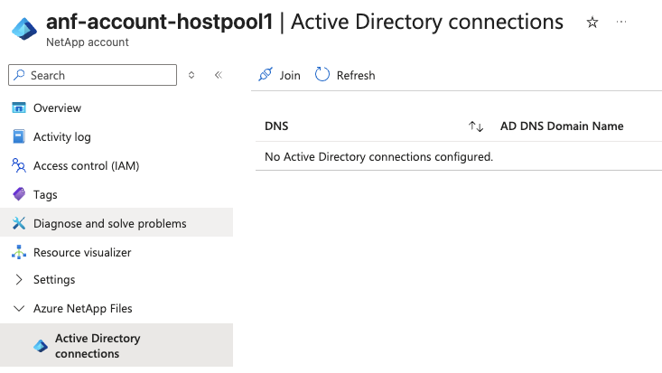
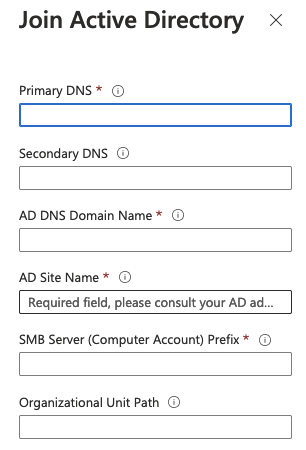
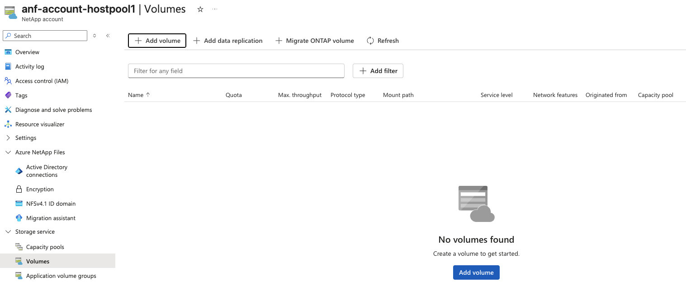
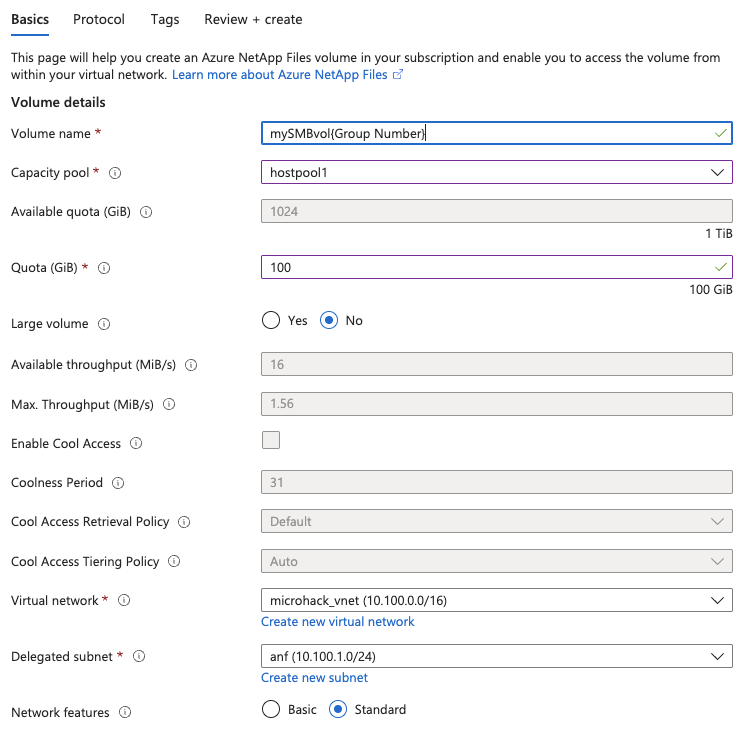
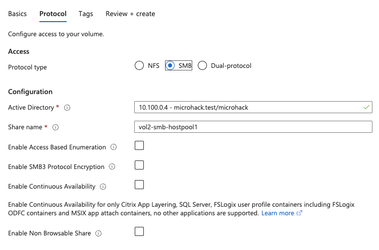
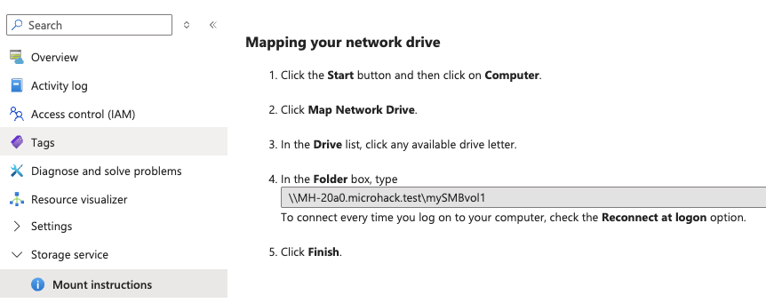

# Walkthrough Challenge 4 - Setting Up Azure NetApp Files for VDI/AVD

[Previous Challenge Solution](../challenge-03/solution-03.md) - **[Home](../../Readme.md)** - [Next Challenge Solution](../challenge-05/solution-05.md)

# Prerequisites
The pre-provisioned AVD setup already has a designated Hostpool for each attendee. 
Your Hostpool is microhack_hostpool{Group Number}

The username and password will be provided during the session.

### Task 1: Configure AD connection in NetApp account

1. Log in to the [Azure portal](https://portal.azure.com/#home) 

2. Pick Azure NetApp Files service 

3. From the Azure NetApp Files management sidebar, select your NetApp account, e.g. myaccount1

4. On the left side expand **Azure Netapp Files** and click on **Active Directory connections**

<kbd>  </kbd>

5. Click **Join** and enter the following values (leave all other fields blank)

* Primary DNS: **10.100.0.4**
* AD DNS Domain Name: **microhack.test**
* AD Site Name: **Default-First-Site-Name**
* SMB Serve: **MH**
* Organizational Unit Path: **OU=Hostpool{Group Number}**
* AES Encryption: **checked**

<kbd>  </kbd>

6. Click **OK**

### Task 2: Create a new SMB volume

1. On the left side expand **Storage service**, click on **Volumes** and **Add volume**. Enter the following

* Volume Name: **mySMBvol{Group Number}**
* Capacity Pool: **your existing capacity pool**
* Quota: **100**
* Max. Throughput: What throughput value did you get? Why can't you change it?
* Virtual Network: **microhack_vnet**
* Delegated subnet: **anf**

2. Click on **Next Protocol**

3. Access: Select **SMB**

4. Click on **Review + create** and **create**

### Task 3: Integration of your volume into AVD (Trainer Task)

1. Click on your new volume
2. On the left side under **Storage Service** click on **Mount instructions** to identify the UNC path of your volume

The UNC path of your share needs to be entered in the AD Group Policy attribute **VHD locations** which is assigned to your OU (see AD connection) 

### Task 4: Test and verify correct AVD integration of your SMB volume 

1. Login to AVD using your assigned AVD user

2. Goto **Settings** and select **Manage disks and volumes**

3. Can you see the attached VHD disks?

4. Now select **Map network drive** and mount you SMB share manually

5. Can you find your home directory on the share?

You successfully completed challenge 4! 🚀🚀🚀

