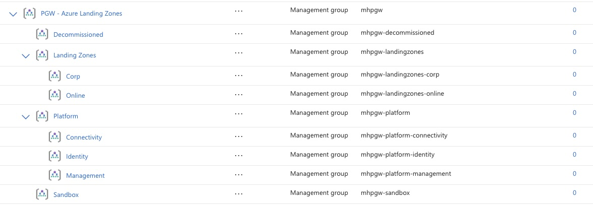
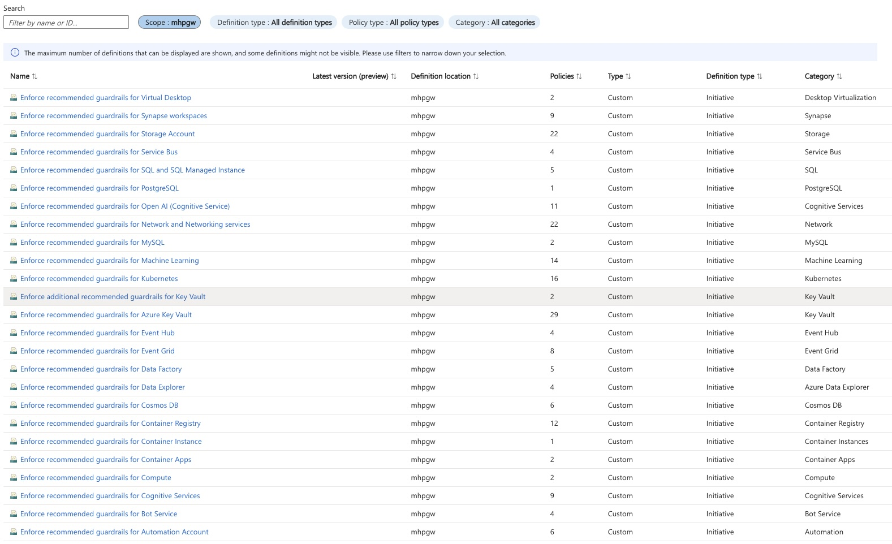
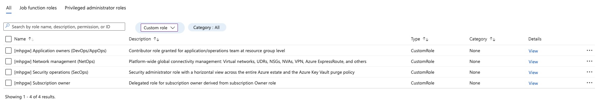
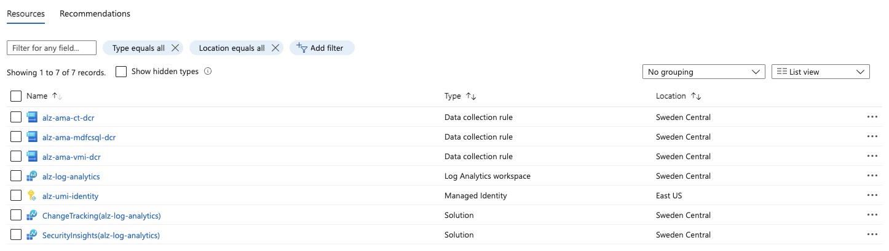
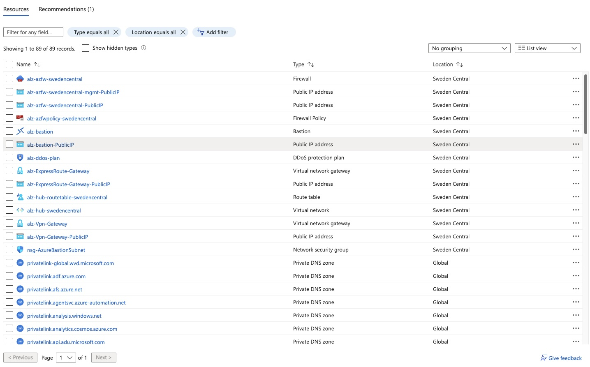
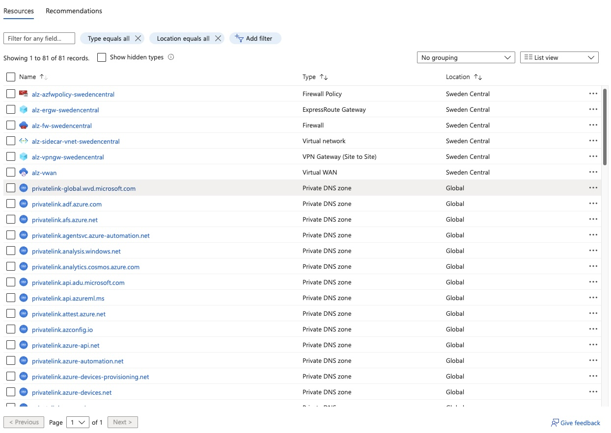
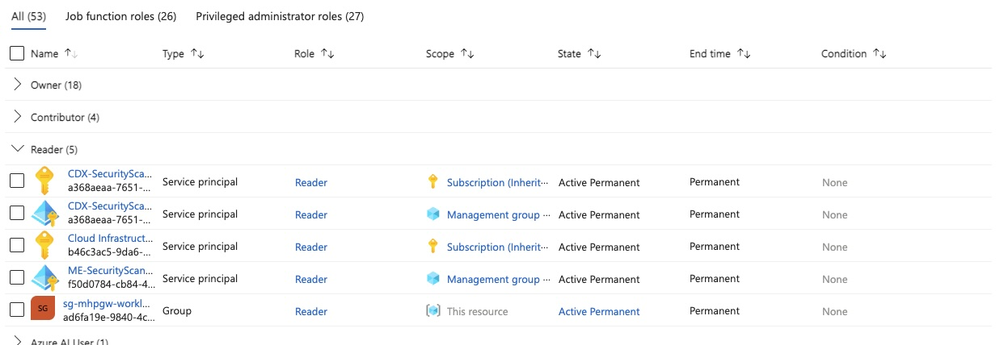

# GENERIC <a id="generic"/>

```bash
az login
ConnectivitySubscriptionId="ccba9824-4a78-4aae-be58-2a597800d986"
az account set --subscription $ConnectivitySubscriptionId

TopLevelMGPrefix="mhpgw"
```

> [!IMPORTANT]
> During the execution of the various chellenges take special care of setting the parameter files correctly. Most importantly make sure you scan the parameters for location and company prefix settings (also in the parameter values. Wherever you see _alz_ you should use the prefix assigned to you)

> [!TIP]
> In the following sections, the _PARAMETERS_ env variable will point to the parameter files for the respective modules. We would strongly suggest you create a copy of one of the ones in the accelerator (e.g. the _.all._) and rename it (e.g. to _.solution._) before editing it. To prevent you from accidentally deploying with defaults, we are always referenceing a _*.solution.*_ file in the code samples.

# Challenge 1 - Management Groups <a id="challenge1"/>

## Solution

```bash
dateYMD=$(date +%Y%m%dT%H%M%S%NZ)
NAME="alz-MGDeployment-${dateYMD}"
LOCATION="swedencentral"
```

### 1.1 Management Group Hierarchy

> [!CAUTION]
> For the workshop, the Management Group hierarchy (steps below) was created for you. Your user does not have the necessary permissions to do so. In case you want to run through this in your own environment, you need to follow the permissions setup as described [here](https://github.com/Azure/Enterprise-Scale/wiki/ALZ-Setup-azure).
> From here on out, whenver a MGID or MGIDprefix is required, please use your **userid**.

```bash
TEMPLATEFILE="bicep/modules/managementGroups/managementGroups.bicep"
PARAMETERS="@bicep/modules/managementGroups/parameters/managementGroups.parameters.solution.json"

MGID=$TopLevelMGPrefix
NAME="alz-PolicyDefsDefaults-${dateYMD}"

az deployment tenant create --name ${NAME:0:63} --location $LOCATION --template-file $TEMPLATEFILE --parameters $PARAMETERS
```



### 1.2 Custom Policy Definition

> [!TIP]
> Make sure you update the parameter file to provide the value for _parTargetManagementGroupId_ to correspond to your _MGID_ env variable, or provide the parameter using the commandline.

```bash
MGID=mhpgw
TEMPLATEFILE="bicep/modules/policy/definitions/customPolicyDefinitions.bicep"
PARAMETERS="@bicep/modules/policy/definitions/parameters/customPolicyDefinitions.parameters.solution.json"

az deployment mg create --name ${NAME:0:63} --location $LOCATION --management-group-id $MGID --template-file $TEMPLATEFILE --parameters $PARAMETERS
```

> [!TIP]
> Make sure you switch the scope to your management group in the list filter at the top



### 1.3 Custom RBAC Roles

> [!TIP]
> Make sure you update the parameter file to provide the value for _parAssignableScopeManagementGroupId_ to correspond to your _MGID_ env variable, or provide the parameter using the commandline.

```bash
dateYMD=$(date +%Y%m%dT%H%M%S%NZ)
NAME="alz-CustomRoleDefsDeployment-${dateYMD}"
TEMPLATEFILE="bicep/modules/customRoleDefinitions/customRoleDefinitions.bicep"
PARAMETERS="@bicep/modules/customRoleDefinitions/parameters/customRoleDefinitions.parameters.solution.json"

az deployment mg create --name ${NAME:0:63} --location $LOCATION --management-group-id $MGID --template-file $TEMPLATEFILE --parameters $PARAMETERS
```



# Challenge 2 - Logging & Security <a id="challenge2"/>

## Solution

> [!TIP]
> Make sure you inspect the parameter file carfully. There are certain parameters (e.g. _parLogAnalyticsWorkspaceLocation_) which you need to take care of in the parameter file.

### 2.1 Logging

```bash
dateYMD=$(date +%Y%m%dT%H%M%S%NZ)
GROUP="rg-$TopLevelMGPrefix-logging-001"
NAME="alz-loggingDeployment-${dateYMD}"
TEMPLATEFILE="bicep/modules/logging/logging.bicep"
PARAMETERS="@bicep/modules/logging/parameters/logging.parameters.solution.json"

az group create \
 --name $GROUP \
 --location $LOCATION

az deployment group create --name ${NAME:0:63} --resource-group $GROUP --template-file $TEMPLATEFILE --parameters $PARAMETERS
```



### 2.2. Management Group Diagnostic Settings

> [!TIP]
> This step requires referencing the Log Analystics worspace you just created by its resource id, which can be found in the output of the previous deployment step or via Azure Portal.
> The resource id needs to be provided as the value of _parLogAnalyticsWorkspaceResourceId_ in the parameter file.

```bash
dateYMD=$(date +%Y%m%dT%H%M%S%NZ)
NAME="alz-mgDiagSettings-${dateYMD}"
TEMPLATEFILE="bicep/modules/mgDiagSettings/mgDiagSettings.bicep"
PARAMETERS="bicep/modules/mgDiagSettings/parameters/mgDiagSettings.parameters.solution.json"

az deployment mg create --name $NAME --location $LOCATION --template-file $TEMPLATEFILE --parameters $PARAMETERS --management-group-id $MGID
```

> [!TIP]
> The only way to validate the correct creation is to use the REST APIs as documented [here](https://learn.microsoft.com/en-us/rest/api/monitor/management-group-diagnostic-settings/get?view=rest-monitor-2020-01-01-preview&tabs=HTTP#code-try-0). This call requires the Management Group Id the settings were deployed to and the name of the settings, which can be found in the parameters file.

# Challenge 3 - Core Connectivity <a id="challenge3"/>

## Solution

> [!NOTE]
> Depending on the network topology you are planning to use (Hub-Spoke or Virtual WAN) you can use the respective chapters.

### 3.1 Hub Connectivity

```bash
ConnectivitySubscriptionId="ccba9824-4a78-4aae-be58-2a597800d986"
```

> [!IMPORTANT]
> For the workshop, we are using the same subscription for all aspects. In a real deployment you might distribute the connectivity components into their own "Connectivity" subscription, for easier access control and cost managment.

> [!TIP]
> Make sure you set -at least- the value for _parLocation_ and _parCompanyPrefix_ in the parameter file.

```bash
az account set --subscription $ConnectivitySubscriptionId

dateYMD=$(date +%Y%m%dT%H%M%S%NZ)
NAME="${TopLevelMGPrefix}-HubNetworkingDeploy-${dateYMD}"
GROUP="rg-${TopLevelMGPrefix}-hub-networking-000"

TEMPLATEFILE="bicep/modules/hubNetworking/hubNetworking.bicep"
PARAMETERS="bicep/modules/hubNetworking/parameters/hubNetworking.parameters.solution.json"

az group create --location $LOCATION --name $GROUP
```

> [!TIP]
> Since the challenge is asking for DDoS Protection to be initially disabled, you need to set the value of _parDdosEnabled_ accordingly.

```bash
az deployment group create --name ${NAME:0:63} --resource-group $GROUP --template-file $TEMPLATEFILE --parameters $PARAMETERS
```



### 3.1a vWAN Connectivity

```bash
dateYMD=$(date +%Y%m%dT%H%M%S%NZ)
NAME="alz-vwanConnectivityDeploy-${dateYMD}"
GROUP="rg-$TopLevelMGPrefix-vwan-001"
TEMPLATEFILE="bicep/modules/vwanConnectivity/vwanConnectivity.bicep"
PARAMETERS="@bicep/modules/vwanConnectivity/parameters/vwanConnectivity.parameters.solution.json"

az group create \
 --name $GROUP \
 --location $LOCATION
```

> [!TIP]
> Since the challenge is asking for DDoS Protection to be initially disabled, you need to set the value of _parDdosEnabled_ accordingly.

```bash
az deployment group create --name ${NAME:0:63} --resource-group $GROUP --template-file $TEMPLATEFILE --parameters $PARAMETERS
```



# Challenge 4 - Role Assignments <a id="challenge4"/>

## Solution

```bash
GROUP="rg-$TopLevelMGPrefix-workload-001"

az group create \
 --name $GROUP \
 --location $LOCATION
```

> [!TIP]
> If you have not set up a security group which would technically hold your users for this given role, you need to create one as the templates will need an assignee's object ID.
>
> ```bash
> GROUP_NAME="sg-mhpgw-workload-admins"
> GROUP_NICK="sg-mhpgw-workload-admins"
> GROUP_DESC="Workshop workload admins"
>
> az ad group create \
>  --display-name "$GROUP_NAME" \
>  --mail-nickname "$GROUP_NICK" \
>  --description "$GROUP_DESC"
> ```
>
> You can then query the groups object id using the following command
>
> ```bash
> az ad group show --group <SECURITY_GROUP_NAME> --query id
> ```
>
> e.g. az ad group show --group $GROUP_NAME --query id

```bash
dateYMD=$(date +%Y%m%dT%H%M%S%NZ)
MGID=$TopLevelMGPrefix
NAME="alz-RoleAssignmentsDeployment-${dateYMD}"
TEMPLATEFILE="bicep/modules/roleAssignments/roleAssignmentResourceGroup.bicep"
PARAMETERS="@bicep/modules/roleAssignments/parameters/roleAssignmentResourceGroup.securityGroup.parameters.solution.json"

az deployment group create --name ${NAME:0:63} --resource-group $GROUP --template-file $TEMPLATEFILE --parameters $PARAMETERS
```

> [!NOTE]
> This module covers multiple options for role assginemnt. For simplicity we are using the _single Resource group_ option, but strongly encourage you to also check out the _many_ assignments, different scope and assignee options.

Validate the assginmet in _Identity & Access Management_ for the Resource group in Azure Portal.



# Challenge 5 - Subscription Placement <a id="challenge5"/>

> [!IMPORTANT]
> As noted in the description of Challenge 5, there is no sulution steps as this challenge cannot be executed in the shared workshop environment.
>
> In real-world environments, a subscription would be moved to its corresponding management group, which would automatically apply and RBAC or policy assignments.
>
> Please continue with Challenge 6.

# Challenge 6 - Policy Assignments <a id="challenge6"/>

> [!NOTE]
> Policy Assignment is handled at the Management Group level. So for this challenge you will need to choose one of the Management Groups of the hierarchy assigned to you as part of Challenge 1.

## Solution

### 6.1 - Policy Assignment to Managmeent Group

Default Policy Assignments

```bash

dateYMD=$(date +%Y%m%dT%H%M%S%NZ)
NAME="alz-alzPolicyAssignmentDefaults-${dateYMD}"
TEMPLATEFILE="bicep/modules/policy/assignments/alzDefaults/alzDefaultPolicyAssignments.bicep"
PARAMETERS="@bicep/modules/policy/assignments/alzDefaults/parameters/alzDefaultPolicyAssignments.parameters.solution.json"

az deployment mg create --name ${NAME:0:63} --location $LOCATION --management-group-id $MGID --template-file $TEMPLATEFILE --parameters $PARAMETERS
```

Workload-specific Policy Assignments

```bash
dateYMD=$(date +%Y%m%dT%H%M%S%NZ)
NAME="alz-alzPolicyAssignmentWorkloadSpecific-${dateYMD}"
TEMPLATEFILE="bicep/modules/policy/assignments/workloadSpecific/workloadSpecificPolicyAssignments.bicep"
PARAMETERS="@bicep/modules/policy/assignments/workloadSpecific/parameters/workloadSpecificPolicyAssignments.parameters.solution.json"

az deployment mg create --name ${NAME:0:63} --location $LOCATION --management-group-id $MGID --template-file $TEMPLATEFILE --parameters $PARAMETERS
```

### 6.3 Policy Assignment to Resource Group

For the purpose of this workshop we assume certain policies excluded at the Management Group level need to be assigned at the Resource Group level for one particular Workload.

> [!NOTE]
> Use the Resource Group you created in Challenge 4 for this assignment.

```bash

dateYMD=$(date +%Y%m%dT%H%M%S%NZ)
NAME="alz-customPolicy-${dateYMD}"

az deployment sub create \
  --name $NAME \
  --location $LOCATION \
  --template-file challenge6/custom-policy/allowed-regions/policyDefinition.bicep \
  --parameters policyDefinitionName=${TopLevelMGPrefix}-custom-allowed-regions
```

Deploy assignment:

```bash
dateYMD=$(date +%Y%m%dT%H%M%S%NZ)
NAME="alz-customPolicy-assginment-${dateYMD}"

az deployment sub create \
  --name $NAME \
  --location $LOCATION \
  --template-file challenge6/custom-policy/allowed-regions/policyAssignment.bicep \
  --parameters assignmentName=${TopLevelMGPrefix}-custom-allowed-regions-assignment \
               policyDefinitionName=${TopLevelMGPrefix}-custom-allowed-regions \
               targetResourceGroupName=$GROUP \
               allowedLocations='["swedencentral"]'
```

```bash
POLICY_NAME=$(az policy definition list --query "[?displayName=='Storage accounts should disable public network access'].name | [0]" -o tsv)
POLICY_ID="/providers/Microsoft.Authorization/policyDefinitions/${POLICY_NAME}"
dateYMD=$(date +%Y%m%dT%H%M%S%NZ)
NAME="alz-storageNoPublicAccess-assginment-${dateYMD}"

az deployment sub create \
  --name $NAME \
  --location $LOCATION \
  --template-file challenge6/storage-policy/storageNoPublicAccessAssignment.bicep \
  --parameters targetResourceGroupName=$GROUP \
               policyDefinitionId="$POLICY_ID"
```

# Challenge 7 - Workload Deployment <a id="challenge7"/>

## Solution

```bash
TEMPLATEFILE=challenge7/storageAccount.bicep
STORAGENAME=alz${TopLevelMGPrefix}st
# should fail --> wrong region
az deployment group create \
  --resource-group $GROUP \
  --template-file $TEMPLATEFILE \
  --parameters storageAccountName=$STORAGENAME \
               allowPublicAccess=false \
               location=westeurope
# should fail --> policy vialoation, no public access
# if it succeeds, check your policies enforcement mode
az deployment group create \
  --resource-group $GROUP \
  --template-file $TEMPLATEFILE \
  --parameters storageAccountName=$STORAGENAME \
               allowPublicAccess=true \
               location=swedencentral
# shopuld succeed
az deployment group create \
  --resource-group $GROUP \
  --template-file $TEMPLATEFILE \
  --parameters storageAccountName=$STORAGENAME \
               allowPublicAccess=false \
               location=swedencentral
```

[Top](#generic)
