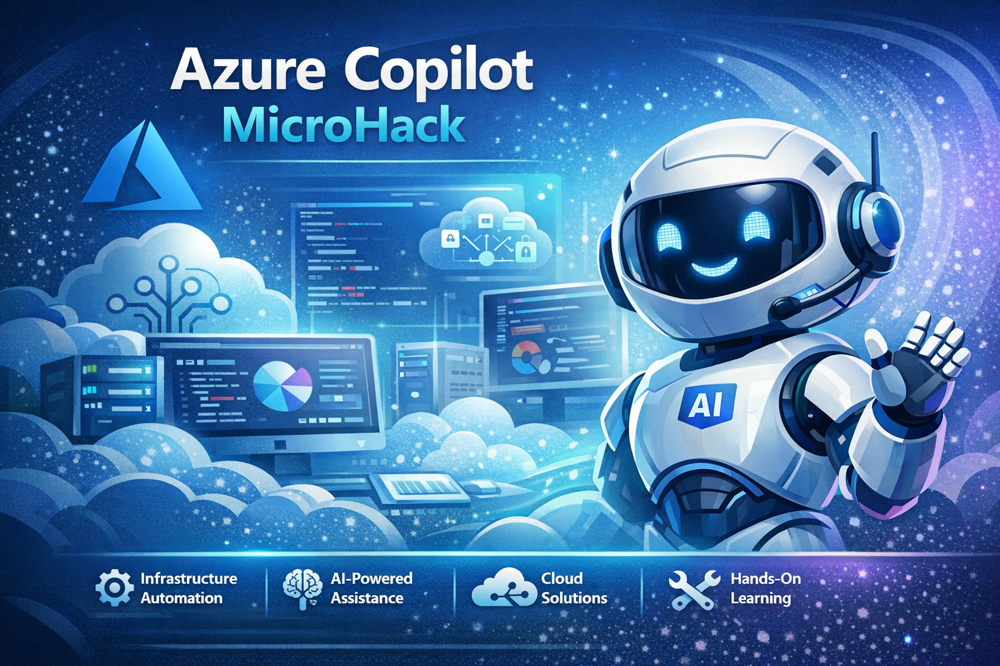

# **MicroHack Azure Copilot**



- [**MicroHack introduction**](#MicroHack-introduction)
- [**MicroHack context**](#microhack-context)
- [**Objectives**](#objectives)
- [**MicroHack Challenges**](#microhack-challenges)
- [**Contributors**](#contributors)

## MicroHack introduction

This Azure Copilot MicroHack walks engineers and architects through the core capabilities of **Azure Copilot** and its **five specialized agents** (Deployment, Observability, Optimization, Resiliency, Troubleshooting) in the Azure portal. Participants learn to use natural-language conversations to plan infrastructure, investigate alerts, optimize costs, harden resiliency, and troubleshoot resource issues — all from a single AI-powered interface.

Azure Copilot is an AI-powered tool built into the Azure portal that helps you design, operate, optimize, and troubleshoot your Azure apps and infrastructure. It leverages Large Language Models (LLMs), the Azure control plane, and deep insights about your Azure environment to help you work more efficiently.

This lab is not a full explanation of Azure Copilot as a technology. Please consider the following articles as required pre-reading to build foundational knowledge:

- [Azure Copilot Overview](https://learn.microsoft.com/en-us/azure/copilot/overview)
- [Azure Copilot Capabilities](https://learn.microsoft.com/en-us/azure/copilot/capabilities)
- [Agents (Preview)](https://learn.microsoft.com/en-us/azure/copilot/agents-preview)
- [Writing Effective Prompts](https://learn.microsoft.com/en-us/azure/copilot/write-effective-prompts)

Optional (read after completing this lab to take your learning even deeper):

- [Deployment Agent](https://learn.microsoft.com/en-us/azure/copilot/deployment-agent)
- [Observability Agent](https://learn.microsoft.com/en-us/azure/copilot/observability-agent)
- [Optimization Agent](https://learn.microsoft.com/en-us/azure/copilot/optimization-agent)
- [Resiliency Agent](https://learn.microsoft.com/en-us/azure/copilot/resiliency-agent)
- [Troubleshooting Agent](https://learn.microsoft.com/en-us/azure/copilot/troubleshooting-agent)

## MicroHack context

This MicroHack scenario walks through the use of Azure Copilot and its five specialized agents with a focus on best practices, real-world scenarios, and progressive skill-building. Specifically, this builds up to include working with existing Azure infrastructure that has been pre-deployed with intentional issues — oversized VMs, blocked NSGs, misconfigured firewalls, missing backups, and buggy applications — so that each agent can demonstrate its diagnostic and remediation capabilities.

Participants start by mastering Azure Copilot fundamentals (navigation, prompt writing, context management) and then progress through each agent's specialty before tackling a capstone challenge that combines all five agents in an end-to-end e-commerce platform scenario.

## Objectives

After completing this MicroHack you will:

- Navigate and use Azure Copilot effectively in the Azure portal
- Plan and generate Terraform infrastructure configurations using the **Deployment Agent**
- Investigate Azure Monitor alerts and run automated root-cause analysis using the **Observability Agent**
- Discover cost-saving opportunities and generate optimization scripts using the **Optimization Agent**
- Assess zone resiliency, configure backups, and plan disaster recovery using the **Resiliency Agent**
- Diagnose resource issues, apply one-click fixes, and create support requests using the **Troubleshooting Agent**
- Orchestrate all five agents in a seamless end-to-end cloud operations workflow

## MicroHack challenges

| Challenge | Topic                                                                  | Challenge                               | Solution                               | Duration |
| --------- | ---------------------------------------------------------------------- | --------------------------------------- | -------------------------------------- | -------- |
| 1         | Azure Copilot Basics — navigation, prompts, context                    | [Challenge](challenges/challenge-01.md) | [Solution](walkthrough/solution-01.md) | 30 min   |
| 2         | Deployment Agent — infrastructure planning and Terraform generation    | [Challenge](challenges/challenge-02.md) | [Solution](walkthrough/solution-02.md) | 45 min   |
| 3         | Observability Agent — alert investigation and remediation              | [Challenge](challenges/challenge-03.md) | [Solution](walkthrough/solution-03.md) | 45 min   |
| 4         | Optimization Agent — cost savings and rightsizing                      | [Challenge](challenges/challenge-04.md) | [Solution](walkthrough/solution-04.md) | 45 min   |
| 5         | Resiliency Agent — zone resiliency, backup, disaster recovery          | [Challenge](challenges/challenge-05.md) | [Solution](walkthrough/solution-05.md) | 45 min   |
| 6         | Troubleshooting Agent — diagnostics, one-click fixes, support requests | [Challenge](challenges/challenge-06.md) | [Solution](walkthrough/solution-06.md) | 45 min   |
| 7         | Capstone — multi-agent end-to-end e-commerce scenario                  | [Challenge](challenges/challenge-07.md) | [Solution](walkthrough/solution-07.md) | 90 min   |

**Total estimated time: ~5.75 hours**

### General prerequisites

This MicroHack has a few but important prerequisites.

In order to use the MicroHack time most effectively, the following tasks should be completed prior to starting the session.

> [!NOTE]
> Prerequisites 1–4 are handled by the organizers for events hosted by Microsoft.

1. Your own **Azure subscription** with Contributor RBAC rights at the subscription level. [Create a free account](https://azure.microsoft.com/pricing/purchase-options/azure-account) if you don't have one.
2. **Azure Copilot access** — Azure Copilot must be enabled for your tenant. By default, Azure Copilot is available to all users in a tenant. Your Global Administrator can [manage access](https://learn.microsoft.com/en-us/azure/copilot/manage-access) if needed.
3. **Agents (Preview) access** — Your tenant must have access to Agents (preview) in Azure Copilot. Access is managed at the tenant level and rolled out gradually. Check with your tenant administrator, or [request access](https://aka.ms/azurecopilot/agents/feedbackprogram).
4. **WebSocket connections** — Your organization must allow WebSocket connections to `https://directline.botframework.com`. Ask your network administrator to enable this if blocked.
5. [Azure CLI](https://learn.microsoft.com/cli/azure/install-azure-cli) installed and logged in (`az login`). **Hint:** Make sure to use the latest version available.

In summary:

- Azure Subscription (Contributor role)
- Azure Copilot enabled for your tenant
- Agents (Preview) enabled for your tenant
- Azure CLI installed
- WebSocket connectivity to `directline.botframework.com`

Permissions for the deployment:

- Contributor on your Azure Subscription
- Monitoring Contributor or Issue Contributor on an Azure Monitor Workspace (for Challenge 3)

### Infrastructure deployment

The workshop includes Bicep IaC templates and a PowerShell deployment script that creates all necessary Azure resources with intentional issues for each challenge. Run one command to set everything up:

```powershell
# Ensure Azure CLI is installed and you are logged in
az login

# Deploy all workshop resources (default region: France Central)
.\lab\Deploy-Lab.ps1 -DeploymentType subscription -SubscriptionId "<your-subscription-id>"

# Or specify a different region
.\lab\Deploy-Lab.ps1 -DeploymentType subscription -SubscriptionId "<your-subscription-id>" -PreferredLocation "westeurope"
```

This creates five resource groups with pre-configured resources:

| Resource Group    | Challenge           | What's Deployed                                               |
| ----------------- | ------------------- | ------------------------------------------------------------- |
| `rg-copilot-<suffix>-ch00` | 1 (Basics)          | Storage account, VNet, NSG                                    |
| `rg-copilot-<suffix>-ch02` | 3 (Observability)   | App Service with buggy app, Application Insights, alert rules |
| `rg-copilot-<suffix>-ch03` | 4 (Optimization)    | Oversized VM (D4s_v3) for cost recommendations                |
| `rg-copilot-<suffix>-ch04` | 5 (Resiliency)      | VM without zone redundancy or backup                          |
| `rg-copilot-<suffix>-ch05` | 6 (Troubleshooting) | VM with blocked NSG, Cosmos DB with restrictive firewall      |

> [!IMPORTANT]
> Azure Advisor recommendations (Challenge 4) may take **24–48 hours** to appear. You can start the workshop immediately — just revisit Challenge 4 later if recommendations aren't ready yet.

**Validate the deployment:**

```powershell
.\scripts\Test-CopilotWorkshop.ps1 -Suffix "<your-deployment-suffix>"
```

**Cleanup after the workshop:**

```powershell
.\scripts\Remove-CopilotWorkshop.ps1 -Suffix "<your-deployment-suffix>"
```

### Cost estimates

The main cost drivers for this MicroHack are virtual machines and App Service:

- **Challenge 4 (Optimization):** One Standard_D4s_v3 VM — approximately **$8/day**
- **Challenge 5 (Resiliency):** One Standard_B2s VM — approximately **$1.50/day**
- **Challenge 6 (Troubleshooting):** One Standard_B1s VM + Cosmos DB (Serverless) — approximately **$1.50/day**
- **Challenge 3 (Observability):** App Service B1 plan — approximately **$0.50/day**

Running all resources for one day costs approximately **$11.50–14**. For a 2-day workshop this would be approximately **$23–28 total**.

> [!TIP]
> Delete all resources immediately after the workshop using `.\scripts\Remove-CopilotWorkshop.ps1 -Suffix "<suffix>"` to minimize costs.

## Contributors

- Dmitriy Nekrasov [GitHub](https://github.com/nekdima); [LinkedIn](https://www.linkedin.com/in/inthedark/)
