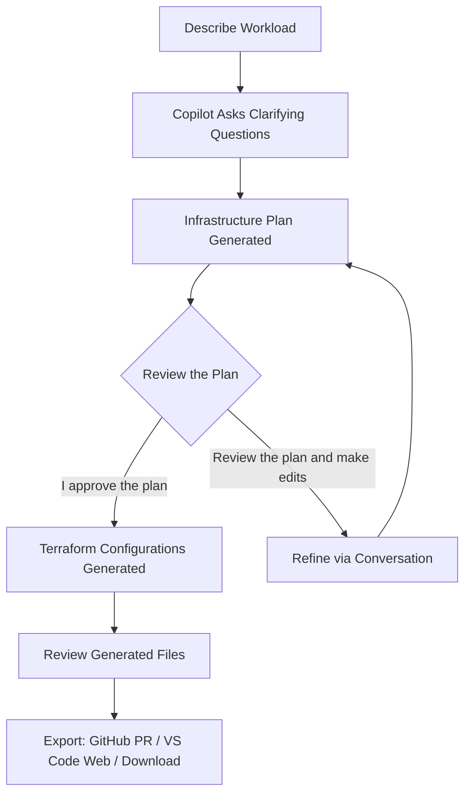

# Challenge 2 - Deployment Agent

**[Home](../Readme.md)** - [Previous Challenge](challenge-01.md) - [Next Challenge](challenge-03.md)

## Goal

The Deployment Agent serves as a **virtual cloud solution architect**, guiding you through the entire infrastructure planning and deployment process. It can:

- Translate high-level goals into **actionable deployment plans**
- Apply **Azure Well-Architected Framework** best practices
- Generate **Terraform configurations** for your infrastructure
- Provide **CI/CD pipeline guidance**
- Integrate with **GitHub** for pull request creation
- Open generated files in **VS Code for the Web**

Use the Deployment Agent in Azure Copilot to plan, design, and generate Terraform configurations for a real-world cloud infrastructure deployment — all through natural language conversation.

**Scenario:** Contoso Ltd. wants to launch a new internal employee portal. The application is a **Python Flask web application** backed by a **PostgreSQL database**, with secrets managed securely and full monitoring enabled. Your task is to use the Deployment Agent to plan and generate the infrastructure.

By the end of this challenge, you will be able to:

- Enable agent mode in Azure Copilot
- Describe a deployment goal in natural language and receive an infrastructure plan
- Review and refine the workload plan through multi-turn conversation
- Generate Terraform configurations from the approved plan
- Review and understand the generated Terraform files
- Export configurations via GitHub PR or VS Code for the Web

## Actions

### Task 1: Enable Agent Mode and Describe Your Workload (10 min)

1. Open Azure Copilot in the Azure portal
2. **Enable agent mode** by clicking the agent mode icon in the chat input area
3. Describe your deployment goal using this prompt:

   > _"Deploy a Python Flask web app on Azure App Service with a PostgreSQL Flexible Server backend, secure secrets in Azure Key Vault, and enable monitoring with Application Insights."_

4. **Observe** how Azure Copilot:
   - Asks clarifying questions about your requirements
   - Proposes an infrastructure plan
   - Includes pros, cons, and trade-offs for architectural decisions
5. Answer any clarifying questions Azure Copilot asks (e.g., about scaling, region, pricing tier)

**Question to answer:** What components does Azure Copilot include in the infrastructure plan? Does it align with the Well-Architected Framework?

### Task 2: Refine the Architecture Plan (10 min)

The initial plan is good, but as the architect, you want to refine it. Use follow-up prompts to adjust:

1. Ask: _"Can you add a Virtual Network with subnets for the App Service and the database?"_
2. Ask: _"I want the PostgreSQL server to use private endpoints instead of public access."_
3. Ask: _"Add a Network Security Group to restrict traffic to the App Service subnet."_
4. Ask: _"What would be the estimated monthly cost for this setup at a basic tier?"_

**Question to answer:** How does the Deployment Agent handle these incremental refinements? Does it update the plan or start over?

### Understanding the Plan → Approve → Generate Workflow

Before Azure Copilot generates any Terraform code, it always presents an **infrastructure plan** for your review. You must explicitly approve the plan before code generation begins. This is a **human-in-the-loop** checkpoint — no IaC is produced without your consent.

The full workflow looks like this:

When the plan is ready, Azure Copilot presents it as a summary with components, trade-offs, and recommendations, along with **action buttons**:

- **"I approve the plan"** — Confirms you are satisfied and triggers Terraform code generation
- **"Review the plan and make edits"** — Returns to the refinement conversation so you can request changes; the updated plan will be presented for approval again

> **Important:** Azure Copilot will **not** generate Terraform configurations until you explicitly approve the infrastructure plan. Always review the plan carefully — verify components, SKUs, networking, and security settings before approving.

### Task 3: Generate Terraform Configurations (10 min)

1. After reviewing the infrastructure plan, click **"I approve the plan"** to proceed (or, if you described the workload via a prompt, ask Azure Copilot to generate the Terraform code):

   > _"Generate the Terraform configurations for this plan."_

2. **Review the generated files** in the artifact pane:
   - Click the **maximize icon** to open the artifact pane
   - Examine the file structure (e.g., `main.tf`, `variables.tf`, `outputs.tf`)
   - Verify the resources match your approved plan
3. Note that the artifact pane is **read-only** — to make edits (e.g., change a resource name or adjust a parameter), you need to export the files first using one of the deployment options in Task 4 (VS Code for the Web, GitHub PR, or download)

**Question to answer:** What files does the Deployment Agent generate? Are they production-ready or do they need further customization?

### Task 4: Explore Deployment Options (10 min)

After reviewing the configurations, explore the available deployment methods:

1. **Open in VS Code (Web):**
   - Click **Open in VS Code (Web)** from the artifact pane
   - Explore the files in the VS Code web workspace
   - Note: This opens a **temporary workspace** for reviewing and editing files. Changes made here are **not persisted** — to save your work, use the GitHub PR or download options below

2. **GitHub Pull Request Integration (if you have a GitHub account):**
   - Click **Create pull request** from the artifact pane
   - Sign in to GitHub if prompted
   - Select a repository and branch
   - Review the pull request details
   - This is the **recommended way to save and version-control** the generated files
   - Note: The PR contains the original generated files, not any edits made in VS Code for the Web

3. **Download option:**
   - Click the **download icon** (next to "Create pull request") to save the files locally
   - After downloading, commit them to your own repository and make edits there

4. Ask Azure Copilot for deployment guidance:
   > _"How should I set up a CI/CD pipeline to deploy this Terraform configuration?"_

**Question to answer:** Which deployment method would you choose for a production environment and why?

### Task 5: Try a Different Architecture (5 min)

Start a **new conversation** and try a completely different deployment scenario:

> _"Set up a multitenant SaaS application on AKS using Kubernetes namespaces for isolation, integrate Microsoft Entra for authentication, and centralize logs in Azure Log Analytics."_

Compare the approach, plan, and generated configurations with your first scenario.

**Question to answer:** How does the Deployment Agent adapt to fundamentally different architecture requirements?

## Success criteria

- You enabled agent mode and received an infrastructure plan
- You refined the plan through at least 2 follow-up prompts
- You generated Terraform configurations from the plan
- You reviewed the generated files in the artifact pane
- You explored at least one deployment option (VS Code Web, GitHub PR, or download)
- You understand the end-to-end workflow from description to deployment

## Learning resources

- The Deployment Agent acts as a **virtual solution architect** — describe what you need in plain English
- Plans are based on the **Azure Well-Architected Framework** with documented trade-offs
- Generated Terraform is a **starting point** — always review before deploying to production
- **GitHub integration** and **VS Code for the Web** accelerate the path from plan to deployment
- The agent supports **greenfield deployments** (new workloads) — it doesn't modify existing infrastructure
- [Deployment Agent documentation](https://learn.microsoft.com/en-us/azure/copilot/deployment-agent)

**Limitations to Note:**

- Generated artifacts are **only available as Terraform** configurations (no Bicep or ARM)
- Designed for **new workloads** — doesn't import, analyze, or modify existing infrastructure
- Doesn't support **automated CI/CD integration** — provides guidance only
- Always **review generated configurations** — they may need adjustments for your specific requirements

## Solution

> [!TIP]
> We encourage you to try solving the challenge on your own before looking at the solution. This will help you learn and understand the concepts better.

Click here to view the solution

[Solution for Challenge 2](../walkthrough/solution-02.md)

