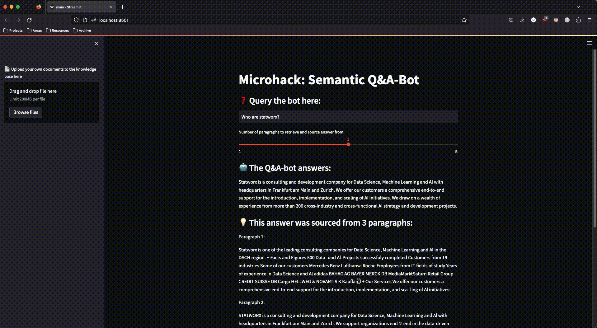
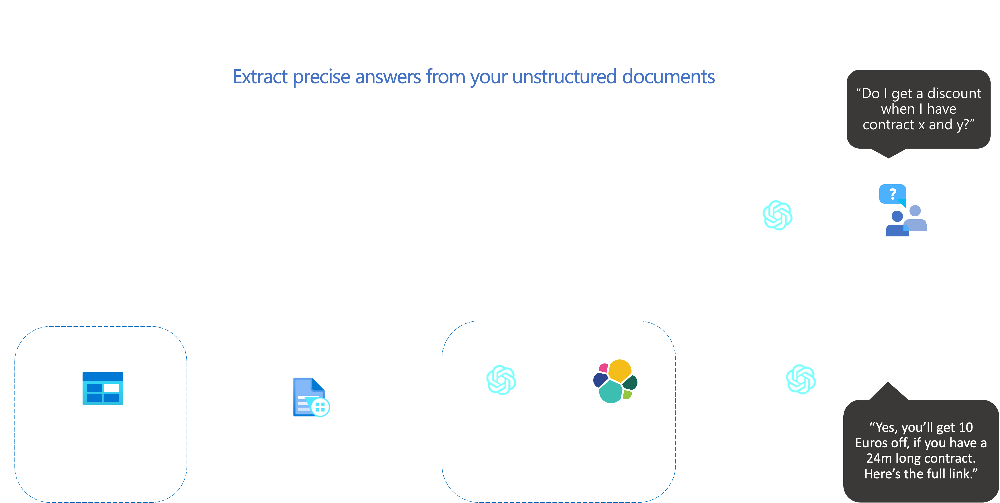

# **Semantic Q&A Bot with Azure OpenAI**

- [**Semantic Q\&A Bot with Azure OpenAI**](#semantic-qa-bot-with-azure-openai)
  - [MicroHack Introduction and Context](#microhack-introduction-and-context)
  - [Objectives](#objectives)
  - [Prerequisites](#prerequisites)
  - [Lab environment for this MicroHack](#lab-environment-for-this-microhack)
  - [Architecture](#architecture)
- [MicroHack Challenges](#microhack-challenges)
  - [Challenge 1 - Setup Azure Services to Process Stored Documents in an Azure Function](#challenge-1---setup-azure-services-to-process-stored-documents-in-an-azure-function)
    - [Goal](#goal)
    - [Task 1: Create a Storage Account](#task-1-create-a-storage-account)
    - [Task 2: Setup Azure Form Recognizer](#task-2-setup-azure-form-recognizer)
    - [Task 3: Setup Azure Key Vault and save Form Recognizer Keys](#task-3-setup-azure-key-vault-and-save-form-recognizer-keys)
    - [Task 4: Setup Chroma DB](#task-4-setup-chroma-db)
    - [Task 5: Create the Azure Function](#task-5-create-the-azure-function)
    - [Task 6: Test the Azure Function Locally](#task-6-test-the-azure-function-locally)
  - [Challenge 2 - Setting up a functional Pipeline](#challenge-2---setting-up-a-functional-pipeline)
    - [Goal](#goal-1)
    - [Task 1: Setup the Azure OpenAI Service](#task-1-setup-the-azure-openai-service)
    - [Task 2: Implement the Azure Form Recognizer in the Azure Function](#task-2-implement-the-azure-form-recognizer-in-the-azure-function)
    - [Task 3: Create a Chroma Collection and Prepare the Azure Function for Creating Text Embeddings](#task-3-create-a-chroma-collection-and-prepare-the-azure-function-for-creating-text-embeddings)
    - [Task 4: Write the Extracted Paragraphs and Embeddings to the Chroma Collection](#task-4-write-the-extracted-paragraphs-and-embeddings-to-the-chroma-collection)
    - [Task 5: Test the Azure Function Locally](#task-5-test-the-azure-function-locally)
    - [Task 6: Deploy the Azure Function](#task-6-deploy-the-azure-function)
  - [Challenge 3 - Building a Streamlit frontend for our Q\&A bot](#challenge-3---building-a-streamlit-frontend-for-our-qa-bot)
    - [Goal](#goal-2)
    - [Task 1: Setup Streamlit App](#task-1-setup-streamlit-app)
    - [Task 2: Create Streamlit Widgets](#task-2-create-streamlit-widgets)
    - [Task 3: Connect the Streamlit App to the Blob Storage](#task-3-connect-the-streamlit-app-to-the-blob-storage)
    - [Task 4: Connect the Streamlit App to the Chroma DB](#task-4-connect-the-streamlit-app-to-the-chroma-db)
    - [Task 5: Generate Answers via the OpenAI Completions Endpoint](#task-5-generate-answers-via-the-openai-completions-endpoint)
  - [Challenge 4 - Deploy the Streamlit App to Azure](#challenge-4---deploy-the-streamlit-app-to-azure)
    - [Goal](#goal-3)
    - [Task 1: Create the Dockerfile for the Streamlit App](#task-1-create-the-dockerfile-for-the-streamlit-app)
    - [Task 2: Build and Test the Docker Image](#task-2-build-and-test-the-docker-image)
    - [Task 3: Build and Store the Docker Image by Using Azure Container Registry](#task-3-build-and-store-the-docker-image-by-using-azure-container-registry)
    - [Task 4: Setup Azure App Service and Deploy the Streamlit App](#task-4-setup-azure-app-service-and-deploy-the-streamlit-app)
  - [Finished? Delete your lab](#finished-delete-your-lab)
  - [Authors](#authors)

## MicroHack Introduction and Context

This MicroHack scenario walks through the creation of a Q&A bot using the Azure OpenAI service for building a semantic search pipeline. This Hack focuses on setting up the necessary Azure services as the building blocks of a Q&A bot powered by OpenAI's most recent language models and Azure. It guides you through setting up a robust infrastructure that extracts paragraphs from your raw text documents, stores them in a text data base optimized for vector search and then leverages the power of Natural Language Processing to find the information you are looking for - all from within Microsoft Azure and requiring minimal coding.

For demonstration purposes, we are going to use scanned versions of statworx whitepapers as toy data for this Microhack. Our whitepapers tackle various Data Science topics and can be found on our [website](https://www.statworx.com/content-hub/?whitepaper).\
\
\
\
Semantic search is a more informed way of sifting through documents. Traditional search methods relied on finding lexical overlap between a query and the contents of a document. Semantic search foregoes this approach and instead assumes that language exists in a latent semantic space, where words that are similar in meaning reside close to each other - and those that are different are separated by large distances. Deep neural networks facilitate finding the semantic location of words as they can be trained to translate words into numerical representations of their meanings, called word embeddings, and thus enabling us to measure their distance from each other and draw inference about the relationships amongst each other.

Semantic search uses this technique to find information that is most closely related to a search query, measured as the distance between their respective embeddings. The language models developed by OpenAI are highly proficient at this task. They have been trained on massive amounts of text data from many different contexts, hence they are prodicient at projecting natural language text to a latent, semantic space and are thus well-suited for building AI-powered Q&A applications.

This MicroHack is not an in-depth explanation of word embeddings as a technology, so please consider the following articles as required pre-reading to build foundational knowledge about the technology that enables finding semantic similarity between words, paragraphs and entire documents:

- <https://openai.com/blog/introducing-text-and-code-embeddings>
- <https://platform.openai.com/docs/guides/embeddings/what-are-embeddings>
- <https://learn.microsoft.com/en-us/azure/cognitive-services/openai/concepts/understand-embeddings>
- <https://medium.com/@statworx_blog/whats-cooking-at-statworx-ecd863edfabe>

## Objectives

After completing this MicroHack you will:

- Know how to build an AI-powered Q&A bot using Azure services.
- Understand how text embeddings can be used to find relevant passages in unstructured text documents.
- Have an functional Q&A service that takes your own documents as inputs and can be interacted with through a clean UI.

## Prerequisites

This MicroHack is designed to work with text data that is read from documents to be then processed and stored in Azure. We used our own documents, a collection of whitepapers written and published by statworx. In order to make the most of this MicroHack, we suggest you have a collection of documents in PDF-format at hand that you can then use to test the processing pipeline and inform the Q&A-bot by giving it context for its answers. 

In order to use the MicroHack time most effectively, the following services should be set up and ready for use prior to starting work on the challenges and their task:

- Azure Account
- Azure Subscription
- Azure Resource Group

Permissions for deployment:

- Contributor on your Resource Group

With these pre-requisites in place, you only need to set up the lab environment before starting to work on the challenges. These are designed for you to build familiarity with Azure's various services that facilitate implementing NLP-products through the use of services such Azure OpenAI, Virtual Machines and Azure Functions.

## Lab environment for this MicroHack

The majority of challenges of this MicroHack are completed in the Azure portal, with only a few tasks requiring any code at all. For the few tasks that do require code we suggest you set up a Lab environment that has access to the following tools:

- Azure CLI
  - Find detailed information on installing the Azure CLI in the [official documentation.](https://learn.microsoft.com/en-us/cli/azure/install-azure-cli)
  - `Homebrew` makes it easy to install the Azure CLI on macOS: `brew install azure-cli`
- Git
  - Make sure that you have [Git installed on your computer](https://git-scm.com/book/en/v2/Getting-Started-Installing-Git). This also enables you to clone the MicroHack repository to your local machine by executing the following command from your Shell:  
  `git clone https://github.com/microsoft/MicroHack.git`

We strongly recommend using [Visual Studio Code](https://code.visualstudio.com/) as a code editor with the following extensions:

- Python for Visual Code Studio
  - [This guide](https://code.visualstudio.com/docs/python/python-tutorial) walks you through installing a Python interpreter and the extension needed for using VSCode for Python development.
- Azure Tools
  - This extension pack contains multiple extensions used for interacting with Azure directly from VSCode. Find more information on the extension pack in the [official resource](https://marketplace.visualstudio.com/items?itemName=ms-vscode.vscode-node-azure-pack).

## Architecture

At the end of this MicroHack you will have set your Azure environment to use the following architecture:



# MicroHack Challenges

## Challenge 1 - Setup Azure Services to Process Stored Documents in an Azure Function

[Walkthrough](challenges/challenge-1/solution.md)

### Goal

The goal of Challenge 1 is to set up a system using Azure services to process stored documents in an Azure function. This involves creating a Storage Account, setting up Azure Form Recognizer, creating an Azure Key Vault and saving Secrets, setting up a vector database, as well as creating an Azure Function to execute custom code every time a new document is added to the blob storage.

### Task 1: Create a Storage Account

In this task you will set up a Storage Account in Azure which contains and manages all of your Azure Storage data objects such as blobs.

### Task 2: Setup Azure Form Recognizer

Task 2 requires you to set up an Azure Form Recognizer resource to extract text data from unstructured documents. 

### Task 3: Setup Azure Key Vault and save Form Recognizer Keys

In task 3, you will set up an Azure Key Vault, a secure location to store and manage your application secrets such as your Form Recognizer Keys. Once you have set up the Key Vault, you will save your Form Recognizer Keys in it, which will allow your Azure Function to securely access the keys.

### Task 4: Setup Chroma DB

In task 4, you will set up Chroma DB, an open-source database that is designed to store embedding vectors. Chroma is particularly useful for a document storage for our specific use case since it returns the most closely related documents to the query by evaluating the similarity between query and document embeddings using cosine similarity. You will deploy Chroma inside an Azure Virtual Machine and allow specific ports of the VM to be accessible from the internet to connect your Azure Function and Frontend with the Chroma DB.

### Task 5: Create the Azure Function

In task 5, you will create an Azure Function that executes custom code every time a new document is added to the blob storage you created in Task 1. This is achieved using VSCode and the Azure Tools extension.

### Task 6: Test the Azure Function Locally

In Task 6, you will test your Azure Function locally to ensure it is working properly before deploying it to Azure. This will involve simulating an event trigger by uploading a test file to the blob storage and verifying that the Azure Function is triggered and processes the file correctly.

## Challenge 2 - Setting up a functional Pipeline

[Walkthrough](challenges/challenge-2/solution.md)

### Goal

The goal of Challenge 2 is to set up a functional pipeline that extracts paragraphs from scanned documents, creates text embeddings, and stores them in a Chroma database. This is achieved by deploying models in Azure OpenAI Service, implementing Azure Form Recognizer and Chroma client in an Azure Function, and deploying the Function to an Azure Function App with secure access using a managed identity and access policy. The pipeline is tested locally before being deployed to Azure.

### Task 1: Setup the Azure OpenAI Service

In Task 1, you will learn how to create the Azure OpenAI Service and deploy models. Once you have created the service, you will deploy some of the available OpenAI models to use them in your Azure Function and Frontend.

### Task 2: Implement the Azure Form Recognizer in the Azure Function

Task 2 requires you to implement the Azure Form Recognizer in the Azure Function. You will need to add the necessary packages to the requirements.txt and then install them, after which you will work on the code of your Azure function.

### Task 3: Create a Chroma Collection and Prepare the Azure Function for Creating Text Embeddings

Task 3 involves setting up the needed steps for creating text embeddings and writing them to a Chroma database inside the Azure Function. This requires initializing a Chroma client, creating a Chroma collection to store the documents and embeddings, adding helper functions for cleaning and embedding text data, and implementing a wrapper function around the ```get_embedding()``` function.

### Task 4: Write the Extracted Paragraphs and Embeddings to the Chroma Collection

In task 4, you will write the extracted paragraphs and their embeddings to the Chroma collection. To do this, you will use Chroma's API to connect to your collection, supply it with an embedding function and add the documents to the collection.

### Task 5: Test the Azure Function Locally

In this task, you will test the Azure Function locally using VSCode Azure Extensions. This will allow you to make sure that the Function is working as expected before deploying it to Azure.

### Task 6: Deploy the Azure Function

Task 6 involves deploying the Azure Function to a Function App in Azure after creating a Function App resource. To allow the Function App to access the Azure Key Vault for authentication and use of different resources, set up secure access using a managed identity and access policy, and add the outbound IP addresses of the Azure Function to the inbound port rules of the Azure VM created in Challenge 1.

## Challenge 3 - Building a Streamlit frontend for our Q&A bot

[Walkthrough](challenges/challenge-3/solution.md)

### Goal

The goal of this final challenge is the creation of an interactive web application that you can use to query the Q&A-chatbot and upload more documents to your knowledge base. 

### Task 1: Setup Streamlit App

The first task is dedicated to setting up a simple script that is used to initialize a streamlit web app. 

### Task 2: Create Streamlit Widgets

In this task you will extend your streamlit template to include multiple widgets that allow users to interact with your app. 

### Task 3: Connect the Streamlit App to the Blob Storage

Next, you will extend the streamlit script to be able to connect with your Azure Blob storage. This allows the interactive upload of documents to your Blob storage directly from within the streamlit app. 

### Task 4: Connect the Streamlit App to the Chroma DB

In this penultimate task of the MicroHack you will extend your streamlit app to also be able to send queries to your ChromaDB deployment. That's how your embedded documents can be retrieved and used for context by the Q&A-bot.

### Task 5: Generate Answers via the OpenAI Completions Endpoint

Finally, in this concluding task you will extend your streamlit to use the OpenAI Completions endpoint to generate human-like answers to your queries that include the retrieved documents as sources for the generated answers. With this step, the streamlit app is complete and your Q&A-bot is fully functional.

## Challenge 4 - Deploy the Streamlit App to Azure

[Walkthrough](challenges/challenge-4/solution.md)

### Goal
In this final challenge, we will containerize the Streamlit app with Docker, push it to an Azure Container Registry and deploy it via Azure App Services to make the web app accessible from the internet. You will also learn how to restrict access to the web app to selected IP addresses if you don't want it to be accessible by anybody.

### Task 1: Create the Dockerfile for the Streamlit App

In this task, you will learn how to create a Dockerfile for your Streamlit app. With a Dockerfile, you can easily package and deploy your app to any environment that supports Docker.

### Task 2: Build and Test the Docker Image

Once you've created your Dockerfile, it's time to build and test your Docker image. In this task, you'll learn how to use Docker to build your app and test it locally to ensure it's working as expected.

### Task 3: Build and Store the Docker Image by Using Azure Container Registry

In this task, you'll learn how to build and store your Docker image using Azure Container Registry. This will allow you to easily deploy your app to Azure or any other environment that supports Docker.

### Task 4: Setup Azure App Service and Deploy the Streamlit App

Finally, in this task, you'll learn how to set up an Azure App Service and deploy your Streamlit app. With Azure App Service, you can easily deploy your app to the cloud and scale it as needed to meet the demands of your users.

## Finished? Delete your lab

Thank you for participating in this MicroHack!

## Authors

**[Robin Baudisch](https://www.linkedin.com/in/robin-baudisch-a5091a125/)** is a Data Science consultant at [statworx](https://www.statworx.com/)  
**[Oliver Guggenbühl](https://www.linkedin.com/in/oliver-guggenb%C3%BChl-672146172/)** is a Data Science consultant at [statworx](https://www.statworx.com/)

Don't hesitate to reach out if you have any questions!
