# Walkthrough Challenge 1 -  Setup Azure Services to Process Stored Documents in an Azure Function

Duration: **1.5 hours**

**[Home](../../Readme.md)** - [Next Challenge Solution](../challenge-2/solution.md)

- [Walkthrough Challenge 1 -  Setup Azure Services to Process Stored Documents in an Azure Function](#walkthrough-challenge-1----setup-azure-services-to-process-stored-documents-in-an-azure-function)
  - [Prerequisites](#prerequisites)
  - [Task 1: Create a Storage Account](#task-1-create-a-storage-account)
  - [Task 2: Setup Azure Form Recognizer](#task-2-setup-azure-form-recognizer)
  - [Task 3: Setup Azure Key Vault and Save Form Recognizer Keys](#task-3-setup-azure-key-vault-and-save-form-recognizer-keys)
  - [Task 4: Setup Chroma DB](#task-4-setup-chroma-db)
  - [Task 5: Create the Azure Function](#task-5-create-the-azure-function)
  - [Task 6: Test the Azure Function Locally](#task-6-test-the-azure-function-locally)

## Prerequisites

In order to complete Challenge 1, make sure to complete the [Development Setup](../../Readme.md#lab-environment-for-this-microhack) and read through the [General Prerequisites](../../Readme.md#prerequisites). It is assumed that you already created an Azure Account with a valid Azure Subscription and a Resource Group for the MicroHack.

## Task 1: Create a Storage Account

**Resources:**

[Create Storage Account | Microsoft Learn](https://learn.microsoft.com/en-us/azure/storage/common/storage-account-create?tabs=azure-portal)\
[Quickstart: Create, download, and list blobs with Azure CLI](https://learn.microsoft.com/en-us/azure/storage/blobs/storage-quickstart-blobs-cli)\
\
A storage account provides a unique namespace in Azure for your data. Every object that you store in Azure Storage has an address that includes your unique account name. The combination of the account name and the Blob Storage endpoint forms the base address for the objects in your storage account.\
\
Under the MicroHack Resource Group, search for *storage account* in the search bar.

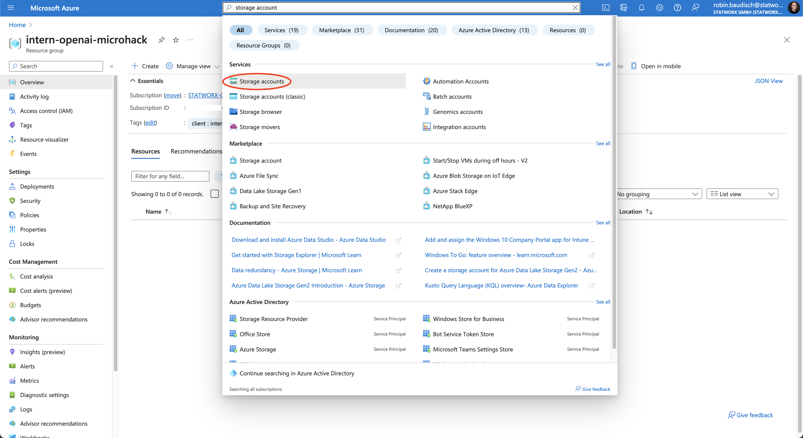

On the Storage Account subpage, either click on *+ Create* at the top of the page or on *Create storage account*.

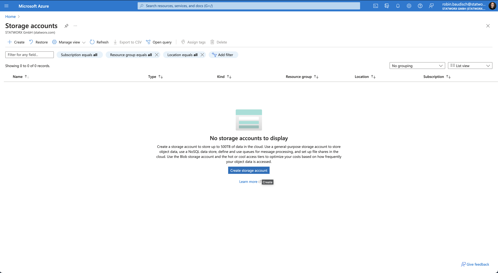

On the configuration page, the correct Azure Subscription and Resource Group should have been automatically selected under *Project Details*. Under *Instance Details* you need to name the Storage Account and select a deployment region. Here, we selected **Germany West Central** since statworx is located in Frankfurt, Germany. It is, however, up to you where you want your Storage Account to be located.

The selections for **Performance** and **Redundancy** are also up to you. Since we are only using this Storage Account for showcase purposes, low latency and high redundancy are not of primary concern to us. After you have given your storage account a name, selected the right deployment region and selected suitable performance and redundancy options, click on **Review**.

We do not modify the standard selections under the tabs **Advanced**, **Networking**, **Data protection**, **Encryption** or **Tags**. If you are handling sensitive data or have specific networking needs, please consult the official Azure resources.

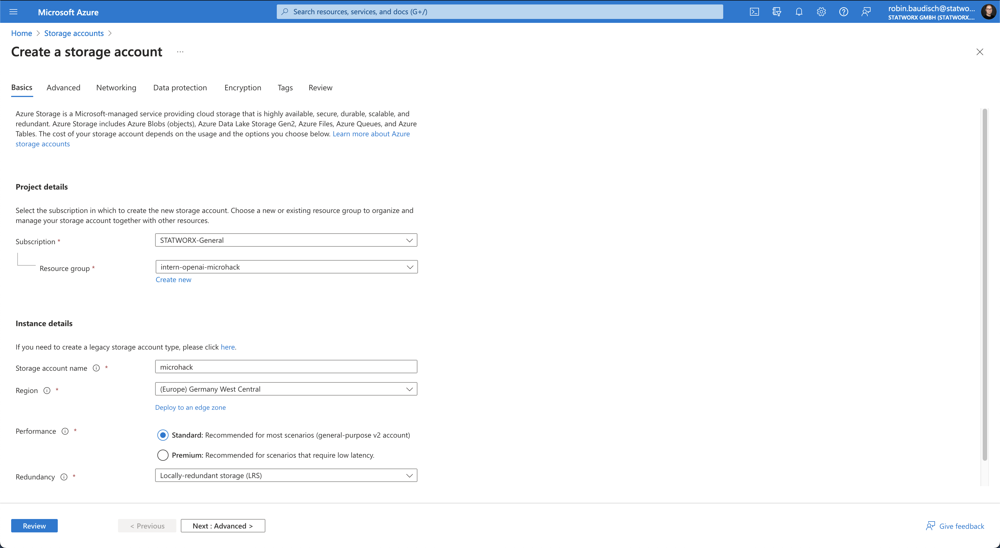

On the **Review** page, click on *Create* if you are happy with your configuration. It should take you to the deployment page of the storage account.


After the deployment page shows that the deployment was completed, click on *Go to resource*.


You are now seeing the main page of your newly created storage account. From the sidebar, under **Data storage**, select *Containers*.

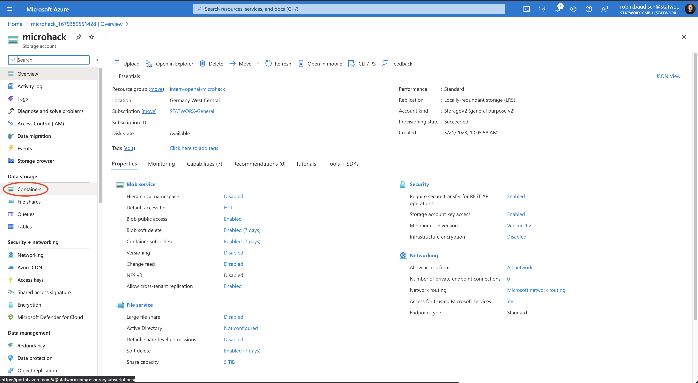

A container organizes a set of blobs, similar to a directory in a file system. At the top of the page, click on *+ Container*. A sidebar should appear. Give your container a suitable name. Under *Public access level*, select the access level suitable for your use case and click on *Create*.

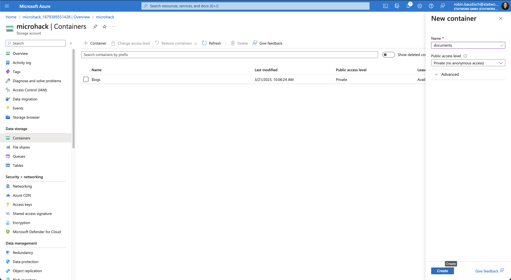

Your newly created container should now be selectable. You can now upload data by clicking on your container and selecting *Upload* at the top of the page.


If you want to use the Azure CLI for creating the storage account and uploading files, please refer to the resource at the beginning of the task.

## Task 2: Setup Azure Form Recognizer

**Resources:**

[Create a Azure Form Recognizer Resource](https://learn.microsoft.com/en-us/azure/applied-ai-services/form-recognizer/create-a-form-recognizer-resource?view=form-recog-3.0.0)\
[Azure Form Recognizer Documentation](https://learn.microsoft.com/en-us/azure/applied-ai-services/form-recognizer/?view=form-recog-3.0.0)\
[Azure Form Recognizer Pricing](https://azure.microsoft.com/en-us/pricing/details/form-recognizer/#pricing)\
\
Azure Form Recognizer is a cloud-based Azure Applied AI Service that uses machine-learning models to extract key-value pairs, text, and tables from your documents. Form Recognizer analyzes your forms and documents, extracts text and data, maps field relationships as key-value pairs, and returns a structured JSON output.\
\
In this task, you will set up an Azure Form Recognizer resource that can extract text data from unstructured documents.

Under the MicroHack Resource Group, search for *form recognizer* in the search bar.

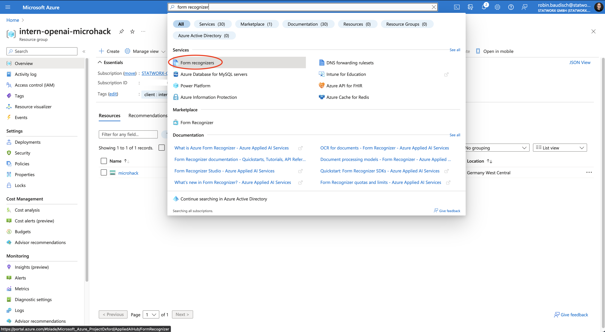

On the Form Recognizer subpage, either click on + Create at the top of the page or on Create form recognizer.


On the configuration page, the correct Azure Subscription should have been automatically selected under *Project Details*. You need to specify the Resource Group under which you want the Form Recognizer to be situated. Under *Instance Details* you need to name the Form Recognizer Service, select a deployment region and decide on the pricing tier. We once again selected **Germany West Central** and gave the Form Recognizer Service a fitting name.

When it comes to the pricing tier, you can decide to use the free tier which lets you process 500 document pages per month with a limit of 20 API calls per minute or the paid tier. Please refer to the pricing page at the top of this task for more details. Since we are exclusively using the Form Recognizer for demonstration purposes, we decided to use the free tier.

After you have given your Form Recognizer Service a name, selected the right resource group, deployment region and decided on a suitable pricing tier, click on **Review + create**. We once again do not modify the standard selections under the tabs **Network**, **Identity** or **Tags**. If you are handling sensitive data or have specific networking needs, please consult the official Azure resources.

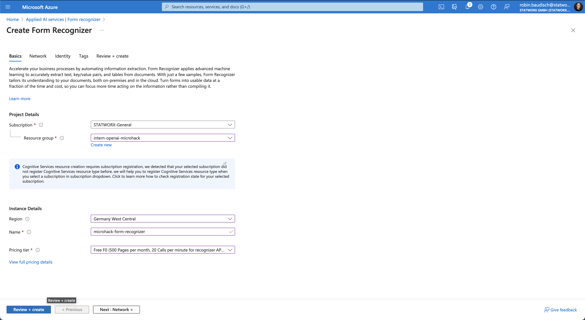

On the Review page, click on Create if you are happy with your configuration. It should take you to the deployment page of the Form Recognizer Service.

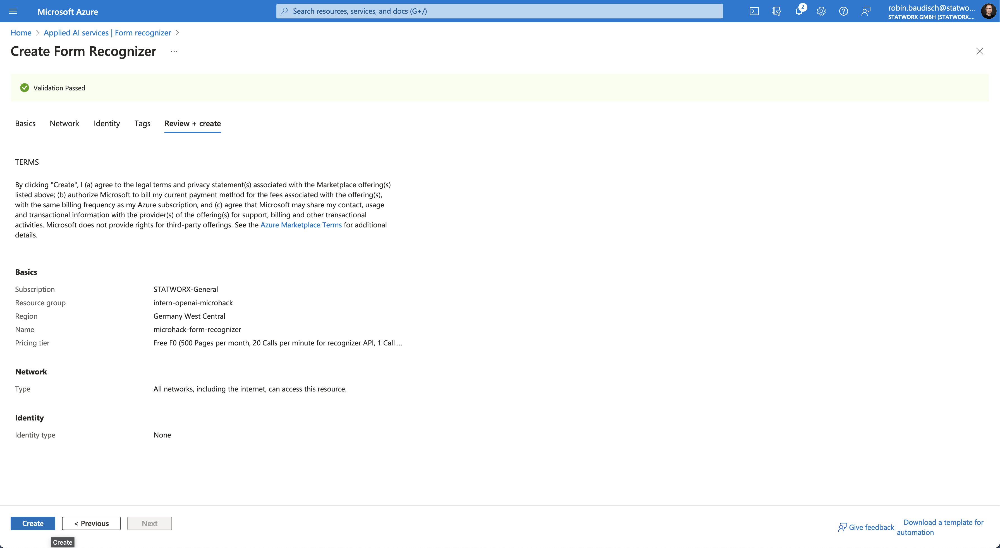

After the deployment page shows that the deployment was completed, click on Go to resource.


You are now seeing the main page of your newly created Form Recognizer Service. From the sidebar, under Resource Management, select Keys and Endpoint.

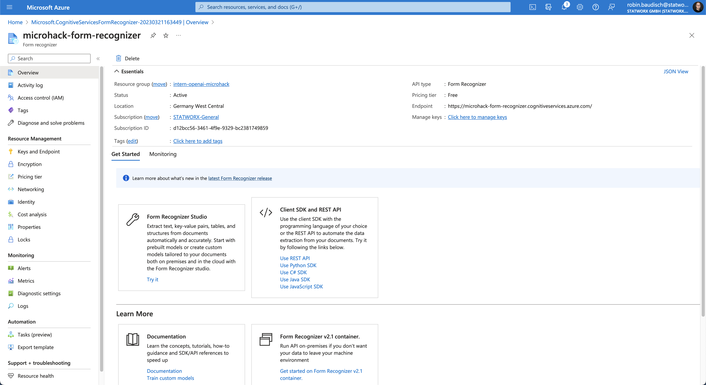

Copy the key and endpoint values and paste them in a convenient location, such as a Microsoft Notepad, for now. You'll need the key and endpoint values to connect your application to the Form Recognizer API. We will save these values in an Azure Key Vault in the next step. Make sure to keep these values in a private location - API keys are sensitive values and should not be stored in a public place such as a Git repository.

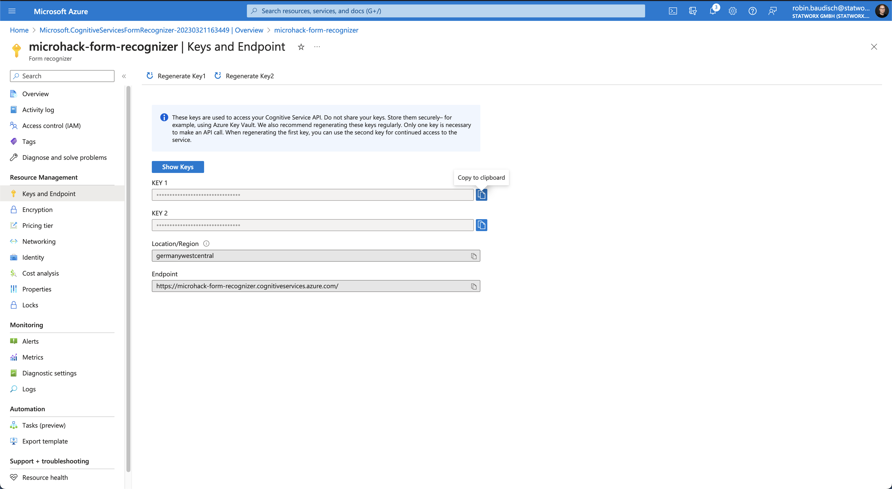

## Task 3: Setup Azure Key Vault and Save Form Recognizer Keys

**Resources:** \
[About Azure Key Vault](https://learn.microsoft.com/en-us/azure/key-vault/general/overview)\
[Quickstart: Create a Key Vault using the Azure Portal](https://learn.microsoft.com/en-us/azure/key-vault/general/quick-create-portal)\
[Quickstart: Create a Key Vault using the Azure CLI](https://learn.microsoft.com/en-us/azure/key-vault/general/quick-create-cli)\
[Assign a Key Vault Access Policy](https://learn.microsoft.com/en-us/azure/key-vault/general/assign-access-policy?tabs=azure-portal)

Azure Key Vault is a cloud service used to manage keys, secrets, and certificates. Key Vault eliminates the need for developers to store security information in their code. It allows you to centralize the storage of your application secrets which greatly reduces the chances that secrets may be leaked.

In this task, we will set up a Azure Key Vault to safely store the secrets for our previously created Form Recognizer Service.  

Under the MicroHack Resource Group, search for *key vault* in the search bar.

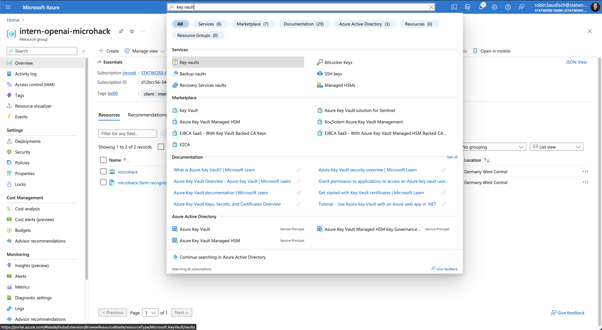

On the Key Vaults subpage, either click on + Create at the top of the page or on *Create key vault*.

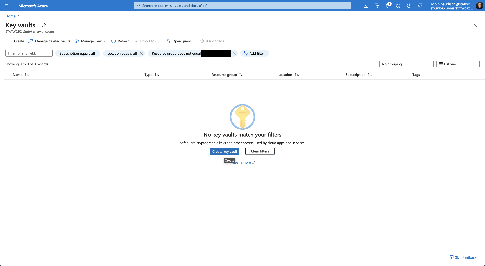

On the configuration page, the correct Azure Subscription should have been automatically selected under *Project Details*. You need to specify the Resource Group under which you want the Key Vault to be situated. Under *Instance Details* you need to name the Key Vault Service, select a deployment region and decide on the pricing tier. We once more selected **Germany West Central** and gave the Key Vault Service a fitting name.

The Recovery Options enable *Soft-delete* by default, meaning that deleted key vaults and secrets will be retained for a specified amount of time before being deleted completely. You are able to set the duration of this retention period, which we set to 90 days in our case, yourself. During this retention period, you will be able to either restore the key vault and secrets or delete them permanently without any more options for recovery.

After you have given your Key Vault Service a name, selected the right resource group, deployment region and decided on the recovery options, click on *Review + create*. We once more do not modify the standard selections under the tabs **Network**, **Identity** or **Tags**. If you are handling sensitive data or have specific networking needs, please consult the official Azure resources.

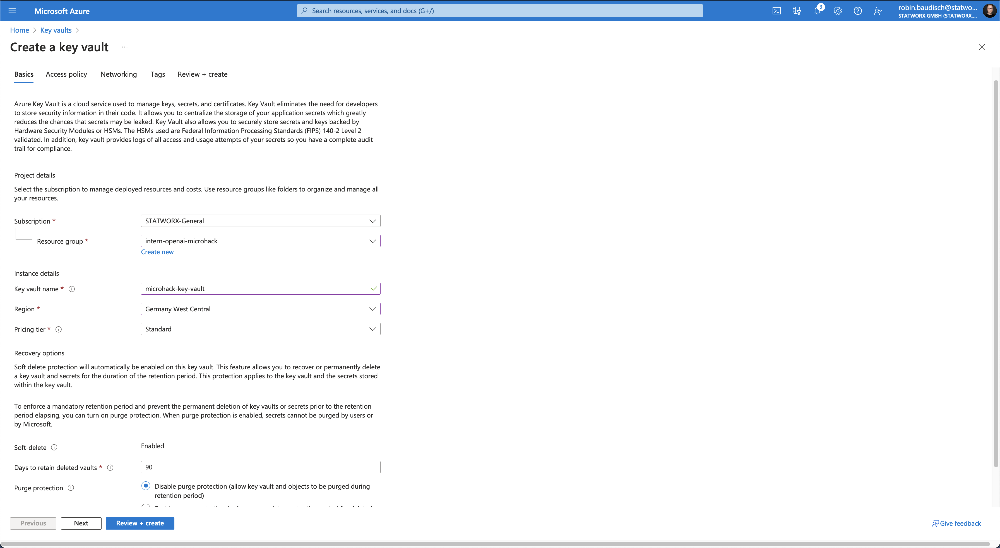

On the Review page, click on Create if you are satisfied with your configuration. This deploys your Key Vault Service and takes you to its dedicated Overview page.

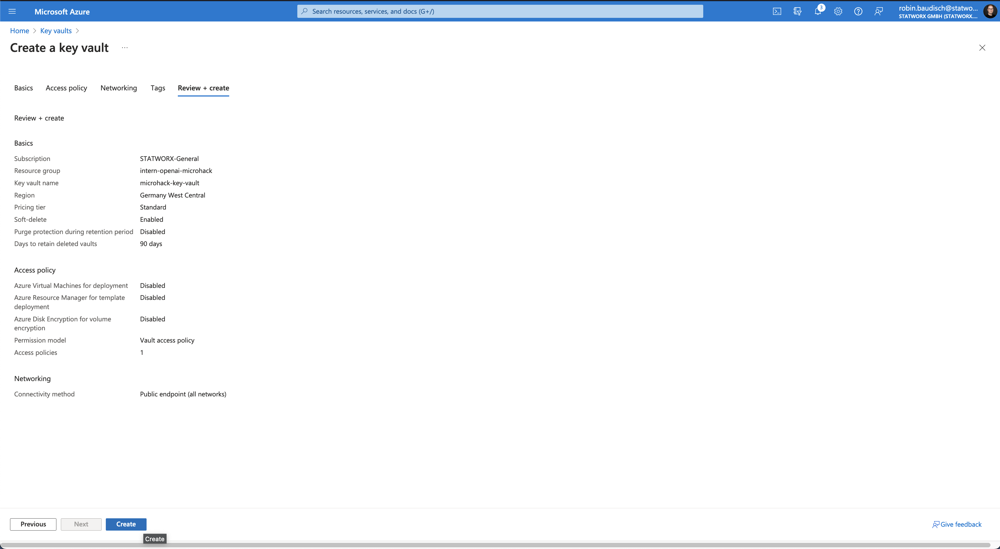

After the deployment page shows that the deployment was completed, click on *Go to resource*.


You are now seeing the main page of your newly created Key Vault Service. From the sidebar, click on *Access Control (IAM)* to be taken to the access and role assignments page.

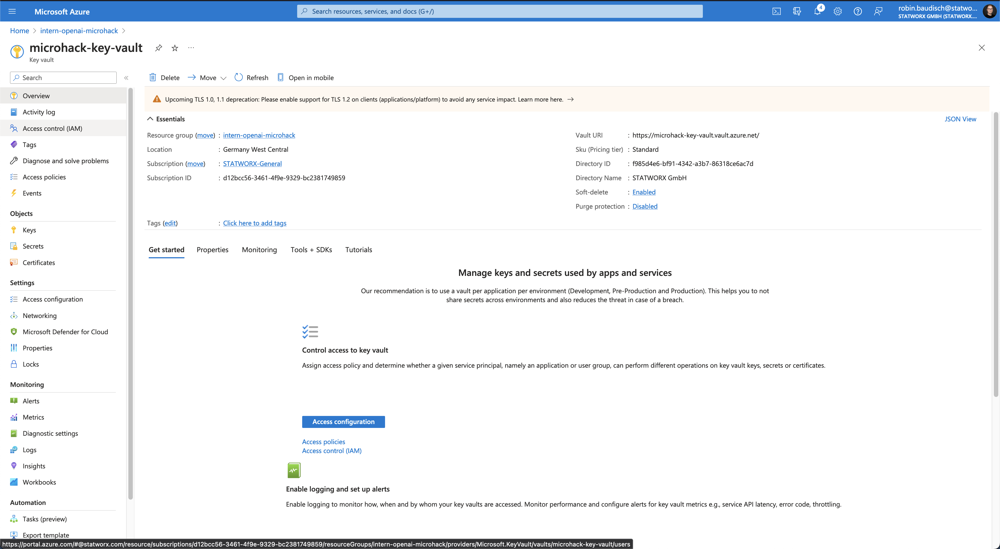

After navigating to the **Role assignments** tab, you can double-check the existing roles and whether they align with the needs of your project.

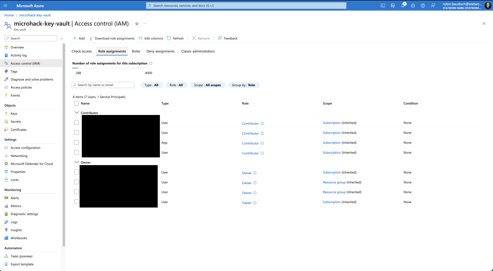

Configure role assignment/add users if neccessary (refer to last link under resources at top of task)
If needed, you can assign new roles to users or even create custom roles tailored to your specific project needs. The last link found [under resources](#task-3-setup-azure-key-vault-and-save-form-recognizer-keys) demonstrates how to assign access policies.

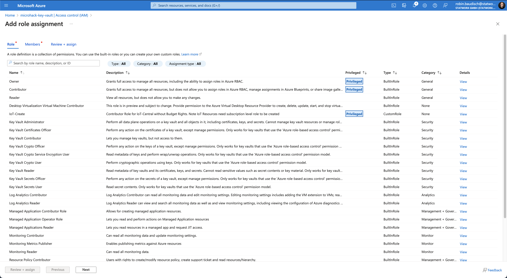

Head back to the main page of your newly created Key Vault Service. From the sidebar, under Objects, select Secrets.


Click on Generate/Import to store the secret Key + Endpoint of your previously created Form Recognizer.

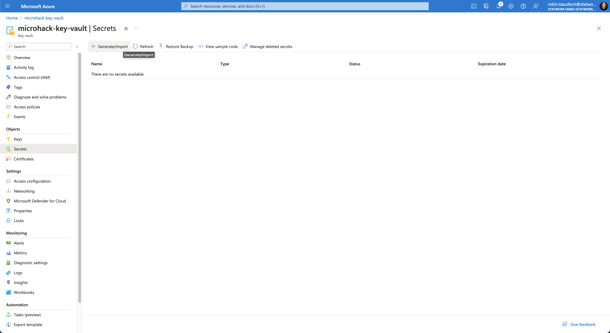

Next you must give the secret API key a fitting name, before copy-pasting the previously created Form Recognizer key to the *Secret value* field. If you followed this guide, you stored this key in a local text editor such as Microsoft Notepad.  
Click create once you're finished.

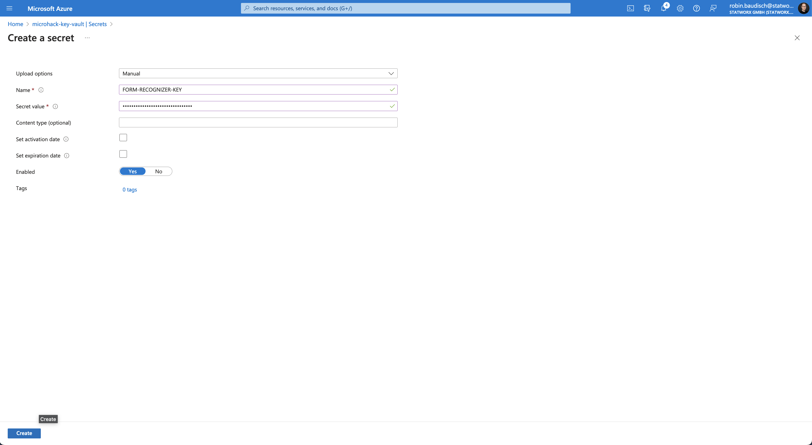

Repeat this process for the Form Recognizer endpoint. Give your secret an appropriate name and copy-paste the endpoint value over to *Secret value*. Click create to store your secret in your Key Vault Service.

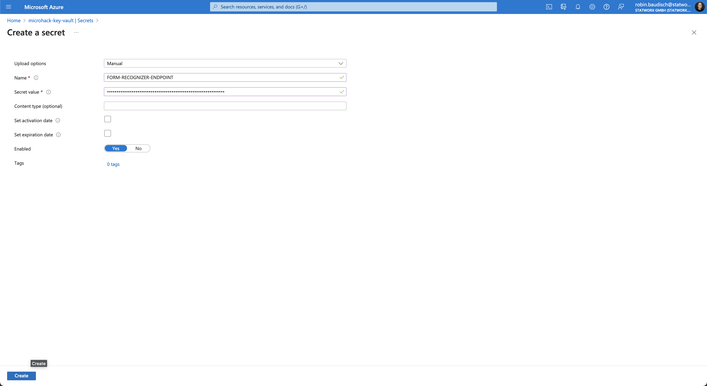

Once finished you will find that both endpoint and key secrets have been stored in your Key Vault Service. Your secrets are now safely stored without the risk of being leaked from a public Git repository.

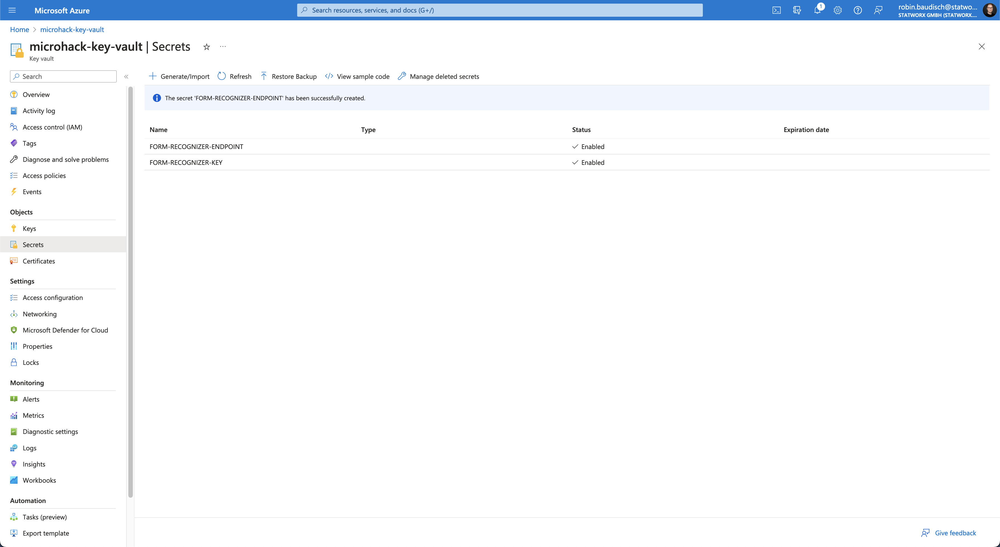

## Task 4: Setup Chroma DB

**Resources** \
[Quickstart: Create a Linux virtual machine in the Azure portal](https://learn.microsoft.com/en-us/azure/virtual-machines/linux/quick-create-portal?tabs=ubuntu)\
[Create a virtual machine with a static public IP address using the Azure portal](https://learn.microsoft.com/en-us/azure/virtual-network/ip-services/virtual-network-deploy-static-pip-arm-portal?context=%2Fazure%2Fvirtual-machines%2Fcontext%2Fcontext)\
[Run scripts in your Linux VM by using action Run Commands](https://learn.microsoft.com/en-us/azure/virtual-machines/linux/run-command)\
[Chroma](https://docs.trychroma.com/)\
[Chroma - docker-compose.yml](https://github.com/chroma-core/chroma/blob/main/docker-compose.yml)

Chroma is an open-source database specifically designed to store embedding vectors. This focus on embeddings makes Chroma a vector database, which differ from relational databases in that they are not designed to be queried for exact matches (or "lexical overlap"). Instead, proximity metrics are used to return the most closely related documents to the query, as evaluated by measuring similarity between query and documents embeddings with the **cosine similarity**. Read more about Chroma in its [official documentation](https://docs.trychroma.com/).

Chroma is thus an excellent choice for a document storage for our specific use case. Not only does Chroma sport a developer-friendly API and straight-forward implementations for vector-search, it is also open-source and thus does not require any paid subscription. Since Chroma does not come as its own Azure service it requires its own custom deployment on an Azure virtual machine.

Chroma has made a docker-compose file for containerizing and deploying Chroma available for developers. We will use this template and deploy it inside of an Azure Virtual Machine which is exposed to the internet.

Azure Virtual Machines (VMs) are on-demand, scalable, and fully customizable virtual machines provided by Microsoft Azure. These VMs allow users to run different operating systems, applications, and services, including Linux and Windows.

In the Azure Portal, search for *virtual machines* in the searchbar. On the VM start page, click on Create/Azure virtual machine.


Under the Basics subpage of the VM configuration, select your Resource Group, give the VM a fitting name and select a deployment region. We chose North Europe since the deployment region has an impact on the costs.
The image type option let's you choose the base OS or application of the VM. We chose, and recommend, Debian 11, a Linux OS, as our image.

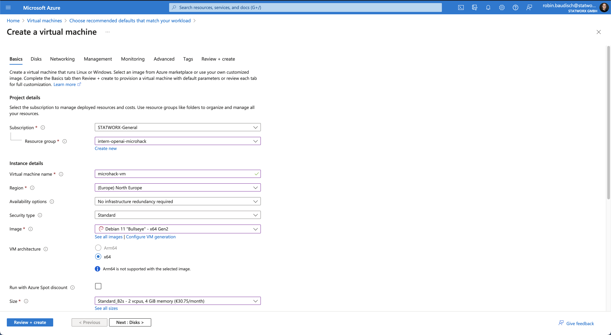

The option you select for Size has the main impact on the costs of running your VM. For demonstration purposes, we chose *Standard_B2s* as our size option (2 vCPUs, 4GB RAM, 8GB storage).

For administrative purposes, you need to specify the way you want to interface/authenticate with the VM. The recommended way is to select *SSH public key* here. This option will create key pair for you to authenticate yourself when trying to SSH into the VM.

Since we need to connect our Azure Function and Frontend with the Chroma DB, we need to set the inbound port rules to allow specific ports of the VM to be accessible from the internet. Again, since this VM will only be used for this Microhack, we selected the ports 80 (HTTP), 443 (HTTPS) and 22 (SSH) to be accessible for debugging purposes. We will take some additional security precautions later on in our setup.


Under the Networking subpage, we will create a virtual network and a Public IP for our VM. Give the virtual network a name and configure the Address range as well as the subnet's address range of the network. We kept the default configuration for both.

Next, click on Review + create.

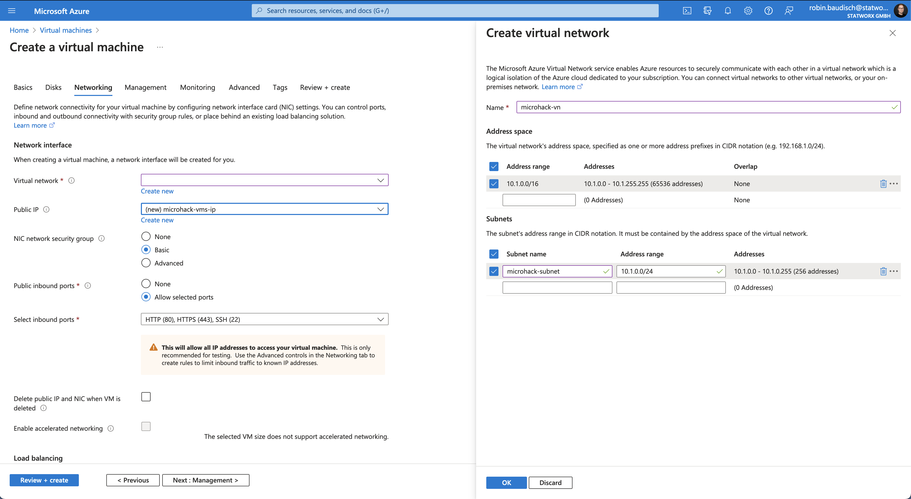

After reviewing your VMs specifications, click on Create. Deploying the VM will take a few seconds.


After the VM has been deployed, we will set some networking security rules to whitelist specific IP addresses for connecting to the VM via the public internet.

Navigate to your VMs main page in the Azure Portal and select *Networking* under Settings in the sidebar.

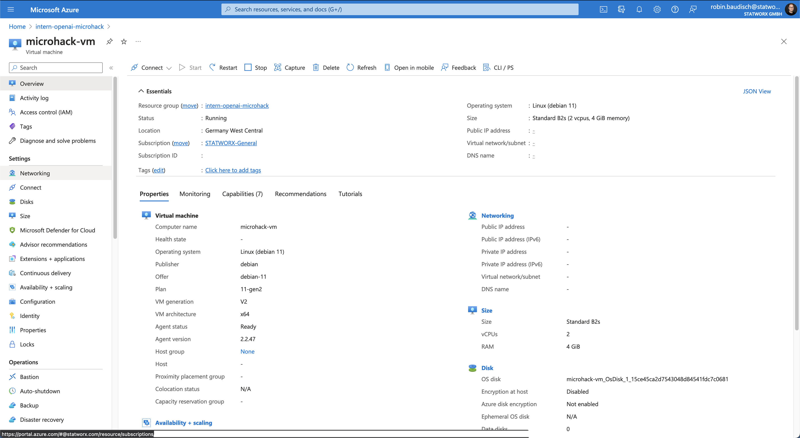

Here, you can set inbound port rules. Inbound port rules define who can connect to the VM. For now, we want our own IP to be able to access the VM on specific ports. In Challenge 2, after we deployed our Azure Function and the Frontend Web App, we'll add inbound port rules for their IPs as well.

We'll allow our own IP address to connect to the VM via SSH (for debugging) and on port 8000 (Chroma's port).


The Chroma DB will be available via the IP Address next to *NIC Public IP*. Since this is also a sensitive value, we will add the IP to our Key Vault, just as we did for the Form Recognizer secrets in Task 3.

Now that we are able to connect to the VM locally, we will set up Chroma and check if the container group is running as expected. You can execute the Chroma docker-compose script *startup.sh* by running the following command inside your terminal:

```console
az vm run-command invoke -g <Resource Group> -n <VM Name> --command-id RunShellScript --scripts @startup.sh
```

This can take a few minutes. After the script has run successfully, SSH into the VM by executing this command in your terminal:

```console
ssh -i <Path to private key> <User Name>@<VM IP>
```

You need to specify the path to the key file which was automatically downloaded when you created the VM and the user name you decided on.

After you are connected to the VM via SSH, check the docker containers on the VM by running:

```console
sudo docker ps -a
```

You should see two running containers - one for the Chroma image and one for clickhouse, the backend database.

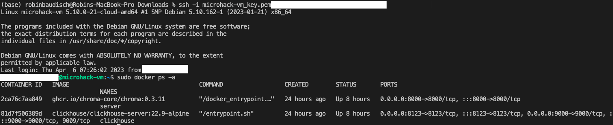

## Task 5: Create the Azure Function

**Resources:** \
[Introduction to Azure Functions](https://learn.microsoft.com/en-us/azure/azure-functions/functions-overview)\
[Getting started with Azure Functions](https://learn.microsoft.com/en-us/azure/azure-functions/functions-get-started?pivots=programming-language-python)

Azure Functions are a so-called serverless compute service. They are used to execute processes based on event-triggered code. This means that the code you write that makes up your Azure function does not run continuously, it is instead initiated by a large range of various trigger events. That is exactly what we need for this use case: every time a new document is added to our knowledge base, it triggers an Azure function that extracts and embeds the content of that document and adds it to the Elastic search index used for providing the Q&A bot with the knowledge needed to answer questions.

In this task, we are setting up an Azure function that we can later customize to execute the custom code that executes said process.

For this task, we move away from the Azure portal to VSCode for a change of pace. Make sure that you have the Azure Tools extension installed, as lined out in the [**Lab Requirements**](./readme.md#lab-environment-for-this-microhack) section of this microhack. 

In VSCode, navigate to your Azure extension tab on the toolbar at the left edge of the editor. 


Use `Ctrl`+`Shift`+`P` or `⇧⌘P` to bring up the VSCode command palette. Type `>azure functions create new project` into the search bar and select **Azure Functions: Create New Project...**. You will be prompted to either browser to a folder to be used as the project folder, or select a pre-selected folder for the same purpose. Select **Browse...** to open up a file browser.


Use the file browser to navigate to a folder where you want to store the necessary files for your function app. The function app provides an execution context for your function in Azure and is thus the unit of deployment and management for all of your created functions of a project. We choose the root folder of our MicroHack repository as the project folder for our function app. 

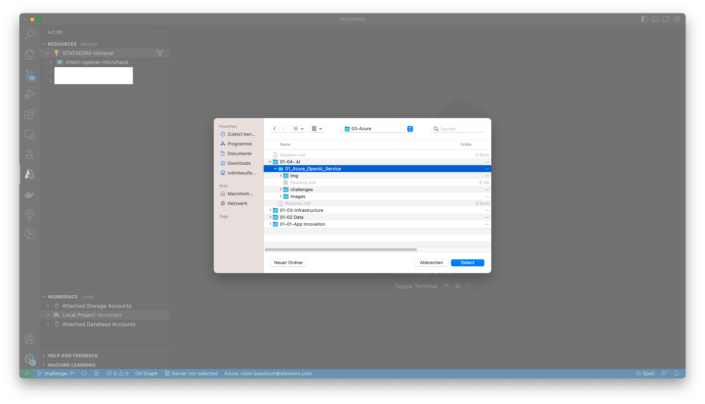

Next you are prompted to choose a programming language for the function project. This is the programming language that your Azure function is then expected to be written in. We choose python for the purpose of this MicroHack. 

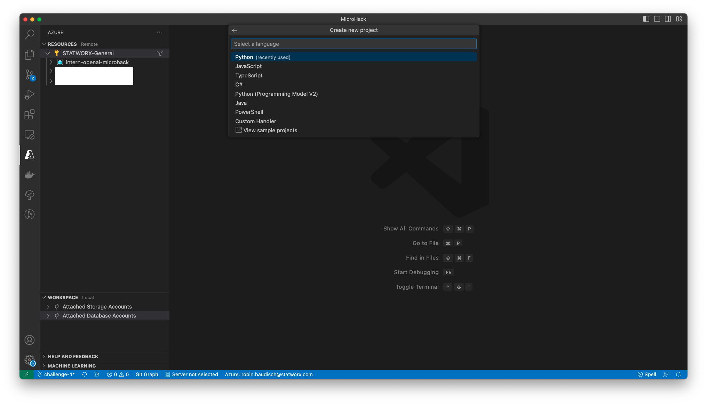

The project setup window will then ask you to specify the Python interpreter you would like to use for this project. You can either choose one of the displayed Python interpreters or use a file browser to manually enter the system path to another Python interpreter. 

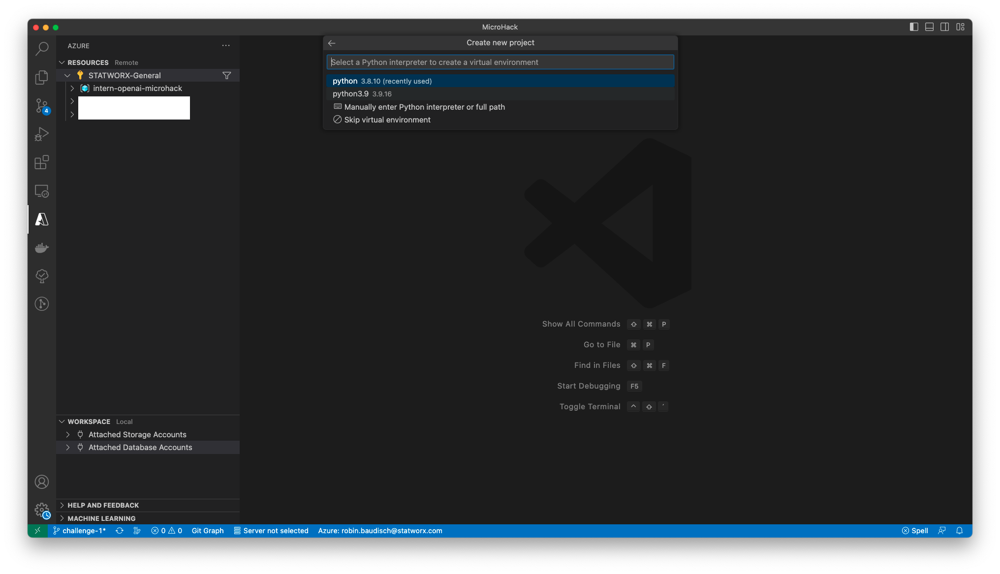

Next the project setup dialogue will ask you to select a project template to use for your Function app project. For the specific use case of this MicroHack, we opt for the **Azure Blob Storage trigger** template. Make sure to take your time and read through [the documentation](https://learn.microsoft.com/en-us/azure/azure-functions/functions-triggers-bindings?tabs=python) for other possible trigger templates depending on your own project needs. If you're just following along, the **Azure Blog Storage trigger** is what we need. 


Next we enter a name for our Azure function. This can be anything, but short and expressive names are recommended to make it easier for others to understand the project. 

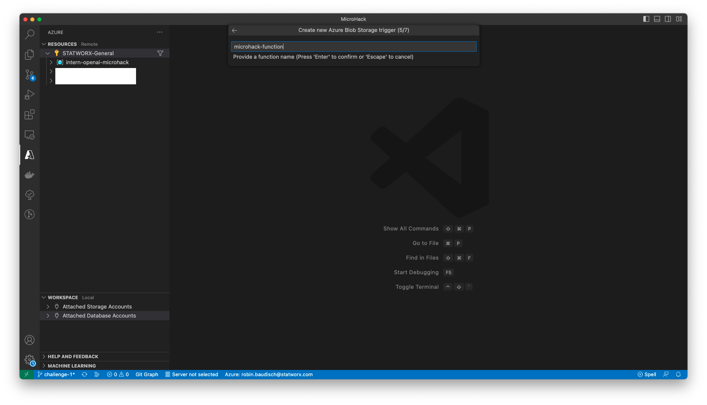

After deciding on a name we can either select existing app settings from a JSON-file, or create new local app settings. 

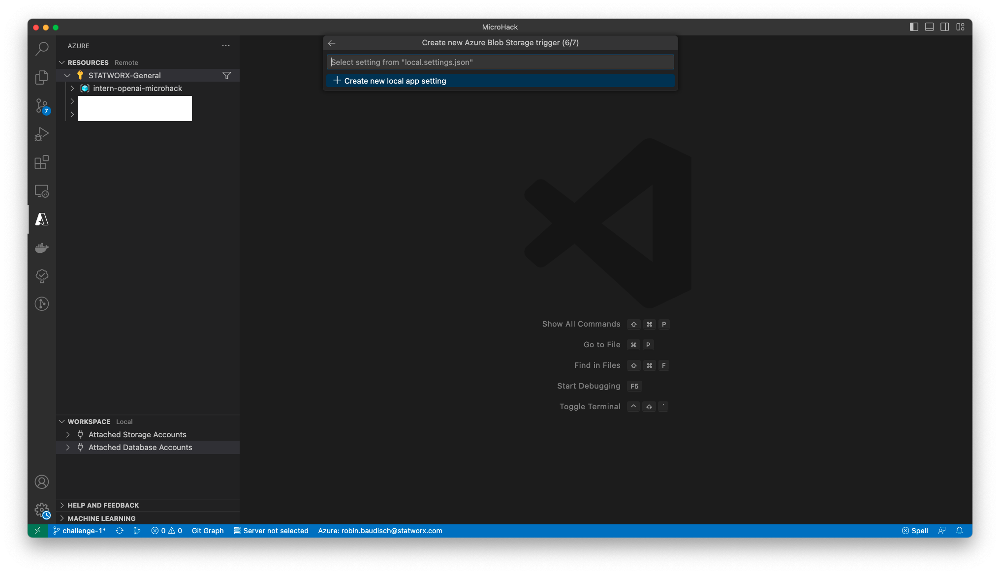

As the last step of this set-up process, we define the Azure Storage account that this function has access to. We choose the Storage Account that we have previously set up in [Task 1](#task-1-create-a-storage-account) of this challenge. 

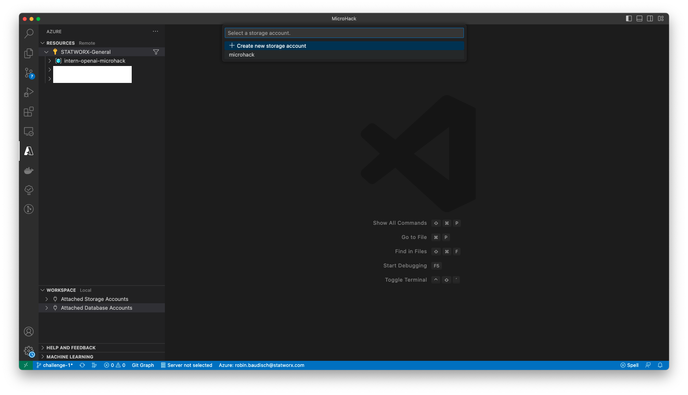

Now we need to specify a path within our Azure Storage account that the trigger will monitor for changes. Here we choose to monitor the documents folder and trigger the Azure function whenever a new file of any given filename is added. 


After this, a new python scrypt names `__init__.py` is added to the project folder that we specified earlier. It contains the template for an Azure function script that you can already test. Everytime the trigger is activated, the `main()` function is executed from this script. Currently, we are still missing the `azure.functions` module that this script depends on, since the VSCode creates a new virtual environment for this project when creating the Azure functions. 

This requires two actions to fix: 

- Activate the virtual environment that VSCode has created for this function project:
    - For this we use VSCode's built-in terminal and execute the following command inside the Microhack folder: `source .venv/bin/activate`
- Install the needed requirements for this script:
    - Once the virtual environment has been activated we install all required packages by executing the following command from the terminal: `pip install -r requirements.txt`

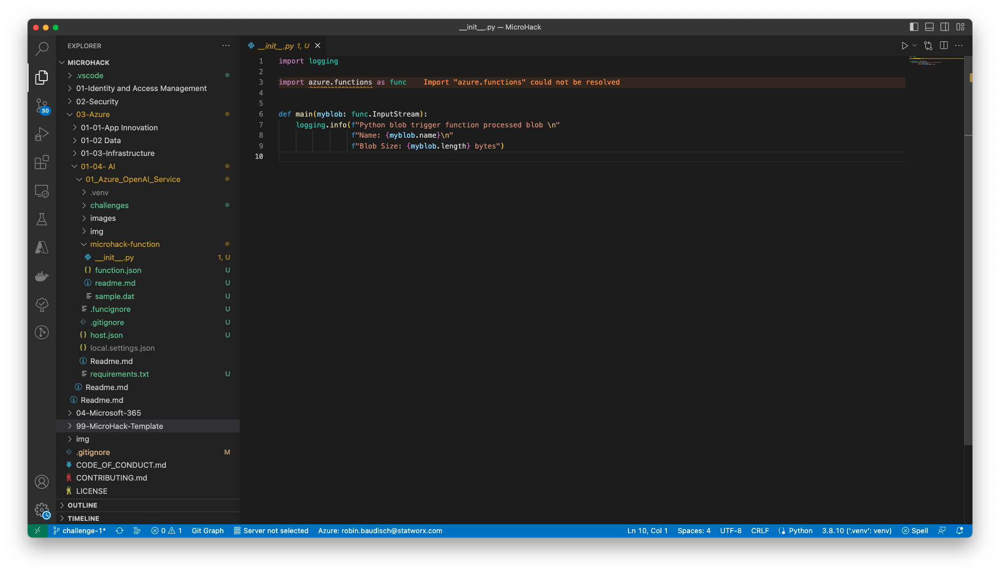

All required dependencies are now properly installed in the dedicated virtual environment for this project and the script is ready to be executed and tested. 


## Task 6: Test the Azure Function Locally

The created Azure Function has not yet been deployed to the cloud and only lives on your local machine right now. However, you can and very much should run the function locally in order to test if it runs smoothly.

To do this, press ```F5``` to run the basic function which should print out basic information if someone uploads a file into the specified blob storage.

You might get prompted to select the storage account the function depends on when running it for the first time.

In the terminal you should see the following after a few seconds:


This means that the function is now ready to be triggered by a new upload to the specified blob storage.

There are different ways to upload files to a blob storage. For our test, we will do it via the Azure Portal.

For this, navigate to the storage account which you created in Task 1. Select **Containers** in the sidebar.

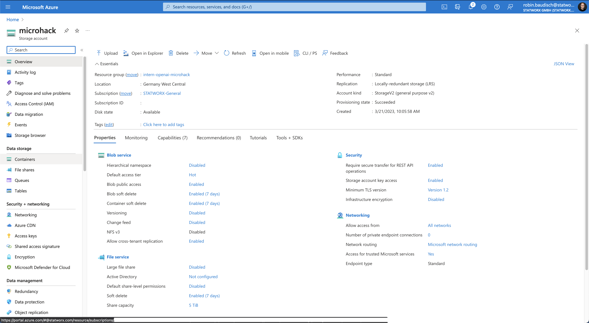

You should now see the blob storage you created. In our case, it is named *documents*. Click on the blob storage.

On the top of the blob storage page, click on **Upload**.


Now you can either drag and drop a file into the specified field or browse for files to upload.

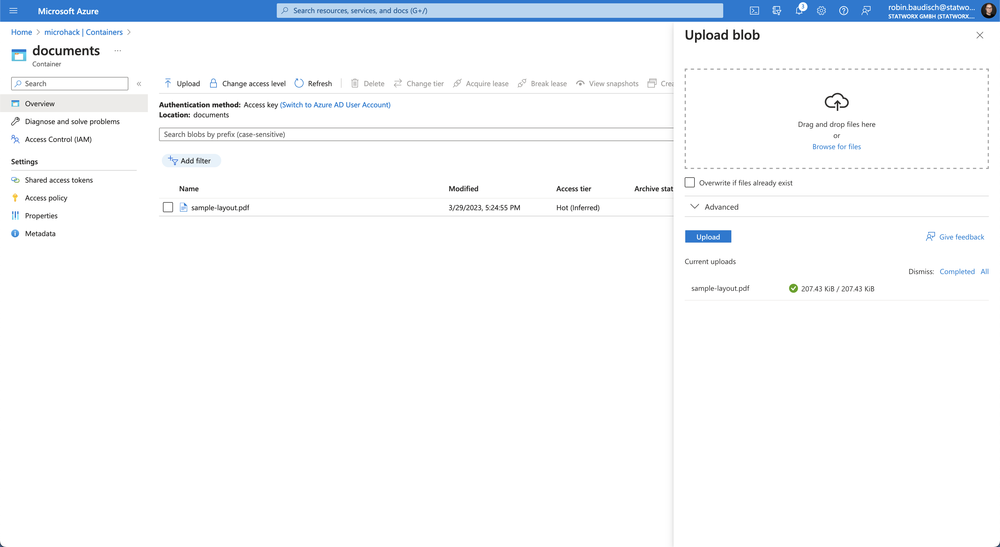

After clicking on **Upload**, you should see the following in your VSCode terminal:


This means that the function has successfully been triggered by the upload of your file.

**Congratulations, you successfully completed Challenge 1! 🚀**
