# Walkthrough Challenge 2 - Setting up a Functional Pipeline

Duration: **2.5 hours**

**[Home](../../Readme.md)** - [Next Challenge Solution](../challenge-3/solution.md)

- [Walkthrough Challenge 2 - Setting up a Functional Pipeline](#walkthrough-challenge-2---setting-up-a-functional-pipeline)
  - [Prerequisites](#prerequisites)
  - [Task 1: Setup the Azure OpenAI Service](#task-1-setup-the-azure-openai-service)
  - [Task 2: Implement the Azure Form Recognizer in the Azure Function](#task-2-implement-the-azure-form-recognizer-in-the-azure-function)
  - [Task 3: Create a Chroma Collection and Prepare the Azure Function for Creating Text Embeddings](#task-3-create-a-chroma-collection-and-prepare-the-azure-function-for-creating-text-embeddings)
  - [Task 4: Write the Extracted Paragraphs and Embeddings to the Chroma Collection](#task-4-write-the-extracted-paragraphs-and-embeddings-to-the-chroma-collection)
  - [Task 5: Test the Azure Function Locally](#task-5-test-the-azure-function-locally)
  - [Task 6: Deploy the Azure Function](#task-6-deploy-the-azure-function)

## Prerequisites

In order to complete Challenge 2, make sure to complete the [Development Setup](../../Readme.md#lab-environment-for-this-microhack) and work through the tasks laid out in Challenge 1. It is assumed that you already created an Azure Storage Account, Form Recognizer, Key Vault, a running Chroma DB inside an Azure VM and a locally running Azure Function.

## Task 1: Setup the Azure OpenAI Service

**Resources:** \
[Azure OpenAI Service Documentation](https://learn.microsoft.com/en-us/azure/cognitive-services/openai/overview)\
[Create a resource and deploy a model using Azure OpenAI](https://learn.microsoft.com/en-us/azure/cognitive-services/openai/how-to/create-resource?pivots=web-portal)\
[New and improved embedding model](https://openai.com/blog/new-and-improved-embedding-model)

In order to work with the GPT models from OpenAI, we need to create the Azure OpenAI service and deploy the models we will be using.

Under your Resource Group, search for *openai* in the search bar and select the **Azure OpenAI** service.


This will take you to the **Cognitive Services | Azure OpenAI** subpage, either click on *+ Create* at the top of the page or on *Create Azure OpenAI*.

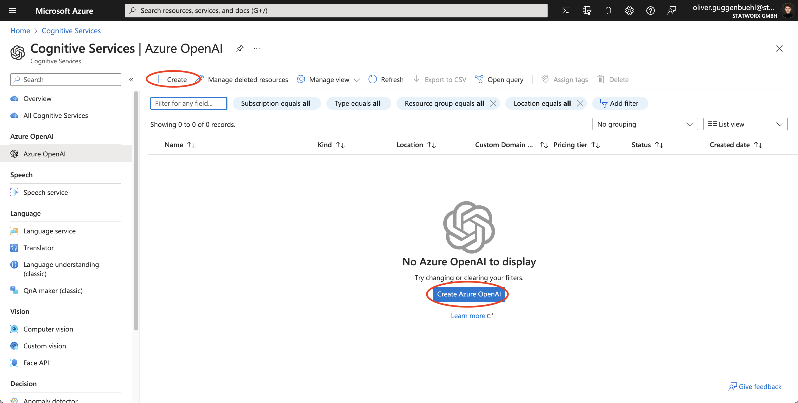

On the configuration page, select the correct Azure Subscription under *Project Details*. You need to specify the Resource Group under which you want the Azure OpenAI resource to be situated. Under *Instance Details* you need to select a deployment region, name the Azure OpenAI service and decide on the pricing tier. We selected **West Europe**, gave the Azure OpenAI service a fitting name and chose the default pricing tier.

The next step is to click on **Review + create**. We once again do not modify the standard selections under the tabs **Network**, **Identity** or **Tags**. If you are handling sensitive data or have specific networking needs, please consult the official Azure resources.

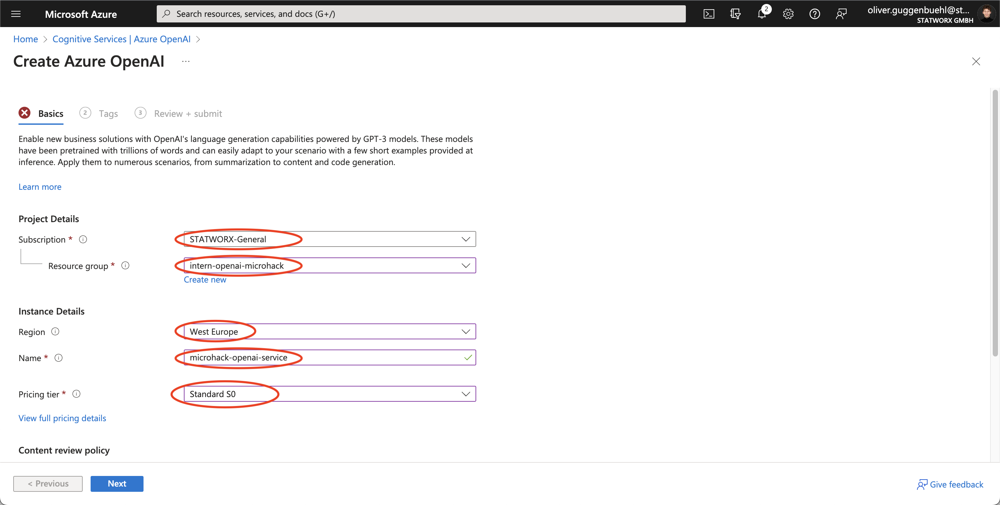

Next, Azure is prompting us to give the resource some tags that make it easier to differentiate between multiple instances of the same service. Which tags you want to set and how to name their values is entirely up to you.

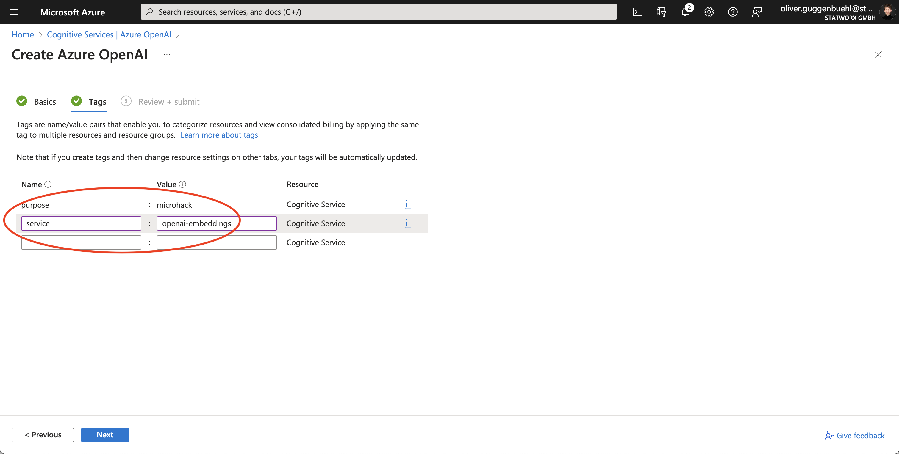

On the Review page, click on Create if you are happy with your configuration. It should take you to the deployment page of the Azure OpenAI service. Deployment might take an unexpectedly long time for this particular resource - do not be surprised if it takes over an hour to finish deployment.

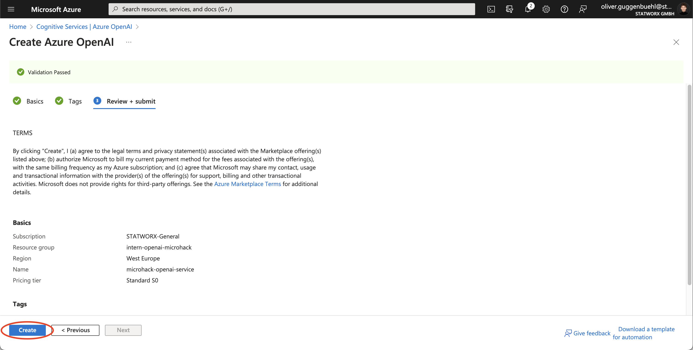

Before you can generate embeddings or text, you need to deploy a model. You can select from one of several available models in the [Azure OpenAI Studio](https://oai.azure.com/). Select the correct Azure Subscription and the Resource Group under which you created the Azure OpenAI Service.


Since the Service has just been created, on the main page of the Azure OpenAI Studio it will let you know that you have currently no models deployed. Click on *Create new deployment*.


In the newly opened window, you are asked to select one of several different OpenAI models for deplyoment. These models are dividable by their parameter size (Ada is the smallest models while Davinci is the largest) and their respective use cases. There are different models for creating text embeddings, code embeddings or text/code generation. For a complete list of available models, refer to [Azure OpenAI Service models](https://learn.microsoft.com/en-us/azure/cognitive-services/openai/concepts/models#model-summary-table-and-region-availability).

Since we want to create embeddings of documents and user queries with the goal of retrieving relevant sections of our uploaded documents with regards to the query, we need to deploy a text search embedding model. We select *text-embedding-ada-002*, the newest embedding model from OpenAI which creates embeddings with 1536 dimensions.

Under *Deployment Name*, give the model a fitting name. Deployment names are the ones we will specify in our code.


Lastly, we need a text generation model which will output the response to the user query. For this, we chose *text-davinci-003*.


The two models we just deployed will be usable in our Azure Function and our Frontend.

## Task 2: Implement the Azure Form Recognizer in the Azure Function

**Resources:**

[Use Azure Functions and Python to process stored Documents](https://learn.microsoft.com/en-us/azure/applied-ai-services/form-recognizer/tutorial-azure-function?view=form-recog-3.0.0)

[Azure Form Recognizer client library for Python  - version 3.2.1](https://learn.microsoft.com/en-us/python/api/overview/azure/ai-formrecognizer-readme?source=recommendations&view=azure-python)

After setting up the individual services needed for this MicroHack, we are now moving on to writing the Python script that handles the data processing within our defined Azure Function, once the function has been triggered.

Firstly, we'll add the needed packages to the requirements.txt.
We will be using

- ```azure-identity``` to authenticate ourselves
- ```azure-keyvault-secrets``` to connect to our Azure Key Vault
- ```azure-ai-formrecognizer``` which is the official Python SDK of the Azure Form Recognizer
- ```azure-storage-blob``` to connect to the storage account

Next, we'll install the updated requirements.txt. For this, open the integrated terminal in VSCode. Make sure that the correct virtual environment is active. If it is not, execute the following terminal command inside the *01_Azure_OpenAI_Service* directory:

```source .venv/bin/activate```

We'll execute ```pip install -r requirements.txt``` to install the updated list of packages.

Now we are ready to work on the code of our Azure function.
Open up the \_\_init\_\_.py file inside the *microhack-function* folder. Import the needed packages at the start of the file:

```Python
import logging
import azure.functions as func
from azure.keyvault.secrets import SecretClient
from azure.identity import DefaultAzureCredential
from azure.ai.formrecognizer import DocumentAnalysisClient
from azure.core.credentials import AzureKeyCredential
from typing import List, Optional
```

Next, we'll make sure to authenticate ourselves inside the ```main()``` function and grab the needed secrets from the Azure Key Vault:

```Python
def main(myblob: func.InputStream):
    logging.info(
        f"Python blob trigger function processed blob \n"
        f"Name: {myblob.name}\n"
        f"Blob Size: {myblob.length} bytes"
    )

    credential = DefaultAzureCredential()
    # Retrieve secrets from Key Vault
    key_vault_name = "microhack-key-vault"
    key_vault_uri = f"https://{key_vault_name}.vault.azure.net"
    client = SecretClient(vault_url=key_vault_uri, credential=credential)
    logging.info("Retreiving secrets from Azure Key Vault.")
    fm_api_key = client.get_secret("FORM-RECOGNIZER-KEY").value
    fm_endpoint = client.get_secret("FORM-RECOGNIZER-ENDPOINT").value
```

Grabbing the uploaded document is as easy as:

```Python
# Read document
data = myblob.read()
```

Now, we are ready to implement a function which utilizes the Azure Form Recognizer SDK to extract the document's text. The Form Recognizer SDK organizes a document into different granularities: Pages, Paragraphs, Lines and Words. For this, we'll first implement the ```chunk_paragraphs()``` function which - as the name suggests - chunks the list of paragraphs we'll get from the Form Recgonizer into chunks of approximately equal word count with a maximum of 100 words per chunk:

```Python
def chunk_paragraphs(paragraphs: List[str], max_words: int = 100) -> List[str]:
    """
    Chunk a list of paragraphs into chunks
    of approximately equal word count.
    """
    # Create a list of dictionaries with the paragraph as the
    # key and the word count as the value
    paragraphs = [{p: len(p.split())} for p in paragraphs]
    # Create a list of lists of paragraphs
    chunks = []
    # Iterate over the list of paragraphs
    for i, p in enumerate(paragraphs):
        # If the current chunk is empty, add the first paragraph to it
        if len(chunks) == 0:
            chunks.append([p])
        # If the current chunk is not empty, check if adding the
        # next paragraph will exceed the max word count
        else:
            # If adding the next paragraph will exceed the max word count,
            # start a new chunk
            if (
                sum([list(c.values())[0] for c in chunks[-1]]) + list(p.values())[0]
                > max_words
            ):
                chunks.append([p])
            # If adding the next paragraph will not exceed the max word
            # count, add it to the current chunk
            else:
                chunks[-1].append(p)
    # Create a list of strings from the list of lists of paragraphs
    chunks = [" ".join([list(c.keys())[0] for c in chunk]) for chunk in chunks]
    return chunks
```

Finally, we'll implement a wrapper function around the Form Recognizer which takes the uploaded document as input and returns a list of the extracted (and chunked) paragraphs:

```Python
def analyze_layout(data: bytes, endpoint: str, key: str) -> List[str]:
    """
    Analyze a document with the layout model.
    Args:
        data (bytes): Document data.
        endpoint (str): Endpoint URL.
        key (str): API key.
    Returns:
        List[str]: List of paragraphs.
    """
    # Create a client for the form recognizer service
    document_analysis_client = DocumentAnalysisClient(
        endpoint=endpoint, credential=AzureKeyCredential(key)
    )
    # Analyze the document with the layout model
    poller = document_analysis_client.begin_analyze_document("prebuilt-layout", data)
    # Get the results and extract the paragraphs
    # (title, section headings, and body)
    result = poller.result()
    paragraphs = [
        p.content
        for p in result.paragraphs
        if p.role in ["Title", "sectionHeading", None]
    ]
    # Chunk the paragraphs (max word count = 100)
    paragraphs = chunk_paragraphs(paragraphs)

    return paragraphs
```

## Task 3: Create a Chroma Collection and Prepare the Azure Function for Creating Text Embeddings

**Resources**:\
[OpenAI Python Library](https://github.com/openai/openai-python)\
[Tutorial: Explore Azure OpenAI Service embeddings and document search](https://learn.microsoft.com/en-us/azure/cognitive-services/openai/tutorials/embeddings?tabs=command-line)

Since we now have implemented the text extraction part of our Azure Function and deployed the OpenAI models, we need to set up the needed steps for creating text embeddings and writing them to our Chroma database inside the Azure Function.

This requires the creation of a so-called 'collection' in Chroma. A collection is where all documents and embeddings will be stored.  

We'll first add the needed packages to the requirements.txt and install them just like we did in Task 1.

Add the following packages:

- `openai`
- `num2words`
- `matplotlib`
- `plotly`
- `scipy`
- `scikit-learn`
- `chromadb`

We can create a new Chroma collection directly inside our Python script.
First we import the needed libraries and classes:

```Python
import chromadb
from chromadb.config import Settings
```

Then we add the following snippet to the ```main()``` function to retrieve the IP address of the Azure VM where the Chroma database is running on:

```Python
# Chroma
chroma_address = client.get_secret("CHROMA-DB-ADDRESS").value
```

Next, we initialize a Chroma client. Using the `client.heartbeat()` method, we ping the Chroma API to test its health.

```Python
# Init Chroma client
chroma_client = chromadb.Client(
    Settings(
        chroma_api_impl="rest",
        chroma_server_host=chroma_address,
        chroma_server_http_port="8000")
        )

# Ping Chroma
chroma_client.heartbeat()
```

Next, we extend the script with a number of helper functions that facilitate our workflow of extracting, cleaning, embedding and storing text data.

First we add the libraries that we need to import:

```Python
import re
import openai
from openai.embeddings_utils import get_embedding
```

Then, we write a helper function which cleans up the extracted paragraphs before any embeddings are generated:

```Python
def normalize_text(s: str) -> str:
    """
    Clean up a string by removing redundant
    whitespaces and cleaning up the punctuation.
    Args:
        s (str): The string to be cleaned.
    Returns:
        s (str): The cleaned string.
    """
    s = re.sub(r"\s+", " ", s).strip()
    s = re.sub(r". ,", "", s)
    s = s.replace("..", ".")
    s = s.replace(". .", ".")
    s = s.replace("\n", "")
    s = s.strip()

    return s
```

Now, we are ready to implement a wrapper function around the `get_embedding()` function. The function will call `normalize_text()` and `get_embedding()` and returns a dictionary object with the key value pairs

```Python
{
    "paragraph": cleaned_paragraph,
    "embedding": embedding
}
```

```Python
def generate_embedding(s: str, engine: Optional[str] = "microhack-ada-text-embedding"):
    """
    Clean the extracted paragraph before generating its' embedding.
    Args:
        s (str): The extracted paragraph.
        engine (str): The name of the embedding model.
    Returns:
        embedding_dict (dict): The cleaned paragraph and embedding
        as key value pairs.
    """
    cleaned_paragraph = normalize_text(s)
    embedding = get_embedding(cleaned_paragraph, engine)

    return embedding
```

We then write our own custom class for OpenAI embeddings in Azure. Chroma already supports OpenAI embeddings from the proprietary OpenAI API, but not from Azure. This requires just a quick fix:

```Python
from chromadb.api.types import Documents, EmbeddingFunction, Embeddings

class AzureOpenAIEmbeddings(EmbeddingFunction):
    def __init__(
        self,
        openai_api_key: str,
        openai_endpoint: str,
        model_name: Optional[str] = "microhack-ada-text-embedding",
    ):
        self.model_name = model_name
        openai.api_type = "azure"
        openai.api_key = openai_api_key
        openai.api_base = openai_endpoint
        openai.api_version = "2022-12-01"

    def __call__(self, texts: Documents) -> Embeddings:
        return [generate_embedding(p, self.model_name) for p in texts]
```

Finally, we use the `client.get_or_create_collection()` method to create an aptly named collection for storing our documents and embeddings - or retrieve it if it already exists:

```Python
# Get a Chroma collection or create it if it doesn't exist already
logging.info("Get or create the microhack colletion")
collection = client.get_or_create_collection(
    "microhack-collection",
    embedding_function=AzureOpenAIEmbeddings(openai_api_key, openai_endpoint),
)
logging.info("""Successfully retrieved microhack collection from Chroma DB.""")
```

We now have a Chroma collection set up, ready to store our documents and embeddings.

## Task 4: Write the Extracted Paragraphs and Embeddings to the Chroma Collection

All services are in place now for us to generate and story embeddings of our documents.

We need to get the OpenAI secrets from our Azure Key Vault so we can later call the OpenAI API to create embeddings for our documents:

```Python
openai_api_key = client.get_secret("OPENAI-KEY").value
openai_endpoint = client.get_secret("OPENAI-ENDPOINT").value
```

One peculiarity of Chroma is that it does not create its own unique IDs for stored documents. It is thus up to us to make sure that there are no duplicates among our document IDs. We can do this by writing a simple function that takes care of this for us:

```Python
def gen_ids(client: chromadb.Client, collection_name: str, documents: List) -> List:
    """Generate a list of ids for the documents to be inserted into the collection.
    Args:
        client (chromadb.Client): The client to use to connect to the database.
        collection_name (str): The name of the collection to insert the documents into.
        documents (List): The documents to be inserted into the collection.
    Returns:
        List: A list of ids for the documents to be inserted into the collection.
    """
    if collection_name not in [
        collection.name for collection in client.list_collections()
    ]:
        return ["id{}".format(count) for count in range(len(documents))]
    else:
        collection = client.get_collection(collection_name)
        return [
            "id{}".format(count)
            for count in range(collection.count(), collection.count() + len(documents))
        ]
```

We now have everything in place to embed the extracted paragraphs and write the extracted paragraphs and their embeddings to our Chroma collection. Chroma's developer-friendly API makes this process quite straight-forward: We just need to add the documents in question to the collection (`collection.add()`), which are automatically embedded using the embedding function.

We thus extend our `main()` function in \_\_init\_\_.py with the following code section:

```Python
# Generate embeddings and save to Chroma
logging.info(
    """Add paragraphs to chroma collection.
                Number of new paragraphs: %s""",
    len(paragraphs),
)
collection.add(
    documents=paragraphs, ids=gen_ids(client, "microhack-collection", paragraphs)
)
logging.info("Total number of documents in collection: %s", collection.count())
```

Our Azure Function is now complete.

## Task 5: Test the Azure Function Locally

**Resources:**

The Azure Function still only lives on our local development machine. Before deploying it to the Azure Cloud, we should test the Function one last time. You can refer to [Challenge 1 Task 6](../challenge-1/solution.md#task-6-test-the-azure-function-locally) on how to test an Azure Function locally.

## Task 6: Deploy the Azure Function

**Resources:**\
[Develop Azure Functions by using Visual Studio Code](https://learn.microsoft.com/en-us/azure/azure-functions/functions-develop-vs-code?tabs=csharp)\
[Use Key Vault references for App Service and Azure Functions](https://learn.microsoft.com/en-us/azure/app-service/app-service-key-vault-references?tabs=azure-cli)

After successfully testing the Azure function locally, it is time to deploy the function to an Azure Function App. To do so, we must first create a Function App resource that we can then deploy to.

Navigate to the Azure extension on the left side of VSCode and select the **Create Resource...** button (The + next to your list of resources) to start the process.


VSCode will then prompt you to select a resource to create. Out of the given options, choose **Create Function App in Azure...** to create your own Function App.


Next give your Function App a globally unique name. Since we're only deploying a single function app for this microhack we choose to call it "microhack-function". Choose your own, more expressive Function App name if needed.


The next prompt asks you to choose a runtime stack, meaning the Python distribution that will be available to execute the Azure function when triggered. Choose the Python distribution that you used to develop your Azure function.


Similar to when setting up resources in the Azure Portal, VSCode also prompts you to choose a deployment region. We once more choose the region that is closest to our location in Frankfurt am Main, Germany West Central.


As a next step, you are prompted to choose the Azure Resource Group to add the Function App service to. We select the Resource Group that we have used for this project all along.

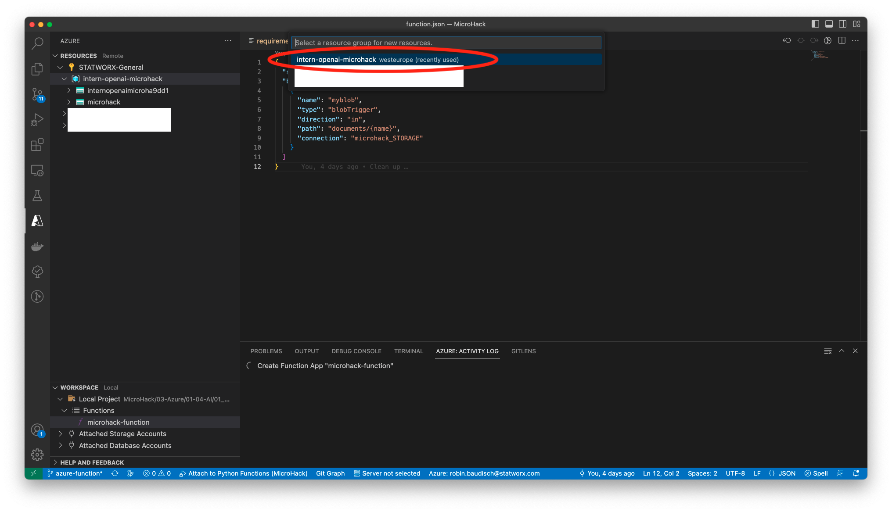

After selecting the Resource Group, the Azure Function App service is then created. This process might take a short while until deployment is finished.


The terminal will notify you once the Function App resource has been created successfully.


Now that the Function App resource has been created, you can deploy the Azure Function next.

Navigate to the **Deploy to Function App...** button next to the **WORKSPACE** panel.


This will open another dialogue that guides you through the deployment process of your Azure Function.

First you are prompted to select your chosen resource group.


Next you must select the resource you wish to deploy. In this case, it is the Azure Function that you have previously named. Select the function.


You are then prompted to confirm that this is the function you would like to deploy.

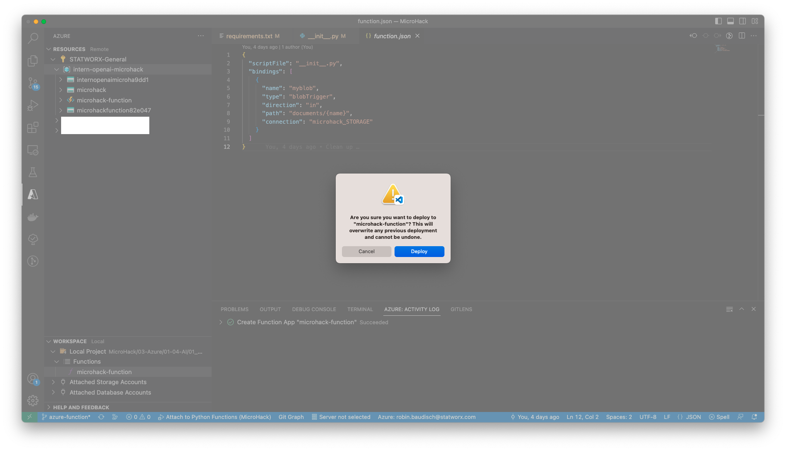

After deployment you will find your Function App among the other resources of your Resource Group in the **Overview** tab.

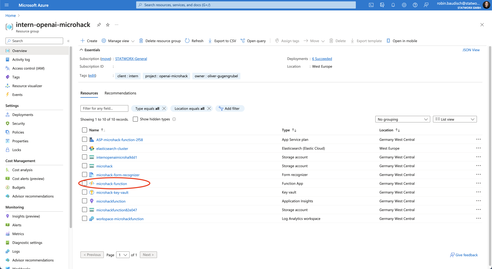

Since the Azure function needs access to the Azure Key Vault to use the stored secrets for authentication and use of different resources, we need to set up secure access. We can do so using a managed identity and access policy.

Select your deployed **Function App** resource (not the App Service plan) to open up the **Overview** panel of the Function App.

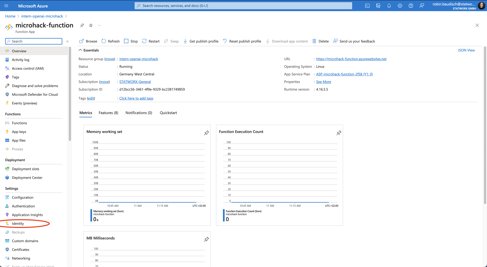

First we create a manged identity. Navigate to the **Identity** panel on the navigation bar and activate a system-assigned identity by setting its status to **On**.

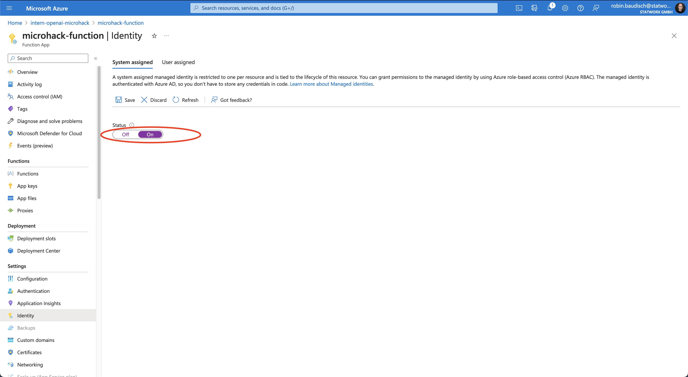

Next, head back over to the Key Vault and navigate to the **Access Policies** panel. Here you need to create a new access policy for your Function App. To do so, select the **+ Create** button to proceed.

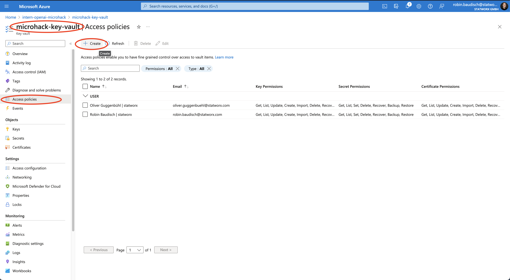

On the next page you can select the permissions you would like your Function App to receive. For the purpose of this Microhack, simply getting the secrets from the Key Vault is enough - hence we select **Get** and continue.


Now the Access Policy requires a principal. We select the Microhack function that we just deployed and click on **Next**.


During the review you will see the object ID that was previously created for the managed identity. Double-check if this object ID corresponds to the value of the managed identity. If it does, click on **Create** to create the access policy.

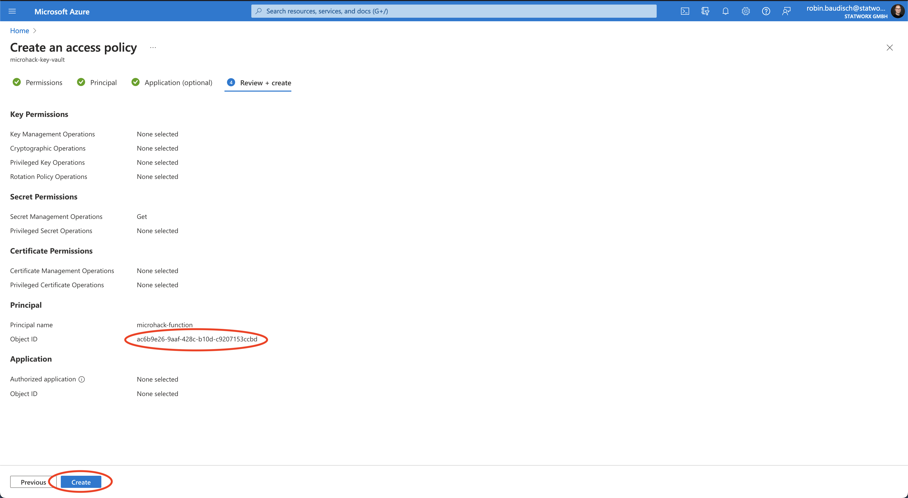

Finally, we'll find out which outbound IP addresses our Azure Function can use and add these to the inbound port rules of the Azure VM created in Challenge 1.

For this, execute the following command in your terminal and copy the output:

```console
az functionapp show --resource-group <Resource Group> --name <Azure Function Name> --query outboundIpAddresses --output tsv
```

Or navigate to the Networking subpage of your Azure Function in the Azure Portal, click on *Show more* under outbound addresses and copy the IPs from there.


Add the copied IPs to a new inbound port rule for the Azure VM, allowing these IPs to connect to port 8000:


**You successfully completed Challenge 2! 🚀**
