# Walkthrough Challenge 4 - Deploy the Streamlit App to Azure

Duration: **1 hour**

**[Home](../../Readme.md)**

- [Walkthrough Challenge 4 - Deploy the Streamlit App to Azure](#walkthrough-challenge-4---deploy-the-streamlit-app-to-azure)
  - [Prerequisites](#prerequisites)
  - [Task 1: Create the Dockerfile for the Streamlit App](#task-1-create-the-dockerfile-for-the-streamlit-app)
  - [Task 2: Build and Test the Docker Image](#task-2-build-and-test-the-docker-image)
  - [Task 3: Build and Store the Docker Image by Using Azure Container Registry](#task-3-build-and-store-the-docker-image-by-using-azure-container-registry)
  - [Task 4: Setup Azure App Service and Deploy the Streamlit App](#task-4-setup-azure-app-service-and-deploy-the-streamlit-app)

## Prerequisites

In order to complete Challenge 4, make sure that you have successfully completed Challenge 1, 2 and 3, meaning that you should have a locally running and fully functioning Streamlit frontend.

If you haven't used Docker before, you'll need to install it on your PC or Mac. To do this, go to the Docker website (https://www.docker.com/) and download the appropriate version for your operating system. Once you have installed Docker, you can verify the installation by opening a terminal or command prompt and typing ```docker --version```. If Docker is installed correctly, you should see the version number displayed in the output.

## Task 1: Create the Dockerfile for the Streamlit App

**Resources:**\
[Dockerfile Reference](https://docs.docker.com/engine/reference/builder/)\
[Deploy Streamlit using Docker](https://docs.streamlit.io/knowledge-base/tutorials/deploy/docker)

Docker is a platform for developing, shipping, and running applications in containers. Containers are like lightweight virtual machines that contain everything an application needs to run, including its code, runtime, system tools, libraries, and settings. With Docker, you can package your application and its dependencies into a single container that can be run on any machine that has Docker installed. This makes it easy to build, test, and deploy applications consistently across different environments, from your local machine to the cloud.

Before we start containerizing our Streamlit app, we need to create a Dockerfile that defines the environment in which our app will run. A Dockerfile is essentially a text file that contains a series of instructions that Docker will use to build an image of our app.

Open a text editor and create a new file named "Dockerfile" (without any extension). The first line of our Dockerfile should specify the base image that we want to use. For our Streamlit app, we'll use the official Python 3.9-slim image:

```docker
FROM python:3.9-slim
```

Next, we'll install some necessary dependencies we need for ensuring that our docker container will run smoothly:

```docker
RUN apt-get update
RUN apt-get install -y build-essential
RUN apt-get install -y azure-cli
```

In summary, these lines update the package list, install the build-essential package, which is needed for the libraries we will install via ```pip```, and install the azure-cli package to authenticate ourselves with Azure inside of the Docker container.

Next, we'll set the working directory for our app:

```docker
WORKDIR /app
```

Now, let's copy the requirements.txt file into the container and install the required packages:

```docker
COPY requirements.txt .
RUN pip install -r requirements.txt
```

We're almost there. Now, let's copy the rest of our app into the container:

```docker
COPY . .
```

Finally, we'll expose the port that our Streamlit app is running on:

```docker
EXPOSE 80
```

Before specifying the entrypoint of the docker image, which will be run when the container is started, we need to authenticate ourselves via the Azure CLI. Note that this is only necessary for our local tests and we will remove this line in a later task:

```docker
RUN az login
```

Finally, we'll specify the command that should be run when the container starts:

```docker
ENTRYPOINT ["streamlit", "run", "--server.port=80", "--server.address=0.0.0.0", "main.py"]
```

That's it! Save the Dockerfile and we're ready to build the Docker image.

## Task 2: Build and Test the Docker Image

To build the Docker image, run the following command in your terminal inside of the /app folder where the files for the Streamlit app are located:

```bash
docker build -t microhack-streamlit .
```

The ```-t``` flag is used to tag the image. Here, we have tagged the image microhack-streamlit.
This will take a few minutes. Make sure to open up the url and copy and paste the code you'll see inside the terminal when the Dockerfile is executing the ```az login``` line to authenticate yourself.

After the Docker image has been built, we need to run it. Execute the following command inside the terminal:

```cli
docker run -p 80:80 microhack-streamlit
```

The ```-p``` flag publishes the container’s port 80 to your machine’s 80 port. In our case, since we are running the container locally, it will run on http://localhost:80.

If all went well, you should see an output similar to the following:

```cli
docker run -p 80:80 microhack-streamlit

  You can now view your Streamlit app in your browser.

  URL: http://0.0.0.0:80

```

Your Streamlit app is now running inside the Docker container and can be interacted with on http://0.0.0.0:80.

## Task 3: Build and Store the Docker Image by Using Azure Container Registry

**Resources:**\
[Quickstart: Create an Azure container registry using the Azure portal](https://learn.microsoft.com/en-us/azure/container-registry/container-registry-get-started-portal?tabs=azure-cli)

Once we have tested our Docker image on the local machine and ensured that it is working correctly, the next step is to store it in a container registry that is accessible from Azure.

A container registry is a service that stores and manages Docker images. It allows us to store images securely, manage access control, and share images with others. In our case, we will use Azure Container Registry, which is a managed Docker registry service provided by Microsoft Azure.

To set up an Azure Container Registry, search for "container registry" in the search bar in the Azure Portal, select it and click on "Create" on the main page of the Azure Container Registry page.

Select the right resource group, choose a fitting name for the Container Registry, select a deployment region and the SKU tier you want. We are choosing "Basic" here since we will only use this Container Registry for demonstration purposes. Next, click on "Review + Create".

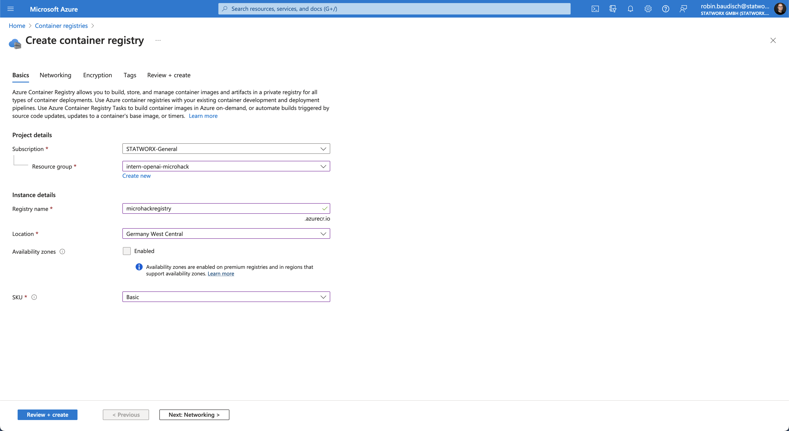

Click on "Create" on the Review page if you are happy with the configuration you selected.

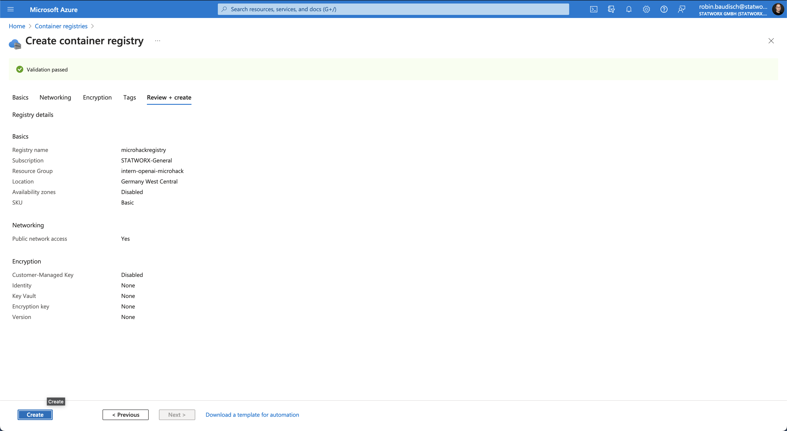

After a moment, the service should be deployed successfully.

We will need to log in to the create Container Registry. Run the following command in your terminal:

```cli
az acr login -n <Your Registry Name>
```

Once you have created the Container Registry and logged in, the next step is to push the Docker image to it. We can do this by tagging our local Docker image with the name of the Azure Container Registry where we want to store the image.

Before we do that, we need to modify the Dockerfile slightly. First, we won't be needing the Azure CLI login, so we will remove the lines

```docker
RUN apt-get install -y azure-cli
```

and

```docker
RUN az login
```

from the Dockerfile.

We also remove the reference of the server address from the entrypoint since the Streamlit app will not be running on localhost once we've deployed it. The entrypoint in the Dockerfile will now look like this:

```docker
ENTRYPOINT ["streamlit", "run", "--server.port=80", "main.py"]
```

Now, we'll build the docker image again and tag the image with the name of the Azure Container Registry.

```cli
docker build -t <Your Registry Name>.azurecr.io/<Your Image Name> .
```

Once we have rebuilt the Docker image, we can push it to the Azure Container Registry by using the following command:

```cli
docker push <Your Registry Name>.azurecr.io/<Your Image Name>
```

The upload to your Container Registry might take a few minutes. Once it is done, navigate to the Azure Container Registry in the Azure Portal and check if you can see the uploaded images under "Repositories" in the sidebar:

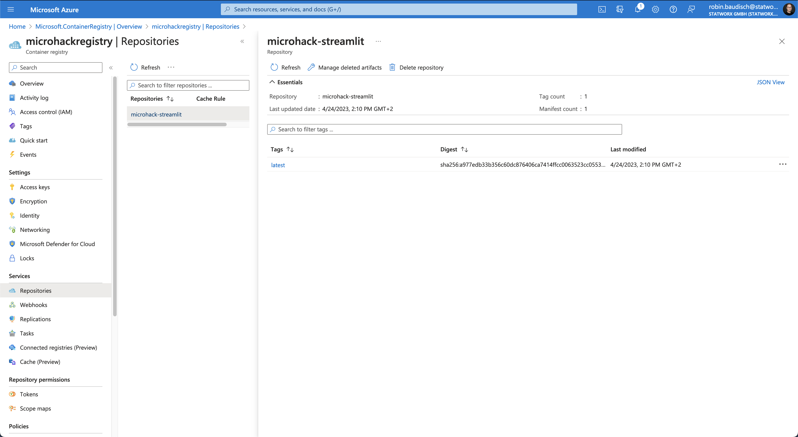

Finally, we will need to enable "Admin user" for the created Azure Container Registry in order to deploy the docker image in task 4. On the main page of the created Container Registry, click on "Update" at the top of the page and enable "Admin User" and click "Save".

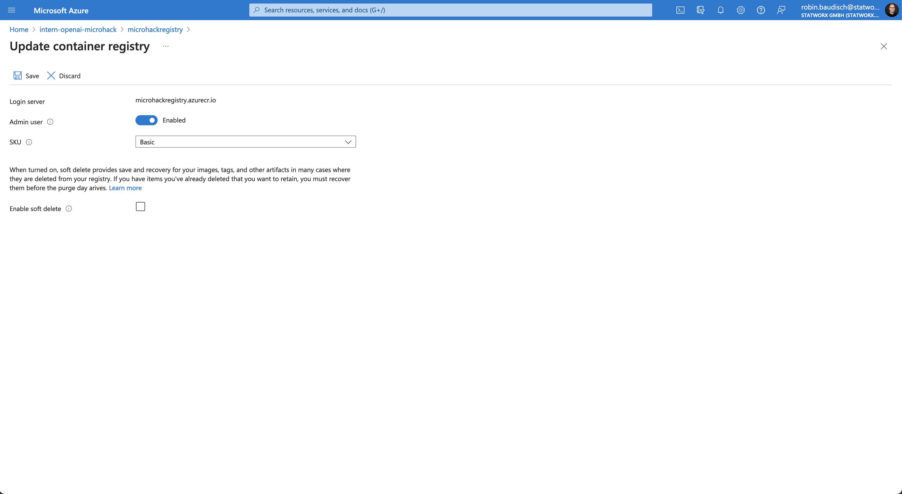

## Task 4: Setup Azure App Service and Deploy the Streamlit App

**Resources:**\
[Deploy and run a containerized web app with Azure App Service](https://learn.microsoft.com/en-us/training/modules/deploy-run-container-app-service/)\
[Set up Azure App Service access restrictions](https://learn.microsoft.com/en-us/azure/app-service/app-service-ip-restrictions?tabs=azurecli)

Now that we have created a Docker image for our Streamlit app and stored it in the Azure Container Registry, we can proceed to deploy the app to an Azure App Service. An App Service is a fully managed platform for building, deploying, and scaling web applications. We will use the App Service to host our Streamlit app and make it accessible to the internet.

Look for "app services" in the Azure Portal's search bar, select "Azure App Services" and click on "Create" on the following page.

Again, we need to specify the correct Resource Group, give our app a name, and select a deployment region. Select Linux as the OS for our web app and, since we will use a Docker container to create the web app, select "Docker Container" under Publish.

Next, we will create a new App Service Plan. The App Service Plan determines the location and size of the underlying virtual machines that will host your web application. We selected "Basic B1" as our pricing plan. If you are happy with your configuration, click on "Next: Docker" at the bottom of the page.

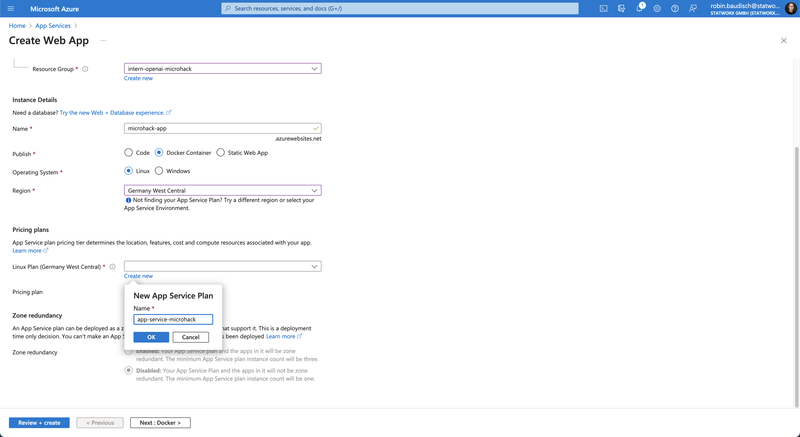

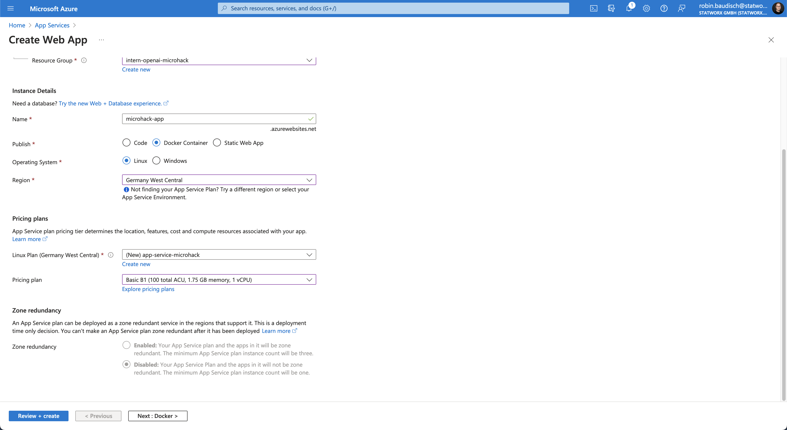

Select "Single Container" and "Azure Container Registry" for the Image Souce. Under the Azure container registry options, you should now be able to select the Registry we created earlier as well as the Docker image we pushed to it. Next, click on "Review + create", check the configurations again and, if you are happy with it, click on "Create". The App Service should deploy successfully. Please note that pulling the Docker image from the Container Registry and setting it up will take a few minutes.

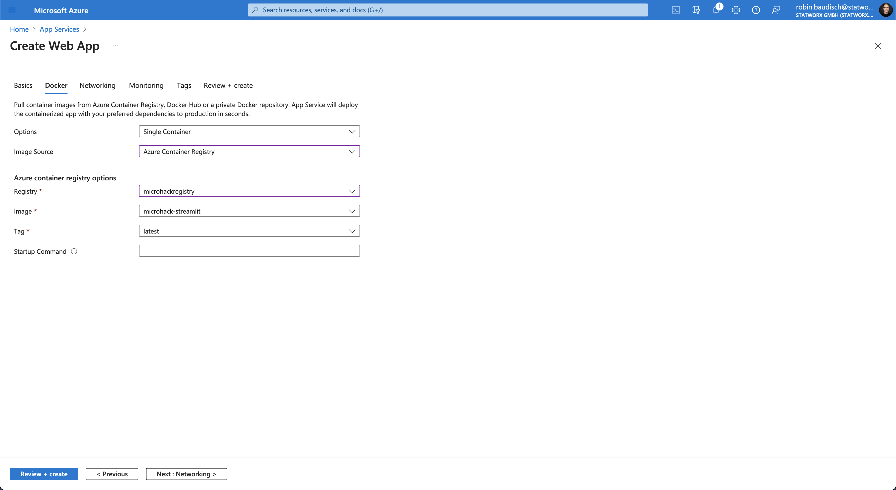

Since we need to retrieve secrets from the Azure Key Vault inside of our Docker container, the web app needs to authenticate itself with Azure. In our local tests, we did this via the browser. For the deployed app, we want to authenticate ourselves automatically. For this, the web app needs a so called System Assigned Identity.

A Managed Identity in Azure is a feature that provides Azure resources with an automatically managed identity in Azure Active Directory (Azure AD). With a Managed Identity, you can authenticate to services that support Azure AD authentication, without needing to store credentials in your code or in configuration files.

To create a Managed Identity, navigate to the "Identity" page via the sidebar of the App Service you just created. The only thing you need to do is to click on the slider under "Status" and click on "Save" at the top of the page.

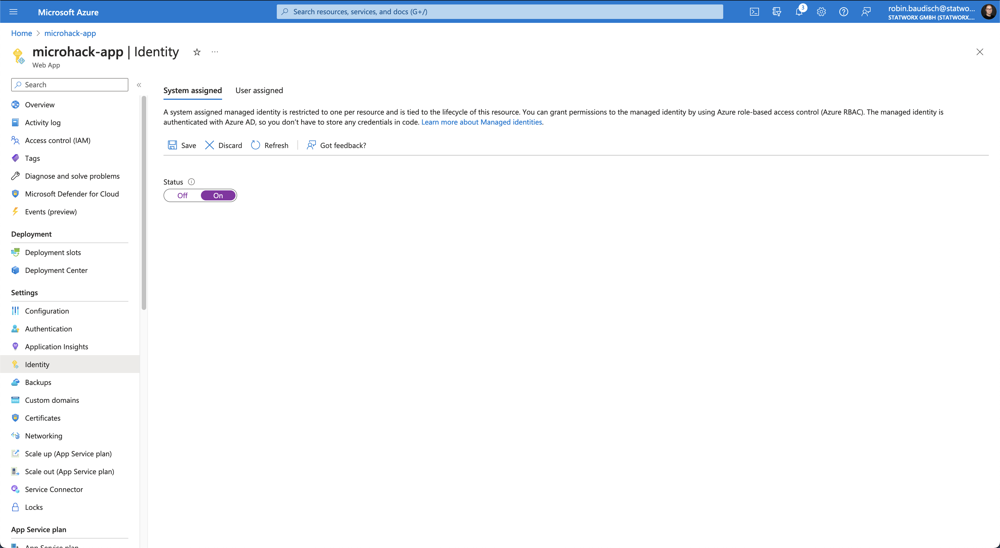

Next, just as we did four our Azure Function, navigate to the main page of your Azure Key Vault and click on "Access policies" in the sidebar and click on "+ Create" on the following page. Select "Get" under "Secret permissions" and click on "Next" at the bottom of the page.

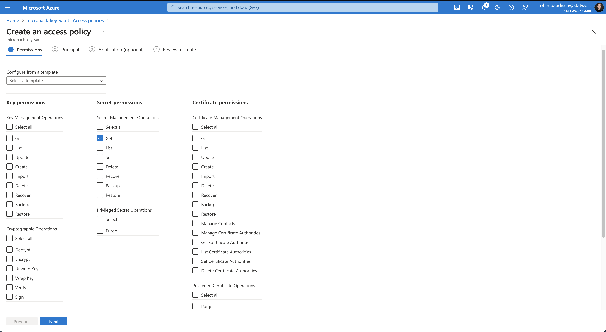

Search for the name of your App Service in the search bar, select it, and click on "Next" again. On the "Review + create" subpage, click on "Create" after reviewing the configurations. Now, your web app is allowed to retrieve secrets from the Azure Key Vault.

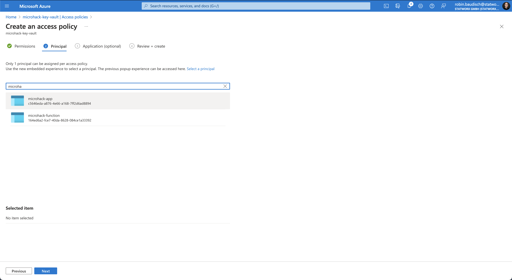

Theoretically, the web app is now working as intended. To check, navigate to the main page of the App Service and click on the URL of your web app next to "Default domain".

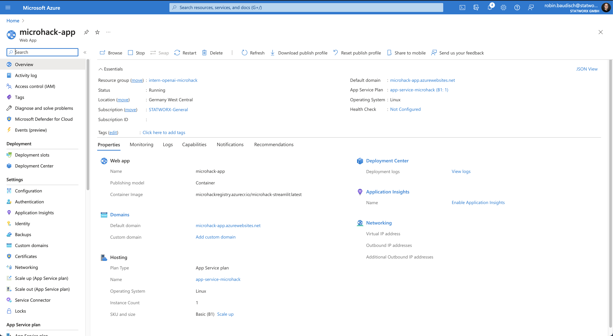

The web app should now be available under this domain.

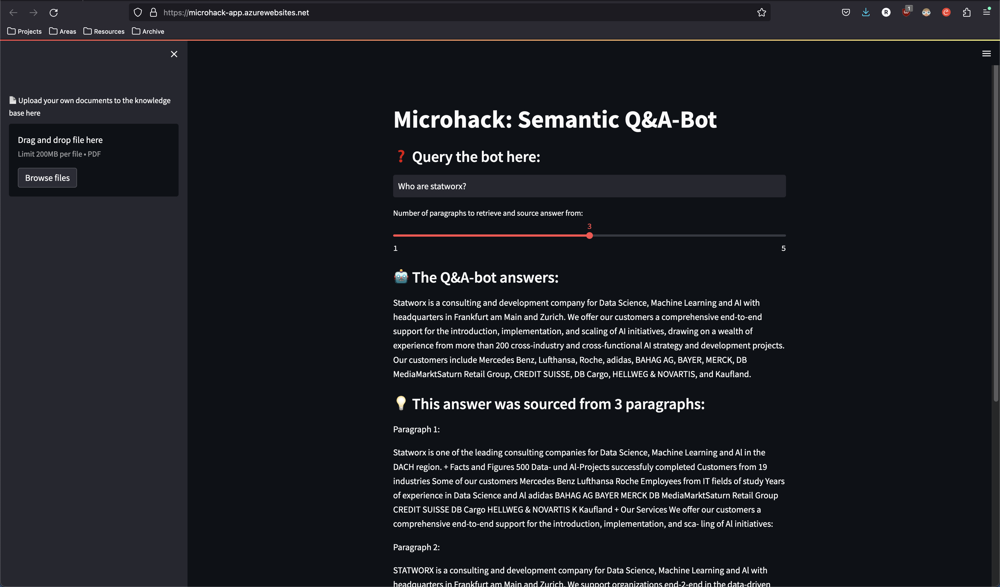

However, it is accessible by anybody on the open internet who has the URL. If you want to restrict the access of your web app to selected IPs, select "Networking" on the sidebar and click on "Access restriction" in the Inbound Traffic box.

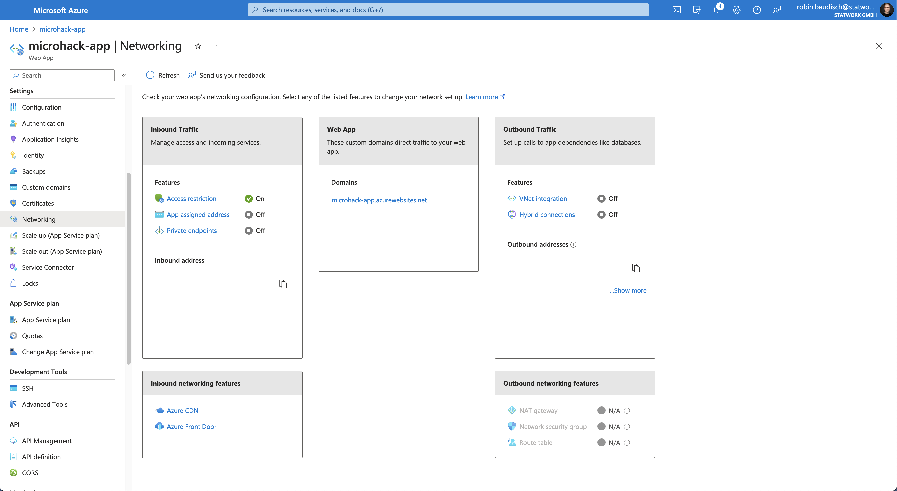

The first thing you will need to do is to select "Deny" for "Unmatched rule action". This will deny all access to the web app. Underneath, click on "+ Add" to create access rules.

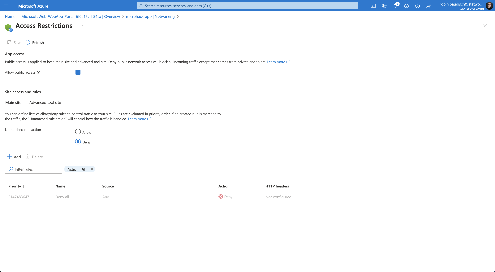

In the opened sidebar, give the rule a fitting name, select either "Allow" or "Deny" as an action, choose a priority and specify the IP Block you want to allow or deny acces to your web app. Finally, click on "Add rule".

After you have created all access rules, click on "Save" at the top of your page. Your web app will now only be accessible to the IPs you have given access to.

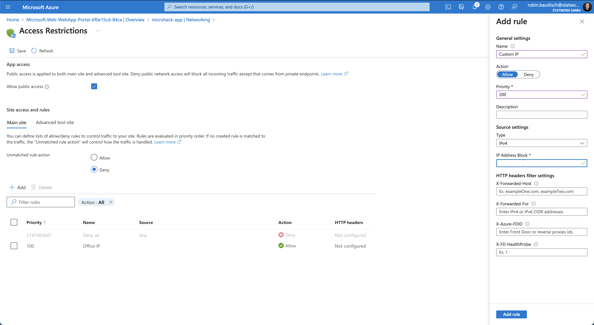

**Congratulations, you successfully completed Challenge 4! 🚀**