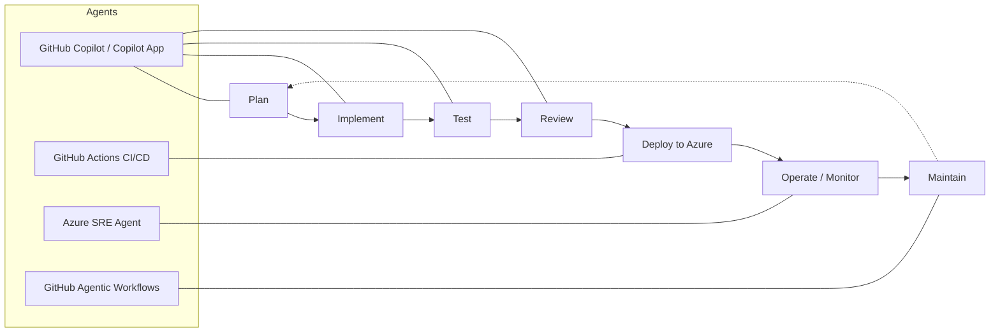

# **MicroHack: Agentic SDLC with GitHub Copilot & Azure**

- [**MicroHack introduction**](#microhack-introduction)
- [**MicroHack context**](#microhack-context)
- [**Objectives**](#objectives)
- [**MicroHack challenges**](#microhack-challenges)
- [**Contributors**](#contributors)

## MicroHack introduction

This MicroHack walks a team through the **Agentic Software Development Lifecycle (SDLC)** — plan, implement, test, review, deploy, and operate with agents — using **GitHub Copilot**, **GitHub Actions**, and **Microsoft Azure**, applied end-to-end to a real full-stack application called **Octocat Supply**.

Rather than treating an AI coding assistant as autocomplete, you practise driving *agents* across the whole lifecycle: refining requirements from organizational signal, planning multi-file changes, generating and hardening tests, reviewing code, deploying to Azure with Infrastructure as Code, monitoring with the Azure SRE Agent, and standing up agentic workflows that maintain the app over time.

This lab is **not** a full explanation of GitHub Copilot or Azure as technologies. The following are recommended pre-reading to build foundational knowledge:

- [GitHub Copilot documentation](https://docs.github.com/en/copilot)
- [GitHub Actions documentation](https://docs.github.com/en/actions)
- [Azure Container Apps](https://learn.microsoft.com/en-us/azure/container-apps/)
- [Azure SRE Agent](https://learn.microsoft.com/en-us/azure/sre-agent/)

> **What's included.** This MicroHack folder is **self-contained** — everything you need ships with it: the **Octocat Supply** application source ([`src/`](src/README.md)), the Azure infrastructure scaffold ([`infra/`](infra/README.md)), helper [`scripts/`](scripts/README.md), the dev containers ([`.devcontainer/`](.devcontainer/)), the editor config ([`.vscode/`](.vscode/)), and the repo custom instructions, custom agents, and workflows ([`.github/`](.github/)). The Challenge 2 inputs — the product backlog and the mock **WorkIQ** organizational knowledge (Teams thread, support-ticket digest, stakeholder email) — live under [`assets/`](assets/). Facilitators create a copy/fork of this MicroHack per team before the event; participants work in their team's copy.

## MicroHack context

The Octocat team are behind schedule launching their new **Octocat Supply** application and are exploring Agentic Development practices to help them deliver the remaining features before deploying the full application to their Azure environment. Core functionality is still missing — like the shopping cart and other backlog items — and the testing and monitoring aren't yet up to Octocat standards for a reliable, secure application.

You are given the existing application code and access to GitHub tools such as GitHub Copilot, and you complete the work by progressing through the challenges. The app is a full-stack supply chain platform with a **React + Vite + Tailwind** frontend and **four interchangeable API implementations** (TypeScript, C#, Python, Java) over a shared **SQLite** schema — pick whichever API language your team prefers; the challenges are language-agnostic.

## Objectives

After completing this MicroHack you will be able to:

- Use GitHub Copilot to **plan and implement** features across a full-stack app while keeping changes scoped and consistent.
- Run an **agentic loop** — plan → implement → test → review — on a backlog item, including refining a requirement from ambient organizational signal.
- **Generate and extend tests** deliberately, choosing models and context budgets on purpose, and run an agent-assisted code review.
- **Deploy to Azure** with Infrastructure as Code and a GitHub Actions pipeline authenticated via OIDC — no secrets in source.
- Use the **Azure SRE Agent** to detect, diagnose, and remediate a fault in a deployed app.
- Stand up **GitHub Agentic Workflows** to maintain the application over time with clear triggers and guardrails.

## MicroHack challenges

### General prerequisites

This MicroHack has a few but important prerequisites. Completing them before the session keeps the time focused on the differentiated, agentic work rather than setup.

In summary:

- A **GitHub account** with access to your team's copy of this MicroHack repo and an **active GitHub Copilot seat** (Copilot Business/Enterprise, with Chat, agents, CLI, and MCP policies enabled).
- Either **GitHub Codespaces** (recommended — nothing to install) **or** local **VS Code** with the **Dev Container** plus the **GitHub Copilot / Copilot Chat** extensions. The container preinstalls **Node.js 24, Python 3.13, .NET 10, Java 17**.
- For **Challenges 4 & 5**, **Azure access**:
  - An **Azure subscription** with budget.
  - A **Resource Group** for the team.
  - **Contributor** permissions on that scope (plus any roles the Azure SRE Agent needs on the monitored resources).
  - A GitHub ↔ Azure **OIDC federated credential** for pipeline authentication.
  - **Azure SRE Agent** available in the team's region/subscription.

> Facilitators: work through the pre-event admin checklist (Copilot enablement, repo access, backlog issue seeding, Azure prerequisites) before running the event.

### Challenges

* [Challenge 0 - Dev environment, Copilot access & repo overview](challenges/challenge-00.md)  **<- Start here**
* [Challenge 1 - Deliver a new feature (the cart)](challenges/challenge-01.md)
* [Challenge 2 - Add another feature from the backlog (agentic loop)](challenges/challenge-02.md)
* [Challenge 3 - Run and extend test coverage, and review code](challenges/challenge-03.md)
* [Challenge 4 - Deploy into Azure](challenges/challenge-04.md)
* [Challenge 5 - Monitor the deployed app with the Azure SRE Agent](challenges/challenge-05.md)
* [Challenge 6 - Implement agentic workflows to maintain the app](challenges/challenge-06.md)
* [Finish](challenges/finish.md)

### Solutions - Spoilerwarning

Do not open these before attempting the challenges — they contain guidance and worked approaches.

* [Solution 0 - Dev environment & repo overview](walkthrough/challenge-00/solution-00.md)
* [Solution 1 - Deliver the cart feature](walkthrough/challenge-01/solution-01.md)
* [Solution 2 - Backlog feature (agentic loop)](walkthrough/challenge-02/solution-02.md)
* [Solution 3 - Testing & review](walkthrough/challenge-03/solution-03.md)
* [Solution 4 - Deploy into Azure](walkthrough/challenge-04/solution-04.md)
* [Solution 5 - Monitor with the Azure SRE Agent](walkthrough/challenge-05/solution-05.md)
* [Solution 6 - Agentic workflows](walkthrough/challenge-06/solution-06.md)

## Suggested agenda

A typical one-day delivery of this MicroHack:

| Time | Activity |
| --- | --- |
| 09:00 – 10:00 | Tech Talk — Agentic SDLC overview |
| 10:00 – 12:30 | Hacking session — Challenges 0, 1, 2, 3 |
| 12:30 – 13:30 | Lunch break |
| 13:30 – 15:30 | Hacking session — Challenges 4, 5, 6 |
| 15:30 – 16:00 | Final discussion / Wrap-up |

## Contributors

* Frank ([GitHub](https://github.com/Frank802))
