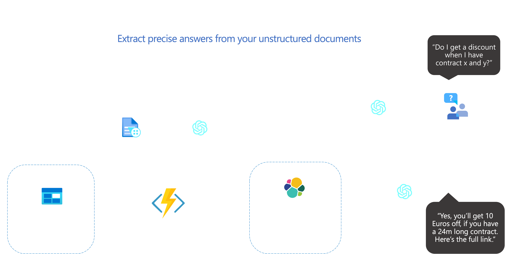

# **Semantic Q&A Bot with Azure OpenAI**

- [**Semantic Q\&A Bot with Azure OpenAI**](#semantic-qa-bot-with-azure-openai)
  - [MicroHack Introduction and Context](#microhack-introduction-and-context)
  - [Objectives](#objectives)
  - [Prerequisites](#prerequisites)
  - [Lab environment for this MicroHack](#lab-environment-for-this-microhack)
  - [Architecture](#architecture)
- [MicroHack Challenges](#microhack-challenges)
  - [Challenge 1 - Setup Azure Services to Process Stored Documents in an Azure Function](#challenge-1---setup-azure-services-to-process-stored-documents-in-an-azure-function)
    - [Goal 1](#goal-1)
    - [Task 1: Create a Storage Account](#task-1-create-a-storage-account)
    - [Task 2: Setup Azure Form Recognizer](#task-2-setup-azure-form-recognizer)
    - [Task 3: Setup Azure Key Vault and save Form Recognizer Keys](#task-3-setup-azure-key-vault-and-save-form-recognizer-keys)
    - [Task 4: Setup Elastic Cloud](#task-4-setup-elastic-cloud)
    - [Task 5: Create the Azure Function](#task-5-create-the-azure-function)
    - [Task 6: Test the Azure Function Locally](#task-6-test-the-azure-function-locally)
  - [Challenge 2 - Setting up a functional Pipeline](#challenge-2---setting-up-a-functional-pipeline)
    - [Goal 2](#goal-2)
    - [Task 1: Write the Python Processing Script](#task-1-write-the-python-processing-script)
    - [Task 2: Test your Pipeline](#task-2-test-your-pipeline)
    - [Task 3:](#task-3)
    - [Task 4:](#task-4)
  - [Challenge 3 - Building a Streamlit frontend for our Q\&A bot](#challenge-3---building-a-streamlit-frontend-for-our-qa-bot)
    - [Goal 3](#goal-3)
    - [Task 1: Setup Streamlit App](#task-1-setup-streamlit-app)
    - [Task 2: Create Streamlit Widgets](#task-2-create-streamlit-widgets)
    - [Task 3: Connect the Streamlit App to the Blob Storage](#task-3-connect-the-streamlit-app-to-the-blob-storage)
    - [Task 4: Connect the Streamlit App to the Chroma DB](#task-4-connect-the-streamlit-app-to-the-chroma-db)
    - [Task 5: Generate Answers via the OpenAI Completions Endpoint](#task-5-generate-answers-via-the-openai-completions-endpoint)
- [Finished? Delete your lab](#finished-delete-your-lab)

## MicroHack Introduction and Context

This MicroHack scenario walks through the creation of a Q&A bot using the Azure OpenAI service for building a semantic search pipeline. This Hack focuses on setting up the necessary Azure services as the building blocks of a Q&A bot powered by OpenAI's most recent language models and Azure. It guides you through setting up a robust infrastructure that extracts paragraphs from your raw text documents, stores them in a text data base optimized for search use cases and then leverages the power of Natural Language Processing to find the information you are looking for - all from within Microsoft Azure and requiring minimal coding. 

Semantic search is a more informed way of sifting through documents. Traditional search methods relied on finding lexical overlap between a query and the contents of a document. Semantic search foregoes this approach and instead assumes that language exists in a latent semantic space, where words that are similar in meaning reside close to each other - and those that are different are separated by large distances. Deep neural networks facilitate finding the semantic location of words as they can be trained to translate words into numerical representations of their meanings, called word embeddings, and thus enabling us to measure their distance from each other and draw inference about the relationships amongst each other.

Semantic search uses this technique to find information that is most closely related to a search query, measured as the distance between their respective embeddings. The language models developed by OpenAI are highly proficient at this task. They have been trained on massive amounts of text data from many different contexts, hence they are prodicient at projecting natural language text to a latent, semantic space and are thus well-suited for building AI-powered Q&A applications. 

This MicroHack is not an in-depth explanation of word embeddings as a technology, so please consider the following articles as required pre-reading to build foundational knowledge about the technology that enables finding semantic similarity between words, paragraphs and entire documents:

* https://openai.com/blog/introducing-text-and-code-embeddings
* https://platform.openai.com/docs/guides/embeddings/what-are-embeddings
* https://learn.microsoft.com/en-us/azure/cognitive-services/openai/concepts/understand-embeddings
* https://medium.com/@statworx_blog/whats-cooking-at-statworx-ecd863edfabe

## Objectives

After completing this MicroHack you will:

- Know how to build an AI-powered Q&A bot using Azure services.
- Understand how text embeddings can be used to find relevant passages in unstructured text documents.
- Have an functional Q&A service that takes your own documents as inputs and can be interacted with through a clean UI.

## Prerequisites

In order to use the MicroHack time most effectively, the following services should be set up and ready for use prior to starting work on the challenges and their task:

- Azure Account 
- Azure Subscription
- Azure Resource Group

Permissions for deployment:

- Contributor on your Resource Group

With these pre-requisites in place, you only need to set up the lab environment before starting to work on the challenges. These are designed for you to build familiarity with Azure's various services that facilitate implementing NLP-products through the use of services such Azure OpenAI, Azure Storage, Azure Functions and Elastic Cloud. 

## Lab environment for this MicroHack

The majority of challenges of this MicroHack are completed in the Azure portal, with only a few tasks requiring any code at all. For the few tasks that do require code we suggest you set up a Lab environment that has access to the following tools:

- Azure CLI
  - Find detailed information on installing the Azure CLI in the [official documentation.](https://learn.microsoft.com/en-us/cli/azure/install-azure-cli)
  - `Homebrew` makes it easy to install the Azure CLI on macOS: `brew install azure-cli`
- Git
  - Make sure that you have [Git installed on your computer](https://git-scm.com/book/en/v2/Getting-Started-Installing-Git). This also enables you to clone the MicroHack repository to your local machine by executing the following command from your Shell:  
  `git clone https://github.com/microsoft/MicroHack.git`

We strongly recommend using [Visual Studio Code](https://code.visualstudio.com/) as a code editor with the following extensions:

- Python for Visual Code Studio
  - [This guide](https://code.visualstudio.com/docs/python/python-tutorial) walks you through installing a Python interpreter and the extension needed for using VSCode for Python development.
- Azure Tools 
  - This extension pack contains multiple extensions used for interacting with Azure directly from VSCode. Find more information on the extension pack in the [official resource](https://marketplace.visualstudio.com/items?itemName=ms-vscode.vscode-node-azure-pack). 

## Architecture

At the end of this MicroHack you will have set your Azure environment to use the following architecture:

# MicroHack Challenges

## Challenge 1 - Setup Azure Services to Process Stored Documents in an Azure Function

### Goal 1

The goal of this challenge is to set up all the Azure services and tools that are required for building the backend of a fully functional Q&A chatbot.

### Task 1: Create a Storage Account

In this task you will set up a Storage Account in Azure which contains and manages all of your Azure Storage data objects such as blobs.

### Task 2: Setup Azure Form Recognizer

In this task you will set up the Azure Form Recognizer service, which extracts text from files and helps you turn your documents into data.

### Task 3: Setup Azure Key Vault and save Form Recognizer Keys

In task 3, you will set up an Azure Key Vault, a secure location to store and manage your application secrets such as your Form Recognizer Keys. Once you have set up the Key Vault, you will save your Form Recognizer Keys in it, which will allow your Azure Function to securely access the keys.

### Task 4: Setup Elastic Cloud

Elasticsearch acts as the data base for storing our text data for this MicroHack. In this task, you will set up the Elastic Cloud service that makes deploying your own Elasticsearch cluster easier than ever.

### Task 5: Create the Azure Function

Azure Functions are serverless computing solutions that enable you to run your code on demand. In this task, you will create an Azure Function that will be automatically triggered when a new file is uploaded into the blob storage created in Task 1.

### Task 6: Test the Azure Function Locally

In Task 6, you will test your Azure Function locally to ensure it is working properly before deploying it to Azure. This will involve simulating an event trigger by uploading a test file to the blob storage and verifying that the Azure Function is triggered and processes the file correctly.

## Challenge 2 - Setting up a functional Pipeline

### Goal 2

### Task 1: Write the Python Processing Script

### Task 2: Test your Pipeline

### Task 3: 

**Explain the background...**

### Task 4: 

Before proceeding to challenge 3, ...

## Challenge 3 - Building a Streamlit frontend for our Q&A bot

### Goal 3
The goal of this final challenge is the creation of an interactive web application that you can use to query the Q&A-chatbot and upload more documents to your knowledge base. 

### Task 1: Setup Streamlit App
The first task is dedicated to setting up a simple script that is used to initialize a streamlit web app. 

### Task 2: Create Streamlit Widgets
In this task you will extend your streamlit template to include multiple widgets that allow users to interact with your app. 

### Task 3: Connect the Streamlit App to the Blob Storage
Next, you will extend the streamlit script to be able to connect with your Azure Blob storage. This allows the interactive upload of documents to your Blob storage directly from within the streamlit app. 

### Task 4: Connect the Streamlit App to the Chroma DB
In this penultimate task of the MicroHack you will extend your streamlit app to also be able to send queries to your ChromaDB deployment. That's how your embedded documents can be retrieved and used for context by the Q&A-bot. 

### Task 5: Generate Answers via the OpenAI Completions Endpoint
Finally, in this concluding task you will extend your streamlit to use the OpenAI Completions endpoint to generate human-like answers to your queries that include the retrieved documents as sources for the generated answers. With this step, the streamlit app is complete and your Q&A-bot is fully functional. 

# Finished? Delete your lab

Thank you for participating in this MicroHack!
