# Walkthrough Challenge 1 -  Use Azure Form Recognizer, Python and Azure Functions to process stored documents

Duration: **TBD**

**[Home](.../../.../../Readme.md)** - [Next Challenge Solution](.../../challenges/challenge-2/solution.md)

## Prerequisites

In order to complete Challenge 1, make sure to complete the Development Setup under [Link](.../../.../../Readme.md) and read through the [General Prerequisites](.../../.../../Readme.md#prerequisites). It is assumed that you already created an Azure Account with a valid Azure Subscription and a Resource Group for the MicroHack.

## Task 1: Create a Storage Account

**Resources:**

[Create Storage Account | Microsoft Learn](https://learn.microsoft.com/en-us/azure/storage/common/storage-account-create?tabs=azure-portal)\
[Quickstart: Create, download, and list blobs with Azure CLI](https://learn.microsoft.com/en-us/azure/storage/blobs/storage-quickstart-blobs-cli)\
\
A storage account provides a unique namespace in Azure for your data. Every object that you store in Azure Storage has an address that includes your unique account name. The combination of the account name and the Blob Storage endpoint forms the base address for the objects in your storage account.\
\
Under the MicroHack Resource Group, search for *storage account* in the search bar.

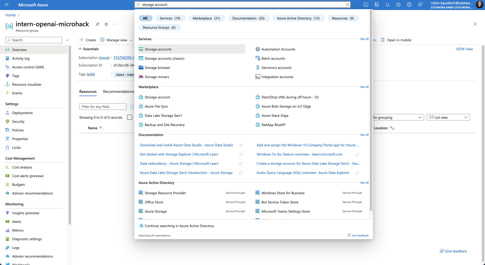

On the Storage Account subpage, either click on *+ Create* at the top of the page or on *Create storage account*.

On the configuration page, the correct Azure Subscription and Resource Group should have been automatically selected under *Project Details*. Under *Instance Details* you need to name the Storage Account and select a deployment region. Here, we selected **Germany West Central** since statworx is located in Frankfurt, Germany. It is, however, up to you where you want your Storage Account to be located.

The selections for **Performance** and **Redundancy** are also up to you. Since we are only using this Storage Account for showcase purposes, low latency and high redundancy are not of primary concern to us. After you have given your storage account a name, selected the right deployment region and selected suitable performance and redundancy options, click on **Review**.

We do not modify the standard selections under the tabs **Advanced**, **Networking**, **Data protection**, **Encryption** or **Tags**. If you are handling sensitive data or have specific networking needs, please consult the official Azure resources.

On the **Review** page, click on *Create* if you are happy with your configuration. It should take you to the deployment page of the storage account.

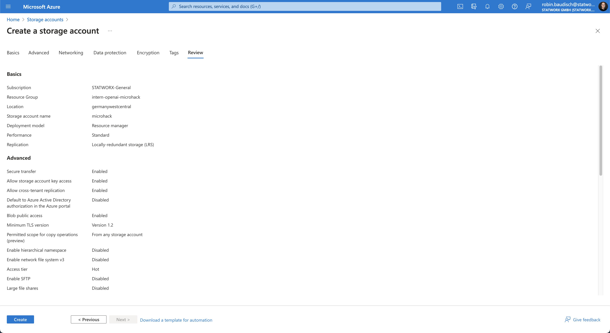

After the deployment page shows that the deployment was completed, click on *Go to resource*.

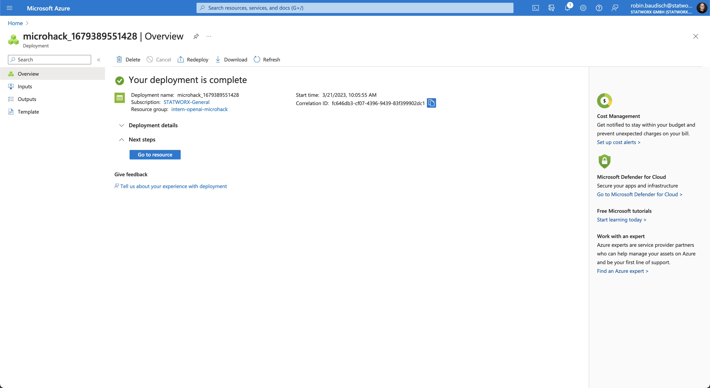

You are now seeing the main page of your newly created storage account. From the sidebar, under **Data storage**, select *Containers*.

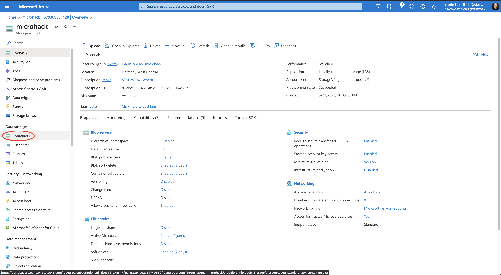

A container organizes a set of blobs, similar to a directory in a file system. At the top of the page, click on *+ Container*. A sidebar should appear. Give your container a suitable name. Under *Public access level*, select the access level suitable for your use case and click on *Create*.

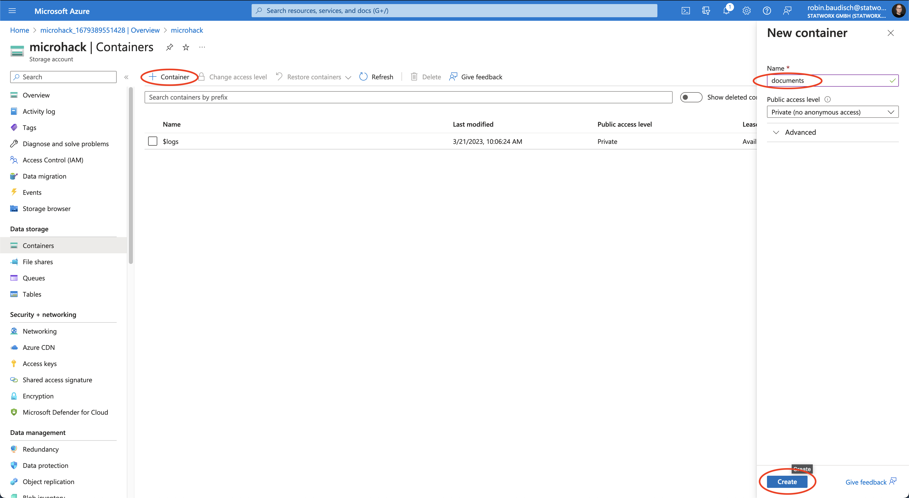

Your newly created container should now be selectable. You can now upload data by clicking on your container and selecting *Upload* at the top of the page.

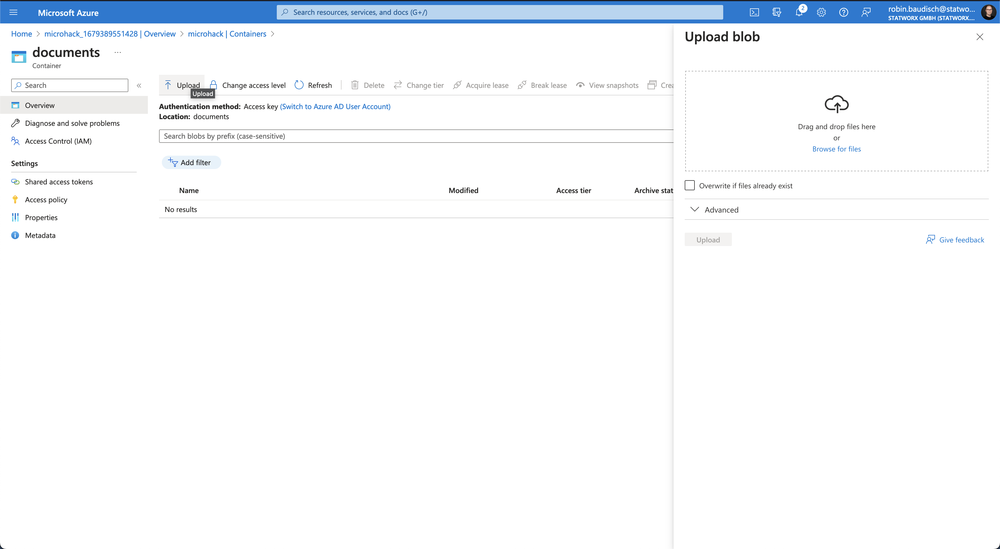

If you want to use the Azure CLI for creating the storage account and uploading files, please refer to the resource at the beginning of the task.

## Task 2: Setup Azure Form Recognizer

**Resources:**

[Create a Azure Form Recognizer Resource](https://learn.microsoft.com/en-us/azure/applied-ai-services/form-recognizer/create-a-form-recognizer-resource?view=form-recog-3.0.0)\
[Azure Form Recognizer Documentation](https://learn.microsoft.com/en-us/azure/applied-ai-services/form-recognizer/?view=form-recog-3.0.0)\
[Azure Form Recognizer Pricing](https://azure.microsoft.com/en-us/pricing/details/form-recognizer/#pricing)\
\
Azure Form Recognizer is a cloud-based Azure Applied AI Service that uses machine-learning models to extract key-value pairs, text, and tables from your documents. Form Recognizer analyzes your forms and documents, extracts text and data, maps field relationships as key-value pairs, and returns a structured JSON output.\
\
In this task, you will set up an Azure Form Recognizer resource, that can extract text data from unstructured documents. This task concludes with you generating and then storing a secret key and an endpoint string that can later be used to connect your application to the Form Recognizer API. 

Under the MicroHack Resource Group, search for *form recognizer* in the search bar.

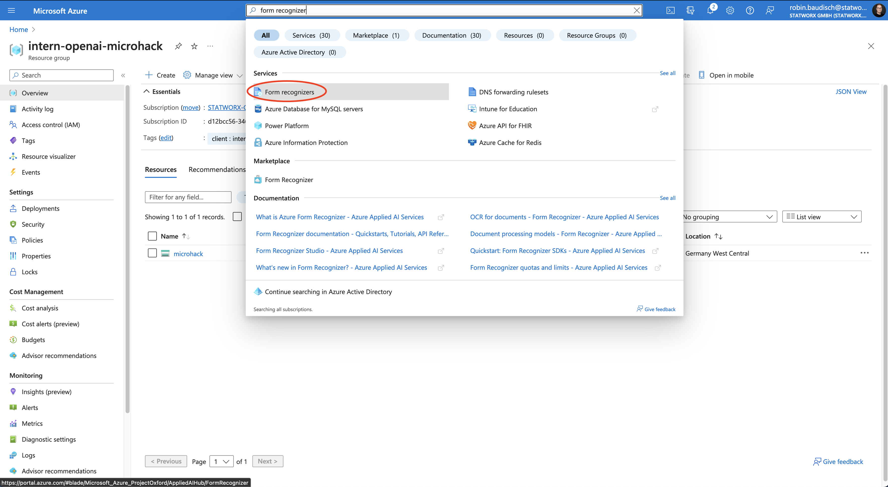

On the Form Recognizer subpage, either click on + Create at the top of the page or on Create form recognizer.

On the configuration page, the correct Azure Subscription should have been automatically selected under *Project Details*. You need to specify the Resource Group under which you want the Form Recognizer to be situated. Under *Instance Details* you need to name the Form Recognizer Service, select a deployment region and decide on the pricing tier. We once again selected **Germany West Central** and gave the Form Recognizer Service a fitting name.

When it comes to the pricing tier, you can decide to use the free tier which lets you process 500 document pages per month with a limit of 20 API calls per minute or the paid tier. Please refer to the pricing page at the top of this task for more details. Since we are exclusively using the Form Recognizer for demonstration purposes, we decided to use the free tier.

After you have given your Form Recognizer Service a name, selected the right resource group, deployment region and decided on a suitable pricing tier, click on **Review + create**. We once again do not modify the standard selections under the tabs **Network**, **Identity** or **Tags**. If you are handling sensitive data or have specific networking needs, please consult the official Azure resources.

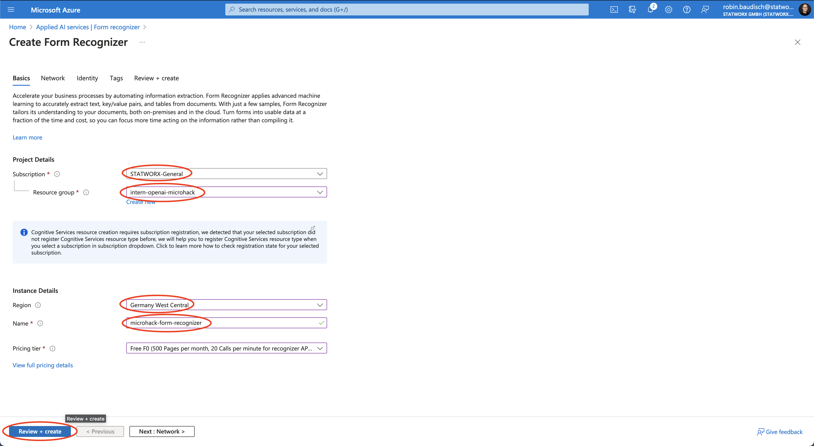

On the Review page, click on Create if you are happy with your configuration. It should take you to the deployment page of the Form Recognizer Service.

After the deployment page shows that the deployment was completed, click on Go to resource.

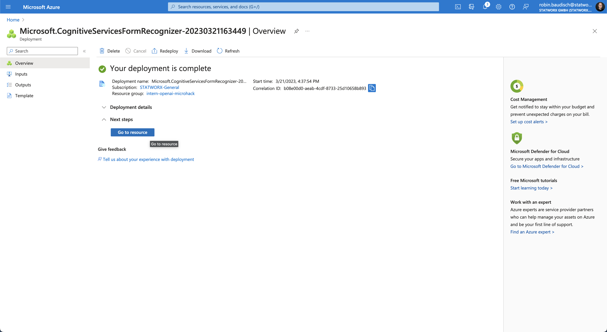

You are now seeing the main page of your newly created Form Recognizer Service. From the sidebar, under Resource Management, select Keys and Endpoint.

Copy the key and endpoint values and paste them in a convenient location, such as a Microsoft Notepad, for now. You'll need the key and endpoint values to connect your application to the Form Recognizer API. We will save these values in an Azure Key Vault in the next step. Make sure to keep these values in a private location - API keys are sensitive values and should not be stored in a public place such as a Git repository.

## Task 3: Setup Azure Key Vault and Save Form Recognizer Keys

**Resources:** \
[About Azure Key Vault](https://learn.microsoft.com/en-us/azure/key-vault/general/overview)\
[Quickstart: Create a Key Vault using the Azure Portal](https://learn.microsoft.com/en-us/azure/key-vault/general/quick-create-portal)\
[Quickstart: Create a Key Vault using the Azure CLI](https://learn.microsoft.com/en-us/azure/key-vault/general/quick-create-cli)\
[Assign a Key Vault Access Policy](https://learn.microsoft.com/en-us/azure/key-vault/general/assign-access-policy?tabs=azure-portal)

Azure Key Vault is a cloud service used to manage keys, secrets, and certificates. Key Vault eliminates the need for developers to store security information in their code. It allows you to centralize the storage of your application secrets which greatly reduces the chances that secrets may be leaked.

In this task, we will set up a Azure Key Vault to safely store the secrets for our previously created Form Recognizer Service.  

Under the MicroHack Resource Group, search for *key vault* in the search bar.

On the Key Vaults subpage, either click on + Create at the top of the page or on *Create key vault*.

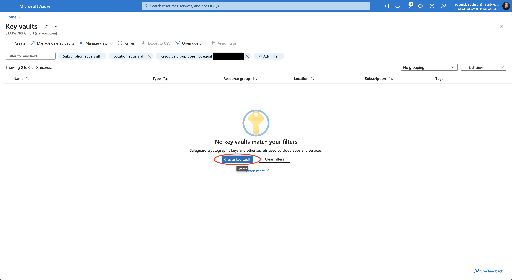

On the configuration page, the correct Azure Subscription should have been automatically selected under *Project Details*. You need to specify the Resource Group under which you want the Key Vault to be situated. Under *Instance Details* you need to name the Key Vault Service, select a deployment region and decide on the pricing tier. We once more selected **Germany West Central** and gave the Key Vault Service a fitting name.

The Recovery Options enable *Soft-delete* by default, meaning that deleted key vaults and secrets will be retained for a specified amount of time before being deleted completely. You are able to set the duration of this retention period, which we set to 90 days in our case, yourself. During this retention period, you will be able to either restore the key vault and secrets or delete them permanently without any more options for recovery.

After you have given your Key Vault Service a name, selected the right resource group, deployment region and decided on the recovery options, click on *Review + create*. We once more do not modify the standard selections under the tabs **Network**, **Identity** or **Tags**. If you are handling sensitive data or have specific networking needs, please consult the official Azure resources.

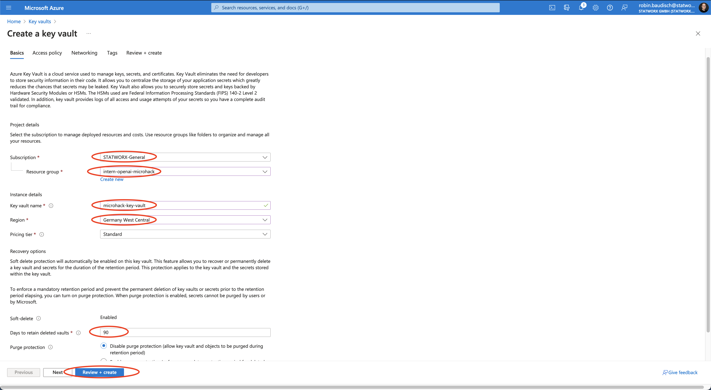

On the Review page, click on Create if you are satisfied with your configuration. This deploys your Key Vault Service and takes you to its dedicated Overview page.

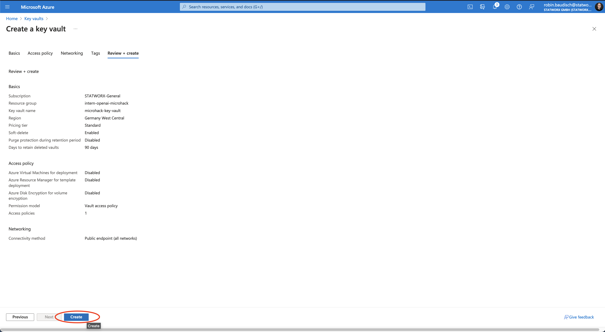

After the deployment page shows that the deployment was completed, click on *Go to resource*.

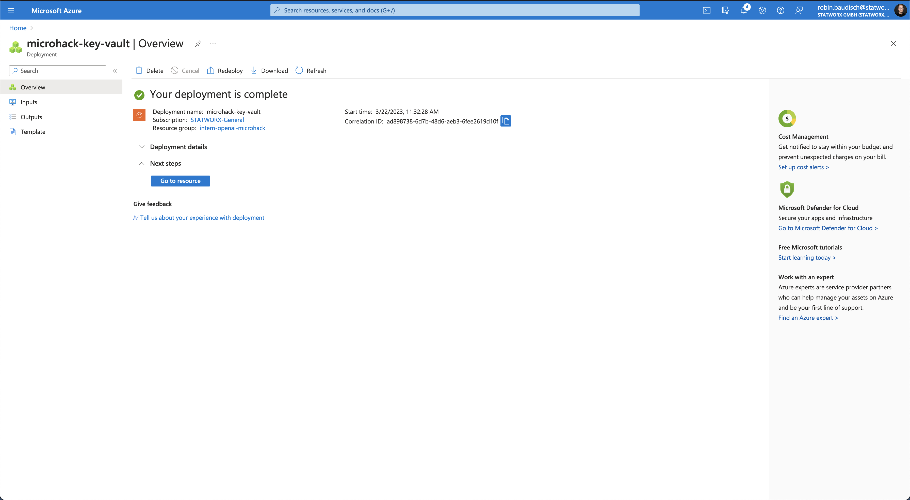

You are now seeing the main page of your newly created Key Vault Service. From the sidebar, click on *Access Control (IAM)* to be taken to the access and role assignments page.

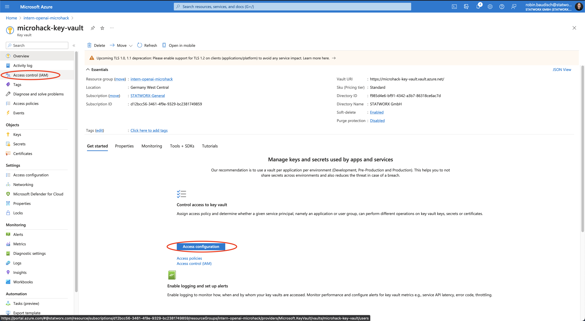

After navigating to the **Role assignments** tab, you can double-check the existing roles and whether they align with the needs of your project.

Configure role assignment/add users if neccessary (refer to last link under resources at top of task)
If needed, you can assign new roles to users or even create custom roles tailored to your specific project needs. The last link found [under resources](#task-3-setup-azure-key-vault-and-save-form-recognizer-keys) demonstrates how to assign access policies.

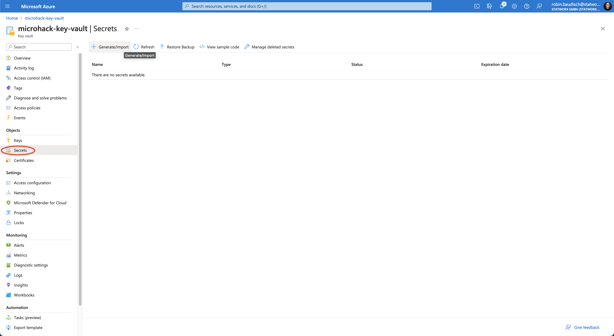

At main page of Key Vault, click on Secrets in sidebar (under Objects)
Head back to the main page of your newly created Key Vault Service. From the sidebar, under Objects, select Secrets.

Click on Generate/Import to store the secret Key + Endpoint of your previously created Form Recognizer.

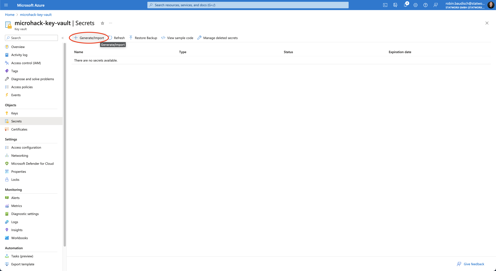

Next you must give the secret API key a fitting name, before then copy-pasting the previously created Form Recognizer key to the *Secret value* field. If you followed this guide, you stored this key in a local text editor such as Microsoft Notepad.  
Click create once you're finished.

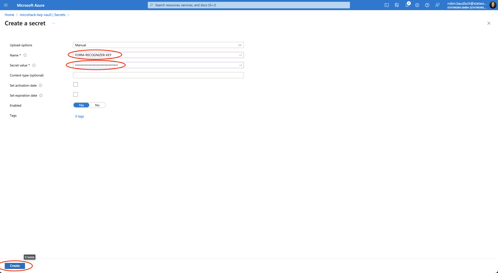

Repeat this process for the Form Recognizer endpoint. Give your secret an appropriate name and copy-paste the endpoint value over to *Secret value*. Click create to store your secret in your Key Vault Service.

Once finished you will find that both endpoint and key secrets have been stored in your Key Vault Service. Your secrets are now safely stored without the risk of being leaked from a public Git repository.

## Task 4: Setup Elastic Cloud

**Resources** \
[About the native Elastic integration with Azure](https://azure.microsoft.com/de-de/blog/search-made-simple-native-elastic-integration-with-azure-now-in-preview/)\
[Deploying and managing Elastic on Azure](https://www.elastic.co/blog/getting-started-with-the-azure-integration-enhancement)\

Elastic Cloud for Azure is a cloud-based hosting service offered by Elastic in partnership with Microsoft Azure. It enables users to deploy and manage Elasticsearch clusters on Azure in a fully-managed environment. Elasticsearch is a powerful search and analytics engine that is often used to support information retrieval use cases by providing a database-like service that is optimized for text retrieval. In our use case of this Microhack, Elasticsearch is used as the backend storage system for the Q&A bot.

In this task, we are setting up an Elasticsearch cluster using Azure's Elastic Cloud service, to store and quickly search through the documents that will make up the knowledge-base of our Q&A bot. 

Under the MicroHack Resource Group, search for *Elastic Cloud* in the search bar.

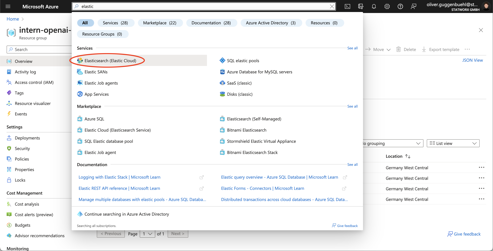

On the Elastic Cloud subpage, either click on + Create at the top of the page or on *Create Elasticsearch (Elastic Cloud)*.

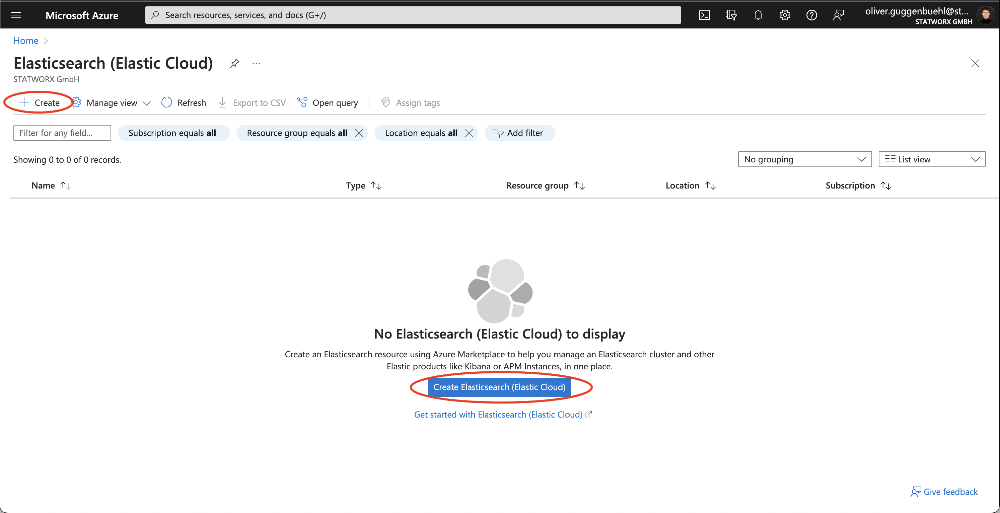

On the configuration page, the correct Azure Subscription should have been automatically selected under *Project Details*. You need to specify the Resource Group you'd like the Elastic resource to be hosted. Under *Instance Details* you need to name the Elastic Resource and select a deployment region. Here we selected **(Europe) West Europe** and gave the Elastic resource a fitting name.

Please note that cluster size cannot be customized during configuration and is thus set to the default values of 16GB RAM and 560GB storage. Since we have no need for such a large Elasticsearch cluster for this use case, we can customize the resource size after deployment, which in turn adjusts the price estimate for this resource. 

After you have given your Elastic resource a name, selected the right resource group and deployment region, click on *Review + create*. We once more do not modify the standard selections under the tabs **Logs & Metrics** or **Tags**. If you are handling sensitive data or have specific networking needs, please consult the official Azure resources.

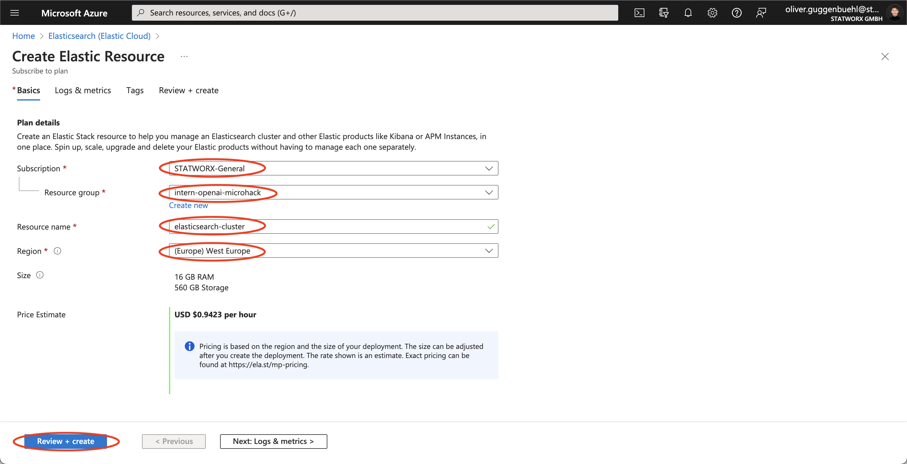

On the Review page, click on Create if you are satisfied with your configuration. This deploys your Elastic resource and takes you to its dedicated Overview page.

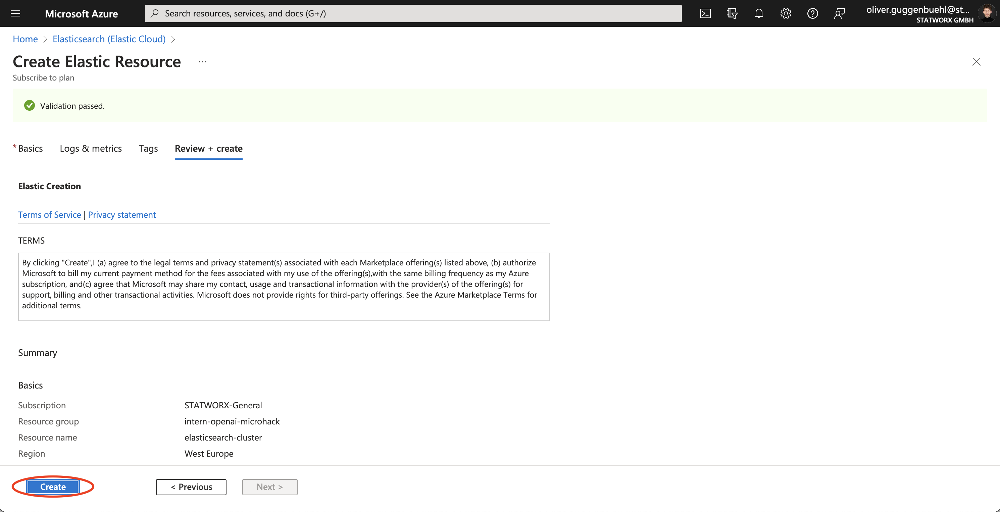

Deployment may take up to a few minutes. After the deployment page shows that the deployment was completed, click on *Go to resource*.

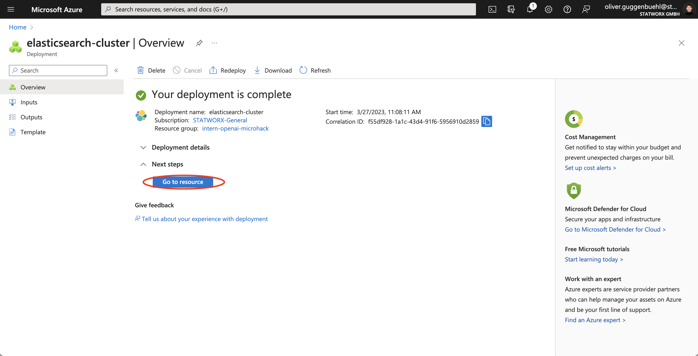

Now that the resource has been deployed, we can head over to the Elastic Cloud configuration page and adjust the size and parameters of our Elastic resource. Click the **Manage changes in Elastic Cloud** button after heading back to the overview page of your newly deployed Elastic resource. This will take you out of the Azure portal and navigate to Elastic's own configuration page

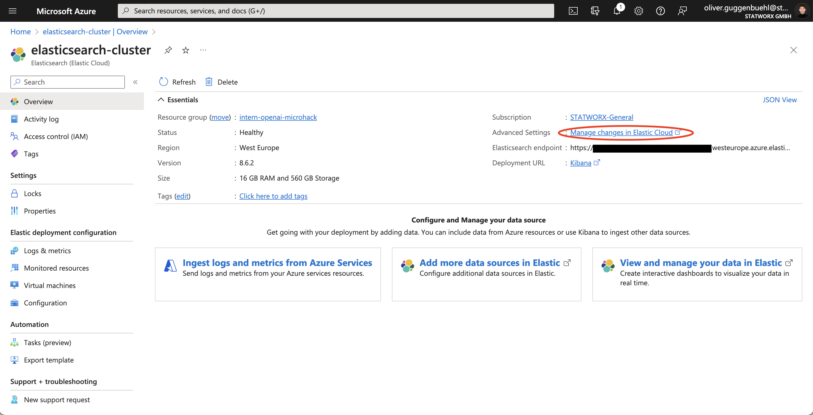

From here the deployment options of your resource can be edited to your own needs and liking. Navigate to the **Actions** button in the top right and select **Edit deployment**. 

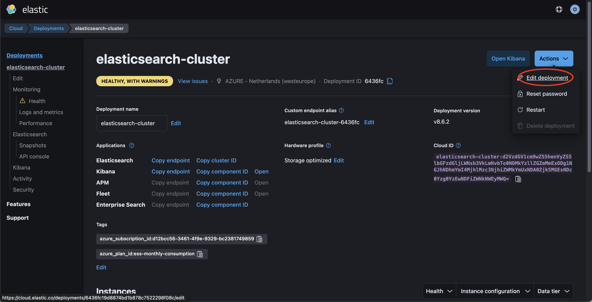

This opens an interface that allows the editing of your deployment parameters. For the specific use case of this Microhack we selected the smallest possible deployment size and chose 35GB of storage and 1GB of RAM for a single region. 

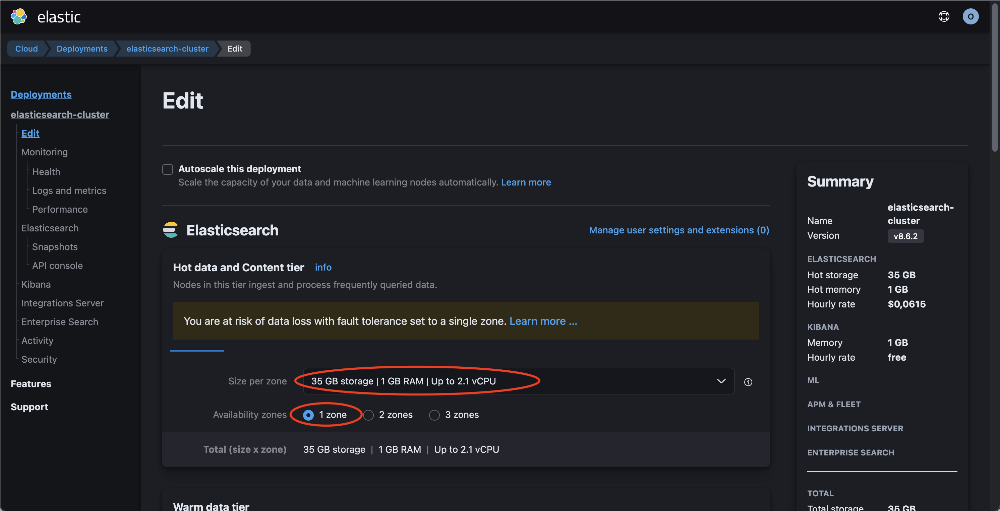

After adjusting the deployment options to our needs, we scroll to the bottom of the page to confirm our changes by clicking the **Save** button. The site then prompts us to review our selected changes and updates the price estimate accordingly. 

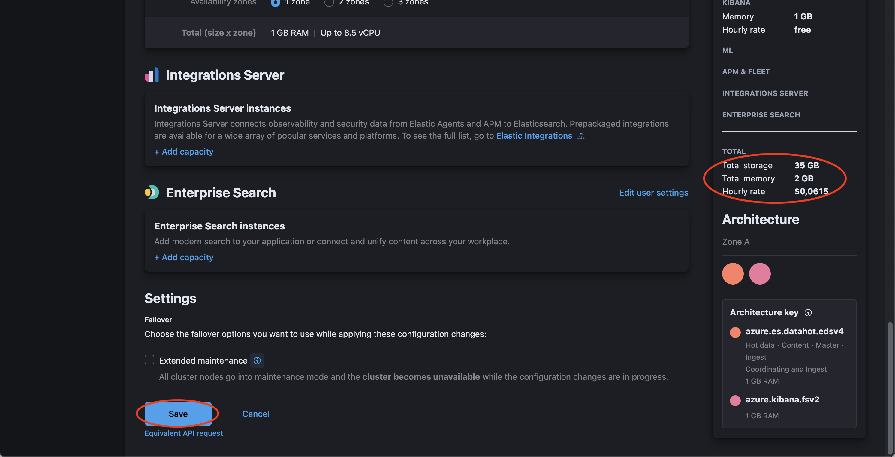

The changes to our deploymnet are now visible on the Azure Portal as well, after having taken effect. Our Elastic resource is up and running. The overview page also provides you with the API endpoint that you can now use to interact with your Elasticsearch cluster. 

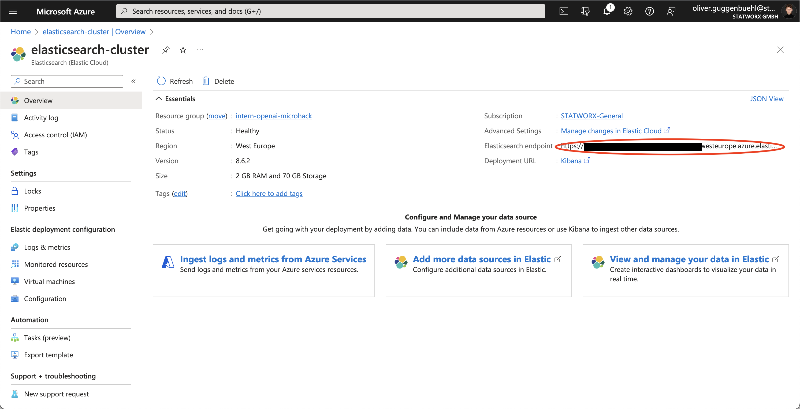

## Task 5: Create the Azure Function

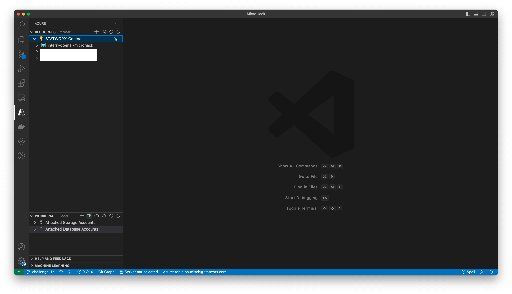

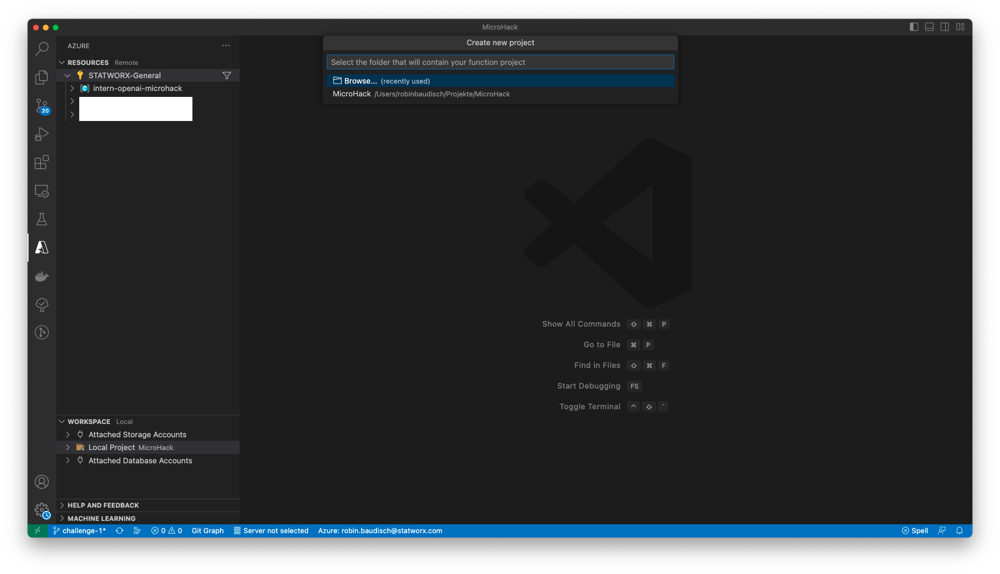

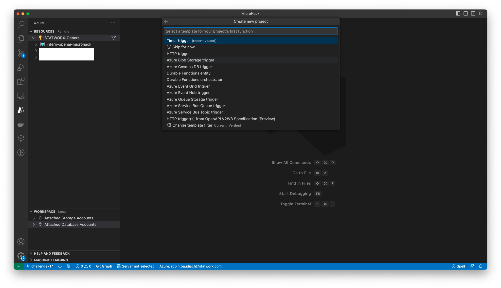

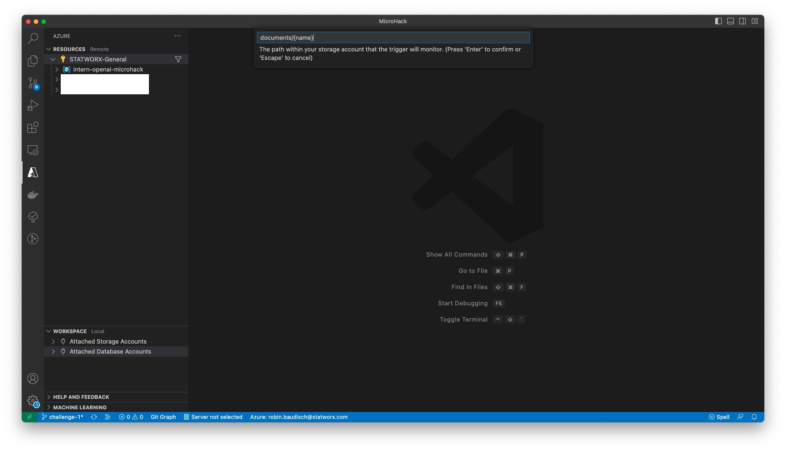

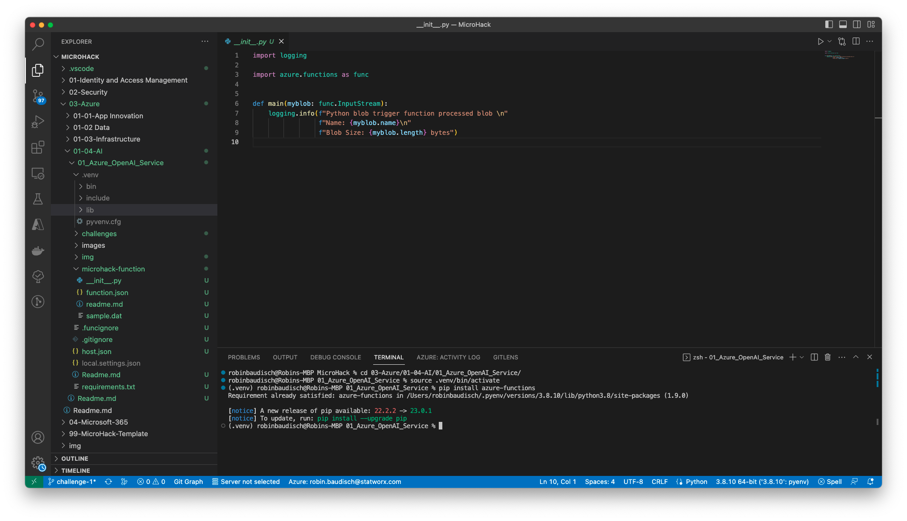

## Task 6: Test your Pipeline

You successfully completed Challenge 1! 🚀
