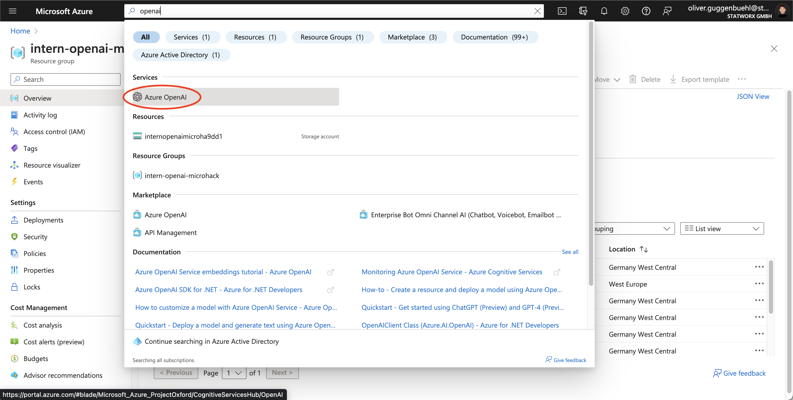
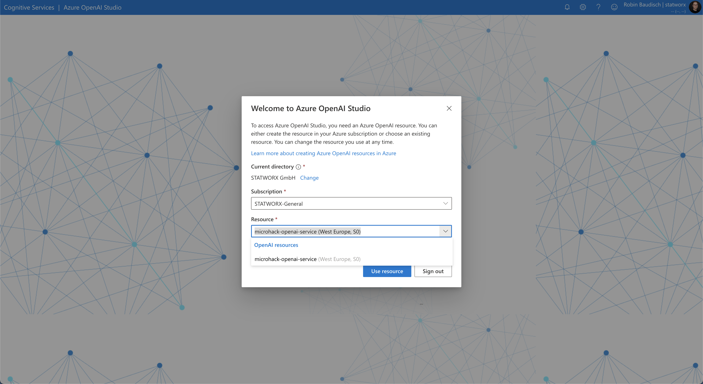
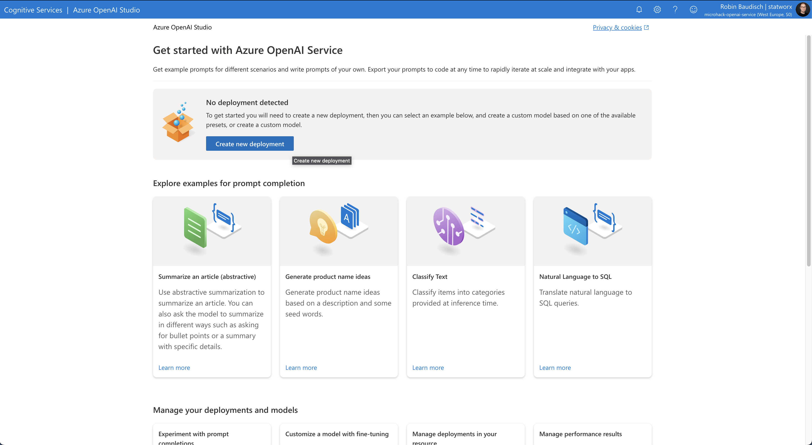
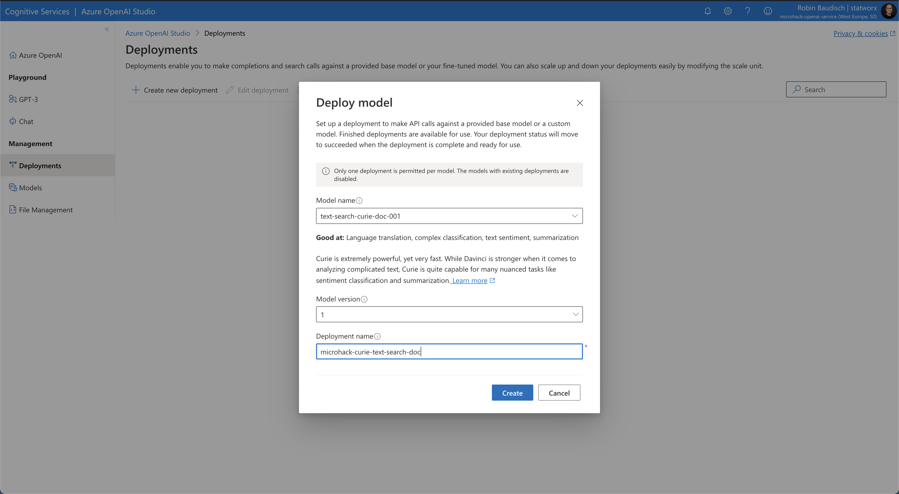
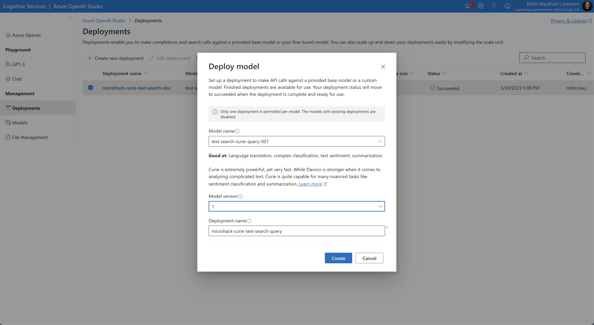
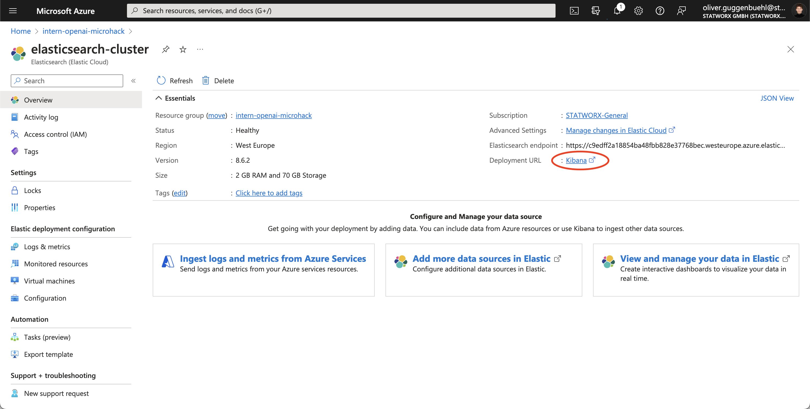
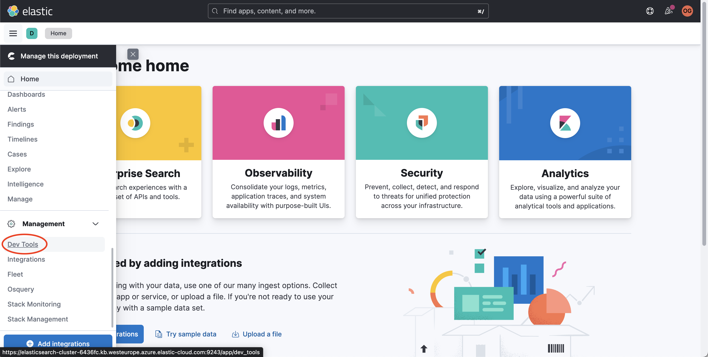
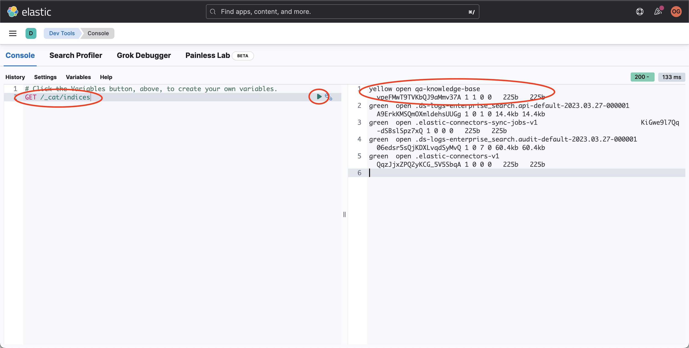

# Walkthrough Challenge 2 - Setting up a functional Pipeline

Duration: **TBD**

**[Home](../../Readme.md)** - [Next Challenge Solution](../challenges/challenge-2/solution.md)

## Prerequisites

In order to complete Challenge 2, make sure to complete the [Development Setup](../../Readme.md) and work through the tasks laid out in Challenge 1. It is assumed that you already created an Azure Storage Account, Form Recognizer, Key Vault, Elastic Cloud and a locally running Azure Function. 

## Task 1: Implement the Azure Form Recognizer in the Azure Function

**Resources:**

[Use Azure Functions and Python to process stored Documents](https://learn.microsoft.com/en-us/azure/applied-ai-services/form-recognizer/tutorial-azure-function?view=form-recog-3.0.0)

[Azure Form Recognizer client library for Python  - version 3.2.1](https://learn.microsoft.com/en-us/python/api/overview/azure/ai-formrecognizer-readme?source=recommendations&view=azure-python)

After setting up the individual services needed for this MicroHack, we are now moving on to writing the python script that handles the data processing within our defined Azure Function, once the function has been triggered.

Firstly, we'll add the needed packages to the requirements.txt.
We will be using
- ```azure-identity``` to authenticate ourselves
- ```azure-keyvault-secrets``` to connect to our Azure Key Vault
- ```azure-ai-formrecognizer``` which is the official Python SDK of the Azure Form Recognizer
- ```azure-storage-blob``` to connect to the storage account
- ```cryptography```

Next, we'll install the updated requirements.txt. For this, open the integrated terminal in VSCode. Make sure that the correct virtual environment is active. If it is not, execute the following terminal command inside the *01_Azure_OpenAI_Service* directory:

```source .venv/bin/activate```

We'll execute ```pip install -r requirements.txt``` to install the updated list of packages.

Now we are ready to work on the code of our Azure function.
Open up the \_\_init\_\_.py file inside the *microhack-function* folder. Import the needed packages at the start of the file:

```Python
import logging
import azure.functions as func
from azure.keyvault.secrets import SecretClient
from azure.identity import DefaultAzureCredential
from azure.ai.formrecognizer import DocumentAnalysisClient
from azure.core.credentials import AzureKeyCredential
from typing import List, Optional
```

Next, we'll make sure to authenticate ourselves inside the ```main()``` function and grab the needed secrets from the Azure Key Vault:

```Python
def main(myblob: func.InputStream):
    logging.info(f"Python blob trigger function processed blob \n"
                 f"Name: {myblob.name}\n"
                 f"Blob Size: {myblob.length} bytes")

    # Azure Credentials
    credential = DefaultAzureCredential()
    # Retrieve secrets from Key Vault
    key_vault_name = "microhack-key-vault"
    key_vault_uri = f"https://{key_vault_name}.vault.azure.net"
    client = SecretClient(vault_url=key_vault_uri, credential=credential)
    logging.info("Retreiving secrets from Azure Key Vault.")
    fm_api_key = client.get_secret("FORM-RECOGNIZER-KEY").value
    fm_endpoint = client.get_secret("FORM-RECOGNIZER-ENDPOINT").value
```

Grabbing the uploaded document is as easy as:

```Python
# Read document
data = myblob.read()
```

Now, we are ready to implement a function which utilizes the Azure Form Recognizer SDK to extract the document's text. The Form Recognizer SDK organizes a document into different granularities: Pages, Paragraphs, Lines and Words. For this, we'll first implement the ```chunk_paragraphs()``` function which - as the name suggests - chunks the list of paragraphs we'll get from the Form Recgonizer into chunks of approximately equal word count with a maximum of 100 words per chunk:

```Python
def chunk_paragraphs(paragraphs: List[str], max_words: Optional[int] = 100) -> List[str]:
    """Chunk a list of paragraphs into chunks
    of approximately equal word count."""
    # Create a list of dictionaries with the paragraph as the
    # key and the word count as the value
    paragraphs = [{p: len(p.split())} for p in paragraphs]
    # Create a list of lists of paragraphs
    chunks = []
    # Iterate over the list of paragraphs
    for i, p in enumerate(paragraphs):
        # If the current chunk is empty, add the first paragraph to it
        if len(chunks) == 0:
            chunks.append([p])
        # If the current chunk is not empty, check if adding the
        # next paragraph will exceed the max word count
        else:
            # If adding the next paragraph will exceed the max word count,
            # start a new chunk
            if sum(
                [list(c.values())[0] for c in chunks[-1]]
            ) + list(p.values())[0] > max_words:
                chunks.append([p])
            # If adding the next paragraph will not exceed the max word 
            # count, add it to the current chunk
            else:
                chunks[-1].append(p)
    # Create a list of strings from the list of lists of paragraphs
    chunks = [" ".join([list(c.keys())[0] for c in chunk]) for chunk in chunks]
    return chunks
```

Finally, we'll implement a wrapper function around the Form Recognizer which takes the uploaded document as input and returns a list of the extracted (and chunked) paragraphs:

```Python
def analyze_layout(data: bytes, endpoint: str, key: str) -> List[str]:
    """Analyze a document with the layout model.
    
    Args:
        data (bytes): Document data.
        endpoint (str): Endpoint URL.
        key (str): API key.
        
    Returns:
        List[str]: List of paragraphs.
    """
    # Create a client for the form recognizer service
    document_analysis_client = DocumentAnalysisClient(
        endpoint=endpoint, credential=AzureKeyCredential(key)
    )
    # Analyze the document with the layout model
    poller = document_analysis_client.begin_analyze_document(
            "prebuilt-layout", data)
    # Get the results and extract the paragraphs 
    # (title, section headings, and body)
    result = poller.result()
    paragraphs = [
        p.content for p in result.paragraphs
        if p.role in ["Title", "sectionHeading", None]
        ]
    # Chunk the paragraphs (max word count = 100)
    paragraphs = chunk_paragraphs(paragraphs)
    logging.info("CLEANED PARAGRAPHS:\n{}".format(paragraphs))

    return paragraphs
```

Now, we'll call the function inside of ```main()```. The complete \_\_init\_\_.py script looks like this now:

```Python
import logging
import azure.functions as func
from azure.keyvault.secrets import SecretClient
from azure.identity import DefaultAzureCredential
from azure.ai.formrecognizer import DocumentAnalysisClient
from azure.core.credentials import AzureKeyCredential
from typing import List, Optional


def chunk_paragraphs(paragraphs: List[str], max_words: int = 100) -> List[str]:
    """Chunk a list of paragraphs into chunks
    of approximately equal word count."""
    # Create a list of dictionaries with the paragraph as the
    # key and the word count as the value
    paragraphs = [{p: len(p.split())} for p in paragraphs]
    # Create a list of lists of paragraphs
    chunks = []
    # Iterate over the list of paragraphs
    for i, p in enumerate(paragraphs):
        # If the current chunk is empty, add the first paragraph to it
        if len(chunks) == 0:
            chunks.append([p])
        # If the current chunk is not empty, check if adding the
        # next paragraph will exceed the max word count
        else:
            # If adding the next paragraph will exceed the max word count,
            # start a new chunk
            if sum(
                [list(c.values())[0] for c in chunks[-1]]
            ) + list(p.values())[0] > max_words:
                chunks.append([p])
            # If adding the next paragraph will not exceed the max word 
            # count, add it to the current chunk
            else:
                chunks[-1].append(p)
    # Create a list of strings from the list of lists of paragraphs
    chunks = [" ".join([list(c.keys())[0] for c in chunk]) for chunk in chunks]
    return chunks


def analyze_layout(data: bytes, endpoint: str, key: str) -> List[str]:
    """Analyze a document with the layout model.
    
    Args:
        data (bytes): Document data.
        endpoint (str): Endpoint URL.
        key (str): API key.
        
    Returns:
        List[str]: List of paragraphs.
    """
    # Create a client for the form recognizer service
    document_analysis_client = DocumentAnalysisClient(
        endpoint=endpoint, credential=AzureKeyCredential(key)
    )
    # Analyze the document with the layout model
    poller = document_analysis_client.begin_analyze_document(
            "prebuilt-layout", data)
    # Get the results and extract the paragraphs 
    # (title, section headings, and body)
    result = poller.result()
    paragraphs = [
        p.content for p in result.paragraphs
        if p.role in ["Title", "sectionHeading", None]
        ]
    # Chunk the paragraphs (max word count = 100)
    paragraphs = chunk_paragraphs(paragraphs)
    logging.info("CLEANED PARAGRAPHS:\n{}".format(paragraphs))

    return paragraphs


def main(myblob: func.InputStream):
    logging.info(f"Python blob trigger function processed blob \n"
                 f"Name: {myblob.name}\n"
                 f"Blob Size: {myblob.length} bytes")

    # Azure Credentials
    credential = DefaultAzureCredential()
    # Retrieve secrets from Key Vault
    key_vault_name = "microhack-key-vault"
    key_vault_uri = f"https://{key_vault_name}.vault.azure.net"
    client = SecretClient(vault_url=key_vault_uri, credential=credential)
    logging.info("Retreiving secrets from Azure Key Vault.")
    fm_api_key = client.get_secret("FORM-RECOGNIZER-KEY").value
    fm_endpoint = client.get_secret("FORM-RECOGNIZER-ENDPOINT").value

    # Read document
    data = myblob.read()

    # Get List of paragraphs from document
    paragraphs = analyze_layout(data, fm_endpoint, fm_api_key)
```

## Task 2: Setup the Azure OpenAI Service

**Resources:** \
[Azure OpenAI Service Documentation](https://learn.microsoft.com/en-us/azure/cognitive-services/openai/overview)\
[Create a resource and deploy a model using Azure OpenAI](https://learn.microsoft.com/en-us/azure/cognitive-services/openai/how-to/create-resource?pivots=web-portal)

In order to work with the GPT models from OpenAI, we need to create the Azure OpenAI service and deploy the models we will be using.

Under your Resource Group, search for *openai* in the search bar and select the **Azure OpenAI** service.



This will take you to the **Cognitive Services | Azure OpenAI** subpage, either click on *+ Create* at the top of the page or on *Create Azure OpenAI*.


On the configuration page, select the correct Azure Subscription under *Project Details*. You need to specify the Resource Group under which you want the Azure OpenAI resource to be situated. Under *Instance Details* you need to select a deployment region, name the Azure OpenAI service and decide on the pricing tier. We selected **West Europe**, gave the Azure OpenAI service a fitting name and chose the default pricing tier.

The next step is to click on **Review + create**. We once again do not modify the standard selections under the tabs **Network**, **Identity** or **Tags**. If you are handling sensitive data or have specific networking needs, please consult the official Azure resources.


Next, Azure is prompting us to give the resource some tags that make it easier to differentiate between multiple instances of the same service. Which tags you want to set and how to name their values is entirely up to you.


On the Review page, click on Create if you are happy with your configuration. It should take you to the deployment page of the Azure OpenAI service. Deployment might take an unexpectedly long time for this particular resource - do not be surprised if it takes over an hour to finish deployment.


Before you can generate embeddings or text, you need to deploy a model. You can select from one of several available models in the [Azure OpenAI Studio](https://oai.azure.com/). Select the correct Azure Subscription and the Resource Group under which you created the Azure OpenAI Service.



Since the Service has just been created, on the main page of the Azure OpenAI Studio it will let you know that you have currently no models deployed. Click on *Create new deployment*.


In the newly opened window, you are asked to select one of several different OpenAI models for deplyoment. These models are dividable by their parameter size (Ada is the smallest models while Davinci is the largest) and their respective use cases. There are different models for creating text embeddings, code embeddings or text/code generation. For a complete list of available models, refer to [Azure OpenAI Service models](https://learn.microsoft.com/en-us/azure/cognitive-services/openai/concepts/models#model-summary-table-and-region-availability).

Since we want to create embeddings of documents and user queries with the goal of retrieving relevant sections of our uploaded documents with regards to the query, we need to deploy two text search embedding models. These models help measure whether long documents are relevant to a short search query. There are two input types supported by this family: **doc**, for embedding the documents to be retrieved, and **query**, for embedding the search query. We select *text-search-curie-doc-001* for the document embeddings and *text-search-curie-query-001* for the query embeddings.

Under *Deployment Name*, give these models a fitting name. Deployment names are the ones we will specify in our code.




Lastly, we need a text generation model which will output the response to the user query. For this, we chose *text-davinci-003*.


The three models we just deployed will be usable in our Azure Function now.

## Task 3: Generate Text Embeddings via the Azure OpenAI Service in the Azure Function

**Resources**:\
[OpenAI Python Library](https://github.com/openai/openai-python)\
[Tutorial: Explore Azure OpenAI Service embeddings and document search](https://learn.microsoft.com/en-us/azure/cognitive-services/openai/tutorials/embeddings?tabs=command-line)

Since we now have implemented the text extraction part of our Azure Function and deployed the needed models, we need to generate embeddings for each of the extracted paragraphs. This is quite simple when using the ```openai``` Python SDK.

We'll firstly add the needed packages to the requirements.txt and install them just like we did in Task 1.

Add the following packages:

- ```openai```
- ```num2words```
- ```matplotlib```
- ```plotly```
- ```scipy```
- ```scikit-learn```

And add the ones we'll utilize to the imports inside of the \_\_init\_\_.py script:

```Python
import re
import openai
from openai.embeddings_utils import get_embedding
```

Next, we'll write a helper function which cleans up the extracted paragraphs before generating their embeddings:

```Python
def normalize_text(s: str) -> str:
    """Clean up a string by removing redundant 
    whitespaces and cleaning up the punctuation.

    Args:
        s (str): The string to be cleaned.

    Returns:
        s (str): The cleaned string.
    """
    s = re.sub(r'\s+', " ", s).strip()
    s = re.sub(r". ,", "", s)
    s = s.replace("..", ".")
    s = s.replace(". .", ".")
    s = s.replace("\n", "")
    s = s.strip()

    return s
````

Now, we are ready to implement a wrapper function around the ```get_embedding()``` function. The function will call ```normalize_text()``` and ```get_embedding()``` and returns a dictionary object with the key value pairs

```Python
{
    "paragraph": cleaned_paragraph,
    "embedding": embedding
}
```

```Python
def generate_embedding(s: str, engine: Optional[str] = "microhack-curie-text-search-doc"):
    """Clean the extracted paragraph before generating its' embedding.

    Args:
        s (str): The extracted paragraph.
        engine (str): The name of the embedding model.

    Returns:
        embedding_dict (dict): The cleaned paragraph and embedding 
        as key value pairs.
    """
    cleaned_paragraph = normalize_text(s)
    embedding = get_embedding(cleaned_paragraph, engine)
    embedding_dict = {
        "paragraph": cleaned_paragraph, 
        "embedding": embedding
        }
    return embedding_dict
```

Finally, we need to get the OpenAI secrets from our Azure Key Vault and add the call to the ```generate_embedding()``` function inside the ```main()``` function:

```Python
openai_api_key = client.get_secret("OPENAI-KEY").value
openai_endpoint = client.get_secret("OPENAI-ENDPOINT").value
openai.api_type = "azure"
openai.api_key = openai_api_key
openai.api_base = openai_endpoint
openai.api_version = "2022-12-01"
# Generate embeddings
embeddings_dict = [generate_embedding(p) for p in paragraphs]
logging.info(embeddings_dict)
```

The complete \_\_init\_\_.py script looks like this now:

```Python
import logging
import azure.functions as func
from azure.keyvault.secrets import SecretClient
from azure.identity import DefaultAzureCredential
from azure.ai.formrecognizer import DocumentAnalysisClient
from azure.core.credentials import AzureKeyCredential
from typing import List, Optional
import re
import openai
from openai.embeddings_utils import get_embedding


def chunk_paragraphs(paragraphs: List[str], max_words: int = 100) -> List[str]:
    """Chunk a list of paragraphs into chunks
    of approximately equal word count."""
    # Create a list of dictionaries with the paragraph as the
    # key and the word count as the value
    paragraphs = [{p: len(p.split())} for p in paragraphs]
    # Create a list of lists of paragraphs
    chunks = []
    # Iterate over the list of paragraphs
    for i, p in enumerate(paragraphs):
        # If the current chunk is empty, add the first paragraph to it
        if len(chunks) == 0:
            chunks.append([p])
        # If the current chunk is not empty, check if adding the
        # next paragraph will exceed the max word count
        else:
            # If adding the next paragraph will exceed the max word count,
            # start a new chunk
            if sum(
                [list(c.values())[0] for c in chunks[-1]]
            ) + list(p.values())[0] > max_words:
                chunks.append([p])
            # If adding the next paragraph will not exceed the max word 
            # count, add it to the current chunk
            else:
                chunks[-1].append(p)
    # Create a list of strings from the list of lists of paragraphs
    chunks = [" ".join([list(c.keys())[0] for c in chunk]) for chunk in chunks]
    return chunks


def analyze_layout(data: bytes, endpoint: str, key: str) -> List[str]:
    """Analyze a document with the layout model.
    
    Args:
        data (bytes): Document data.
        endpoint (str): Endpoint URL.
        key (str): API key.
        
    Returns:
        List[str]: List of paragraphs.
    """
    # Create a client for the form recognizer service
    document_analysis_client = DocumentAnalysisClient(
        endpoint=endpoint, credential=AzureKeyCredential(key)
    )
    # Analyze the document with the layout model
    poller = document_analysis_client.begin_analyze_document(
            "prebuilt-layout", data)
    # Get the results and extract the paragraphs 
    # (title, section headings, and body)
    result = poller.result()
    paragraphs = [
        p.content for p in result.paragraphs
        if p.role in ["Title", "sectionHeading", None]
        ]
    # Chunk the paragraphs (max word count = 100)
    paragraphs = chunk_paragraphs(paragraphs)
    logging.info("CLEANED PARAGRAPHS:\n{}".format(paragraphs))

    return paragraphs


def normalize_text(s: str) -> str:
    """Clean up a string by removing redundant 
    whitespaces and cleaning up the punctuation.

    Args:
        s (str): The string to be cleaned.

    Returns:
        s (str): The cleaned string.
    """
    s = re.sub(r'\s+', " ", s).strip()
    s = re.sub(r". ,", "", s)
    s = s.replace("..", ".")
    s = s.replace(". .", ".")
    s = s.replace("\n", "")
    s = s.strip()

    return s


def generate_embedding(s: str, engine: Optional[str] = "microhack-curie-text-search-doc"):
    """Clean the extracted paragraph before generating its' embedding.

    Args:
        s (str): The extracted paragraph.
        engine (str): The name of the embedding model.

    Returns:
        embedding_dict (dict): The cleaned paragraph and embedding 
        as key value pairs.
    """
    cleaned_paragraph = normalize_text(s)
    embedding = get_embedding(cleaned_paragraph, engine)
    embedding_dict = {
        "paragraph": cleaned_paragraph, 
        "embedding": embedding
        }
    return embedding_dict    


def main(myblob: func.InputStream):
    logging.info(f"Python blob trigger function processed blob \n"
                 f"Name: {myblob.name}\n"
                 f"Blob Size: {myblob.length} bytes")

    # Azure Credentials
    credential = DefaultAzureCredential()
    # Retrieve secrets from Key Vault
    key_vault_name = "microhack-key-vault"
    key_vault_uri = f"https://{key_vault_name}.vault.azure.net"
    client = SecretClient(vault_url=key_vault_uri, credential=credential)
    logging.info("Retreiving secrets from Azure Key Vault.")
    fm_api_key = client.get_secret("FORM-RECOGNIZER-KEY").value
    fm_endpoint = client.get_secret("FORM-RECOGNIZER-ENDPOINT").value
    openai_api_key = client.get_secret("OPENAI-KEY").value
    openai_endpoint = client.get_secret("OPENAI-ENDPOINT").value
    openai.api_type = "azure"
    openai.api_key = openai_api_key
    openai.api_base = openai_endpoint
    openai.api_version = "2022-12-01"

    # Read document
    data = myblob.read()

    # Get List of paragraphs from document
    paragraphs = analyze_layout(data, fm_endpoint, fm_api_key)

    # Generate embeddings
    embeddings_dict = [generate_embedding(p) for p in paragraphs]
    logging.info(embeddings_dict)
````

## Task 4: Create the ElasticSearch Index

**Resources:** \
[Create Index API](https://www.elastic.co/guide/en/elasticsearch/reference/current/indices-create-index.html)

In order to write documents to our Elasticsearch service, we need to set up a so-called index first. Think of an index as the elastic version of a database, where our text data is stored in an unstructured way. To interact with our Elasticsearch cluster, we can use HTTP requests to read, create, delete and write to an Elasticsearch index. 

From the overview page of your Elastic Cloud service, navigate to the **Kibana** link that will take you to the dedicated Kibana instance that is used to monitor and manage your Elastic Cloud deployment. 



Toggle the menu on the left side of the page and navigate to the **Management** section at the very bottom. From there select the **Dev Tools** rider, which will take you to a developer console that you can use to interact with your Elasticsearch cluster. 



From there you can now create a new Index for your Elasticsearch cluster that can then store and search through your documents. To do so, write a HTTP PUT request that specifies the index name you would like to create. We decided to call our index `qa-knowledge-base`. The complete PUT request thus becomes: `PUT /qa-knowledge-base`. Execute your request by clicking the green **send** button on the top-right corner of your console. 

If successful, the output window to the right will indicate that your request was acknowledged and display the name of your newly created Elasticsearch index. 


We can also test the success of your our request manually by requesting the names of all the currently existing indexes of our Elasticsearch cluster. To do so, we use a GET request: `GET /_cat/indices`

This prints the name of all currently existing indexes to the output window and adds some additional information such as the number of currently stored documents per index. It appears that our cluster now hosts multiple indexes: the one that we just created, as well as some default indexes that we do not need to interact with for the time being. 



## Task 5: Write the Extracted Paragraphs + Embeddings to the Azure Elastic Service

**Resources:**

## Task 5: Test the Azure Function Locally

**Resources:**

## Task 6: Deploy the Azure Function

**Resources:**


You successfully completed Challenge 2! 🚀
