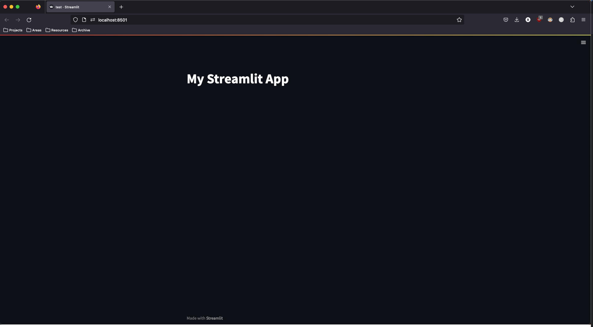

# Walkthrough Challenge 3 -  Create a Graphical User Interface with Streamlit

Duration: **TBD**

**[Home](.../../.../../Readme.md)**

- [Walkthrough Challenge 3 -  Create a Graphical User Interface with Streamlit](#walkthrough-challenge-3----create-a-graphical-user-interface-with-streamlit)
  - [Prerequisites](#prerequisites)
  - [Task 1: Setup Streamlit App](#task-1-setup-streamlit-app)
  - [Task 2: Create Streamlit Widgets](#task-2-create-streamlit-widgets)
  - [Task 3: Connect the Streamlit App to the Blob Storage](#task-3-connect-the-streamlit-app-to-the-blob-storage)
  - [Task 4: Connect the Streamlit App to the Chroma DB and Retrieve Relevant Paragraphs](#task-4-connect-the-streamlit-app-to-the-chroma-db-and-retrieve-relevant-paragraphs)
  - [Task 5: Generate Answers via the Completions Endpoint](#task-5-generate-answers-via-the-completions-endpoint)

## Prerequisites

In order to complete Challenge 3, make sure that you have successfully completed Challenge 1 and 2, meaning that you should have a running Chroma Database as well as a functioning Azure Function.

## Task 1: Setup Streamlit App

**Resources:**\
[Streamlit documentation](https://docs.streamlit.io/)\
[OpenAI API Completions Endpoint](https://platform.openai.com/docs/api-reference/completions)\
[OpenAI Text Completion Guide](https://platform.openai.com/docs/guides/completion)

In this Challenge, we will use Streamlit to build a very simple web-based UI where users are able to upload new documents to our blob storage as well as interface with the Q&A system we have built so far.

Streamlit is a Python library that allows you to create interactive web applications and dashboards for machine learning and data science projects, without requiring expertise in web development. It is an open-source tool that provides a simple and intuitive way to build and share data-driven applications.

With Streamlit, you can quickly prototype and build interactive data applications using familiar Python syntax. The library provides a set of easy-to-use widgets for creating user interfaces, including sliders, dropdowns, text inputs, and more.

Setting up a Streamlit app in Python is a straightforward process. All you need is to install Streamlit in your Python environment, create a Python script where you will define the look and functionality of your UI and run the app via a simple terminal command.

First, add the Streamlit package to the ```environment.txt``` file we used in Challenge 2 and run ```pip install -r requirements.txt``` once again.

Now, we can already start working on our UI. Create a Python file ```main.py```, import Streamlit and add your first widget:

```Python
import streamlit as st

# Add a title to your app
st.title("My Streamlit App")
```


Running the app is as easy as executing the following code in your terminal:

```console
streamlit run main.py
```

This command will print out some information in the terminal, most importantly, the link to your app. By default, Streamlit apps which are locally run are found under http://localhost:8501.


If you follow this link, the Streamlit app should open up in your default browser:



## Task 2: Create Streamlit Widgets

**Resources:**

Next, we will start designing the needed widgets. More specifically, our app should feature

- an upload widget where users can upload files to the blob storage we created in Challenge 1
- a text box where users can ask their questions which will then be used to retrieve relevant paragraphs from the Chroma DB. The retrieved information, together with the user query, is then fed into the Completions endpoint of the Azure OpenAI Service
- a slider where the number of paragraphs to retrieve from Chroma can be selected
- a section where the generated answer is displayed
- a section where the retrieved information from the Chroma DB is displayed

This sounds more complicated than it actually is. To create the widgets, add the following code to your ```main.py```:

```Python
import streamlit as st

# App title
st.title("Microhack: Semantic Q&A-Bot")

# File upload in sidebar (only allows PDFs)
doc = st.sidebar.file_uploader(
    ":page_facing_up: Upload your own documents to the knowledge base here",
    type=["pdf"],
)

# Query free-text window with default question
st.markdown("### :question: Query the bot here:")
query = st.text_input("query", value="Who are statworx?", label_visibility="collapsed")

# Paragraph slider (default of 3)
n_paragraphs = st.slider(
    "Number of paragraphs to retrieve and source answer from:",
    min_value=1,
    max_value=5,
    value=3,
)

# Display answer
st.markdown("### :robot_face: The Q&A-bot answers:")
st.write("Answer will be displayed here!")

# Display paragraphs
st.markdown(f"### :bulb: This answer was sourced from {n_paragraphs} paragraphs:")
st.write("Retrieved paragraphs will be displayed here!")
```

When reloading the web page, the app should now look like this:


## Task 3: Connect the Streamlit App to the Blob Storage

**Resources:**

Now that we have created the Upload widget, we need to implement the actual upload logic. To do this, we need to connect to the Azure Key Vault and retrieve the blob storage secrets in order to connect to it:

```Python
from azure.storage.blob import BlobServiceClient
from azure.keyvault.secrets import SecretClient
from azure.identity import DefaultAzureCredential

# Connect to key vault
credential = DefaultAzureCredential()
key_vault_name = "microhack-key-vault"
key_vault_uri = f"https://{key_vault_name}.vault.azure.net"
client = SecretClient(vault_url=key_vault_uri, credential=credential)

# Blob storage
account_name = "microhack"
account_key = client.get_secret("BLOB-KEY").value
container_name = "documents"

blob_service_client = BlobServiceClient(
    account_url=f"https://{account_name}.blob.core.windows.net", credential=account_key
)
container_client = blob_service_client.get_container_client(container_name)
```

This code snippet creates a container client via the Python Azure SDK. We can use this client to interact with the blob storage, i.e. upload, delete or modify files.

To actually upload a document, we will need to check if a user has supplied us with a file via the upload widget, see if the file does not already exist in the blob storage and if not, upload the file. If the file does already exist, we want to let the user know.

```Python
from azure.core.exceptions import ResourceExistsError

# Upload doc to blob storage and display status banner
if doc is not None:
    blob_client = container_client.get_blob_client(doc.name)

    try:
        blob_client.upload_blob(doc)
        st.sidebar.success("Document uploaded successfully!", icon="🚀")
    except ResourceExistsError:
        st.sidebar.error("Document was already uploaded!", icon="🛑")
```

## Task 4: Connect the Streamlit App to the Chroma DB and Retrieve Relevant Paragraphs

**Resources:**

The documents which are uploaded by the user are automatically processed by the Azure Function, paragraphs and embeddings are retrievable from the Chroma DB. We will now connect the Streamlit app to the Chroma DB and retrieve relevant paragraphs with regards to a user query.

First, we need to create the connections to the Chroma DB and the Azure OpenAI Service.

```Python
import openai 
import chromadb
from chromadb.config import Settings

# OpenAI
openai_api_key = client.get_secret("OPENAI-KEY").value
openai_endpoint = client.get_secret("OPENAI-ENDPOINT").value

openai.api_type = "azure"
openai.api_key = openai_api_key
openai.api_base = openai_endpoint
openai.api_version = "2022-12-01"

# Chroma
chroma_address = client.get_secret("CHROMA-DB-ADDRESS").value

chroma_client = chromadb.Client(
    Settings(
        chroma_api_impl="rest",
        chroma_server_host=chroma_address,
        chroma_server_http_port="8000",
    )
)

# Get collection
collection = chroma_client.get_collection("microhack-collection")
```

We have now connected to Chroma, retrieved our collection and initialized the Python OpenAI SDK. Next, we'll embed the text the user inputs into the query text box, 

## Task 5: Generate Answers via the Completions Endpoint

**Resources:**

Text here.

**Congratulations, you successfully completed Challenge 3! 🚀**
