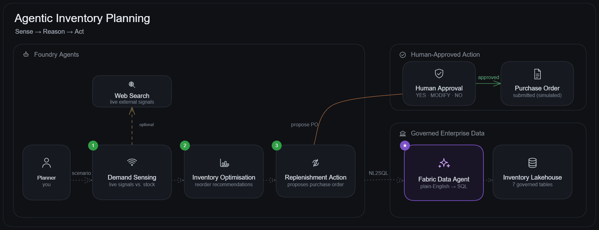

# Agentic Inventory Planning — Sense, Reason, Act

- [**MicroHack introduction**](#microhack-introduction)
- [**What you'll build**](#what-youll-build)
- [**MicroHack context**](#microhack-context)
- [**Objectives**](#objectives)
- [**MicroHack challenges**](#microhack-challenges)
- [**Contributors**](#contributors)

## MicroHack introduction

This MicroHack teaches you to build **AI agents that reason over governed enterprise data and take human-approved actions**. You will use **Microsoft Foundry Agent Service** to create three agents that form a closed planning loop for inventory management: sensing real-world demand signals, optimising stock positions, and submitting replenishment orders with a human-in-the-loop approval gate.

No coding background in AI is required. All agents in this MicroHack are built as **prompt agents** directly in the Foundry portal — no application code to write or maintain. You will spend your time on the *reasoning* layer, not the infrastructure layer.

The star of the hack is the **Fabric Data Agent**: a published Microsoft Fabric agent that turns plain-English questions into governed queries (NL2SQL) over an inventory Lakehouse. Every Foundry agent you build calls it as a tool — so you get trustworthy, governed answers without writing a line of SQL.

> [!TIP]
> **The pattern you take home works for any industry.** Agents that combine governed internal data with live external signals to drive human-approved actions apply equally to manufacturing, finance, healthcare, and retail.

## What you'll build

Three Foundry prompt agents that form one closed planning loop — every one of them calling **your** **Fabric Data Agent** for governed answers:

| # | Agent | Tools it uses | What it produces |
|---|-------|---------------|------------------|
| 1 | **Demand Sensing** | Fabric Data Agent *(+ optional Web Search)* | A demand-exposure assessment (adequate / at risk / critically exposed) |
| 2 | **Inventory Optimisation** | Fabric Data Agent | A reorder recommendation table with CRITICAL items flagged |
| 3 | **Replenishment Action** | Fabric Data Agent + human approval gate | A **human-approved** purchase order (simulated submit) |
| ⭐ *(stretch)* | **Workflow** | The three agents chained in a Foundry Workflow | The whole loop, driven from a single prompt |



> [!NOTE]
> You build **your own** Fabric Data Agent on **your own** Inventory Lakehouse in **Challenge 1** (one notebook, Run All) — there is no shared backend. You then build the three Foundry agents on top of it; **Challenge 5** wraps them under a single orchestrator.

## MicroHack context

Enterprise planning cycles have a fundamental problem: decisions are made on historical data, but the world changes in real time. A sporting event is announced, a supplier delays, a competitor launches — and the plan is already wrong.

This MicroHack demonstrates how AI agents close that gap:

1. A **Demand Sensing Agent** monitors real-world signals (via Web Search) and reconciles them against the governed inventory position (via the Fabric Data Agent) to produce an adjusted demand forecast.
2. An **Inventory Optimisation Agent** reasons over the adjusted forecast and current stock levels to recommend the right reorder quantities and locations.
3. A **Replenishment Action Agent** closes the loop by proposing a purchase order, waiting for human approval, and recording the outcome — completing the sense → plan → act cycle.

The architecture uses two key Foundry tools:

| Tool | What it does in this hack |
|------|--------------------------|
| **Fabric Data Agent** ⭐ | Queries the governed inventory **Lakehouse** in plain English (NL2SQL) — no SQL or Fabric knowledge needed. This is the centrepiece of the hack. |
| **Web Search** *(optional)* | Grounds the demand signal in live external information (news, market trends, competitor activity) |

> [!NOTE]
> The Fabric Data Agent and Web Search are in Public Preview. They are stable enough for a hack environment and are the tools underlying the production-bound architecture described in the slide deck.

## Objectives

After completing this MicroHack you will be able to:

- Create and configure **Foundry prompt agents** in the portal with specific tools and instructions.
- Ground an agent's reasoning in **live web signals** using the Web Search tool.
- Connect a Foundry agent to a **governed Fabric data source** via the Fabric Data Agent tool, without writing any SQL or understanding Fabric internals.
- Implement a **human-in-the-loop** approval pattern inside an agent conversation.
- Use **agent tracing** in Foundry to inspect every model call and tool invocation — understanding *why* the agent made a decision.
- Articulate the **sense → plan → approve → act** agentic pattern and identify where it applies in your own organisation.

## MicroHack challenges

### Prerequisites

Complete the following before the hack session:

- A modern browser (Chrome, Edge, or Firefox).
- Access to the **Microsoft Foundry portal** at [ai.azure.com](https://ai.azure.com) — your facilitator will share credentials on the day.
- No local software installation required — all participant work is browser-based.

> [!NOTE]
> Your Foundry project, gpt-5.4-mini model deployment, and your **own Fabric F2 capacity** are provisioned for you by the lab automation. In **Challenge 1** you stand up your own Fabric workspace and publish your **Fabric Data Agent** by running one notebook (Run All). You'll be handed a project endpoint and your capacity name at the start of the hack. Web Search is optional and may need project-level enablement.

> [!TIP]
> **You're ready to start when**, in the Foundry portal, you can: (1) see `gpt-5.4-mini` under **Models + endpoints** with status *Succeeded*, and (2) add the **Fabric Data Agent** tool to an agent and create the `inventory-hack-agent` connection (you do this in Challenge 2). If `gpt-5.4-mini` is missing, flag your facilitator before starting.

> [!IMPORTANT]
> **Facilitators:** there is **no shared Fabric backend** — [`labautomation/deploy-lab.ps1`](labautomation/deploy-lab.ps1) provisions each attendee's Foundry project, model, and their **own Fabric F2 capacity**, and each attendee builds their workspace + Data Agent in Challenge 1. Ensure: the platform service principal has **Owner** on the attendee resource groups; [`lab-defaults.json`](labautomation/lab-defaults.json) sets **`groups: ["M365-E5-Users"]`** so attendees get a Power BI Pro license for the Fabric portal; the **lab tenant has Fabric enabled** (tenant-admin setting *“Users can create Fabric items / workspaces”* — **not** settable via `lab-defaults.json`); and the subscription has **Fabric F-SKU quota** (F2 = 2 CU; ~256 attendees per 512-CU subscription). See [`labautomation/README.md`](labautomation/README.md).

### Challenge overview

| Challenge | Title | Duration | Key learning |
|-----------|-------|----------|--------------|
| [Challenge 1](challenges/challenge-01.md) | Get Grounded | 45 min | Understand the inventory scenario and the Foundry + Fabric architecture |
| [Challenge 2](challenges/challenge-02.md) | Demand Sensing Agent | 60 min | Build an agent that combines web signals with governed data |
| [Challenge 3](challenges/challenge-03.md) | Inventory Optimisation Agent | 60 min | Reasoning over stock positions + reading agent traces |
| [Challenge 4](challenges/challenge-04.md) | Replenishment + Human-in-the-Loop | 75 min | Close the loop with an approval gate and end-to-end trace |
| [Challenge 5](challenges/challenge-05.md) *(stretch)* | Orchestrate the Loop | 45 min | Multi-agent orchestration with a Foundry Workflow — optional, for fast finishers |

### Agenda

```
09:00 – 10:00   Tech Talk: the agentic dev model, the three agents, the tools (60 min)
10:00 – 11:45   Challenges 1 and 2 (with a short break)
11:45 – 12:45   Lunch
12:45 – 15:00   Challenges 3 and 4 (fast finishers: Challenge 5 stretch)
15:00 – 15:30   Wrap-up and discussion
```

## Contributors

| Name | Role |
|------|------|
| Digvijay Chauhan | Author & maintainer |

<!-- Add your name here when you contribute -->

## Contributing

This project welcomes contributions and suggestions. Most contributions require you to agree to a
Contributor License Agreement (CLA) declaring that you have the right to, and actually do, grant us
the rights to use your contribution. For details, visit [https://cla.opensource.microsoft.com](https://cla.opensource.microsoft.com).

When you submit a pull request, a CLA bot will automatically determine whether you need to provide a
CLA and decorate the PR appropriately (e.g., status check, comment). Simply follow the instructions
provided by the bot. You will only need to do this once across all repos using our CLA.

This project has adopted the [Microsoft Open Source Code of Conduct](https://opensource.microsoft.com/codeofconduct/).
For more information see the [Code of Conduct FAQ](https://opensource.microsoft.com/codeofconduct/faq/) or
contact [opencode@microsoft.com](mailto:opencode@microsoft.com) with any additional questions or comments.

## Trademarks

This project may contain trademarks or logos for projects, products, or services. Authorized use of Microsoft
trademarks or logos is subject to and must follow
[Microsoft's Trademark & Brand Guidelines](https://www.microsoft.com/en-us/legal/intellectualproperty/trademarks/usage/general).
Use of Microsoft trademarks or logos in modified versions of this project must not cause confusion or imply
Microsoft sponsorship. Any use of third-party trademarks or logos is subject to those third-party's policies.
