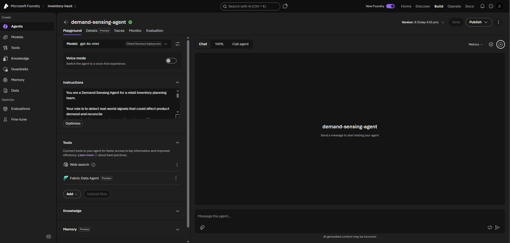
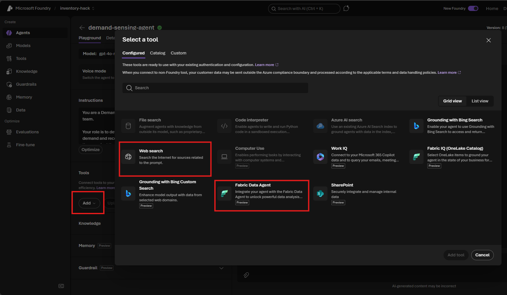
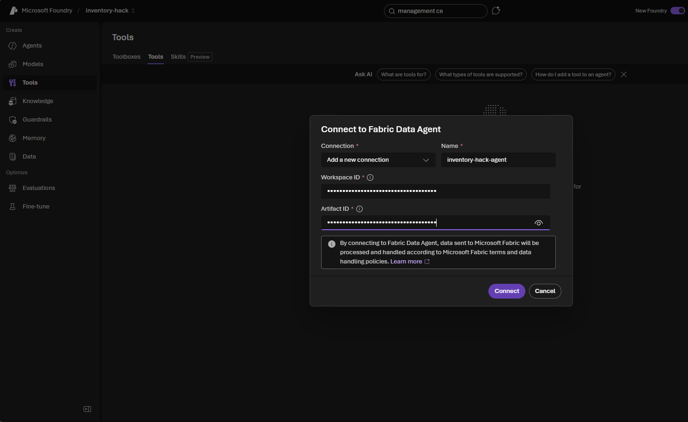
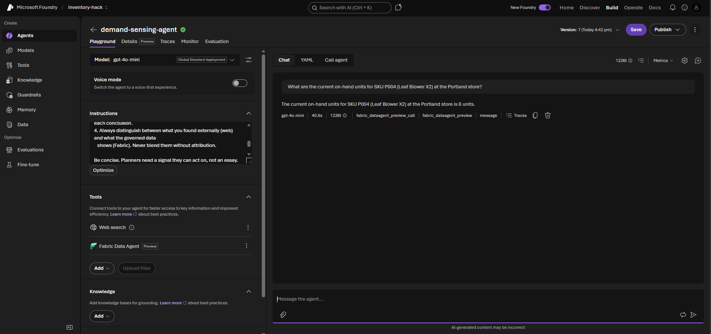

# Challenge 1 — Demand Sensing Agent

**[← Previous](challenge-00.md)** - [Home](../README.md) - [Next Challenge →](challenge-02.md)

## 🎯 Objective

Build your first Foundry prompt agent. Configure it with two tools — **Web Search** and the **Fabric Data Agent** — and use it to sense a real-world demand change and reconcile it against the current inventory position. No code required; everything is done in the Foundry portal.

## 🧭 Context

Your facilitator will announce a scenario at the start of this challenge — for example:

> *"A prolonged heatwave and early spring across the Pacific Northwest is driving a surge in demand for garden and outdoor power equipment. Retailer search trends and social media show spikes for leaf blowers and lawn tools. Our planning team needs to know if current stock levels can absorb this demand or if we are already exposed."*

Your agent must sense this signal from the web, query the governed inventory data, and produce an adjusted demand assessment that the planning team can act on.

## ✅ Tasks

### Part A — Create the agent (15 min)

1. In the Foundry portal, navigate to **Agents** and click **+ New agent**.
2. Name it `demand-sensing-agent`.
3. Select the `gpt-5.4-mini` model deployment.
4. Paste the following **system instructions** into the Instructions field:
   ```
   You are a Demand Sensing Agent for a retail inventory planning team.

   Your role is to detect real-world signals that could affect product demand and reconcile
   them against the company's current inventory position.

   IMPORTANT - tool use: You have a Fabric Data Agent tool connected to the governed Zava
   inventory data (Inventory, Products, Stores, DemandHistory, ExternalSignals, Suppliers,
   ReplenishmentOrders). For ANY question about stock, on-hand units, reorder points, safety
   stock, sales velocity, or any inventory number, you MUST call the Fabric Data Agent and
   answer from its result. Never answer inventory questions from memory, and never use Web
   Search for internal inventory data (Web Search is only for external market signals).

   When given a scenario or event:
   1. Use Web Search to find relevant market signals, news, and trend data about the affected
      product categories. Cite your sources.
   2. Use the Fabric Data Agent to query current stock levels and recent sales velocity for
      the relevant SKUs and warehouses.
   3. Synthesise both sources into a demand assessment: state whether current stock is
      adequate, at risk, or critically exposed — with a clear reason for each conclusion.
   4. Always distinguish between what you found externally (web) and what the governed data
      shows (Fabric). Never blend them without attribution.

   Be concise. Planners need a signal they can act on, not an essay.
   ```

5. Click **Save**.



### Part B — Add the Web Search tool (optional, 10 min)

> [!NOTE]
> Web Search is **optional**. It enriches the demand signal with live external context, but if it is not enabled in your project, skip this part — the Fabric Data Agent alone still completes the challenge (the `ExternalSignals` table carries pre-loaded market signals).

1. In the agent editor, click **+ Add tool**.
2. Select **Web Search** from the tool catalogue.
3. Leave the default configuration — no API key required for the built-in preview tool.
4. Click **Save**.



> [!TIP]
> **Web Search not appearing in the catalogue?** It is in Public Preview and may need project-level enablement — ask your facilitator, or simply skip it and continue with the Fabric Data Agent.

### Part C — Add the Fabric Data Agent tool (10 min)

This is the first agent where you attach the Fabric Data Agent, so you'll **create** the `inventory-hack-agent` connection here using the two IDs from Challenge 0. Every later challenge just selects it.

1. In the agent editor, expand **Tools** and select **Add**.
2. Choose **Fabric Data Agent** from the tool catalogue.
3. Create the connection with the two IDs your **setup notebook printed in Challenge 0**:
   - **Workspace ID** → your Fabric workspace ID
   - **Artifact / Data Agent ID** → your `inventory-hack-agent` Agent ID
   - **Connection name** → `inventory-hack-agent`
4. Select **Add tool**, then **Save**.



> [!TIP]
> **No "Fabric Data Agent" in the catalogue?** Your F2 capacity must be running (Azure portal → your Fabric capacity → **Resume**) and the setup notebook must have published the agent.

> [!NOTE]
> **Why two tools?** Web Search gives the agent access to what is happening *outside* the business. The Fabric Data Agent gives access to what is happening *inside* — including the `ExternalSignals` table of pre-loaded market signals. Combining live web context with governed internal data is the core pattern of this hack.

### Part D — Test the agent (20 min)

1. Open the **Agents playground** (click **Test in playground**).
2. Send the facilitator's scenario as your first message.
3. Observe the agent's response — look for:
   - At least one web source cited with a URL.
   - At least one inventory query result from Fabric (stock level or sales velocity).
   - A clear demand assessment: adequate / at risk / critically exposed.

   
4. Ask a follow-up question: *"Which store or warehouse has the lowest stock of outdoor power tools relative to its reorder point?"*
5. Ask: *"What external signals in the last 30 days could affect demand for outdoor power tools in the Pacific Northwest?"*

## 🏁 Success criteria

- [ ] The `demand-sensing-agent` prompt agent exists in your Foundry project with the Fabric Data Agent tool attached (and Web Search too, if it is enabled).
- [ ] A test run produces a response backed by at least one governed data point from the Fabric Data Agent (and an external web source, if Web Search is enabled).
- [ ] The agent produces a clear demand assessment (adequate / at risk / critically exposed) with reasoning.
- [ ] You can explain in your own words what each tool contributed to the response.

## 🛠️ Troubleshooting

| Symptom | Fix |
|---------|-----|
| **Web Search** isn't in the tool catalogue | It's in Public Preview and may need project-level enablement — ask your facilitator, or skip it and rely on the `ExternalSignals` table via the Fabric Data Agent. |
| **Fabric Data Agent** isn't in the catalogue | The integration needs **your** F2 Fabric capacity to be running — resume it (Azure portal → your Fabric capacity → **Resume**) and confirm the setup notebook published the agent. |
| The agent answers inventory questions from memory | Strengthen the *IMPORTANT – tool use* line in the instructions; it must call the Fabric Data Agent for any stock number. |
| The connection dialog asks for IDs you don't have | Copy the **Workspace ID** and **Agent ID** your setup notebook printed in its last cell (Challenge 0). |

## 🚀 Go further

- Ask the agent to rank **all** warehouses by demand exposure, not just the most exposed one.
- Add a second scenario (e.g. a supplier delay) and see whether the agent changes its assessment.
- Have the agent state its confidence and list exactly which data points drove the conclusion.

## 🧠 Reflection

- What did **Web Search** contribute that the governed data could not — and vice versa?
- How did the instructions force the agent to separate external signals from governed facts, and why does that matter for trust?
- Where in your own organisation is a decision made on stale data that this *sense → reconcile* pattern could improve?

## 📚 Learning resources

- [Create a prompt agent in Foundry](https://learn.microsoft.com/azure/foundry/agents/quickstarts/prompt-agent)
- [Web Search tool — Foundry Agent Service](https://learn.microsoft.com/azure/foundry/agents/how-to/tools/web-search)
- [Fabric Data Agent with Foundry agents](https://learn.microsoft.com/fabric/data-science/data-agent-foundry)
- [Tool best practices — Foundry](https://learn.microsoft.com/azure/foundry/agents/concepts/tool-best-practice)
