# Challenge 1 — Get Grounded

**[Home](../README.md)** - [Next Challenge →](challenge-02.md)

## 🎯 Objective

Understand the inventory scenario, provision your own Fabric workspace + Data Agent, and learn the pattern you will build across the next three challenges. No Foundry agent-building yet — just reading, exploring, standing up your data backend, and forming a clear mental model.

## 🧭 Context

You are a developer at a retail company. The planning team complains that their inventory decisions are always based on last month's data. By the time a demand spike or supplier disruption becomes visible in the ERP, it is too late. Your job is to build three agents that close this gap:

1. **Demand Sensing** — react to real-world changes before they hit the system
2. **Inventory Optimisation** — decide the right stock level given the updated demand picture
3. **Replenishment Action** — submit the order with a human review step

The data lives in **Microsoft Fabric** (a governed Lakehouse with inventory, demand, product, and market-signal data). In this challenge you'll stand up **your own** Fabric workspace and publish a **Fabric Data Agent** on top of it (one notebook, Run All) — then connect your Foundry agents to it in the next challenges.

> [!IMPORTANT]
> Understanding the architecture saves you time in the next challenges. Spend the full 45 minutes here; do not rush ahead.

## ✅ Tasks

1. **Read the Zava data model.**
   The Fabric **Lakehouse** you'll create in Task 3 has the following tables. You do not need to know SQL or Fabric to use them — the agents query in plain English.

   | Table | What it contains | Used by |
   |-------|-----------------|------|
   | `Inventory` | Current stock (`onHand`), `reorderPoint`, and `safetyStock` per product per store/warehouse | Challenges 2, 3 |
   | `DemandHistory` | Weekly sales units per product per location | Challenge 2 |
   | `ExternalSignals` | Pre-loaded market signals: competitor pricing, search trends, weather, news (sourced from Web IQ) | Challenge 2 |
   | `Products` | Product catalogue: `name`, `category`, `unitCost`, `leadTimeDays`, `supplierId` | Challenges 3, 4 |
   | `Stores` | Store and warehouse locations with region and type | Challenges 2, 3 |
   | `ReplenishmentOrders` | Purchase orders and transfers — status, approver, items JSON | Challenge 4 |
   | `Suppliers` | Supplier details | Challenge 4 |

   **Real product categories:** `garden_and_lawn`, `outdoor_power_tools`, `paint_and_supplies`, `smart_home`
   **Real locations:** 4 retail stores (Boston, Brooklyn, Portland, Seattle) + 2 distribution warehouses (Chicago, Dallas)

2. **Explore the Foundry portal.**
   Navigate to [ai.azure.com](https://ai.azure.com) and open **your** Foundry project — its `FoundryProjectEndpoint` is on your lab dashboard.
   - Locate the **model deployments** — confirm `gpt-5.4-mini` is deployed.
   - Open **Agents → Playground** and send a test message: *"What can you do?"*
   - Open **Tracing** in the left navigation — this is where you will inspect agent decisions in Challenges 3 and 4.

   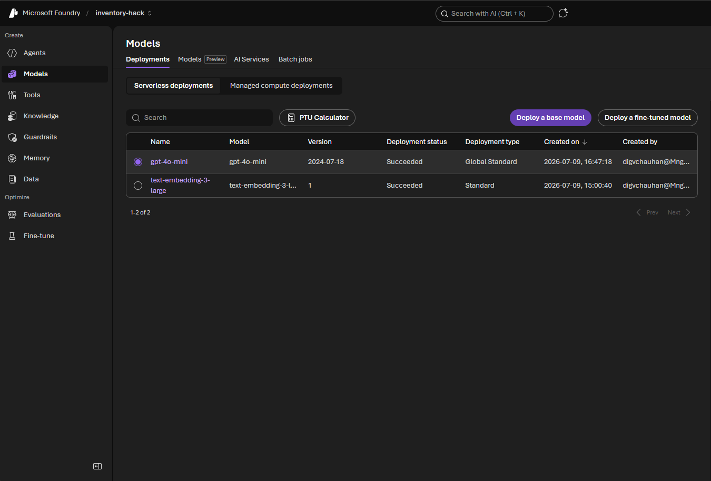

   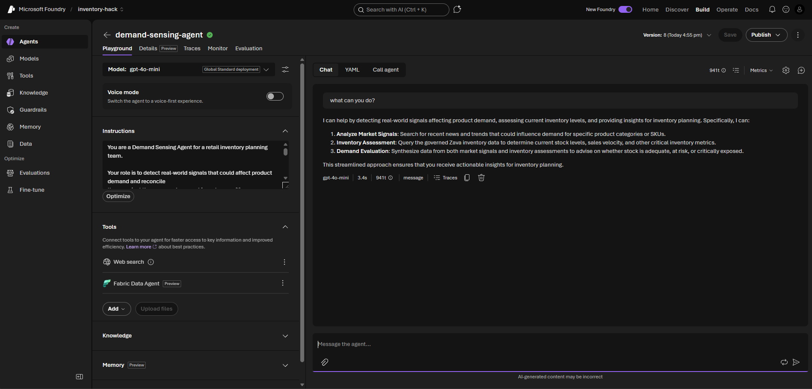

   > [!NOTE]
   > **The model name in the screenshots is only for illustration.** Some captures may show `gpt-4o-mini` (or another model) selected — that's just what was deployed when the screenshot was taken. Use **whatever model is deployed in your project** (check **Models + endpoints**, e.g. `gpt-5.4-mini`). The model is swappable; every step in this hack works the same regardless of which chat model is deployed.

3. **Provision your own Fabric workspace and Data Agent.** *(~15 min)*

   Your lab dashboard gives you a **`FabricCapacityName`** — your own Fabric **F2 capacity**. You'll stand up a workspace on it and publish your own Data Agent by running one notebook. Follow each step carefully — this is the data backend every later challenge depends on.

   **a. Create your workspace on your F2 capacity.**
   Go to [app.fabric.microsoft.com](https://app.fabric.microsoft.com) → **Workspaces** (left rail) → **+ New workspace**.

   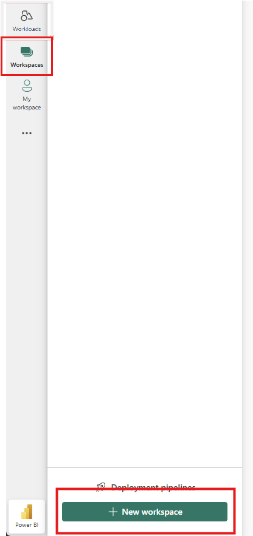

   Name it `inventory-hack`, expand **Advanced**, and under **Workspace type** select **Fabric**. A **Details** dropdown appears — select your **`FabricCapacityName`** (the `invcap…` value from your dashboard). Click **Apply**.

   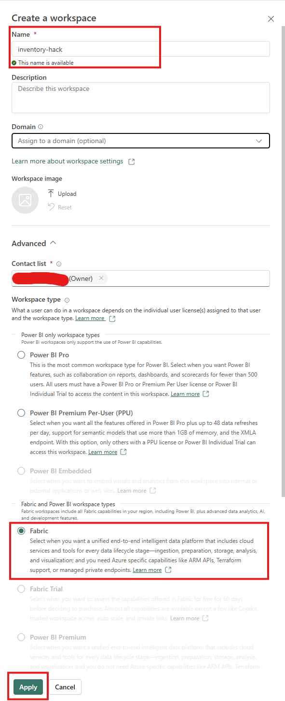

   > If your capacity isn't in the dropdown: it must be **running** (Azure portal → your Fabric capacity → **Resume**), and you must be signed in as the lab user it was assigned to. Ask your facilitator if it still doesn't appear.

   **b. Create the Lakehouse.**
   Inside the workspace, click **+ New item**, choose **Lakehouse** (type `lake` in the search box to find it fast), and name it exactly **`InventoryLakehouse`** — the notebook writes its tables here.

   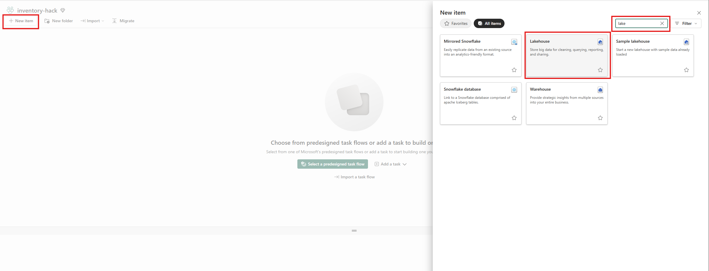

   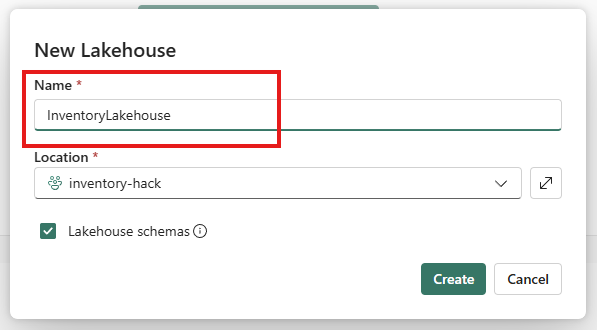

   **c. Import the setup notebook.**
   Download **`Setup-InventoryDataAgent.ipynb`** from the hack repo's **`setup/`** folder (or the link your facilitator shares). In the workspace toolbar, click **Import → Notebook → From this computer**, then **Upload** and choose the file. You'll see an **Imported successfully** confirmation — open the notebook.

   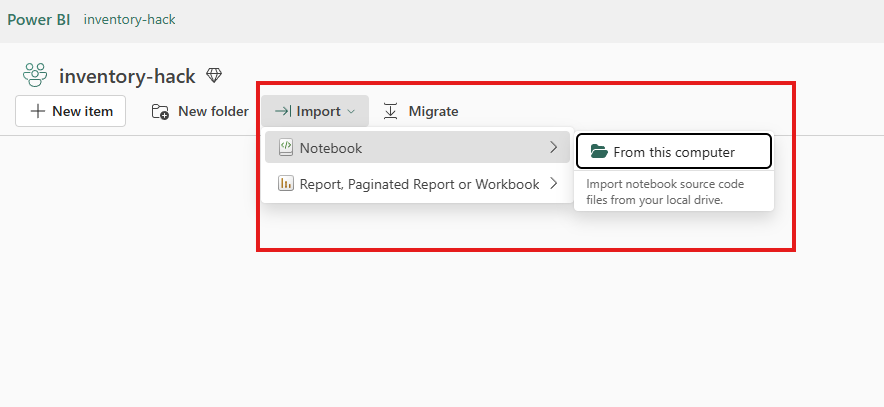

   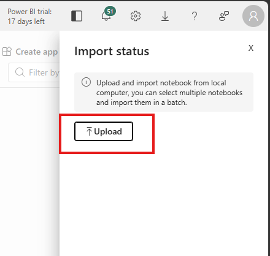

   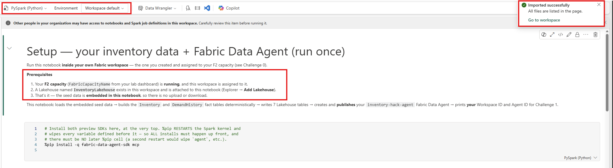

   **d. Attach your Lakehouse to the notebook.**
   Open the imported notebook. In the left **Explorer** pane click **Add** (Lakehouses) → **Existing Lakehouse**. In the **OneLake catalog** dialog, tick **`InventoryLakehouse`** and click **Add** — if more than one appears, pick the row whose **Location** is **`inventory-hack`** (your workspace). It becomes the notebook's **default** Lakehouse. **Without this, the table-write cells fail.**

   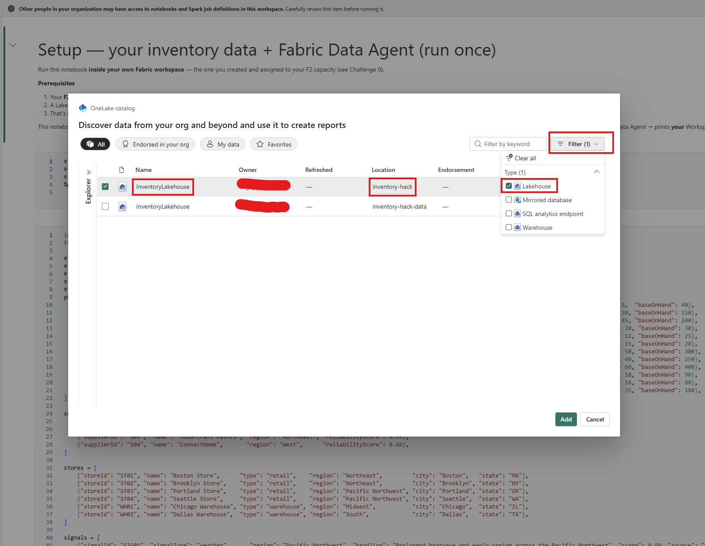

   **e. Run all.**
   Click **Run all**. The notebook installs the preview SDKs (the kernel restarts once — that's expected), loads its embedded seed data, writes **7 tables**, and **publishes** your `inventory-hack-agent` Data Agent (~5–10 min).

   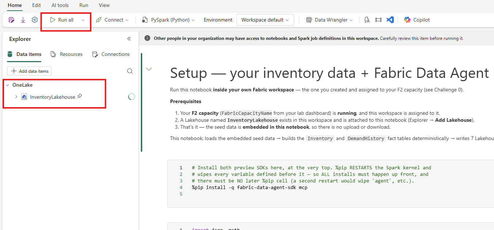

   **f. Copy your two IDs.**
   When it finishes, the **last cell prints your Workspace ID and Agent ID**. Note both — you paste them into the Fabric Data Agent tool in Challenge 2.

   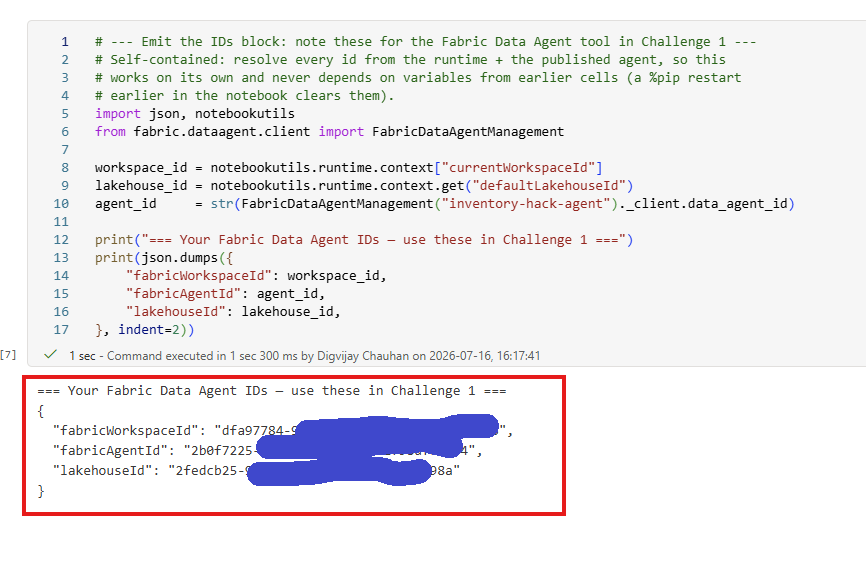

   **g. Verify your agent answers.** *(1 min)*
   Open the data agent's **Test data agent** pane and ask: *"How many Leaf Blower X2 units are on hand at the Portland and Seattle stores, and are they below safety stock?"* You should get exact numbers with **CRITICAL** flags — proof that your tables are selected and the agent is published.

   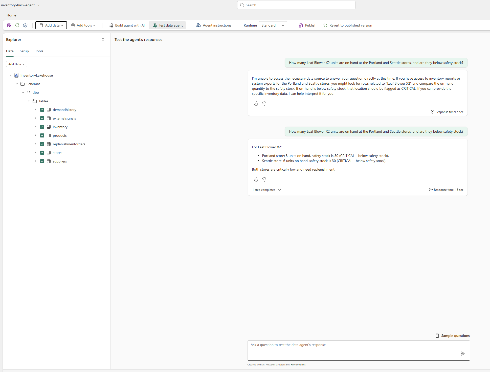

   | Value | Where it comes from |
   |-------|---------------------|
   | Workspace ID | printed by the notebook's last cell (also in the workspace URL) |
   | Artifact / Data Agent ID | printed by the notebook's last cell |
   | Connection name | `inventory-hack-agent` |

   > [!NOTE]
   > You attach the **Fabric Data Agent** as a *tool* on each Foundry agent, and the connection is created the **first time** you add it (Challenge 2). After that you simply **select** it. It points your Foundry agents at the data agent on top of **your** inventory Lakehouse.

   > [!TIP]
   > **No "Fabric Data Agent" in the Foundry tool catalogue later?** Your F2 capacity must be **running** (Azure portal → your Fabric capacity → **Resume**) and the setup notebook must have finished publishing the agent.

4. **Understand the three-agent pattern.**
   Draw (on paper or a whiteboard) the flow:
   ```
   Real-world event
        ↓
   [Demand Sensing Agent] — Web Search + Fabric Data Agent
        ↓  adjusted demand signal
   [Inventory Optimisation Agent] — Fabric Data Agent
        ↓  reorder recommendation
   [Replenishment Action Agent] — Fabric Data Agent + human approval
        ↓  submitted purchase order
   ```
   Be able to answer: *What tool does each agent use and why?*

5. **Answer the grounding questions** (discuss with your team):
   - What would go wrong if the Demand Sensing Agent only looked at web signals and ignored the governed inventory data?
   - Why does the Replenishment Action Agent need a human approval step?
   - What data does the Fabric Data Agent abstract away for you?

## 🏁 Success criteria

- [ ] You can name the key inventory tables and explain what each one is used for.
- [ ] You have confirmed the `gpt-5.4-mini` model is deployed in your Foundry project.
- [ ] You have created your own Fabric workspace on your F2 capacity, run the setup notebook, and published your `inventory-hack-agent` Data Agent — and noted its **Workspace ID** and **Agent ID** (used in Challenge 2).
- [ ] You can describe, in one sentence each, what each of the three agents does.
- [ ] You can explain why combining web signals with governed data produces better decisions than either source alone.

## 🛠️ Troubleshooting

| Symptom | Fix |
|---------|-----|
| `gpt-5.4-mini` is missing under **Models + endpoints** | Flag your facilitator before starting — the model deployment is part of your provisioned lab. |
| Your **`FabricCapacityName`** isn't selectable when creating the workspace | The F2 capacity must be **running** — resume it (Azure portal → your Fabric capacity → **Resume**). |
| The setup notebook errors on `%pip install` or the publish cell | Preview SDK drift — re-run the failed cell; if a method name differs, check the [SDK reference](https://learn.microsoft.com/fabric/data-science/fabric-data-agent-sdk). Make sure your F2 capacity is **running**. |
| **Fabric Data Agent** isn't in the tool catalogue (previewing ahead) | Your F2 capacity must be running, and the setup notebook must have **published** the agent. |
| The agent replies *"I'm unable to access the data source"* (or *"No tables selected yet"*) | Its tables aren't selected. The setup notebook selects all seven automatically, but if it didn't: open the data agent → **Data** tab → tick **all** tables under `InventoryLakehouse → dbo` → **Publish**, then re-test. |

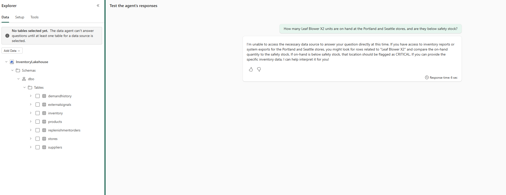

## 🚀 Go further

- Sketch the three-agent flow from memory and label which tool each agent uses and why.
- In the playground, ask the agent *“What data can you see?”* and compare its answer to the table list above.
- Predict which tables Challenge 3 and Challenge 4 will lean on before you get there.

## 🧠 Reflection

- What would go wrong if the Demand Sensing Agent only looked at web signals and ignored the governed inventory data?
- Why does the Replenishment Action Agent need a human approval step?
- What does the Fabric Data Agent abstract away for you, and why does that matter for a non-SQL audience?

## 📚 Learning resources

- [What is Microsoft Foundry Agent Service?](https://learn.microsoft.com/azure/foundry/agents/overview)
- [Fabric Data Agent with Foundry agents](https://learn.microsoft.com/fabric/data-science/data-agent-foundry)
- [Foundry agents playground](https://learn.microsoft.com/azure/foundry/concepts/concept-playgrounds)
- [Web Search tool in Foundry](https://learn.microsoft.com/azure/foundry/agents/how-to/tools/web-search)
