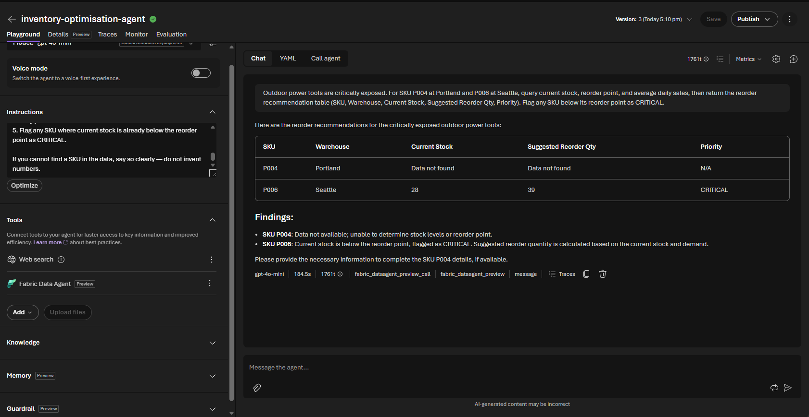
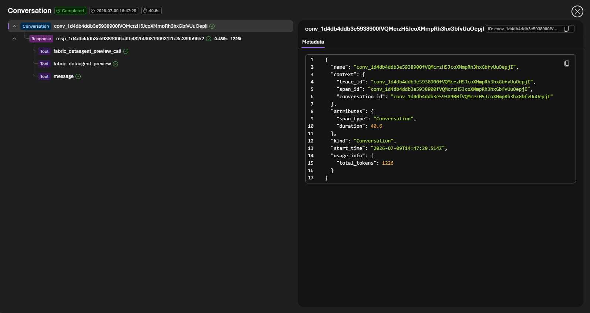

# Challenge 2 — Inventory Optimisation Agent

**[← Previous](challenge-01.md)** - [Home](../README.md) - [Next Challenge →](challenge-03.md)

## 🎯 Objective

Build a second Foundry prompt agent that takes the demand assessment from Challenge 1 and reasons over the governed stock data to produce a concrete reorder recommendation. Then use **agent tracing** to inspect every decision the agent made — the most important skill for building trustworthy AI systems.

## 🧭 Context

The demand signal from your Demand Sensing Agent shows exposure. Now the planning team needs to know:

- *Which SKUs need to be reordered?*
- *How many units, and to which warehouse?*
- *What is the reasoning behind the recommendation?*

Your Inventory Optimisation Agent answers these questions by querying the Fabric data and applying simple planning logic. Crucially, after each run you will **open the trace** and verify the agent's reasoning step by step.

## ✅ Tasks

### Part A — Create the Inventory Optimisation Agent (20 min)

1. In the Foundry portal, navigate to **Agents** and click **+ New agent**.
2. Name it `inventory-optimisation-agent`.
3. Select the `gpt-5.4-mini` model deployment.
4. Paste the following **system instructions**:

   ```
   You are an Inventory Optimisation Agent for a retail planning team.

   You receive a demand assessment (adequate / at risk / critically exposed) and a
   description of the affected product categories or SKUs. Your job is to produce a
   concrete reorder recommendation.

   IMPORTANT - tool use: You have a Fabric Data Agent tool connected to the governed Zava
   inventory data (Inventory, Products, Stores, DemandHistory, Suppliers, ReplenishmentOrders).
   For ANY inventory number - stock level, reorder point, safety stock, average daily sales -
   you MUST call the Fabric Data Agent and answer from its result. Never answer from memory
   and never invent numbers.

   For each at-risk or critically exposed SKU:
   1. Use the Fabric Data Agent to query current stock level, reorder point, and
      average daily sales for that SKU across all warehouses.
   2. Calculate the suggested reorder quantity using this rule:
         reorder_qty = max(0, (30-day_demand - current_stock))
      where 30-day_demand = average_daily_sales × 30.
   3. Identify the warehouse with the lowest stock relative to demand — that is the
      priority replenishment location.
   4. Return a structured recommendation table:
         | SKU | Warehouse | Current Stock | Suggested Reorder Qty | Priority |
   5. Flag any SKU where current stock is already below the reorder point as CRITICAL.

   If you cannot find a SKU in the data, say so clearly — do not invent numbers.
   ```

5. Add the **Fabric Data Agent** tool and select the existing **`inventory-hack-agent`** connection (created in Challenge 1). Do **not** add Web Search — this agent works only with internal data.
6. Click **Save**.

### Part B — Run the agent (15 min)

1. Open the **Agents playground**.
2. Paste the demand assessment you received in Challenge 1 as your first message. Copy it directly from your Challenge 1 playground chat, for example:

   > *"Outdoor power tools are critically exposed. Leaf blowers and chainsaws show demand uplift signals but stock at both Chicago and Dallas warehouses is near reorder point. The Portland and Seattle stores are already below safety stock on leaf blowers."*

3. The agent should query Fabric and return a recommendation table.
4. Ask a follow-up: *"Show me only the CRITICAL items."*
5. Ask: *"Can the Chicago warehouse cover Portland's shortfall with a transfer instead of a new purchase order?"*



### Part C — Inspect the agent trace (25 min)

> [!IMPORTANT]
> This is the most important part of the challenge. Understanding what an agent did — and why — is essential for building trust with stakeholders and catching errors before they reach production.

1. In the left navigation, click **Tracing**.
2. Find the most recent run of `inventory-optimisation-agent`.
3. Open the trace and locate:
   - The **model call** — what instructions and context were sent to gpt-5.4-mini?
   - The **tool call** — what exact NL query was sent to the Fabric Data Agent?
   - The **tool response** — what data did Fabric return?
   - The **final generation** — how did the model synthesise the data into the recommendation?

   
4. Answer these questions by reading the trace:
   - Did the agent query Fabric once or multiple times? Why?
   - Was the reorder quantity calculation visible in the trace?
   - Did the agent correctly identify the CRITICAL items?

## 🏁 Success criteria

- [ ] The `inventory-optimisation-agent` prompt agent exists with only the Fabric Data Agent tool (no Web Search).
- [ ] A test run returns a recommendation table with at least one CRITICAL flagged item.
- [ ] You have opened the trace for your run and can identify the model call, tool call, tool response, and final generation steps.
- [ ] You can explain, by pointing to the trace, why the agent made the recommendation it did.

## 🛠️ Troubleshooting

| Symptom | Fix |
|---------|-----|
| The run doesn't appear under **Tracing** | Give it a few seconds and refresh; make sure you ran the agent from the playground, not just saved it. |
| The agent invents stock numbers | Reinforce the *IMPORTANT – tool use* instruction — every inventory number must come from a Fabric Data Agent call. |
| No item is flagged **CRITICAL** | Use a scenario/SKU that is genuinely below reorder point (e.g. leaf blowers at Portland/Seattle), or ask the agent to list items below their reorder point. |
| The reorder quantity looks wrong | Check the trace — confirm the agent used `average_daily_sales × 30 − current_stock` and pulled real numbers from Fabric. |

## 🚀 Go further

- Ask whether a **transfer** from another warehouse could cover a shortfall instead of a new purchase order.
- Extend the reorder rule to respect `safetyStock` as well as `reorderPoint`.
- Have the agent rank all recommendations by estimated spend using `unitCost` from the `Products` table.

## 🧠 Reflection

- By pointing at the trace, can you prove *why* the agent recommended what it did?
- Did the agent query Fabric once or several times — and what does that tell you about its reasoning?
- What would you show a sceptical stakeholder from this trace to earn their trust?

## 📚 Learning resources

- [Agent tracing — Foundry](https://learn.microsoft.com/azure/foundry/observability/concepts/trace-agent-concept)
- [Fabric Data Agent with Foundry agents](https://learn.microsoft.com/fabric/data-science/data-agent-foundry)
- [Responsible AI for agents — Foundry](https://learn.microsoft.com/azure/foundry/responsible-use-of-ai-overview)
- [Tool best practices — when to use one tool vs many](https://learn.microsoft.com/azure/foundry/agents/concepts/tool-best-practice)
