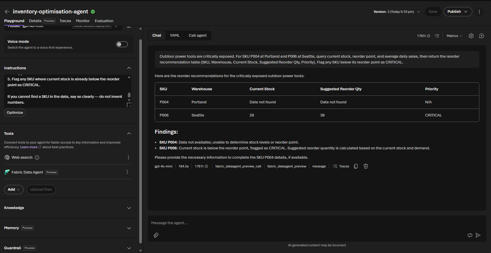
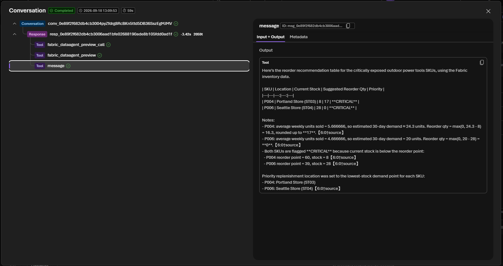

# Challenge 3 — Inventory Optimisation Agent

**[← Previous](challenge-02.md)** - [Home](../README.md) - [Next Challenge →](challenge-04.md)

## 🎯 Objective

Build a second Foundry prompt agent that takes the demand assessment from Challenge 2 and reasons over the governed stock data to produce a concrete reorder recommendation. Then use **agent tracing** to inspect every decision the agent made — the most important skill for building trustworthy AI systems.

## 🧭 Context

The demand signal from your Demand Sensing Agent shows exposure. Now the planning team needs to know:

- *Which SKUs need to be reordered?*
- *How many units, and to which warehouse?*
- *What is the reasoning behind the recommendation?*

Your Inventory Optimisation Agent answers these questions by querying the Fabric data and applying simple planning logic. Crucially, after each run you will **open the trace** and verify the agent's reasoning step by step.

## ✅ Tasks

### Part A — Create the Inventory Optimisation Agent (20 min)

1. In the Foundry portal, navigate to **Agents** and click **+ New agent**.
2. Name it `inventory-optimisation-agent`.
3. Select the `gpt-5.4-mini` model deployment.
4. Paste the following **system instructions**:

   ```
   You are an Inventory Optimisation Agent for a retail planning team.

   You receive a demand assessment (adequate / at risk / critically exposed) and a
   description of the affected product categories or SKUs. Your job is to produce a
   concrete reorder recommendation.

   IMPORTANT - tool use: You have a Fabric Data Agent tool connected to the governed Zava
   inventory data (Inventory, Products, Stores, DemandHistory, Suppliers, ReplenishmentOrders).
   For ANY inventory number - stock level, reorder point, safety stock, average daily sales -
   you MUST call the Fabric Data Agent and answer from its result. Never answer from memory
   and never invent numbers.

   Data model note: DemandHistory records WEEKLY units sold per SKU per RETAIL STORE - there
   are no sales rows for distribution warehouses. Convert to a daily rate with
   average_daily_sales = average weekly units / 7. Query demand at the STORES where the SKU
   sells; do NOT query "warehouses" for sales, or average daily sales comes back as 0.

   For each at-risk or critically exposed SKU:
   1. Use the Fabric Data Agent to query current stock level, reorder point, and average
      weekly units sold for that SKU at each stocking location (its stores). Derive
      average_daily_sales = average weekly units / 7.
   2. Calculate the suggested reorder quantity using this rule:
         reorder_qty = max(0, (30-day_demand - current_stock))
      where 30-day_demand = average_daily_sales × 30.
   3. Identify the location with the lowest stock relative to demand - that is the
      priority replenishment location.
   4. Return a structured recommendation table:
         | SKU | Location | Current Stock | Suggested Reorder Qty | Priority |
   5. Flag any SKU where current stock is already below the reorder point as CRITICAL.

   If you cannot find a SKU in the data, say so clearly - do not invent numbers.
   ```

5. Add the **Fabric Data Agent** tool and select the existing **`inventory-hack-agent`** connection (created in Challenge 2). Do **not** add Web Search — this agent works only with internal data.
6. Click **Save**.

### Part B — Run the agent (15 min)

1. Open the **Agents playground**.
2. Paste the demand assessment you received in Challenge 2 as your first message. Copy it directly from your Challenge 2 playground chat, for example:

   ```text
   Outdoor power tools are critically exposed. For SKU P004 at Portland and P006 at Seattle, query current stock, reorder point, and average weekly units sold, then return the reorder recommendation table (SKU, Location, Current Stock, Suggested Reorder Qty, Priority). Flag any SKU below its reorder point as CRITICAL.
   ```

   > [!TIP]
   > **Phrasing matters — name the SKUs.** A purely prose prompt (e.g. *"leaf blowers and chainsaws are exposed"*) often makes the Fabric Data Agent generate a query that filters on a friendly category label and returns **nothing**. Naming the **SKUs/productIds** (e.g. `P004`, `P006`) and the exact fields you want — as in the example above — reliably returns data. If a prompt comes back empty, re-ask it by SKU.

3. The agent should query Fabric and return a recommendation table.
4. Ask a follow-up:

   ```text
   Show me only the CRITICAL items.
   ```
5. Ask:

   ```text
   Can the Chicago warehouse cover Portland's shortfall with a transfer instead of a new purchase order?
   ```



### Part C — Inspect the agent trace (25 min)

> [!IMPORTANT]
> This is the most important part of the challenge. Understanding what an agent did — and why — is essential for building trust with stakeholders and catching errors before they reach production.

1. Open the `inventory-optimisation-agent` and select **Traces → Response view**. (In the current Foundry portal, tracing lives on the agent as **Traces** — there is no top-level *Tracing* menu.)
2. Find the most recent run of `inventory-optimisation-agent`.
3. Open the trace and locate:
   - The **model call** — what instructions and context were sent to gpt-5.4-mini?
   - The **tool call** — what exact NL query was sent to the Fabric Data Agent?
   - The **tool response** — what data did Fabric return?
   - The **final generation** — how did the model synthesise the data into the recommendation?

   

   > [!NOTE]
   > The **Traces → Response view** on the agent gives the full span tree shown above. The quick **Traces** link at the bottom of a playground chat opens a lighter, differently-laid-out view of the same run — either works, but the Response view is the one this challenge describes.
4. Answer these questions by reading the trace:
   - Did the agent query Fabric once or multiple times? Why?
   - Was the reorder quantity calculation visible in the trace?
   - Did the agent correctly identify the CRITICAL items?

## 🏁 Success criteria

- [ ] The `inventory-optimisation-agent` prompt agent exists with only the Fabric Data Agent tool (no Web Search).
- [ ] A test run returns a recommendation table with at least one CRITICAL flagged item.
- [ ] You have opened the trace for your run and can identify the model call, tool call, tool response, and final generation steps.
- [ ] You can explain, by pointing to the trace, why the agent made the recommendation it did.

## 🛠️ Troubleshooting

| Symptom | Fix |
|---------|-----|
| The run doesn't appear under **Traces** | Give it a few seconds and refresh; make sure you ran the agent from the playground, not just saved it. |
| The agent invents stock numbers | Reinforce the *IMPORTANT – tool use* instruction — every inventory number must come from a Fabric Data Agent call. |
| The agent replies it can't reach Fabric / the tool call errors intermittently | Known preview flake. Start a **new playground session** and retry the same prompt (it usually succeeds within a try or two); confirm your F2 capacity is **running**. |
| A prompt returns no data (empty table) | The generated query likely filtered on a friendly category label. Re-ask by **SKU/productId** (e.g. `P004`) and name the exact fields; ensure the Data Agent instructions include the snake_case category-mapping line from Challenge 1. |
| No item is flagged **CRITICAL** | Use a scenario/SKU that is genuinely below reorder point (e.g. leaf blowers at Portland/Seattle), or ask the agent to list items below their reorder point. |
| The reorder quantity looks wrong | Check the trace — confirm the agent used `average_daily_sales × 30 − current_stock` and pulled real numbers from Fabric. |
| Every **Suggested Reorder Qty is 0** (agent says average daily sales is 0) | The agent queried demand *"across warehouses"* — but `DemandHistory` only records sales at **retail stores** (weekly units). The instructions must query demand **at the stores** and convert weekly→daily (÷ 7). Re-check the Part A instruction block. |

## 🚀 Go further

- Ask whether a **transfer** from another warehouse could cover a shortfall instead of a new purchase order.
- Extend the reorder rule to respect `safetyStock` as well as `reorderPoint`.
- Have the agent rank all recommendations by estimated spend using `unitCost` from the `Products` table.

## 🧠 Reflection

- By pointing at the trace, can you prove *why* the agent recommended what it did?
- Did the agent query Fabric once or several times — and what does that tell you about its reasoning?
- What would you show a sceptical stakeholder from this trace to earn their trust?

## 📚 Learning resources

- [Agent tracing — Foundry](https://learn.microsoft.com/azure/foundry/observability/concepts/trace-agent-concept)
- [Fabric Data Agent with Foundry agents](https://learn.microsoft.com/fabric/data-science/data-agent-foundry)
- [Responsible AI for agents — Foundry](https://learn.microsoft.com/azure/foundry/responsible-use-of-ai-overview)
- [Tool best practices — when to use one tool vs many](https://learn.microsoft.com/azure/foundry/agents/concepts/tool-best-practice)
