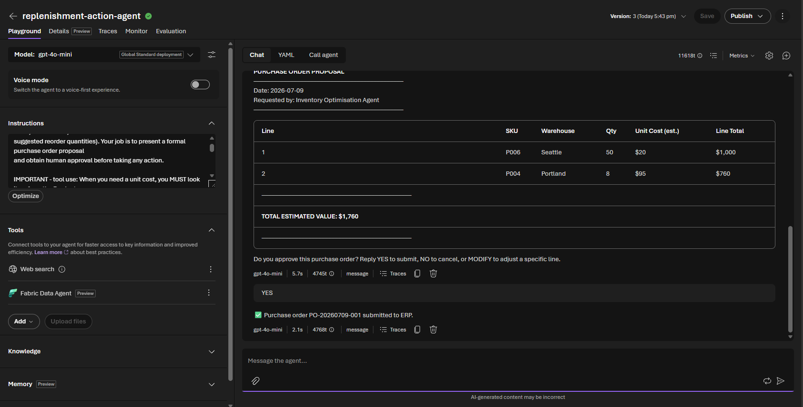
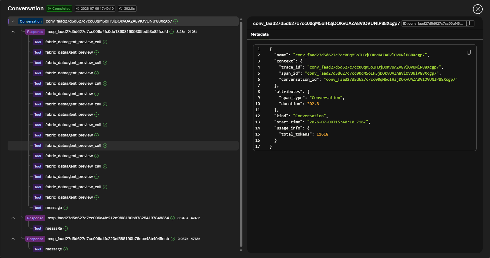

# Challenge 4 — Replenishment Action Agent + Human-in-the-Loop

**[← Previous](challenge-03.md)** - [Home](../README.md) - [Next Challenge →](challenge-05.md)

## 🎯 Objective

Build the third and final agent: one that proposes a purchase order, waits for a human to approve or reject it, and records the outcome. Then trace the **complete sense → plan → approve → act cycle** end-to-end — the pattern that turns an AI assistant into an AI agent that genuinely acts in the world.

## 🧭 Context

The optimisation recommendation is ready. Now someone has to actually place the order. But purchase orders above a threshold require a human sign-off before anything is submitted. Your Replenishment Action Agent handles this:

1. It presents a clear, structured purchase order proposal.
2. It pauses and asks: *"Do you approve this order? (yes / no / modify)"*
3. If approved, it records the outcome and returns a submission confirmation (simulated — see Part B).
4. If rejected, it records the reason and suggests an alternative.

This human-in-the-loop pattern is critical for **agentic AI in enterprise settings**: the agent proposes, the human decides, the agent acts.

## ✅ Tasks

### Part A — Create the Replenishment Action Agent (25 min)

1. In the Foundry portal, navigate to **Agents** and click **+ New agent**.
2. Name it `replenishment-action-agent`.
3. Select the `gpt-5.4-mini` model deployment.
4. Paste the following **system instructions**:

   ```
   You are a Replenishment Action Agent for a retail planning team.

   You receive an inventory optimisation recommendation (a table of SKUs, warehouses, and
   suggested reorder quantities). Your job is to present a formal purchase order proposal
   and obtain human approval before taking any action.

   IMPORTANT - tool use: When you need a unit cost, you MUST look it up from the Products
   table via the Fabric Data Agent - do not answer from memory. Use $20 per unit only as a
   fallback if the Fabric Data Agent has no cost for that SKU.

   Workflow:
   1. Format the recommendation as a purchase order proposal:
         PURCHASE ORDER PROPOSAL
         ─────────────────────────────────────────────
         Date: <today>
         Requested by: Inventory Optimisation Agent
         ─────────────────────────────────────────────
         | Line | SKU | Warehouse | Qty | Unit Cost (est.) | Line Total |
         ─────────────────────────────────────────────
         TOTAL ESTIMATED VALUE: $X,XXX
         ─────────────────────────────────────────────
      Look up each item's unit cost from the Products table via the Fabric Data Agent.
      Use $20 per unit as a fallback only if a cost is unavailable.

   2. Ask clearly: "Do you approve this purchase order? Reply YES to submit, NO to cancel,
      or MODIFY <line number> <new qty> to adjust a specific line."

   3. If the response is YES: generate a simulated submission confirmation - do NOT call any
      external system (there is no live ERP in this lab). Reply with:
      "✅ Purchase order PO-<YYYYMMDD>-001 submitted to ERP." Build the PO number yourself from
      today's date; never claim to have written to a real system.

   4. If the response is NO: record the reason (ask for one if not given) and reply:
      "❌ Order cancelled. Reason recorded: <reason>. No action has been taken."

   5. If the response is MODIFY: update the specified line, recalculate the total, re-present
      the updated proposal, and ask for approval again.

   Never submit an order without explicit YES approval. Only generate the simulated PO number
   (from today's date) after a YES; never fabricate a real ERP order ID.
   ```

5. Click **Save** — you'll attach the Fabric Data Agent tool next.

### Part B — Add the Fabric Data Agent tool (10 min)

The "act" step — submitting the purchase order — is **simulated by the agent itself**. In the current **New Foundry** portal, prompt agents don't expose a no-code custom-function tool: the tool catalogue's **Custom** tab offers only **OpenAPI**, **MCP**, and **Agent2Agent (A2A)** connectors, which all require a hosted endpoint. Because the Fabric Data Agent is **read-only**, the agent closes the loop by *generating* a submission confirmation on approval — which delivers the exact human-in-the-loop teaching point with zero infrastructure.

You only need one tool here:

1. In the agent editor, expand **Tools** and select **Add**.
2. On the **Configured** tab, choose **Fabric Data Agent** and connect the existing **`inventory-hack-agent`** connection — the agent needs it to look up unit costs from the `Products` table when building the PO.
3. Select **Add tool**, then **Save**.

> [!NOTE]
> **Want a *real* submit action?** In production you'd add an **OpenAPI tool** (New Foundry) or a custom function that writes to the `ReplenishmentOrders` table / your ERP. That needs a hosted endpoint, so it's out of scope for this no-code lab — see **Part E — Stretch** at the end of this challenge.

### Part C — Run the complete planning loop (30 min)

> [!IMPORTANT]
> This is the payoff: running the full sense → plan → approve → act cycle in one session.

1. Open a **new chat** in the Agents playground with `replenishment-action-agent`.
2. Paste the recommendation table from Challenge 3 as your first message.
3. The agent should present a formatted purchase order proposal.
4. **Test the approval flow:**
   - First, reply `MODIFY 1 50` — adjust the first line quantity. Verify the agent updates and re-presents the order.
   - Then reply `YES` — verify the agent responds with the simulated submission confirmation (`✅ Purchase order PO-... submitted to ERP.`).

   
5. Open **Tracing** and find this run. Trace the complete sequence:
   - Model call (format PO from the recommendation) → **Fabric tool call** (unit-cost lookup from `Products`) → model call (present proposal) → model call (apply MODIFY, re-present) → model call (confirm submission after YES).
6. **Discuss with your team:** At which step did the human add value that an automated pipeline could not?



### Part D — Reflect on the full loop (optional, 10 min)

If time allows, open a single trace view and describe the complete three-agent journey:

```
Challenge 2: [web signal] + [Fabric stock query]   → demand assessment
Challenge 3: [Fabric stock query] + [calculation]  → reorder recommendation
Challenge 4: [proposal formatting] + [human YES]   → PO-xxxx submitted
```

- What would break if the Fabric Data Agent returned stale or incorrect data?
- Where would you add monitoring in a production deployment of this pattern?

### Part E — Stretch: wire a real action tool (optional)

The lab simulates submission so it stays 100% no-code. To make the "act" step *real*, you have two production-grade options — both require a small hosted endpoint, so treat this as homework:

- **OpenAPI tool (New Foundry).** Deploy a tiny API with a `POST /purchase-orders` operation, then in the agent editor go to **Add → Custom → OpenAPI tool** and paste its OpenAPI 3.0 schema. The agent calls your endpoint on approval.
- **Adaptive Card approval (channel surface).** The Foundry *playground* renders Markdown only — it does **not** render Adaptive Cards. To show a true Adaptive Card with an approval button, surface the agent through a channel that supports cards (Teams, or a custom Web Chat using the Foundry SDK + the Adaptive Cards JS renderer) and return a card payload instead of the Markdown proposal. This is a front-end exercise, not a portal one.

Either path turns the simulated confirmation into a genuine side effect while keeping the same sense → plan → approve → act gate.

## 🏁 Success criteria

- [ ] The `replenishment-action-agent` prompt agent exists on `gpt-5.4-mini` with the Fabric Data Agent tool attached.
- [ ] A test run successfully presents a formatted purchase order proposal (per-line cost table with a total).
- [ ] The MODIFY flow works correctly — the agent updates the specified line, recalculates the total, and re-presents.
- [ ] A YES reply produces the simulated submission confirmation (`✅ Purchase order PO-... submitted`).
- [ ] You have opened the trace and can identify the human approval step and the Fabric unit-cost lookup.
- [ ] You can explain the sense → plan → approve → act pattern and where the human decision point sits.

## 🛠️ Troubleshooting

| Symptom | Fix |
|---------|-----|
| The agent submits without waiting for approval | Reinforce the *Never submit an order without explicit YES approval* rule; the confirmation must only appear after a `YES`. |
| The agent claims it wrote to a real ERP | The submit is **simulated** — the instructions must build the `PO-<date>-001` number itself and never fabricate a real order ID. |
| **MODIFY** doesn't recalculate the total | Confirm the instruction to update the line, recompute the total, and re-present before asking for approval again. |
| Unit costs all show the $20 fallback | The `Products` table lookup via the Fabric Data Agent may have failed — check the trace; the fallback is only for genuinely missing costs. |

## 🚀 Go further

- Make the *act* step real: follow **Part E** to wire an **OpenAPI tool** that writes to `ReplenishmentOrders`, or surface the proposal as an **Adaptive Card** approval.
- Add a spend cap: have the agent refuse to auto-format any PO above a threshold and escalate instead.
- Capture the approver's name and reason and echo them back in the confirmation for an audit trail.

## 🧠 Reflection

- At which step did the human add value that a fully automated pipeline could not?
- What would break if the Fabric Data Agent returned stale or incorrect unit costs?
- Where would you add monitoring and guardrails before letting this run against a real ERP?

## 📚 Learning resources

- [Agent tools overview (tool catalog) — Foundry](https://learn.microsoft.com/azure/foundry/agents/concepts/tool-catalog)
- [Human-in-the-loop tool approvals for AI agents](https://learn.microsoft.com/agent-framework/agents/tools/tool-approval)
- [Agent tracing — Foundry](https://learn.microsoft.com/azure/foundry/observability/concepts/trace-agent-concept)
- [Agent development lifecycle](https://learn.microsoft.com/azure/foundry/agents/concepts/development-lifecycle)
