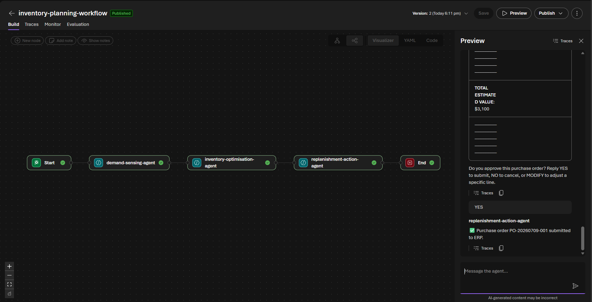
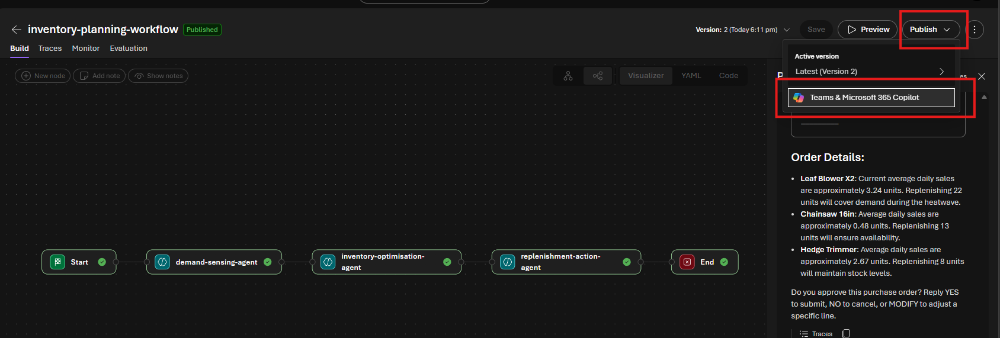

# Challenge 5 — Orchestrate the Loop (Stretch)

**[← Previous](challenge-04.md)** - [Home](../README.md)

> [!NOTE]
> This is an **optional stretch challenge** for teams that finish early. It builds directly on the three agents you created in Challenges 2–4. Skip it without penalty — Challenges 1–4 are the core of the hack.

## 🎯 Objective

Wire your three agents together in a Foundry **Workflow** so the entire sense → plan → approve → act loop runs from one prompt. You'll use the visual workflow designer to chain the agents in sequence with a human-approval gate, then read the trace to see each node execute. This is Microsoft's sanctioned replacement for the older "connected agents" tool and the pattern behind real multi-agent systems.

## 🧭 Context

The planning team doesn't want to talk to three separate agents. They want to type one sentence — *"A heatwave is hitting the Pacific Northwest, check our outdoor power tool exposure and prepare a replenishment order for approval"* — and have the system run the whole loop, pausing only for the human approval gate.

## ✅ Tasks

### Part A — Create the workflow (15 min)

> [!NOTE]
> The classic **connected agents** tool (adding one agent as another's tool) is **not available** in the New Foundry portal — Microsoft replaced it with **Workflows** for multi-agent orchestration. The visual workflow designer is in preview and is supported in-portal until **1 December 2026**, after which you run the same logic by exporting the workflow **YAML** and deploying it as a hosted agent (see Learning resources). For this hack's timeframe the visual designer is the fastest no-code path.

1. In the Foundry portal, go to **Agents → Workflows → + New workflow** (or **Create**).
2. Choose the **Sequential** template (it pre-wires a Start node you can extend). If you start from **Blank**, you'll add the Start node yourself.
3. Name it `inventory-planning-workflow` and open the **Build** canvas (Visualizer view).

### Part B — Add and wire the three agent nodes (20 min)

You'll chain the three specialist agents you built in Challenges 2–4. **You do not need a separate orchestrator agent — the workflow *is* the orchestrator.**

1. On the canvas, click **+ New node** (or the **+** on the Start node) and add an **Agent** node. In **Select an agent**, pick **`demand-sensing-agent`**.
2. Add a second Agent node for **`inventory-optimisation-agent`**, connected after the first.
3. Add a third Agent node for **`replenishment-action-agent`**, connected after the second.
4. For each node, open **Node settings** and wire the data flow so each agent receives the previous agent's output:
   - Use **Save agent output message as** on each node to name its output (e.g. `demandAssessment`, `reorderTable`).
   - Set the next node's **Input message** to that upstream variable.
   - Leave **Conversation context** as `System.ConversationId` so the run shares one conversation.
5. On the **`replenishment-action-agent`** node, enable **Allow multi-turn conversation** — this lets the workflow pause at the purchase-order proposal and wait for the human's `YES` / `MODIFY` reply (the human-in-the-loop gate). In the **Loop condition** box, paste this PowerFx so the node keeps re-prompting until the agent submits or cancels the order:

   ```powerfx
   And(
     IsBlank(Find("submitted to ERP", Last(Local.LatestMessage).Text)),
     IsBlank(Find("Order cancelled", Last(Local.LatestMessage).Text))
   )
   ```

   The loop runs **while the condition is true**: `MODIFY` re-presents the proposal (neither phrase present → keep looping), while `YES` (`✅ … submitted to ERP.`) or `NO` (`❌ Order cancelled…`) makes it false and ends the node. `Find` is **case-sensitive**, so keep the Challenge 4 confirmation wording exactly.
6. Click **Save**.

   

> [!TIP]
> Foundry also ships a **Human in the loop** template and a **Group chat** template. The **Sequential** pattern used here matches this hack's deterministic sense → plan → approve → act chain; **Group chat** is for dynamic hand-off scenarios.

### Part C — Run the full loop from one prompt (20 min)

1. Click **Preview** (or **Run**) to open the workflow playground.
2. Send a single request, e.g.:

   > *"A prolonged heatwave is hitting the Pacific Northwest. Check our exposure on outdoor power tools and prepare a replenishment order for approval."*

3. Watch the nodes execute in order: demand sensing → optimisation → replenishment. When the replenishment node presents the PO proposal, reply `YES` (or `MODIFY <line> <qty>`).
4. Open **Traces** and find the run. Confirm you can see the **node-by-node execution** — each agent node's model call with its **Fabric Data Agent** tool call underneath, and the human approval turn on the replenishment node.

## 🏁 Success criteria

- [ ] `inventory-planning-workflow` exists with the three agents chained Start → demand → optimisation → replenishment.
- [ ] A single prompt drives the full sense → plan → approve → act loop, pausing only at the human approval gate on the replenishment node.
- [ ] The trace shows node-by-node execution (each agent node → its Fabric Data Agent tool call), plus the human approval turn.
- [ ] You can explain the trade-offs of a deterministic workflow vs. three agents a human drives manually — and when you'd choose the Group chat pattern instead.

## Part D — Alternative / bonus: an evaluation pass (optional)

If you want a second stretch (or the visual designer is unavailable), evaluate one agent's quality instead:

1. Open **Evaluation** in the portal (preview).
2. Create a small evaluation dataset of 3–5 questions with expected answers about the inventory data (e.g. *"Which store has the lowest leaf blower stock?"* → *"Portland"*).
3. Run an evaluation against `inventory-optimisation-agent` and review the **groundedness** and **relevance** scores.
4. Discuss: what would you add to the agent's instructions to improve the weakest score?

## Part E — What's next: publish to Teams & Microsoft 365 Copilot (showcase, optional)

> [!NOTE]
> This part is a **look-ahead showcase**, not a required lab step. You don't need to publish anything to finish the hack — it's here to show where a working workflow goes next and what a business rollout looks like.

Everything so far lives in the Foundry portal — great for builders, but the **planners who actually place orders live in Teams**. Publishing the workflow to **Microsoft 365 Copilot & Teams** would let a non-technical user run the whole sense → plan → approve → act loop by typing one sentence in a Teams chat, and approve the PO right there.

> [!NOTE]
> Publishing to Microsoft 365 Copilot and Teams is an **Early Access Preview**. Org-wide publishing needs a **Microsoft 365 admin** to approve the agent — so if you *do* try it, use the **Just you** scope, which is available immediately with no approval.

1. Open your published `inventory-planning-workflow` (or any of the agents), select **Publish → Publish to Teams and Microsoft 365 Copilot**. Foundry provisions an **Azure Bot Service** resource behind the scenes.

   
2. Fill in the metadata: **Name** (e.g. *Inventory Planning Assistant*), **Publish version** `1.0.0`, a one-line **Short description**, a longer **Description**, and your **Developer** name.
   > Don't put secrets/keys in any field — this metadata is user-visible.
3. Select **Next: Publish options → Direct publish**, choose **Just you** under *Choose who can use this agent*, then **Publish**. (Org-wide = *People in your organization* → M365 admin approval → appears under **Built by your org** in the agent store.)
4. In **Microsoft 365 Copilot** or **Teams**, open the **agent store → Your agents**, pick your agent, and chat like a business user:

   > *"A heatwave is hitting the Pacific Northwest — check our outdoor power tool exposure and prepare a replenishment order for approval."*

5. Watch the loop run inside the Teams chat and reply `YES` at the approval gate — no portal, no code.

**Discuss:** what governance would you add before letting hundreds of planners trigger real purchase orders from Teams? (Think: the approval gate, a spend cap, `BotServiceRbac` vs `BotServiceTenant` calling scope, and audit via the trace.)

## 🛠️ Troubleshooting

| Symptom | Fix |
|---------|-----|
| There's no **connected agents** tool | Correct — the New Foundry portal replaced it with **Workflows**. Use the visual workflow designer as described above. |
| The replenishment node never stops looping | The **Loop condition** `Find` is **case-sensitive** — keep the Challenge 4 confirmation wording (`submitted to ERP`, `Order cancelled`) exactly. |
| A node doesn't receive the previous agent's output | Set **Save agent output message as** on the upstream node and reference that variable in the next node's **Input message**. |
| The visual designer isn't available | Do the **Part D** evaluation bonus instead, or export the workflow **YAML** and run it as a hosted agent (see Learning resources). |

## 🚀 Go further

- Do the **Part D** evaluation pass to score `inventory-optimisation-agent` on groundedness and relevance.
- Follow the **Part E** showcase to publish the workflow to **Teams & Microsoft 365 Copilot** (use the *Just you* scope).
- Swap the **Sequential** template for **Group chat** and observe how dynamic hand-off changes the run.

## 🧠 Reflection

- When would you choose a deterministic workflow over three agents a human drives manually — and when would **Group chat** fit better?
- What governance would you add before hundreds of planners could trigger real purchase orders from Teams?
- Where does the human-approval gate belong once the loop runs end-to-end from a single prompt?

## 📚 Learning resources

- [Build a workflow in Microsoft Foundry (Preview)](https://learn.microsoft.com/azure/foundry/agents/concepts/workflow)
- [Publish agents to Microsoft 365 Copilot and Microsoft Teams](https://learn.microsoft.com/azure/foundry/agents/how-to/publish-copilot)
- [Microsoft Agent Framework workflows (code-first / YAML)](https://learn.microsoft.com/agent-framework/workflows/orchestrations/sequential)
- [Agent tracing — Foundry](https://learn.microsoft.com/azure/foundry/observability/concepts/trace-agent-concept)
- [Evaluate agents — Foundry](https://learn.microsoft.com/azure/foundry/observability/how-to/evaluate-agent)
- [Orchestration patterns for AI agents](https://learn.microsoft.com/azure/architecture/ai-ml/guide/ai-agent-design-patterns)
