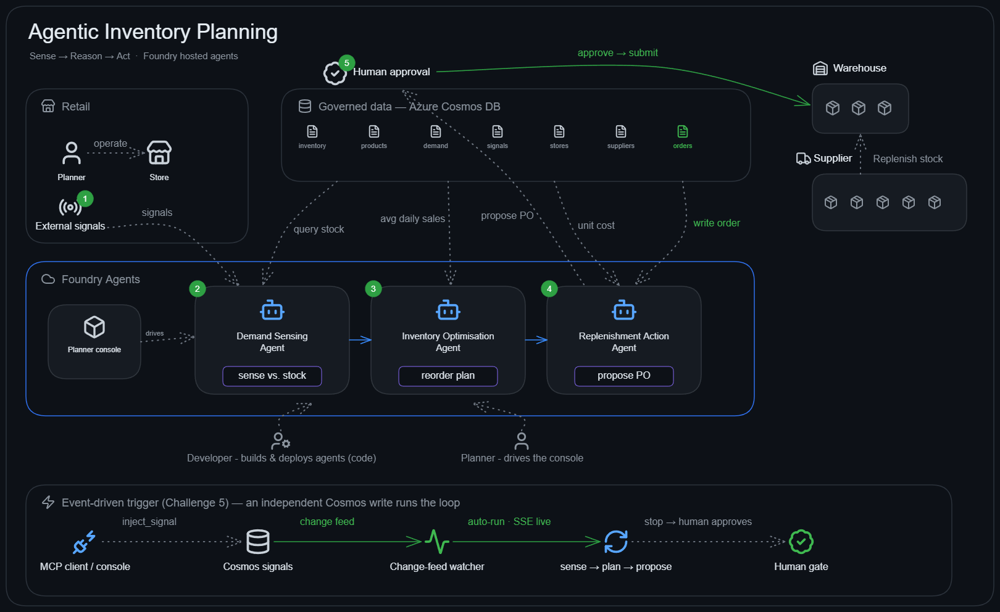

# Agentic Inventory Planning

Welcome to the **Agentic Inventory Planning** MicroHack. In this hands-on, code-first
workshop you'll build **hosted AI agents in code** that reason over governed enterprise
data and take human-approved actions — a closed planning loop for retail inventory, from
sensing demand to submitting a purchase order behind a human gate.

- [**Introduction**](#introduction)
- [**Learning objectives**](#learning-objectives)
- [**Scenario**](#scenario)
- [**Architecture**](#architecture)
- [**A note on the model**](#a-note-on-the-model)
- [**Requirements**](#requirements)
- [**Challenges**](#challenges)
- [**Repository layout**](#repository-layout)
- [**Contributors**](#contributors)

## Introduction

This MicroHack teaches you to build **hosted AI agents in code** that reason over
governed enterprise data and take human-approved actions. Using the **Microsoft
Foundry Agent Service** and Python, you build three agents that form a closed planning
loop for inventory management — sensing demand, optimising stock, and submitting
replenishment orders behind a human-in-the-loop gate — and wire them into a **minimal
planner-console UI** that tells one cohesive story.

The governed data lives in a **per-attendee Azure Cosmos DB** that the lab provisions
for you (keyless, serverless), queried by typed **function tools**, and every agent is a
**hosted agent** you define in Python and deploy to your Foundry project. You can run the
whole thing from a **GitHub Codespace** with zero local setup.

## Learning objectives

By completing this MicroHack you will be able to:

- Define and deploy **hosted agents** in the Foundry Agent Service from Python.
- Give agents **function tools** and understand how the model chooses to call them.
- Implement a **human-in-the-loop approval gate** in code before a side effect.
- Chain agents into a deterministic **sequential workflow**.
- Inspect agent behaviour with **tracing** in the Foundry portal.
- Work entirely from a **Codespace** and drive the loop through a minimal UI.

## Scenario

You are a developer at **Zava**, a retail company whose planning team always reacts to
last month's data. Your job is to close that gap — in code — with three hosted agents
that sense, decide, and act, surfaced through a small planner console.

❶ **The business.** Zava sells across four categories — `garden_and_lawn`,
`outdoor_power_tools`, `paint_and_supplies`, and `smart_home` — stocked across four
stores (Boston, Brooklyn, Portland, Seattle) and two warehouses (Chicago, Dallas). Every
SKU-at-location carries an `onHand`, a `reorderPoint`, and a `safetyStock`.

❷ **The signal.** Real-world events move demand — weather, search trends, competitor
stockouts, news. These live in the governed data alongside inventory, so an agent can
reconcile *what's happening in the world* against *what's on the shelf*.

❸ **The decision.** When stock falls below threshold — **AT_RISK** at or below the
reorder point, **CRITICAL** below safety stock — someone must decide which SKUs to
reorder, how many units, and to which location, then place the order. Purchase orders
need a human sign-off.

❹ **The agents.** Three hosted agents close the loop, each with typed function tools
over the governed data:

| # | Agent (Python) | Tools it calls | What it produces |
|---|----------------|----------------|------------------|
| 1 | **Demand Sensing** | `get_external_signals`, `list_low_stock`, `query_inventory` | A demand-exposure assessment |
| 2 | **Inventory Optimisation** | `list_low_stock`, `calc_reorder`, `get_product`, `query_inventory` | A structured reorder recommendation |
| 3 | **Replenishment Action** | `get_product`, `submit_purchase_order` *(gated)* | A **human-approved** purchase order |
| ⭐ *(stretch)* | **Workflow** | The three agents chained in code | The full loop from one entry point |

❺ **The console.** A minimal **Planner Console** (FastAPI + one static HTML page — no
build step) weaves the agents into one story a planner clicks through:
**Sense → Plan → Approve → Act**.

## Architecture



The pieces you'll work with:

❶ **This repository** holds the docs, starter code, and Zava seed data. Open it in a
Codespace (or a local devcontainer) and work from there.

❷ **GitHub Codespaces / devcontainer** gives everyone the same baseline — Python, `uv`,
and the Azure CLI pre-installed — so there's zero local setup.

❸ **Hosted agents in Microsoft Foundry.** You define each agent in Python and create it
with the Foundry agents API; it appears **natively** in the portal, with a **Traces**
tab.

❹ **Function tools over governed data.** Typed Python callables (`query_inventory`,
`calc_reorder`, `submit_purchase_order`, …) are exposed to the model as tools — this is
how agents read and write real data instead of answering from memory.

❺ **Azure Cosmos DB** is the per-attendee governed store (serverless, keyless), seeded
from `src/data` on first run. The one side-effecting tool does a **real Cosmos write**.

❻ **Application Insights** captures **server-side traces** of every model call and tool
invocation, so you can see exactly *what the agent did and why*.

❼ **The Planner Console** drives the whole loop from the browser and enforces the
human-approval gate before anything is written.

## A note on the model

**This choice is deliberate.** This hack lives or dies on the agent **actually calling
its function tools** and returning **structured JSON**. The lab provisions
**`gpt-5.4-mini`** — a low-cost GPT-5 model whose **Foundry model card** confirms both
**Functions/Tools** and **Structured Outputs** support. Among the low-cost GPT-5 models
it has the longest support horizon (retires **2027-03-18**), and it runs on
**GlobalStandard in EU** regions — targeting availability through **end of 2027**.

> [!IMPORTANT]
> If you change the model, only pick one whose **Foundry model card** lists
> **Functions/Tools** *and* **Structured Outputs** as supported. Avoid the older
> **o-series** reasoning models (o1 / o3 / o4) — in tool-driven agents they can
> refuse to call tools. Avoid already-**deprecated** models too: `gpt-4.1-mini`
> and `gpt-4o-mini` retire in October 2026. Swapping is one env var
> (`MODEL_DEPLOYMENT_NAME`; a good fallback is `gpt-5-mini`) — after changing it,
> re-run a step in the console to confirm the agent still calls its tools.

> [!TIP]
> GPT-5 models are *reasoning* models, so they think before answering. The lab sets
> **`REASONING_EFFORT=minimal`** in `.env` to keep the planner console snappy — raise
> it (`low` / `medium` / `high`) for harder reasoning, or set `default` to let the
> model decide. The runtime passes this only when supported and falls back safely.

## Requirements

To complete this MicroHack you'll need:

- A **GitHub account** (for Codespaces) **or** local **Python 3.11** + [uv](https://docs.astral.sh/uv/) + **Azure CLI**.
- Access to the **Foundry project** and **Cosmos DB** your lab automation provisioned —
  you'll get a `FoundryProjectEndpoint`, `ModelDeploymentName`, and `CosmosEndpoint` on
  your dashboard.
- Comfort **reading and editing Python** (the reference implementation is provided).
- That's it — no data setup (the app seeds Cosmos on first run), no other software.

> [!TIP]
> **You're ready to start when** you can open the repo in a Codespace, run `az login`,
> and paste your three dashboard values into `src/.env`.

## Challenges

This MicroHack is divided into six challenges, each building on the last. You'll start
by getting grounded and setting up, then build one hosted agent at a time, orchestrate
them into a complete loop, and finally make the loop **react to live events**.

### Challenge structure

Each challenge follows the same anatomy, so you always know where to look:

| Section | Description |
|---------|-------------|
| 🎯 **Objective** | What you'll achieve and why it matters |
| 🧭 **Context** | The scenario, concepts, and code to read first |
| ✅ **Tasks** | Step-by-step instructions to complete the challenge |
| 🏁 **Success criteria** | A checklist to confirm you're done |
| 🛠️ **Troubleshooting** | Common problems and their fixes |
| 🚀 **Go further** | Optional stretch goals if you finish early |
| 📚 **Learning resources** | Docs to go deeper |

### Challenge list

- **Challenge 1**: **[Get Grounded & Set Up](challenges/challenge-01.md)** *(45 min)* — the scenario, the data model, your Codespace, and the planner console.
- **Challenge 2**: **[Demand Sensing](challenges/challenge-02.md)** *(60 min)* — build and deploy your first hosted agent with function tools over the governed data.
- **Challenge 3**: **[Inventory Optimisation](challenges/challenge-03.md)** *(60 min)* — a reasoning agent that produces a reorder recommendation, then read its trace.
- **Challenge 4**: **[Replenishment + Human-in-the-Loop](challenges/challenge-04.md)** *(75 min)* — a real approval gate before the only side-effecting tool.
- **Challenge 5** *(stretch)*: **[Orchestrate the Loop](challenges/challenge-05.md)** *(45 min)* — chain all three agents into one sequential workflow with a one-click UI.
- **Challenge 6** *(stretch)*: **[The Loop Reacts](challenges/challenge-06.md)** *(60 min)* — event-driven: an independent Cosmos insert (from the console or an MCP client) auto-runs the loop live and stops at the human gate.

> [!TIP]
> It's tempting to race through, but pause and reflect: which planning decisions in
> *your* environment could benefit from agents that sense, reason, and act behind a
> human gate? Thinking about real-world applicability is where the learning sticks.

> Full reference solutions for every challenge are in [`walkthrough/`](walkthrough/).

## Repository layout

```
.devcontainer/        Codespaces / devcontainer (uv, azd, Azure CLI)
labautomation/        Platform entry point — provisions Foundry + Cosmos DB + App Insights
src/
  pyproject.toml      Dependencies (managed by uv — no requirements.txt)
  data/               Zava seed data — loaded into Cosmos on first run
  inventory_store.py  Cosmos-backed store — seeds the containers, serves the tools
  tools.py            Function tools the agents call (read/write Cosmos)
  agents/             The three hosted-agent definitions
  agent_runtime.py    Creates/runs hosted agents; enforces the approval gate
  orchestrator.py     Weaves the loop for the UI
  workflow.py         Stretch: the loop as one sequential workflow
  live.py             Stretch: change-feed watcher — the loop reacts to Cosmos inserts
  mcp_server.py       Stretch: MCP server exposing inject_signal (external trigger)
  ui/                 Minimal planner console (FastAPI + static HTML) — the only UI
challenges/           Challenge instructions
walkthrough/          Reference solutions (one per challenge)
images/               Screenshots referenced by the challenges
```

## Contributors

| Name | Role |
|------|------|
| Digvijay Chauhan | Author & maintainer |

## Contributing

This project welcomes contributions and suggestions. Most contributions require you to agree to a
Contributor License Agreement (CLA). For details, visit [https://cla.opensource.microsoft.com](https://cla.opensource.microsoft.com).

This project has adopted the [Microsoft Open Source Code of Conduct](https://opensource.microsoft.com/codeofconduct/).

## Trademarks

This project may contain trademarks or logos for projects, products, or services. Authorized use of Microsoft
trademarks or logos is subject to and must follow
[Microsoft's Trademark & Brand Guidelines](https://www.microsoft.com/en-us/legal/intellectualproperty/trademarks/usage/general).
