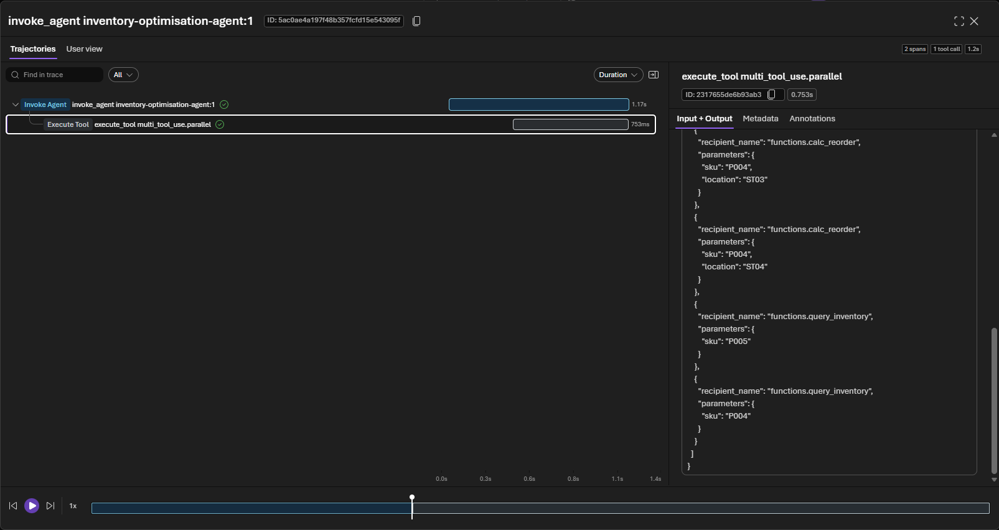

# Challenge 2 — Inventory Optimisation (Hosted Agent) + Tracing

**[← Previous](challenge-01.md)** - [Home](../README.md) - [Next Challenge →](challenge-03.md)

## 🎯 Objective

Build the second hosted agent: it takes the demand assessment and produces a
concrete **reorder recommendation** using a planning rule and the governed data.
Then use **tracing** in the Foundry portal to inspect every tool call it made.

## 🧭 Context

The demand signal shows exposure. The planning team now needs to know *which SKUs*
to reorder, *how many units*, *to which location*, and *why*.

## ✅ Tasks

### Part A — Read the agent & the reorder rule (15 min)

Open [`src/agents/__init__.py`](../src/agents/__init__.py) → `INVENTORY_OPTIMISATION`
and [`src/tools.py`](../src/tools.py) → `calc_reorder`. The rule is:

```
reorder_qty = max(0, average_daily_sales * 30 - current_stock)
```

The agent is instructed to return a **structured JSON** recommendation (so the UI
can render a table), marking any SKU below safety stock as **CRITICAL**.

### Part B — Run the optimisation step (15 min)

In the console, after Step 1, click **Generate reorder plan**. That first click
**creates the `inventory-optimisation-agent` hosted agent**, then runs it: Step 2
renders the recommendation table and unlocks Step 3.

Confirm at least one item is flagged **CRITICAL** (leaf blowers / chainsaws at
Portland and Seattle are strong candidates). Behind the scenes the agent returns a
JSON `recommendations` array — the console renders it as a table.


### Part C — Inspect the trace (25 min)

> [!IMPORTANT]
> Understanding *what an agent did and why* is the core skill for trustworthy AI.

1. In the Foundry portal, open your agent → the **Traces** tab (your lab already
   connected Application Insights, so tracing is on — no setup needed).
2. Find the most recent `inventory-optimisation-agent` run.
3. Locate and read:
   - the **model call** — the instructions + input the model received,
   - each **tool call** — e.g. `calc_reorder` with its arguments,
   - the **tool response** — the numbers your code returned,
   - the **final generation** — how the model assembled the JSON.
4. Answer from the trace:
   - Did the agent call `calc_reorder` once or per SKU? Why?
   - Are the reorder quantities traceable to real `avgDailySales × 30 − stock` numbers?
   - Did it correctly flag the CRITICAL items?



## 🏁 Success criteria

- [ ] `inventory-optimisation-agent` exists in your project with only the read tools.
- [ ] The plan step returns a recommendation with at least one **CRITICAL** item.
- [ ] The console's **Step 2** renders the table and unlocks Step 3.
- [ ] You can point to the trace and prove *why* a quantity was recommended.

## 🛠️ Troubleshooting

| Symptom | Fix |
|---------|-----|
| No run under **Traces** | Traces can take a minute or two to reach Application Insights — wait, then refresh; make sure the agent actually ran. |
| Tools show "Not supported by the selected model" | Cosmetic portal flag for `gpt-5.4-mini`; the tools run via the Responses API (the real reorder numbers prove it). |
| Output isn't valid JSON | The orchestrator tolerates code-fences, but reinforce *"Return ONLY the JSON"* in instructions. |
| No CRITICAL item | Use a scenario touching outdoor power tools (Portland/Seattle are below safety stock). |
| Quantities look wrong | Check the trace — confirm `calc_reorder` was called and returned real numbers. |

## 🚀 Go further

- Extend `calc_reorder` to respect `safetyStock` as well as `reorderPoint`.
- Have the agent rank recommendations by estimated spend using `unitCost`.
- Add a `transfer` suggestion when another location has surplus.

## 📚 Learning resources

- [Trace agents in Foundry](https://learn.microsoft.com/azure/ai-foundry/observability/concepts/trace-agent-concept)
- [Responsible AI for agents](https://learn.microsoft.com/azure/ai-foundry/responsible-use-of-ai-overview)
