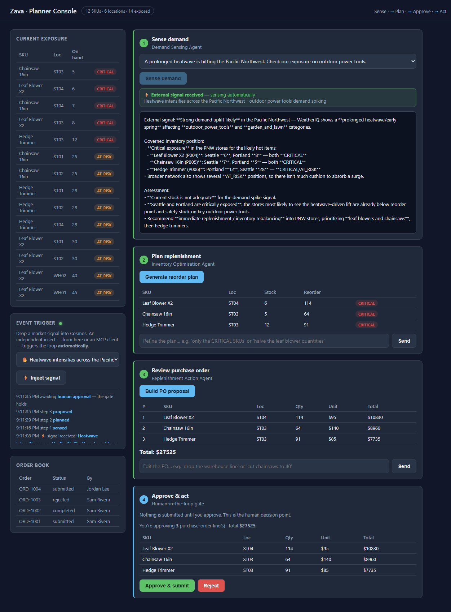

# Challenge 5 — The Loop Reacts (Event-Driven, Stretch)

**[← Previous](challenge-04.md)** - [Home](../README.md)

> [!NOTE]
> Optional capstone for teams that finish early. It builds on the three agents from
> Challenges 1–3. Skip without penalty — Challenges 0–3 are the core.

## 🎯 Objective

Turn the planner loop from *click-driven* into *event-driven*. A background watcher
tails the Cosmos **change feed**; any **independent insert** into the `signals`
container — from the console, an **MCP** client, or any other system — makes the loop
**run itself** (Sense → Plan → Propose) and stream progress live, then **stop at the
human-approval gate**. No new Azure infrastructure: the change feed is intrinsic to
Cosmos, and the watcher runs inside the console you already have.

## 🧭 Context

Planners don't watch a dashboard all day. In real operations a *signal* arrives — a
weather alert, a competitor stockout, a supplier delay lands in a system — and the
planning process should react on its own, surfacing a decision for a human to approve.

That's the shift here: the **write is the trigger**. Whoever drops a signal into the
governed store kicks off the loop, and the agents you built react to it automatically —
while the human still owns the final **Approve**.

## ✅ Tasks

### Part A — Read the reactive layer (15 min)

Open [`src/live.py`](../src/live.py) and follow three pieces:

- **`start_watcher`** — tails the `signals` **change feed** (pull model: poll with a
  continuation token, primed from *now* so the one-time seed never triggers a run).
- **`_auto_run`** — on each new signal, runs `sense → plan → propose` via the same
  orchestrator the console uses, publishing an event at each step — then **stops** and
  emits `awaiting_approval`. It never submits.
- **`EventBus`** — fans those events out to the browser over **SSE** (`/api/events`).

Then skim [`src/ui/app.py`](../src/ui/app.py): the `startup` hook launches the watcher,
`POST /api/signal` only **writes** the signal (it never calls an agent — the change
feed does the triggering), and `GET /api/events` is the SSE stream the console watches.

### Part B — Watch it react from the console (15 min)

1. Launch the console and open port 8000. The **Event trigger** panel shows a green
   dot once the watcher is **listening**.
2. Pick a signal and click **⚡ Inject signal**. Watch **Steps 1–3 run themselves** —
   the activity log narrates each step — and the loop **stop at Step 4**. Notice that
   **Sense demand disables** and shows an *"⚡ External signal received"* banner: the
   run was driven by the signal, not a human click. If several signals arrive at once,
   Step 1 shows a **queue** that drains one run at a time.
3. **Step 4 shows exactly what you're approving** — the per-line purchase order and the
   total — so the human decision is fully informed. Click **Approve & submit** and a
   real `PO-…` is written to Cosmos, exactly as in Challenge 3. The automation ran
   everything *except* the human decision.



### Part B2 — Steer the loop in natural language (10 min)

The reactive loop produces a *draft* — the planner stays in control and can refine it
in plain English before approving, each edit re-running the relevant agent:

- Under **Step 2**, type into *"Refine the plan…"* — e.g. *"only the CRITICAL SKUs"* or
  *"halve the leaf blower quantities"* — and the **Inventory Optimisation agent**
  regenerates the recommendation (`POST /api/plan/refine`).
- Under **Step 3**, type into *"Edit the PO…"* — e.g. *"drop the warehouse line"* or
  *"cut chainsaws to 40"* — and the **Replenishment agent** rewrites the proposal
  (`POST /api/propose/refine`). The approval summary at Step 4 updates to match.

The gate is untouched: refining is still only *proposing* — nothing is written until a
human clicks **Approve**.

### Part C — Trigger it from outside via MCP (20 min)

The write can come from anywhere — including an **MCP** client (GitHub Copilot, Claude,
another agent). [`src/mcp_server.py`](../src/mcp_server.py) exposes one tool,
`inject_signal`, that writes to the same `signals` container.

1. From `src/`, run the MCP server. It uses **stdio transport** — it talks over standard
   input/output, **not a network port**, so there's nothing to `curl`; an MCP client
   launches and speaks to the process directly.
   ```bash
   uv run python mcp_server.py
   ```
2. Point an MCP client at that command (or use an MCP client session to call the tool).
   Invoke **`inject_signal`** with a headline, e.g. *"Competitor out of stock on
   chainsaws in the West"*.
3. Switch to the console — it **reacts on its own** to the MCP-driven insert, runs the
   loop, and waits at the gate. An external system just drove your inventory loop.

### Part D — (Go further) any producer, same reaction

The trigger is **decoupled** from the loop: the watcher reacts to the *data*, not to
who wrote it. Prove it by writing a signal from a third path — the Cosmos portal Data
Explorer, a `az cosmosdb`/SDK script, or a scheduled job — and watch the console react.

## 🏁 Success criteria

- [ ] The **Event trigger** panel shows the watcher **listening** (green dot).
- [ ] Injecting a signal (console **or** MCP) auto-runs Sense → Plan → Propose with
      **no manual clicks**, streamed live, and **disables Sense** with an external-signal banner.
- [ ] You can **refine the plan and the PO in natural language**, and each edit re-runs the agent.
- [ ] **Step 4 shows exactly what's being approved** (per-line PO + total).
- [ ] The loop **stops at the gate** — nothing is submitted without a human.
- [ ] **Approve** writes a real `PO-…` to the order book.
- [ ] You can explain how the change feed **decouples** the trigger from the loop.

## 🛠️ Troubleshooting

| Symptom | Fix |
|---------|-----|
| Watcher dot never turns green | Check `COSMOS_ENDPOINT` in `.env` + `az login`; the watcher starts only when Cosmos is configured. |
| Nothing happens after injecting | The watcher primes from *now* — inject **after** the app has started. Check the server log for `watcher: …` errors. |
| Steps error out mid-run | The auto-run uses the same agents as Challenges 1–3 — make sure they work manually first, and that `az login` is valid. |
| SSE doesn't update the UI | Some corporate proxies buffer `text/event-stream`; open the forwarded port directly, or check the browser console for the `/api/events` connection. |
| Watcher dot goes gray mid-session | The SSE link dropped; it **reconnects automatically** and the dot re-greens on the next event. If it stays gray, reload the page. |
| MCP client can't call the tool | Run `uv run python mcp_server.py` from `src/`, and make sure `.env` + `az login` are in that shell (the tool writes to Cosmos). |

## 🚀 Go further

- Add a **debounce** so a burst of signals collapses into one run.
- Emit a **completion event** and have the UI toast when a proposal is ready.
- Swap the in-process watcher for a **Cosmos-trigger Azure Function** (fully serverless)
  — same pattern, detached from the console. Note the added Function App infra.
- Give the MCP server a second tool, `list_exposure`, so an external agent can *ask*
  before it *injects*.

## 📚 Learning resources

- [Change feed in Azure Cosmos DB](https://learn.microsoft.com/azure/cosmos-db/change-feed)
- [Change feed pull model](https://learn.microsoft.com/azure/cosmos-db/nosql/change-feed-pull-model)
- [Model Context Protocol](https://modelcontextprotocol.io/)
- [Server-Sent Events (MDN)](https://developer.mozilla.org/docs/Web/API/Server-sent_events)
