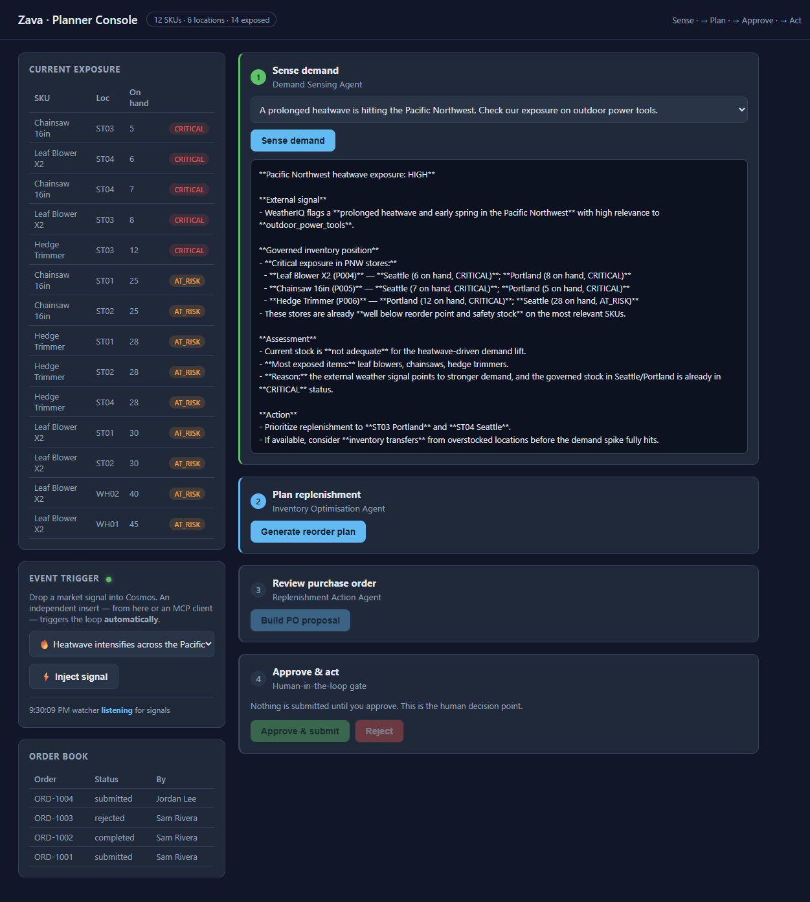

# Solution 01 — Demand Sensing (Hosted Agent)

**[← Back to Challenge 2](../../challenges/challenge-02.md)** · [Home](../../README.md)

## The reference implementation

The agent is already defined in [`src/agents/__init__.py`](../../src/agents/__init__.py)
as `DEMAND_SENSING`. The key ideas:

- **Tools:** `query_inventory`, `list_low_stock`, `get_external_signals` — all from
  [`src/tools.py`](../../src/tools.py).
- **Instructions:** a strict *TOOL USE* rule forcing the model to call a tool for any
  inventory number and to separate external signals from governed data.

`AgentRuntime.ensure()` in [`src/agent_runtime.py`](../../src/agent_runtime.py) is what
makes it a **native hosted** agent: it calls `create_version(...)` on the new Foundry
agents API (`azure-ai-projects` 2.x) and points the agent's endpoint at that version.
The agent then appears in the portal under **Agents** with a **Traces** tab.

## Run it

Start the console from `src/`:

```bash
uv run uvicorn ui.app:app --reload --port 8000
```

Open port 8000, pick a scenario, and click **Sense demand**. The first click creates
the `demand-sensing-agent` hosted agent in your project and runs it.

## Expected output (shape)

A short assessment that:
- names one or more **external signals** (heatwave, search-trend spike, competitor
  out of stock on chainsaws — from `get_external_signals`),
- cites **governed** stock (e.g. leaf blowers CRITICAL at Portland/Seattle — from
  `list_low_stock` / `query_inventory`),
- ends with a verdict: **critically exposed** for outdoor power tools.



## Verify it is really hosted

Open the Foundry portal → your project → **Agents**. `demand-sensing-agent` is listed
as a **native** agent (Playground / Traces / Monitor tabs, no "update your agents"
prompt). Re-running just adds a new **version** — it doesn't create a duplicate agent.

## How the tool call flows

1. `run()` calls the **Responses** API with the scenario as input.
2. The model replies with one or more `function_call` items in `response.output`.
3. The runtime runs each Python function locally and feeds the results back as
   `function_call_output` items (chained via `previous_response_id`).
4. The model produces the final assessment (`response.output_text`).

## Common issues

| Symptom | Fix |
|---------|-----|
| Agent answers without a tool | Strengthen the *TOOL USE* rule; confirm the model card lists Functions/Tools. |
| `DefaultAzureCredential` error | `az login` in the same terminal. |
| Slow first response | Reasoning latency — `REASONING_EFFORT=minimal` (default) keeps it snappy. |
