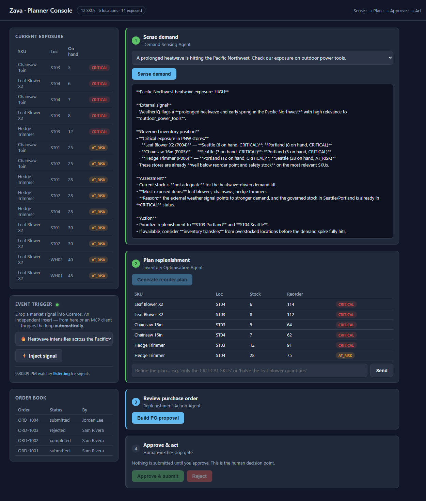

# Solution 02 — Inventory Optimisation + Tracing

**[← Back to Challenge 3](../../challenges/challenge-03.md)** · [Home](../../README.md)

## The reference implementation

`INVENTORY_OPTIMISATION` in [`src/agents/__init__.py`](../../src/agents/__init__.py):

- **Tools:** `list_low_stock`, `calc_reorder`, `get_product`, `query_inventory`.
- **Instructions:** compute `reorder_qty = max(0, avg_daily_sales*30 - current_stock)`
  via `calc_reorder`, flag items below safety stock as `CRITICAL`, and return **only**
  a JSON object: `{"recommendations": [{sku, productName, location, currentStock,
  suggestedReorderQty, priority}]}`.

The planning maths lives in `calc_reorder` in [`src/tools.py`](../../src/tools.py), so
the model does not invent numbers — it orchestrates the tool.

## Run it

In the console, after Step 1, click **Generate reorder plan**. The first click creates
the `inventory-optimisation-agent` hosted agent and runs it: Step 2 renders the
recommendation table with at least one `CRITICAL` row (leaf blowers / chainsaws at
Portland / Seattle).



## Structured output

`orchestrator.plan()` calls `_extract_json()` which tolerates a ```json code fence
and pulls the JSON object out — so the UI can render a table reliably. gpt-5.4-mini
supports **Structured Outputs**, so the JSON is well-formed.

## Reading the trace (the real learning)

Your lab already connected **Application Insights** to the project, so **server-side
tracing** is on automatically (no code changes). Foundry portal → your agent →
**Traces** tab → latest `inventory-optimisation-agent` run. You should see:

- one **model call** (the instructions + the demand assessment as input),
- one or more **`calc_reorder`** tool calls with their arguments,
- the **tool responses** (the exact numbers your code returned),
- the **final generation** assembling the JSON.

Point to a specific `calc_reorder` response to prove *why* a quantity was suggested —
`suggestedReorderQty = thirtyDayDemand - currentStock`, never invented.

## Common issues

| Symptom | Fix |
|---------|-----|
| No CRITICAL row | Use a scenario touching outdoor power tools; Portland/Seattle are below safety stock. |
| Output not JSON | Reinforce *"Return ONLY the JSON"*; `_extract_json` handles fences but not prose. |
| No trace | Refresh after a few seconds; ensure the run actually executed. |
