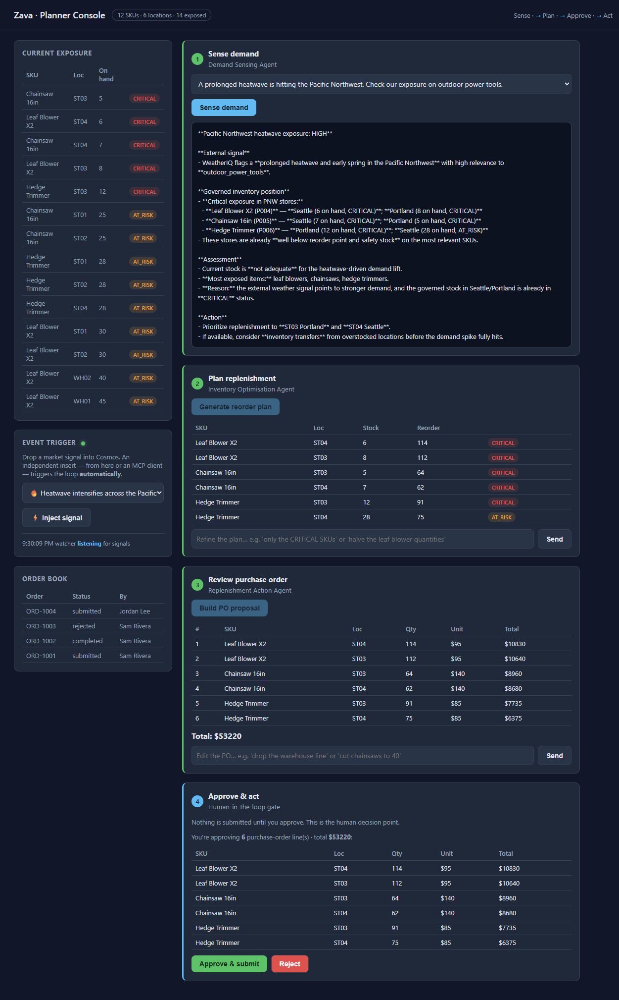

# Solution 03 — Replenishment + Human-in-the-Loop

**[← Back to Challenge 4](../../challenges/challenge-04.md)** · [Home](../../README.md)

## The reference implementation

`REPLENISHMENT` in [`src/agents/__init__.py`](../../src/agents/__init__.py):

- **Tools:** `get_product` (unit costs) and `submit_purchase_order` (the only side effect).
- **Instructions:** produce a PO proposal as JSON with `proposal` (per-line cost table
  + total) and `submitItems`; **never** submit without approval.

## The gate (the whole point)

In [`src/agent_runtime.py`](../../src/agent_runtime.py):

```python
APPROVAL_REQUIRED = {"submit_purchase_order"}
```

`run()` scans the model's `function_call` items. If the model asks for
`submit_purchase_order`, the runtime **returns a `ToolApprovalRequest` instead of
executing it** (the read-only tools still run normally). The write only happens when a
human calls `orchestrator.approve(...)`, which invokes `submit_purchase_order`
directly. So the acting tool is **structurally blocked** behind the human decision —
not just asked nicely in a prompt.

## In the console

Steps 1–2, then **Step 3** shows the proposal and **Step 4 (Approve & act)** offers **Approve & submit** / **Reject**.
- **Reject** → "Order cancelled. No action taken." Order book unchanged.
- **Approve** → `✅ Purchase order PO-… submitted and recorded in the order book.` and
  the new order appears in the **Order book** panel.

> The order is a **real write** to the Cosmos `orders` container, so it **persists**
> across server restarts — reload the console and it's still there.



## Common issues

| Symptom | Fix |
|---------|-----|
| Order written without approval | Ensure `submit_purchase_order` is in `APPROVAL_REQUIRED`. |
| Unit costs all `$20` | `get_product` lookup failed — check the trace; `$20` is the fallback only. |
| `submitItems` empty | Reinforce the JSON shape in the agent instructions. |
