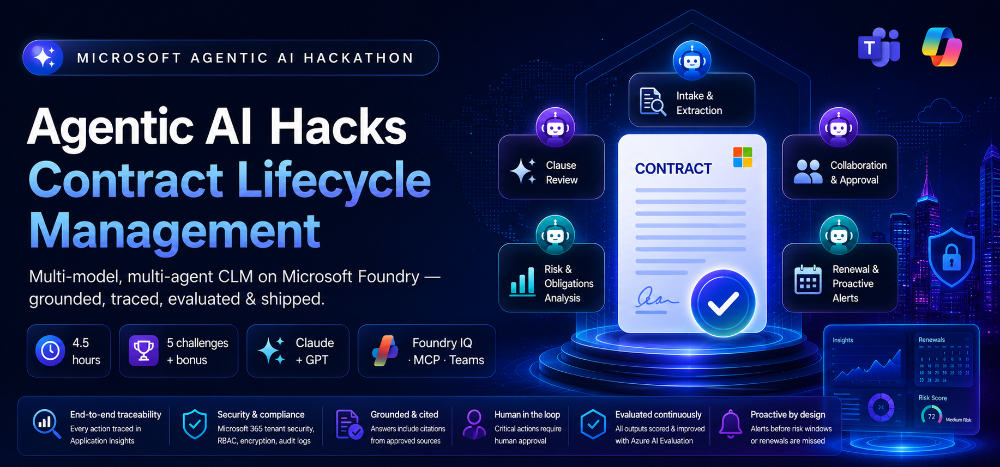
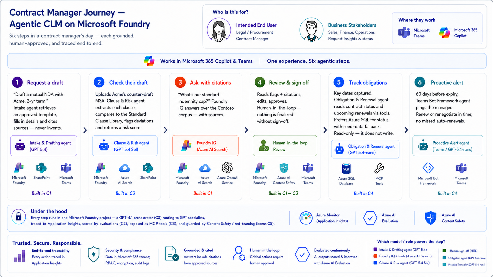
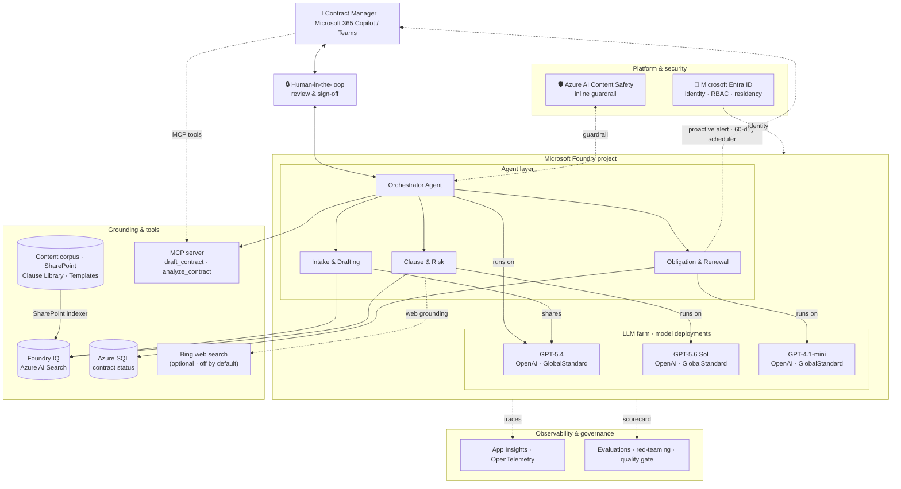

# Agentic AI Hacks · Contract Lifecycle Management

Build a **multi-model, multi-agent** contract assistant on **Microsoft Foundry** — grounded with
**Foundry IQ**, traced and evaluated, exposed as an **MCP server**, and published to **Microsoft 365
Copilot & Teams** with proactive renewal alerts.

> A 4.5-hour microhack · 5 challenges (+ optional bonus) · code-first (Python) · GitHub Codespaces.

## Introduction

Contract lifecycle management is where enterprises quietly lose time and money: slow intake,
inconsistent clause review, and missed renewals. In this microhack you'll transform CLM into an
**AI-native, enterprise-ready** system on **Microsoft Foundry** — turning a manual, weeks-long
process into a grounded, **agentic** workflow with a human always in the loop.

The build uniquely combines four things: a **multi-model GPT fleet** — orchestration and specialist
drafting share **GPT-5.4**, clause-analysis runs on **GPT-5.6 Sol**, and renewal tracking runs on
**GPT-4.1-mini**, all inside a single Foundry project; **grounded retrieval with Foundry IQ** over your own contract corpus so
every answer is cited; **tools and an MCP server** that expose the workflow to **Microsoft 365
Copilot**, **Teams**, and any MCP-compatible client; and the full **GenAIOps lifecycle** —
OpenTelemetry tracing to Application Insights, evaluation scorecards with a quality gate, and
*(bonus)* AI red-teaming plus Content Safety guardrails. From grounded single-agent drafting through
multi-agent orchestration to an observable, governed, published assistant, you'll master the full
stack of enterprise agentic AI — and ship something your legal and procurement teams would actually
use.

---

## The scenario — Contoso Global

<p align="center">
  
</p>

This microhack uses a fictitious multinational, **Contoso Global**, but the scenario applies to any
enterprise that manages contracts at scale. The points below illustrate the conceptual scenario.

❶ Contoso signs **hundreds of contracts a month** — NDAs, MSAs, procurement and partnership
agreements — each moving through the same lifecycle: intake → drafting → clause review → approval →
obligation tracking → renewal.

❷ The business runs on two numbers: **cycle time** and **renewal capture**. Today that's a **~17-day**
turnaround and **~11% of auto-renewals missed** — and every missed renewal is lost revenue or
unwanted lock-in.

❸ Reviewing a counterparty draft means **manually comparing every clause to the enterprise Standard
Clause Library** — slow, inconsistent between reviewers, and impossible to scale.

❹ Contracts and their obligations are **scattered across SharePoint, email, and legacy systems** —
there's no single source of truth for status, owners, and key dates.

❺ Legal and Procurement can't hand this to a black box: **human sign-off, citations, and a full audit
trail are non-negotiable.** Trust, traceability, and safety are requirements, not extras.

The process is complex and coordination-heavy. Common challenges include:

- Drafting consistently from **approved templates** instead of ad-hoc copy-paste.
- **Risk-scoring** counterparty clauses against the standard — quickly and repeatably.
- Answering *"what's our standard position on X?"* with **cited** sources, not tribal knowledge.
- Keeping a human **in the loop** on every finalization, with a reviewable trail.
- Never missing a **renewal or obligation** date across thousands of live contracts.

Agents help by coordinating these steps — drafting, reviewing, answering, tracking, and alerting —
while keeping a person in control. You'll build an **Agentic CLM** system: an **Orchestrator**
coordinating grounded specialist agents, all inside one Microsoft Foundry project with **human
sign-off and full tracing**.

### Meet the contract manager

> 👤 **Persona** — a **Legal / Procurement contract manager** at Contoso Global, drowning in intake,
> clause review, and renewals. They live in **Microsoft 365 Copilot & Teams** — not in a new tool.
> The whole system meets them there.

### The end-to-end journey

Here's a single day in that manager's life once the Agentic CLM assistant is live. Each step maps
directly to what you build in the challenges — follow the [user-journey
diagram](images/diagrams/user-journey.png) alongside this table.

| # | What the manager does | What happens under the hood | Foundry capability | Built in |
|---|-----------------------|-----------------------------|--------------------|----------|
| **1 · Request a draft** | *"Draft a mutual NDA with Acme, 2-yr term."* | **Intake & Drafting** agent (GPT-5.4, shared with the Orchestrator) drafts from an **approved template** | Grounded agent + tools | [C2](challenges/challenge-02.md) |
| **2 · Check their draft** | Uploads Acme's counter-draft MSA | **Clause & Risk** agent (GPT-5.6 Sol) scores every clause against the **Standard Clause Library** and flags deviations | Specialist agent + orchestration | [C4](challenges/challenge-04.md) |
| **3 · Ask, with citations** | *"What's our standard indemnity cap?"* | **Foundry IQ** answers over the Contoso corpus — **with sources** | Agentic retrieval (Foundry IQ) | [C2](challenges/challenge-02.md) |
| **4 · Review & sign off** | Reads flags + citations, edits, **approves** | **Human-in-the-loop** — nothing is finalized without sign-off | HITL + guardrails | [C2](challenges/challenge-02.md) · [C4](challenges/challenge-04.md) |
| **5 · Track obligations** | Reviews upcoming renewals | **Obligation & Renewal** agent (GPT-4.1-mini) **reads** contract status & upcoming renewals via function tools — **Azure SQL** (seed-data fallback) | Function tool / MCP server | [C4](challenges/challenge-04.md) · [C5](challenges/challenge-05.md) |
| **6 · Proactive alert** | Gets a proactive Teams ping **before the renewal date** | Renew or renegotiate in time — **no missed auto-renewals** | Publish + proactive messaging | [C5](challenges/challenge-05.md) |

> 🔒 **Under the hood, every step runs in one Microsoft Foundry project** — traced (Application
> Insights), scored by **evaluations** *([C3](challenges/challenge-03.md))*, and guarded by **Content Safety**
> *(bonus [C6](challenges/challenge-06.md))*. That observability + safety layer is what turns a demo into something
> legal and procurement teams would actually trust.

📊 Prefer a visual? The user-journey diagram above is saved in
[`images/diagrams/`](images/diagrams/) as [`user-journey.png`](images/diagrams/user-journey.png), alongside the
finalized [`architecture.png`](images/diagrams/architecture.png).

---

## Architecture

The diagram below shows the end-to-end architecture you'll build — a layered system with the contract
manager on top, the agent fleet and grounding in a single **Microsoft Foundry** project in the middle,
and observability underneath. The finalized diagram lives in
[`images/diagrams/`](images/diagrams/).


❶ **Consumption plane — where the manager already works.** At the top, the contract manager interacts
through **Microsoft 365 Copilot & Teams** (teal). There's no new app to learn: the assistant meets
users in the tools they use daily, and the two-way arrow to the Orchestrator carries requests down and
grounded answers back.

❷ **The Microsoft Foundry project (navy) — one governed home for every agent and model.** Everything
runs inside a *single* Foundry project: shared identity (Entra), model deployments, tool connections,
tracing, and safety. Crucially, three GPT model deployments support four agent roles here — no second
platform to operate.

❸ **Orchestrator (GPT-5.4) — the front door.** It receives each request, decides which specialist to
call, hands off the right context, and composes the final answer. GPT-5.4 is chosen for fast,
deterministic routing and tool/hand-off calls rather than long-form generation.

❹ **Specialist agents — each matched to its task *and* its model.** The Orchestrator delegates to three
grounded specialists: **Intake & Drafting** shares **GPT-5.4** with the Orchestrator for high-fidelity
drafting while **Clause & Risk** runs on **GPT-5.6 Sol** for structured clause comparison; **Obligation & Renewal** runs on the
cheaper **GPT-4.1-mini** (blue) for high-frequency date and obligation extraction.

❺ **Grounding & tools (blue) — how agents stay factual and act on the world.** **Foundry IQ** (over
**Azure AI Search**) provides agentic retrieval so drafting and clause agents answer *with citations*
from the contract corpus — the original PDFs live in a **SharePoint** document library that a SharePoint
Online indexer crawls into the index; **Azure SQL** is the system of record for contract status, read/written by
the renewal agent through a function tool; an optional **Bing web search** tool gives the Clause & Risk
agent public web grounding for counterparty due-diligence (off by default); and the **MCP server**
(`draft_contract` · `analyze_contract`) re-exposes the whole workflow as Model Context Protocol tools
any MCP client — including M365 Copilot — can call. The Orchestrator can itself be that client
(`src/orchestrator_mcp.py`), consuming the workflow over MCP instead of in-process.

❻ **Observability & governance (gray) — what turns a demo into production.** Every run streams
**OpenTelemetry traces to Application Insights**, while **Evaluations + Content Safety** score answer
quality and enforce guardrails. The **dashed** lines are telemetry (traces, scorecards) flowing out of
the Foundry project — the layer that makes agent behavior debuggable, measurable, and safe.

❼ **The proactive loop (red, dashed).** The Obligation & Renewal agent doesn't wait to be asked — **60
days before expiry** it pushes a **proactive alert** straight back to the manager in Teams, closing the
loop so renewals are never missed.

> 🎨 **Legend:** 🟦 blue = GPT agents · 🟪 purple = Intake & Drafting · 🟧 orange = tools / MCP ·
> 🟩 green = data / grounding · ⬜ gray = governance · **dashed grey** = telemetry · **dashed red** =
> alerts / guardrails. The finalized architecture image — plus the end-to-end **[user
> journey](images/diagrams/)** (Excalidraw) — lives in **[`images/diagrams/`](images/diagrams/)**.

<details>
<summary>Mermaid source</summary>



</details>

### Multi-model GPT fleet

The fleet uses four agent roles across three distinct GPT deployments in **one** Foundry project:
the Orchestrator and Intake & Drafting share GPT-5.4, Clause & Risk uses GPT-5.6 Sol, and
Obligation & Renewal uses GPT-4.1-mini. The platform remains model-agnostic — teams can swap GPT
deployments through configuration without changing the agent or tool code.

| Agent | Model | Why this model |
|-------|-------|----------------|
| **Orchestrator** | GPT-5.4 | Fast, deterministic routing + tool/hand-off calls |
| **Intake & Drafting** | **GPT-5.4** | High-fidelity, template-grounded drafting; shares the Orchestrator deployment |
| **Clause & Risk** | **GPT-5.6 Sol** | Structured clause comparison + nuanced risk rationale |
| **Obligation & Renewal** | GPT-4.1-mini | Cheap, high-frequency structured extraction + alerts |

---

## Learning Objectives 🎯

By participating in this hackathon, you will learn how to:

- **Build grounded, tool-using agents with the [Microsoft Agent Framework](https://learn.microsoft.com/agent-framework/overview/agent-framework-overview)** — author agents with instructions, tools, and safety on Foundry as the chat-client provider, and run the *same* patterns across multiple **GPT** deployments from the [Foundry model catalog](https://learn.microsoft.com/azure/ai-foundry/concepts/foundry-models-overview). *(Challenges [2](challenges/challenge-02.md), [4](challenges/challenge-04.md))*
- **Ground answers with [Foundry IQ](https://learn.microsoft.com/azure/ai-foundry/agents/concepts/what-is-foundry-iq)** — connect a knowledge source over your contract corpus and use [agentic retrieval](https://learn.microsoft.com/azure/search/search-agentic-retrieval-concept) on [Azure AI Search](https://learn.microsoft.com/azure/search/search-what-is-azure-search) so every answer is **cited**, not hallucinated. *(Challenge [2](challenges/challenge-02.md))*
- **Connect tools and expose an [MCP server](https://learn.microsoft.com/azure/ai-foundry/agents/how-to/tools/model-context-protocol)** — add a [function tool](https://learn.microsoft.com/azure/ai-foundry/agents/how-to/tools/function-calling) that reads contract status from [Azure SQL](https://learn.microsoft.com/azure/azure-sql/database/sql-database-paas-overview), then publish the workflow as a **Model Context Protocol** server any MCP client can call. *(Challenge [4](challenges/challenge-04.md))*
- **Orchestrate a multi-agent system with the [Microsoft Agent Framework](https://learn.microsoft.com/agent-framework/overview/agent-framework-overview) agent-as-tool pattern** — an **Orchestrator** delegating to specialist drafting, clause-risk, and renewal agents via `agent.as_tool(...)` (reinforced by this [multi-agent training module](https://learn.microsoft.com/training/modules/develop-multi-agent-azure-ai-foundry/)). *(Challenge [4](challenges/challenge-04.md))*
- **Practice GenAIOps — [tracing](https://learn.microsoft.com/azure/ai-foundry/how-to/develop/trace-agents-sdk) & [observability](https://learn.microsoft.com/azure/ai-foundry/concepts/observability)** — emit **OpenTelemetry** traces to **Application Insights**, then run [evaluations](https://learn.microsoft.com/azure/ai-foundry/how-to/develop/evaluate-sdk) to score quality, add a **quality gate**, and run a **flagship-vs-mini bake-off**. *(Challenge [3](challenges/challenge-03.md))*
- **Publish to [Microsoft 365 Copilot & Teams](https://learn.microsoft.com/azure/ai-foundry/agents/how-to/agent-365)** — surface the assistant where contract managers already work and push **proactive renewal alerts**. *(Challenge [5](challenges/challenge-05.md))*
- **Apply Responsible AI** *(bonus)* — [red-team the agent](https://learn.microsoft.com/azure/ai-foundry/how-to/develop/run-scans-ai-red-teaming-agent), add [Azure AI Content Safety](https://learn.microsoft.com/azure/ai-services/content-safety/overview) / PII guardrails, and gate releases on a **quality + safety** check in CI. *(Challenge [6](challenges/challenge-06.md))*

---

## Challenges

| # | Challenge | Focus | Duration |
|---|-----------|-------|----------|
| [1](challenges/challenge-01.md) | Resource deployment · Codespaces · `.env` · corpus seeding | Setup | 30 min |
| [2](challenges/challenge-02.md) | Intake & Drafting agent + Foundry IQ + tools | Grounding · tools · guardrails | 60 min |
| [3](challenges/challenge-03.md) | Observability, tracing & evaluation | Tracing · eval | 60 min |
| [4](challenges/challenge-04.md) | Clause & Risk agent + Orchestrator + MCP server | Orchestration · MCP | 60 min |
| [5](challenges/challenge-05.md) | Publish to M365 Copilot & Teams + proactive alerts | Publish · alerts | 60 min |
| [6](challenges/challenge-06.md) 🧪 | *Bonus:* Safety, Red-Teaming & Continuous Eval | Responsible AI · CI gate | optional |

## Suggested agenda (4.5h)

| Time | Activity |
|------|----------|
| 09:00 – 10:00 | Tech Talk |
| 10:00 – 12:30 | Team hacking — Challenges 1, 2, 3 |
| 12:30 – 13:30 | Lunch break |
| 13:30 – 15:30 | Team hacking — Challenges 4, 5 |
| 15:30 – 16:00 | Final discussion / wrap up |

> 🧪 **Bonus [Challenge 6](challenges/challenge-06.md)** (Safety, Red-Teaming & Continuous Eval) is optional — for
> teams who finish early. It doesn't fit inside the 4.5h; tackle it if you have time or as follow-up.

> 👩‍🏫 **Running this event?** See the **[Coach & Facilitator Guide](docs/coach-guide.md)** — before-the-day
> checklist, run-of-show, per-challenge blockers & hints, and a reset/recovery playbook.

---

## Prerequisites

- An **Azure subscription** with rights to create a Foundry project and deploy GPT models (confirm
  availability in your target region via the model catalog).
- **GitHub account** (to fork + open in Codespaces).
- Basic Python. No local install needed — the devcontainer has everything.
- For Challenge 5: a Microsoft 365 tenant where you can sideload a Teams app (or a coach-provided one).

## Getting started

1. **Fork** this repo, then **Code → Codespaces → Create codespace**. The devcontainer installs
   Python 3.11, Azure CLI, `azd`, Node, and `requirements.txt` automatically.
2. `az login` (and `azd auth login` if you use the `azd up` path)
3. Do **[Challenge 1](challenges/challenge-01.md)** to deploy resources and seed the corpus — provision with
   **`azd up`** (Bicep in `labautomation/infra/`), the **`labautomation/deploy`** script, or the one-click
   **Deploy to Azure** button (`infra/azuredeploy.json`). The first two autofill your `.env`.
4. Work through Challenges 2 → 5.

---

## Repo layout

```
.
├── .devcontainer/            # Codespaces definition
├── azure.yaml                # azd config (points at labautomation/infra, write-.env hook)
├── README.md                 # this file
├── challenges/               # challenge-01 … challenge-06 (one markdown brief per challenge)
├── walkthrough/              # challenge-0N/solution-0N.md — reference solution per challenge
├── src/                      # all source code: agents/, clm_common/, mcp_server/, data/, scripts/ …
│   └── data/                 # CLM corpus (PDF contracts/templates/clauses/policies) + eval datasets
├── labautomation/            # infra (Bicep) + deploy, seed corpus/SQL, write .env, smoke test
├── images/                   # rendered images + per-challenge screenshots + diagrams
└── docs/                     # coach guide, marketing
```

> Generate images locally with `python src/scripts/make_banner.py` and
> `mmdc -i src/scripts/architecture.mmd -o images/architecture.png -b white -s 3 -w 1600`. Regenerate the
> Teams app icons with `python src/scripts/make_icons.py`.

Each challenge README follows the same anatomy: **🎯 Objective · 🧭 Context · ✅ Tasks · ✔️ Success
criteria · 🚀 Go Further · 🛠️ Troubleshooting · 🧠 Reflection**.

> **On "solutions":** each challenge folder ships a **complete, working reference implementation** —
> there's no separate `solutions/` folder. The challenge is to **run it, understand *why* it works, and
> extend it** (the 🚀 Go Further section), not to type it from a blank file. The code *is* the answer key.

---

> **Guardrail:** the agents assist Legal & Procurement — they draft, analyze, and recommend, but they
> **do not give legal advice** and **never execute a contract**. A human always approves and signs.

---

## Contributing

This project welcomes contributions and suggestions. Most contributions require you to agree to a
Contributor License Agreement (CLA) declaring that you have the right to, and actually do, grant us
the rights to use your contribution. For details, visit [https://cla.opensource.microsoft.com](https://cla.opensource.microsoft.com).

When you submit a pull request, a CLA bot will automatically determine whether you need to provide
a CLA and decorate the PR appropriately (e.g., status check, comment). Simply follow the instructions
provided by the bot. You will only need to do this once across all repos using our CLA.

This project has adopted the [Microsoft Open Source Code of Conduct](https://opensource.microsoft.com/codeofconduct/).
For more information see the [Code of Conduct FAQ](https://opensource.microsoft.com/codeofconduct/faq/) or
contact [opencode@microsoft.com](mailto:opencode@microsoft.com) with any additional questions or comments.

## Trademarks

This project may contain trademarks or logos for projects, products, or services. Authorized use of Microsoft
trademarks or logos is subject to and must follow
[Microsoft's Trademark & Brand Guidelines](https://www.microsoft.com/legal/intellectualproperty/trademarks/usage/general).
Use of Microsoft trademarks or logos in modified versions of this project must not cause confusion or imply Microsoft sponsorship.
Any use of third-party trademarks or logos are subject to those third-party's policies.