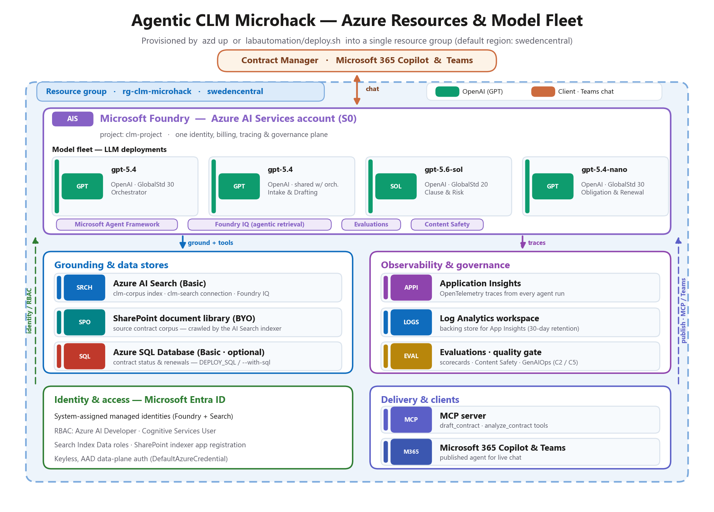

# Challenge 1 · Setup & Foundry Foundations

**[🏠 Home](../README.md)**  ·  [Challenge 2: Grounded Agent →](challenge-02.md)

Welcome to your very first challenge! Here you lay the foundation for the whole microhack: you'll
deploy the Azure resources, wire up your development environment, and seed the contract corpus the
later challenges build on. By the end you'll have the full **Microsoft Foundry** environment
running — with **zero local install** — so the rest of the hack is pure agent-building.

If something isn't working as expected, please let your coach know.

> **⏱️ Duration:** ~30 min

> **📋 Prerequisites:**
> - An **Azure subscription** with rights to create a Foundry project and deploy GPT models.
> - A **GitHub account** (to fork the repo and open it in Codespaces).
> - **GitHub Codespaces** access — everything runs in the browser; no local tooling required.

> 🧩 **How to use this challenge:** the provisioning is **scripted for you** (`azd up` *or* the
> `labautomation/deploy` script). **Run it, then confirm you understand what got created** — the Foundry
> project, the three-model fleet, and the search index the later challenges depend on. Stuck? The
> scripts *are* the answer key.

## 🎯 Objective

- Provision the Azure resources needed for the upcoming challenges into a single resource group.
- Seed the **Contoso Global** contract corpus from a **SharePoint** document library into Azure AI
  Search (via a SharePoint Online indexer) so **Foundry IQ** can ground the agents with **cited** answers.
- Smoke-test the environment so you *know* the GPT model fleet runs before you build.

## 🧭 Context and Background

Everything runs from **GitHub Codespaces** using the devcontainer in this repo (Python 3.11, Azure
CLI, `azd`, Node). A single command — **`azd up`** (Bicep in [`infra/`](../labautomation/infra/)) or the
**`labautomation/deploy`** script — provisions everything below into **one resource group** and autofills
your `.env`.

The following image illustrates the complete setup — every Azure resource, the LLM model fleet, and
the identity + delivery plane around them:



All resources reside in a **single resource group** (default name `rg-clm-microhack`, region
`swedencentral`):

- A **Microsoft Foundry** account (Azure AI Services · S0) with a **Foundry project** (`clm-project`)
  — one identity, billing, tracing, and governance plane for the whole system.
- Three **model deployments** — the multi-model GPT fleet the agents run on: **`gpt-5.4`**
  (Orchestrator + Intake & Drafting share it), **`gpt-5.6-sol`** (Clause & Risk), and **`gpt-5.4-nano`**
  (Obligation & Renewal).
- **Azure AI Search** (Basic) — the backing store for the **Foundry IQ** knowledge base (`clm-corpus`
  index, `clm-search` connection).
- **SharePoint document library** *(bring-your-own · Microsoft 365, not an Azure resource)* — the source
  contract corpus. An Azure AI Search **SharePoint Online indexer** crawls it into the `clm-corpus` index.
- **Application Insights** + a **Log Analytics** workspace — OpenTelemetry tracing (Challenge 3).
- *(Optional)* **Azure SQL Database** (Basic) — backs the contract-status / renewal function tool.
- *(Optional)* **Grounding with Bing Search** — public web grounding for the Clause & Risk agent
  (Challenge 4). Off by default; enable with `DEPLOY_BING`/`--with-bing`. Bing data leaves the Azure
  compliance boundary.

Identity is **keyless** for Azure data planes: system-assigned managed identities plus Microsoft Entra
ID RBAC (Azure AI Developer, Cognitive Services User, Search data roles) — all assigned for you by
`azd up`. *(The SharePoint indexer authenticates with a separate Entra app registration — see below.)*

<details>
<summary><strong>📦 Resource inventory</strong> (what gets created)</summary>

| Resource | Type / SKU | Default name | Purpose |
|----------|------------|--------------|---------|
| Foundry account | Azure AI Services · `S0` | `clmfoundry****` | Hosts the project + model deployments |
| Foundry project | AI Foundry project | `clm-project` | Agents, connections, tracing |
| Azure AI Search | `Basic` | `clmsearch****` | Foundry IQ knowledge base (`clm-corpus` index) |
| SharePoint library *(BYO · M365)* | document library | *your site* | Source contract corpus → AI Search indexer |
| Application Insights | `web` | `clm-appinsights****` | OpenTelemetry traces |
| Log Analytics | `PerGB2018` | `clm-logs****` | Backing store for App Insights |
| Azure SQL *(optional)* | `Basic` | `clmsql****` | Contract status / renewal dates |
| Grounding with Bing Search *(optional)* | `G1` · `Bing.Grounding` | `clm-bing****` | Public web grounding for Clause & Risk (C3) |

`****` is a short random token so globally-unique names don't collide.

</details>

<details>
<summary><strong>🤖 Model fleet</strong> (the LLM deployments)</summary>

| Deployment | Model · format | SKU | Agent it powers | Challenge |
|------------|----------------|-----|-----------------|-----------|
| `gpt-5.4` | OpenAI `gpt-5.4` (`2026-03-05`) | GlobalStandard · 30 | **Orchestrator** (routing + hand-offs) + **Intake & Drafting** | C1, C3 |
| `gpt-5.6-sol` | OpenAI `gpt-5.6-sol` (`2026-07-09`) | GlobalStandard · 30 | **Clause & Risk** — clause comparison + risk | C4 |
| `gpt-5.4-nano` | OpenAI `gpt-5.4-nano` (`2025-04-14`) | GlobalStandard · 30 | **Obligation & Renewal** — cheap, high-frequency | C3 |

> Every agent runs on **GPT** deployments — all inside **one** Foundry project. That's the multi-model
> GPT fleet you'll build agents on: Intake & Drafting shares the `gpt-5.4` orchestrator deployment,
> while Clause & Risk runs on `gpt-5.6-sol` and Obligation & Renewal on `gpt-5.4-nano`.

</details>

<details>
<summary><strong>📚 CLM corpus</strong> (the data you seed)</summary>

`python src/scripts/seed_corpus.py` creates an Azure AI Search **SharePoint Online indexer** that crawls the
[`data/`](../src/data/) corpus (hosted in your SharePoint library) into Azure AI Search so Foundry IQ can
ground answers with citations. The contract corpus is delivered as **PDF** (the indexer extracts the
text at crawl time); regenerate the PDFs with `python src/scripts/make_corpus_pdfs.py` (needs
`pip install reportlab`) and upload them to the library:

| Folder | Contents | Used by |
|--------|----------|---------|
| `contract_templates/` | Approved NDA / MSA / SOW templates (PDF) | Intake & Drafting (C1) |
| `clause_library/` | `standard_clauses.pdf` — standard positions CL-01…CL-12 | Clause & Risk (C3) |
| `policies/` | Contracting policy + delegation-of-authority matrix (PDF) | All agents (grounding + guardrails) |
| `contracts/` | 5 executed contracts (PDF), one per `contracts_seed.json` row | Clause & Risk (C3), tools (C1/C4) |
| `counterparty_drafts/` | `acme_msa_draft.pdf`, `globex_nda_redline.pdf` — inbound drafts full of red flags | Clause & Risk (C3) |
| `playbooks/` | `negotiation_playbook.pdf` — fallback positions | Intake & Drafting (C1) |
| `evaluation/` | `evaluation_dataset.jsonl` — 16 labelled cases | Evaluation (C2) |

</details>

## ✅ Tasks

> [!NOTE]
> **New to Azure or the terminal? Read this first.** This challenge is 100% click-and-paste — you
> never write code. Do the tasks **in order**, and after each command check the **✅ You should see**
> block before moving on. The **📸 Screenshot slot** boxes show *what the screen looks like* at that
> moment (swap in your own screenshots later). If a step doesn't match, jump to
> [🛠️ Troubleshooting](#️-troubleshooting) — don't push past a red error.

**Before you begin — tick these off:**

- [ ] You can sign in to [github.com](https://github.com).
- [ ] You can sign in to the [Azure Portal](https://portal.azure.com) with an account that can **create resources**.
- [ ] Your Azure subscription can deploy **GPT** models (ask your coach if unsure).
- [ ] You have ~30 minutes and a stable connection (provisioning takes 5–10 min on its own).

### Task 1 · Fork the repository (~2 min)

A **fork** is your own copy of this repo where your changes and progress are saved.

1. Go to **[github.com/glejdis/microhack-aiagents/fork](https://github.com/glejdis/microhack-aiagents/fork)**.
2. Leave **Owner** as your username and keep the repo name.
3. Click the green **Create fork** button.

> 📸 **Screenshot slot — what you'll see:** the GitHub *Create a new fork* page with the green **Create fork** button.
>
> 

✅ **You'll know it worked when:** the page reloads at `github.com/<your-username>/microhack-aiagents` (your username, not `glejdis`, in the URL).

> [!IMPORTANT]
> **Already forked this repo a while ago?** Your fork can fall **behind** the original and miss recent
> fixes (for example the model/region fix in Challenge 1). Before you deploy, **sync your fork**: open
> your fork on GitHub → click **"Sync fork" → "Update branch"**, or run
> `gh repo sync <your-username>/microhack-aiagents --branch main`. Then, inside your
> Codespace/clone, run `git pull`. Skipping this is the #1 cause of a `DeploymentModelNotSupported`
> error in Task 4.

---

### Task 2 · Launch the development environment (~5 min)

**GitHub Codespaces** is a full VS Code + terminal running in your browser — no local installs, no
"works on my machine." Everything below runs inside it.

1. On **your fork's** main page, click the green **`< > Code`** button.
2. Open the **Codespaces** tab.
3. Click **Create codespace on `main`**.
4. Wait for the build to finish — it auto-runs `pip install -r requirements.txt`. First build takes
   a few minutes. When the terminal at the bottom stops scrolling and shows a prompt, it's ready.

> 📸 **Screenshot slot — what you'll see:** the **Code → Codespaces → Create codespace on main** menu, then the ready Codespace.
>
> 
> 

✅ **You'll know it worked when:** you see a VS Code editor in the browser with a **Terminal** panel
at the bottom showing a ready prompt (e.g. `@your-username ➜ /workspaces/microhack-aiagents (main) $`).

> [!NOTE]
> If GitHub Codespaces is not enabled in your organization, see [enabling or disabling Codespaces](https://docs.github.com/en/codespaces/managing-codespaces-for-your-organization/enabling-or-disabling-github-codespaces-for-your-organization), or create a [free personal GitHub account](https://github.com/signup). The Free plan includes 120 core-hours/month.

> [!TIP]
> While the Codespace builds, skim the [hackathon scenario & architecture](../README.md#the-scenario--contoso-global) so the pieces you deploy here make sense.

---

### Task 3 · Log in to Azure (~3 min)

Now connect the terminal to your Azure account. In the Codespace **Terminal**, type this and press Enter:

```bash
az login --use-device-code
```

It prints a short code and a URL. **Open [microsoft.com/devicelogin](https://microsoft.com/devicelogin)**
in a new browser tab, paste the code, and sign in with your Azure account.

> 📸 **Screenshot slot — what you'll see:** the device-login page where you paste the code from the terminal.
>
> 

✅ **You should see** (your subscriptions listed, then a table like this):

```text
Retrieving tenants and subscriptions for the selection...
[Tenant and subscription selection]
No     Subscription name        Subscription ID                       Tenant
-----  -----------------------  ------------------------------------  -------------
[1] *  My Azure Subscription    2942123c-....-793528767894            Contoso
```

Then pick the subscription you want to deploy into (replace the id with yours):

```bash
az account set --subscription "<your-subscription-id>"
```

> [!TIP]
> List your subscriptions any time with `az account list --output table`. Copy the **Subscription ID**
> (the long `xxxxxxxx-xxxx-...` value), not the name.

---

### Task 4 · Deploy the resources (~8 min)

> [!IMPORTANT]
> Depending on the setup for your event, the Azure resources may already be provisioned for you — in
> which case you can **skip to Task 6**. Check with your coach what applies.

Choose a region that offers **all three** models. This repo's infra is pre-pinned to models that are
available in **`swedencentral`** today (`gpt-5.4`, `gpt-5.6-sol`, `gpt-5.4-nano`), so
**`swedencentral` is the safe default** — use it unless your coach says otherwise. Then pick **one** option:

> [!TIP]
> **Want to double-check what your subscription offers in a region?** Run
> `az cognitiveservices model list --location swedencentral --output table` and look for the model
> names above. If you switch regions and a model isn't listed, that's what causes a
> `DeploymentModelNotSupported` error — see [🛠️ Troubleshooting](#️-troubleshooting).

> [!IMPORTANT]
> **Preflight (30 seconds, saves 10 minutes):** confirm your checkout has the current model pins
> *before* you provision. Run:
> ```bash
> grep -nE "gptOrchestratorVersion|gptMiniModel|gptMiniVersion|gpt56solVersion" labautomation/infra/resources.bicep
> ```
> ✅ You should see **all three** pins: orchestrator `gpt-5.4` `2026-03-05`, renewal `gpt-5.4-nano`
> `2025-04-14`, and clause-risk `gpt-5.6-sol` `2026-07-09`.
> ❌ If you instead see `gpt-5.3-chat`, `2026-03-03`, `2025-11-01`, or `gpt-4o-mini` `2024-07-18`, your fork/checkout
> is **stale** — go back and **[sync your fork](#task-1--fork-the-repository)** + `git pull`, then re-run
> this check. Deploying a stale template is what triggers `DeploymentModelNotSupported` /
> `ServiceModelDeprecating`.

<details open>
<summary><strong>Option A — <code>azd up</code></strong> (recommended · Bicep in <code>infra/</code>)</summary>

**Step 4a — sign `azd` in** (separate from `az login` above):

```bash
azd auth login
```

**Step 4b — provision everything** with one command:

```bash
azd up
```

`azd up` asks you **three questions** the first time. Answer them like this:

| Prompt | What to type |
|--------|--------------|
| `Enter a new environment name` | anything short + lowercase, e.g. **`clm-microhack`** |
| `Select an Azure Subscription` | the subscription you set in Task 3 (arrow keys → Enter) |
| `Select an Azure location` | **`Sweden Central`** (start typing `sweden` to filter) |

> 📸 **Screenshot slot — what you'll see:** the three `azd up` prompts (environment name, subscription, region).
>
> 

Then it provisions for **5–10 minutes**. `azd up` deploys the Bicep in [`infra/`](../labautomation/infra/), assigns the
RBAC roles the later challenges need, creates the `clm-search` Foundry IQ connection, and runs the
`postprovision` hook (`src/scripts/write_env.py`) to write your `.env`.

> 📸 **Screenshot slot — what you'll see:** the green **SUCCESS** summary with the deployed resources and outputs.
>
> 

✅ **You should see** (names/values will differ) — the key line is `SUCCESS`:

```text
  (✓) Done: Deploying service ...
Deploying services (azd deploy)

  Provisioning Azure resources (azd provision)
  Resource group: rg-clm-microhack
  ...
SUCCESS: Your up workflow to provision and deploy to Azure completed in 8 minutes.
```

❌ **If it fails with `DeploymentModelNotSupported`** — first check you're **not on a stale fork**:
run `grep -n "gptOrchestrator" labautomation/infra/resources.bicep` and confirm you see `gpt-5.4`
and `2026-03-05` (if you see `2025-11-01` or `gpt-5.3-chat`, [sync your fork](#task-1--fork-the-repository) + `git pull`).
If your checkout is current, then a model/version simply isn't offered in your region: this repo is
already fixed for `swedencentral`, so switch back to it, or update the versions in
[`infra/resources.bicep`](../labautomation/infra/resources.bicep). See [🛠️ Troubleshooting](#️-troubleshooting).

To also provision Azure SQL:

```bash
azd env set DEPLOY_SQL true
azd env set SQL_ADMIN_PASSWORD '<StrongP@ssw0rd!>'
azd up
```

To also provision **Grounding with Bing Search** (optional web grounding for the Clause & Risk
agent — see Challenge 4): `azd env set DEPLOY_BING true` before `azd up`. The `.env` then gets a
populated `AZURE_BING_CONNECTION_NAME`. Bing search data leaves the Azure compliance boundary.

</details>

<details>
<summary><strong>Option B — deploy script</strong> (<code>az</code> CLI)</summary>

```bash
LOCATION=swedencentral ./labautomation/deploy.sh          # add --with-sql and/or --with-bing to also provision those
```

> Windows (outside Codespaces): `./labautomation/deploy.ps1` (`-WithSql` / `-WithBing` optional).
> `--with-bing` provisions Grounding with Bing Search (optional web grounding for Challenge 4).

</details>

<details>
<summary><strong>Option C — one-click <em>Deploy to Azure</em> / plain ARM</strong> (<code>infra/azuredeploy.json</code> · no <code>azd</code>)</summary>

Prefer a portal button or a pure `az` deploy with no `azd`? [`infra/azuredeploy.json`](../labautomation/infra/azuredeploy.json)
is a self-contained ARM template **compiled from the same Bicep** — it creates the same
`rg-clm-microhack` resource group and resources.

[](https://portal.azure.com/#create/Microsoft.Template/uri/https%3A%2F%2Fraw.githubusercontent.com%2Fglejdis%2Fmicrohack-aiagents%2Fmain%2Fchallenge-0%2Finfra%2Fazuredeploy.json)

The button opens a **subscription-scoped** custom deployment — pick your subscription and
region and it provisions everything (no resource-group picker; the template creates
`rg-clm-microhack` itself). Or from the CLI:

```bash
az deployment sub create \
  --name clm-microhack \
  --location swedencentral \
  --template-file labautomation/infra/azuredeploy.json \
  --parameters environmentName=clm-microhack location=swedencentral \
               principalId=$(az ad signed-in-user show --query id -o tsv)
```

> Passing your `principalId` assigns the data-plane roles (Search Index Data) you need to
> seed the corpus. Add `deploySql=true sqlAdminPassword='<StrongP@ssw0rd!>'` to also
> provision Azure SQL, and/or `deployBing=true` to provision Grounding with Bing Search
> (optional web grounding for Challenge 4).

Unlike `azd up`, this path does **not** auto-write `.env`. Populate it from the deployment
outputs (use the same `--name` you deployed with):

```bash
python src/scripts/write_env.py --deployment clm-microhack
```

</details>

Options A and B write a populated **`.env`** automatically; Option C writes it via the
`write_env.py --deployment` step above. ⏱️ Provisioning takes ~5–10 minutes.

---

### Task 5 · Verify your resources (~3 min)

Let's confirm everything landed. Do all three checks:

**5a — Resource group in the Azure Portal.** Open the [Azure Portal](https://portal.azure.com/) →
search **`rg-clm-microhack`** → click it. You should see ~7 resources (Foundry account, Azure AI Search,
Application Insights, Log Analytics, and the model deployments live inside the Foundry account).

> 📸 **Screenshot slot — what you'll see:** the `rg-clm-microhack` overview listing the resources.
>
> 

**5b — Model deployments in the Foundry portal.** Open [ai.azure.com](https://ai.azure.com) → select
your **`clm-project`** → **Models + endpoints**. Confirm the deployments show **Succeeded**:
`gpt-5.4`, `gpt-5.6-sol`, and `gpt-5.4-nano` (**three** model deployments).

> 📸 **Screenshot slot — what you'll see:** the three model deployments, all "Succeeded".
>
> 

**5c — Your `.env` file.** In the Codespace file explorer, open **`.env`** at the repo root. Confirm the
values are filled in (every entry has a value **except** the `SHAREPOINT_*` corpus and the Challenge 5
`MICROSOFT_APP_*` / `TEAMS_*` variables, which you fill later).

✅ **`.env` should look like this** (values will differ):

```bash
AZURE_AI_PROJECT_ENDPOINT=https://clmfoundryab12c.services.ai.azure.com/api/projects/clm-project
MODEL_ORCHESTRATOR=gpt-5.4
MODEL_DRAFTING=gpt-5.4
MODEL_CLAUSE_RISK=gpt-5.6-sol
MODEL_RENEWAL=gpt-5.4-nano
AZURE_SEARCH_ENDPOINT=https://clmsearchab12c.search.windows.net
AZURE_SEARCH_INDEX=clm-corpus
AZURE_SEARCH_CONNECTION_NAME=clm-search
APPLICATIONINSIGHTS_CONNECTION_STRING=InstrumentationKey=...
```

> [!CAUTION]
> For convenience, this hackathon keeps secrets (e.g. the SharePoint app secret) in `.env` and uses
> public network access. **Never commit `.env`** — it's already in [`.gitignore`](../.gitignore). In
> production, prefer managed identities, private endpoints, and Key Vault.

---

### Task 6 · Seed the corpus (~7 min)

Build the `clm-corpus` search index that grounds every later challenge (2–6). Because each
participant is an **admin of their own sandbox tenant**, the default is the real,
production-shaped **SharePoint** path — and a single script does all of it for you.

> [!IMPORTANT]
> **Path A — SharePoint corpus, one command (default · recommended).** One script does the
> *entire* SharePoint path — Entra app registration, **admin consent**, a SharePoint site,
> uploading the 14 corpus PDFs, and building the index — with **no portal clicks**:
> ```bash
> python src/scripts/setup_sharepoint_corpus.py
> ```
> It reuses your existing `az login`, so admin consent is granted **as you** (the tenant admin) —
> the greyed-out **"Grant admin consent"** wall never applies in your own tenant. When it finishes
> you'll see:
> ```text
> ✓ admin consent confirmed for both Graph permissions
> ✓ site ready: https://<tenant>.sharepoint.com/sites/clm-microhack-corpus
> ✅ Done. SharePoint is now your corpus source: https://<tenant>.sharepoint.com/sites/clm-microhack-corpus
> ```
> Confirm a **non-zero document count** (portal → Search service → Indexes → `clm-corpus`), then
> **jump to [Task 7](#task-7--smoke-test).**
>
> **Prerequisites:** `az login` as your sandbox admin, and Task 4's deploy already wrote `.env`
> (so `AZURE_SEARCH_ENDPOINT` is set). The script is **idempotent** — safe to re-run — and takes
> flags `--dry-run` (preview only), `--skip-upload`, `--skip-index`, and
> `--site-url https://<tenant>.sharepoint.com/sites/<name>` (to reuse a site you already have).

<details>
<summary><strong>Path B — local-PDF fallback (no SharePoint · works in any tenant · use if you're not an admin)</strong></summary>

Not an admin of your tenant, or SharePoint/SPO unavailable? Skip SharePoint entirely: leave the
five `SHAREPOINT_*` values **blank** in `.env` and run:
```bash
python src/scripts/seed_corpus.py
```
It extracts the local `src/data/**/*.pdf` corpus straight into the `clm-corpus` index — the
**same Foundry IQ grounding** the agents use, no SharePoint required. You should see
`✓ uploaded 14/14 local PDF(s) into 'clm-corpus'`. *(This needs the **Search Index Data
Contributor** role, which `azd up` already granted you.)*

**Skipping SharePoint has zero impact on Challenges 2–6** — the agents only ever read the
`clm-corpus` index, never SharePoint directly. Both paths produce the identical index.

</details>

<details>
<summary><strong>Path C — coach / tenant-admin pre-consent (shared tenant · participants are NOT admins)</strong></summary>

Running in a **shared tenant** where participants **aren't** tenant admins? Then Path A's
automatic admin consent can't run — and, importantly, **the lab deploy can't grant it for you
either.** Consenting to Microsoft Graph *application* permissions (`Sites.ReadWrite.All`,
`Files.Read.All`) is a **directory-plane** action that needs a directory role (Global
Administrator / Privileged Role Administrator / Application Administrator). Azure **`Owner`** on
the subscription — the most `deploy-lab.ps1` is ever guaranteed — is a *resource*-plane role and does **not**
include directory consent, so it's neither in the Bicep nor grantable via `AllowedEntraUserIds`.

The fix: a **tenant admin does the consent once** and shares one app with the whole room.

1. **Admin (once):** register the app, add both Graph permissions, **grant admin consent**, and
   mint a secret — the helper does all of it:
   ```bash
   pwsh src/scripts/setup_sharepoint_app.ps1        # Windows / PowerShell
   # — or —
   bash src/scripts/setup_sharepoint_app.sh         # Codespaces / Linux / macOS
   ```
   Create (or pick) **one** shared SharePoint site + **Documents** library and upload the 14
   corpus PDFs once: `python src/scripts/upload_corpus_to_sharepoint.py`.
2. **Admin → participants:** hand out the five `SHAREPOINT_*` values (site URL, library, tenant
   id, app id, **secret**). One admin-consented app is shared by everyone — participants do **not**
   each need consent.
3. **Each participant:** paste those values into `.env`, then build *their own* index against the
   shared library (skip the upload — the admin already did it):
   ```bash
   python src/scripts/seed_corpus.py
   ```
   Each participant's Foundry + Search resources are their own; only the SharePoint corpus is
   shared. The indexer signs in as the shared app (app-only), so no per-user consent is involved.

Prefer no shared secret, or no admin on hand? Use **Path B** — the local-PDF fallback needs
neither SharePoint nor consent and produces the identical `clm-corpus` index.

</details>

<details>
<summary><strong>Manual SharePoint setup (advanced · click-by-click — only if you can't run the Path A script)</strong></summary>

> [!TIP]
> **You almost certainly don't need this.** Path A above (`setup_sharepoint_corpus.py`) automates
> every step below. Use this manual walkthrough only if the script can't run in your environment,
> or if you want to see exactly what it does under the hood.

The production-shaped path: the corpus lives in a **SharePoint document library** (bring-your-own —
it's Microsoft 365, **not** created by `azd`) and an Azure AI Search **SharePoint Online indexer**
crawls it into `clm-corpus`. One-time setup: create the library, authorize an app, upload the PDFs,
then index. Work through **B.1 → B.5 in order**.

> [!WARNING]
> **This manual path needs tenant-admin rights** at **B.2** ("Grant admin consent"). In your own
> sandbox tenant you have them — and the **Path A script grants that consent for you automatically**,
> which is why it's the default. If you ever see the button greyed out (or Graph returns *"Tenant
> does not have a SPO license"*), fall back to the **local-PDF path** — it produces the identical
> `clm-corpus` index.

> [!NOTE]
> In this hack you run everything yourself in **your own** admin tenant — there's no coach handing
> you `SHAREPOINT_*` values. If you'd rather not click through this by hand, use the **Path A**
> one-command script above instead.

#### B.1 · Create the SharePoint site + document library

1. Go to **[SharePoint](https://www.office.com/launch/sharepoint)** → **+ Create site** → **Team site**.
2. Name it e.g. **`CLMCorpus`** and finish — it comes with a default **Documents** library.
3. Copy the site URL from your browser bar, e.g. `https://<tenant>.sharepoint.com/sites/CLMCorpus`
   (this becomes `SHAREPOINT_SITE_URL`; the library name `Documents` becomes `SHAREPOINT_DOC_LIBRARY`).

#### B.2 · Authorize an app (Microsoft Entra app registration)

The upload script and the AI Search indexer sign in as an **app** (not as you), so they need an Entra
app registration with two Microsoft Graph **application** permissions:

| Permission | Why it's needed | Used by |
|---|---|---|
| `Sites.ReadWrite.All` | upload PDFs into the library (and read it back) | `upload_corpus_to_sharepoint.py` |
| `Files.Read.All` | read document content while crawling | `seed_corpus.py` indexer |

<details open>
<summary><strong>Option A — automate just the app registration (one script)</strong></summary>

> [!NOTE]
> These helpers do **only** the app + consent + secret. The **Path A** script
> (`setup_sharepoint_corpus.py`) already does this *and* the site, upload, and index — prefer it
> unless you specifically want the app-registration step on its own.

Requires the Azure CLI signed in (`az login`) **and** rights to grant admin consent (Global Admin /
Privileged Role Admin / Application Administrator — in your own sandbox tenant, that's you):

```bash
bash src/scripts/setup_sharepoint_app.sh          # Codespaces / Linux / macOS
# — or on Windows PowerShell —
pwsh src/scripts/setup_sharepoint_app.ps1
```

It creates the app, adds **both** permissions, **grants admin consent**, mints a **client secret**, and
prints the three `SHAREPOINT_*` values to paste into `.env`. If you lack consent rights it still creates
everything and prints the single `az ad app permission admin-consent …` command an admin must run.

✅ **You should see** a block like:
```text
SHAREPOINT_TENANT_ID=8f9a...c21
SHAREPOINT_APP_ID=3d2b...9f4
SHAREPOINT_APP_SECRET=Xy7Q~....(shown once)
```
</details>

<details>
<summary><strong>Option B — do it by hand in the portal (click-by-click)</strong></summary>

1. Open the **[Microsoft Entra admin center](https://entra.microsoft.com)** → **Identity → Applications
   → App registrations → + New registration**. Name it **`CLM Microhack Corpus`**, leave the defaults,
   and click **Register**. On the **Overview** page, copy the **Application (client) ID** and the
   **Directory (tenant) ID**.

   > 📸 **Screenshot slot:** the *New registration* form / Overview with the client + tenant IDs.
   >
   > 

2. In the app, open **API permissions → + Add a permission → Microsoft Graph → Application
   permissions**. Search for and tick **`Sites.ReadWrite.All`** and **`Files.Read.All`**, then click
   **Add permissions**. *(Application, not Delegated.)*

   > 📸 **Screenshot slot:** the API permissions list showing both Graph **Application** permissions added.
   >
   > 

3. Click **Grant admin consent for &lt;tenant&gt;** and confirm — both rows must turn to green
   **"Granted for &lt;tenant&gt;"**. **If this button is greyed out you are _not_ a tenant admin: stop
   and switch to the local-PDF fallback (Path B) — you don't need SharePoint to finish the hack.**
   (In your own sandbox tenant the Path A script grants this consent for you automatically.)

   > 📸 **Screenshot slot:** green "Granted for &lt;tenant&gt;" checkmarks on both permissions.
   >
   > 

4. Open **Certificates & secrets → + New client secret**, add one, then **copy the Value immediately**
   (it's shown only once). That value is your `SHAREPOINT_APP_SECRET`.

   > 📸 **Screenshot slot:** the new client secret with its **Value** visible (copy it now).
   >
   > 
</details>

#### B.3 · Put the values in `.env`

Open the repo-root **`.env`** and fill in what you gathered in B.1 + B.2:

```bash
SHAREPOINT_SITE_URL=https://<tenant>.sharepoint.com/sites/CLMCorpus
SHAREPOINT_DOC_LIBRARY=Documents
SHAREPOINT_TENANT_ID=<directory (tenant) id>
SHAREPOINT_APP_ID=<application (client) id>
SHAREPOINT_APP_SECRET=<client secret value>
```

#### B.4 · Upload the corpus PDFs

Push all 14 corpus PDFs from `src/data/` into the library — the script recreates the folder
layout for you:

```bash
python src/scripts/upload_corpus_to_sharepoint.py --dry-run   # preview (no changes)
python src/scripts/upload_corpus_to_sharepoint.py             # upload for real
```

✅ **You should see** each file upload, then a summary:
```text
  uploaded  contracts/CT-4821_Acme_MSA.pdf
  ...
Done. Uploaded 14 PDF(s) to 'Documents'.
```

> [!TIP]
> Prefer to upload by hand? Skip the script and drag the **6 folders** from `src/data/` into the
> library — but leave out `evaluation/` and `contracts_seed.json` (those are read locally, not indexed).
> A `403 Forbidden` from the script means the app is missing `Sites.ReadWrite.All` **admin consent** —
> revisit B.2.

#### B.5 · Build the index from the populated library

```bash
python src/scripts/seed_corpus.py
# optional — only if you deployed Azure SQL:
python src/scripts/seed_sql.py
```

✅ **You should see** the indexer get created and start crawling (wording may vary):

```text
✓ Created data source 'clm-corpus-sharepoint'
✓ Created/updated index 'clm-corpus'
✓ Created indexer 'clm-corpus-indexer' — crawling SharePoint library...
Done. Give the indexer 1–2 minutes, then check the document count in the portal.
```

*(On the **local-PDF fallback** — no `SHAREPOINT_*` set — you'll instead see `· SharePoint settings not
set — using the LOCAL-PDF fallback` followed by `✓ uploaded 14/14 local PDF(s) into 'clm-corpus'`, and
the index is populated immediately.)*

</details>

> 📸 **Screenshot slot — what you'll see:** the `clm-corpus` index with a non-zero document count
> (verify this before Challenge 2 — a **0** count means the index wasn't seeded; re-run
> `python src/scripts/seed_corpus.py`).
>
> 

> [!NOTE]
> The entire corpus is **PDF** — Contoso-authored templates, the clause library and policies, the 5
> executed contracts in `data/contracts/` (one per row seeded into Azure SQL) and the inbound
> counterparty drafts. `seed_corpus.py` lands each document's text in the `clm-corpus` index for
> Foundry IQ — via the SharePoint indexer (Path A) or by extracting the local PDFs directly (Path B).
> To rebuild the PDFs from source, see
> [`data/README.md`](../src/data/README.md#regenerating-the-pdfs).

---

### Task 7 · Smoke test (~2 min)

The final check — prove the project is reachable and that the GPT model fleet runs:

```bash
python src/scripts/smoke_test.py
```

> 📸 **Screenshot slot — what you'll see:** the terminal ending in **`Smoke test: ✅ PASS`**.
>
> 

✅ **You should see** (this is the finish line for Challenge 1):

```text
1) Checking environment…            ✓ (all vars present)
2) Pinging orchestrator deployment 'gpt-5.4'… ✓ orchestrator replied: OK
   · drafting shares deployment 'gpt-5.4' with orchestrator — already verified.
2) Pinging clause-risk deployment 'gpt-5.6-sol'… ✓ clause-risk replied: OK
2) Pinging renewal deployment 'gpt-5.4-nano'… ✓ renewal replied: OK

Smoke test: ✅ PASS
```

*(The drafting agent shares the `gpt-5.4` orchestrator deployment, so the smoke test pings it once
and notes the reuse — that's the `· drafting shares deployment` line, not a separate drafting ping.)*

🎉 If it prints **✅ PASS**, your Foundry CLM environment is ready. Got **⚠️ PARTIAL** or an error
instead? See [🛠️ Troubleshooting](#️-troubleshooting) — a failed ping is usually a regional
chat-client limitation.

## ✔️ Success criteria

- `.env` is populated (project endpoint + connection strings).
- `python src/scripts/smoke_test.py` prints **✅ PASS** — a tiny agent runs on `gpt-5.4`, `gpt-5.6-sol`
  **and** `gpt-5.4-nano`.
- In the Foundry portal you can see the project, the three model deployments, and the
  `clm-corpus` index with documents.

Expected smoke-test output:

```
1) Checking environment…            ✓ (all vars present)
2) Pinging orchestrator deployment 'gpt-5.4'… ✓ orchestrator replied: OK
   · drafting shares deployment 'gpt-5.4' with orchestrator — already verified.
2) Pinging clause-risk deployment 'gpt-5.6-sol'… ✓ clause-risk replied: OK
2) Pinging renewal deployment 'gpt-5.4-nano'… ✓ renewal replied: OK
Smoke test: ✅ PASS
```

## 🚀 Go Further

> [!NOTE]
> Finished early? These are **optional** — feel free to move on and come back later.

- Inspect the **Bicep** in [`infra/`](../labautomation/infra/) (`main.bicep` + `resources.bicep`) — it mirrors
  `deploy.sh` and is what `azd up` runs. Try `azd provision --preview` for a what-if before deploying.
  [`infra/azuredeploy.json`](../labautomation/infra/azuredeploy.json) is that same template compiled to ARM (for the
  one-click button in Option C) — regenerate it with
  `az bicep build --file labautomation/infra/main.bicep --outfile labautomation/infra/azuredeploy.json`.
- Regenerate this challenge's resource diagram: `python src/scripts/make_challenge0_resources.py`.
- Add a **US Data Zone** deployment tier for data-residency, or scope RBAC to least privilege.
- Deploy an alternative lightweight model (e.g. another GPT mini tier) and compare it against `gpt-5.4-nano` for the renewal agent later.

## 🛠️ Troubleshooting

| Symptom | Fix |
|---------|-----|
| `DeploymentModelNotSupported` / `deployment failed` for a model | **First: are you on a stale fork?** Run the [preflight grep](#task-4--deploy-the-resources) — it must show `gpt-5.4`+`2026-03-05`, `gpt-5.6-sol`+`2026-07-09`, and `gpt-5.4-nano`+`2025-04-14`. If you see `gpt-5.3-chat`, `2026-03-03`, `2025-11-01`, or `gpt-4o-mini`, [sync your fork](#task-1--fork-the-repository) and `git pull`, then redeploy. **Otherwise** the model **name or version** isn't offered in your region: list what *is* available with `az cognitiveservices model list --location <region> --output table`, then update the model/version in [`infra/resources.bicep`](../labautomation/infra/resources.bicep) (and `labautomation/deploy.sh`). This repo is pre-pinned for `swedencentral`; if you changed regions, switch back or re-pin. |
| `ServiceModelDeprecating` for `gpt-4o-mini` (or another model) | You're on a **stale template** pinning a deprecating model. The repo now uses `gpt-5.4-nano` `2025-04-14` for the renewal agent — sync your fork + `git pull`. If you deliberately changed a version, pick a current one from `az cognitiveservices model list --location <region> --output table` (avoid ones with a near/past `deprecation.inference` date). |
| `Project can only be created under AIServices Kind account with allowProjectManagement set to true` | Fixed in the template (`account.properties.allowProjectManagement: true`). If you hit it, you're on a stale fork — sync + `git pull` and redeploy. |
| SharePoint: *"Tenant does not have a SPO license"*, or you can't grant the app's Graph **admin consent** (only Global Reader / **"Grant admin consent" greyed out**) | Only happens if you're **not** an admin of the tenant — in your own sandbox tenant the Path A script self-grants consent. If you hit it, it's **not** a failure: use the **local-PDF fallback (Path B)** — leave the `SHAREPOINT_*` values blank in `.env` and run `python src/scripts/seed_corpus.py`. It extracts `src/data/**/*.pdf` and populates `clm-corpus` directly (needs the Search Index Data Contributor role, granted by `azd up`) — the **same index** the SharePoint path builds, so Challenges 2–6 are unaffected. See [Task 6, Path B](#task-6--seed-the-corpus). |
| `account project create` unavailable | The CLI project command is preview. Create the project in the **Foundry portal**, then set `AZURE_AI_PROJECT_ENDPOINT` in `.env` manually (Overview → Endpoint). |
| `az login` in Codespaces | Use `az login --use-device-code`. |
| Search / quota errors | Ensure the subscription has quota for Basic Search + the model SKUs; request quota if needed. |
| `PermissionDenied` after deploy | RBAC can take 5–10 min to propagate. Wait, run `az login --use-device-code` again, and retry. |

<details>
<summary>Re-run seeding or check the search index</summary>

```bash
# seed_corpus.py is idempotent — safe to re-run
python src/scripts/seed_corpus.py

# confirm the index has documents
az search service show --name <clmsearch****> --resource-group rg-clm-microhack --query name
```

</details>

## 🧠 Reflection

- Why keep the corpus in **SharePoint** *and* an Azure AI Search index? *(Business system of record vs. retrieval.)*
- The fleet runs several GPT deployments in one project. What does Foundry give you that stitching
  separate model endpoints together would not? *(One identity, billing, tracing, and governance plane.)*
- The deploy assigns **data-plane** roles (Search Index Data) to a **managed identity**, while the
  SharePoint indexer uses an **Entra app registration**. Why do keyless/app-scoped credentials matter
  for an enterprise CLM system?

## 📚 Learn more

- [Microsoft Foundry](https://learn.microsoft.com/azure/ai-foundry/)
- [Microsoft Agent Framework](https://learn.microsoft.com/agent-framework/overview/agent-framework-overview)
- [Foundry IQ / agentic retrieval](https://learn.microsoft.com/azure/search/search-agentic-retrieval-concept)
- [Azure AI Search](https://learn.microsoft.com/azure/search/)
- [Azure Developer CLI (`azd`)](https://learn.microsoft.com/azure/developer/azure-developer-cli/)

---

➡️ Next: **[Challenge 2 — Intake & Drafting agent + Foundry IQ + tools](challenge-02.md)**
