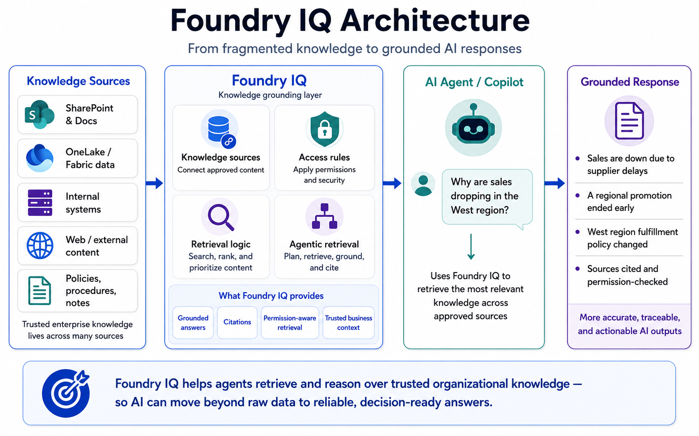
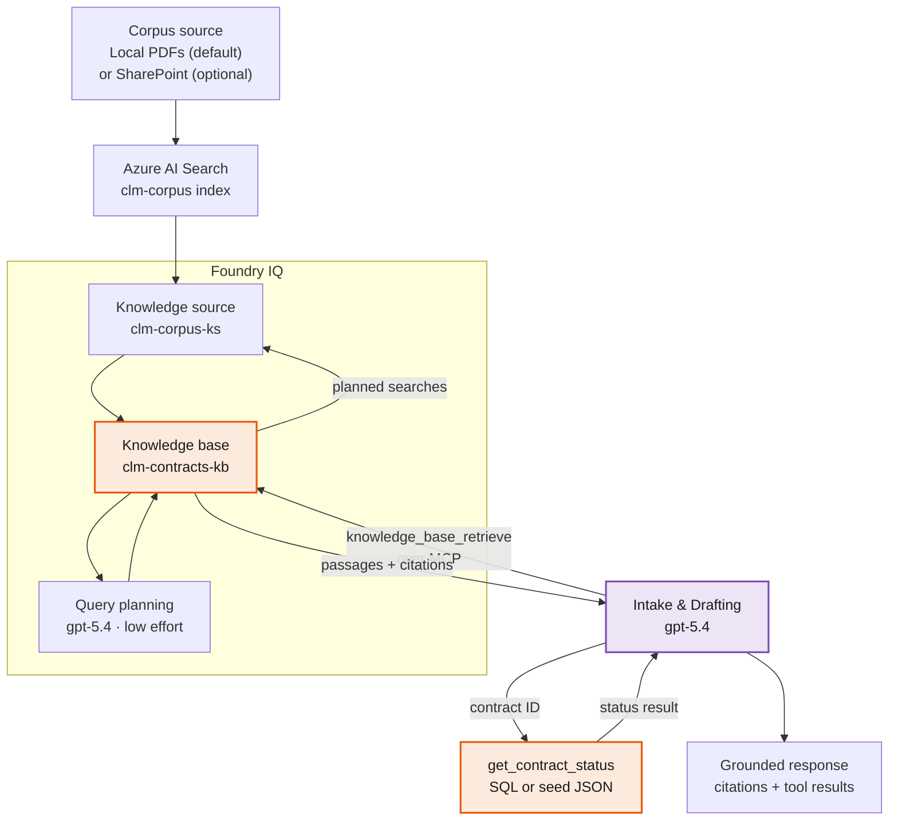
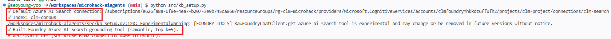
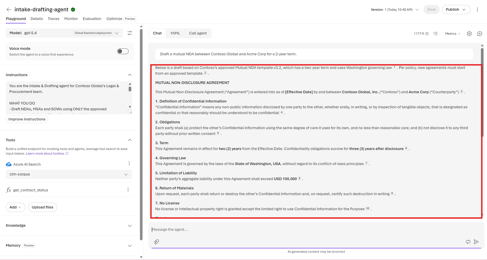

# Challenge 2 · Grounded Agent with Foundry IQ + Tools

**[🏠 Home](../README.md)**  ·  [← Challenge 1: Setup](challenge-01.md)  ·  [Challenge 3: Observability →](challenge-03.md)

Welcome to your first agent! In Challenge 1 you provisioned Microsoft Foundry and seeded the
**Contoso Global** contract corpus. Now you'll turn that corpus into a working assistant: the
**Intake & Drafting agent** — a grounded, cited, tool-enabled, guard-railed agent that drafts
contracts from approved templates and answers policy questions **with sources**. It runs on
**gpt-5.4**, and the twist you'll internalize here is that grounding it on one deployment
takes the *exact same code* as grounding it on any other — because Foundry is a **model-agnostic control
plane**.

**Why the business cares:** at Contoso, intake is the slow, risky front door of every contract.
Managers redraft the same NDAs and MSAs by hand, dig through SharePoint for the approved clause, and
re-answer the same policy questions — a big chunk of the **~17-day** contract cycle, with real
exposure when someone reaches for the wrong clause. This agent removes that friction *safely*: it
drafts from approved templates, answers **with citations**, looks up contract facts with a tool
instead of guessing, and stays firmly out of legal advice — a faster intake cycle the business can
actually trust.

If something isn't working as expected, please let your coach know.

> **⏱️ Duration:** ~60 min

> **📋 Prerequisites:**
> - **Challenge 1 complete** — `.env` populated, corpus seeded into Azure AI Search, smoke test green.
> - A model deployment for **`gpt-5.4`** (created in Challenge 1) reachable from your project.

> 🧩 **How to use this challenge:** the code in this folder is a **complete, working reference
> implementation** — you're not building it from a blank file. **Run it, read it, and understand *why*
> it works**. Stuck? The code *is* the answer key.

---

## 🎯 Objective

Build the **Intake & Drafting agent** on **gpt-5.4**. These four properties aren't academic — each
one is what makes the agent's output *safe for a contract manager to act on*:

- **Grounded** — every substantive answer is drawn from the CLM corpus through **Foundry IQ agentic
  retrieval**, not the model's parametric memory.
- **Cited** — answers reference the source documents they came from.
- **Tool-enabled** — a **function tool** (`get_contract_status`) performs structured lookups the model
  must not guess.
- **Guard-railed** — the agent **refuses** to give legal advice and flags policy deviations for human
  review.

## 🧩 What you'll build

| Component | What it is | Where it lives |
|-----------|-----------|----------------|
| **Knowledge tool (Foundry IQ MCP)** | The `knowledge_base_retrieve` MCP tool over `clm-contracts-kb` — grounds the agent on Contoso's templates, clauses, policy and contracts | [`kb_setup.py`](../src/kb_setup.py) → `build_knowledge_tool()` |
| **Function tool** | `get_contract_status(contract_id)` — deterministic lookup of status, renewal date, risk and owner (Azure SQL, falling back to seed JSON) | [`src/clm_common/tools.py`](../src/clm_common/tools.py) |
| **Guard-railed persona** | Instructions that force citations, forbid invented terms, and refuse legal advice | `INSTRUCTIONS` in [`agents/intake_drafting_agent.py`](../src/agents/intake_drafting_agent.py) |
| **gpt-5.4-backed agent** | The same Agent Framework API for every model, with `model` pointed at the `gpt-5.4` deployment | `create_agent()` in [`agents/intake_drafting_agent.py`](../src/agents/intake_drafting_agent.py) |
| **A repeatable demo** | Builds the agent, runs four prompts (draft · cited Q&A · tool call · refusal) in one session | `main()` in [`agents/intake_drafting_agent.py`](../src/agents/intake_drafting_agent.py) |

## 🧭 Context

### How grounding works — the Foundry IQ tool chain

This microhack creates a real Foundry IQ **search-index knowledge source** (`clm-corpus-ks`) and
**knowledge base** (`clm-contracts-kb`) over the `clm-corpus` index. The knowledge base uses
**gpt-5.4** with **low retrieval reasoning effort** to plan one or more searches, then returns
extractive passages and citation metadata through its authenticated MCP endpoint.



*The implementation follows this architecture: Azure AI Search stores the indexed corpus; Foundry IQ
adds the managed knowledge-source, knowledge-base, query-planning, and MCP retrieval layers.*



The index itself was built in **Challenge 1** by `src/scripts/seed_corpus.py`. In this challenge you
created the knowledge source/base after seeding. In this challenge you **attach its MCP endpoint** and
let the agent use agentic retrieval.

### Two kinds of tools

An agent grounds and acts through **tools**. This agent has both flavors:

- **Knowledge tool** (`knowledge_base_retrieve` over MCP) — for *unstructured* knowledge: "what does
  our standard limitation-of-liability clause say?" Foundry IQ plans the retrieval and answers from
  the corpus, **with citations**.
- **Function tool** (`get_contract_status`) — for *structured* facts the model must never hallucinate:
  "what's the renewal date of `CT-4821`?" The Agent Framework generates the tool's JSON schema **from the
  Python type hints + docstring**, and `function_tool(...)` (`approval_mode="never_require"`) runs the
  function automatically mid-run.

> [!NOTE]
> Because the schema is derived from the function signature and docstring, **keeping good type hints
> and a clear docstring is not optional** — they *are* the tool contract the model sees.

### Why gpt-5.4 here — and why the API doesn't change

Drafting rewards strong instruction-following and long-context legal reasoning, so the Intake &
Drafting agent runs on **gpt-5.4** (`MODEL_DRAFTING`) — the same flagship deployment as the
orchestrator. The whole point of Foundry as a control plane is that you get there by pointing `model`
at a deployment name — **the agent/tool/grounding API is identical across models**. The same
`Agent(client=..., tools=[...]) → run` shape hosts any other deployment (you'll see the specialists
in Challenge 4's orchestrator) with no other changes.

### Guardrails at the prompt layer

**Why this matters:** for a contract assistant, a confident *wrong* answer is worse than a slow one.
An agent that invents a liability cap, cites a clause that doesn't exist, or opines on whether a
contract is enforceable stops being a productivity tool and becomes **legal and financial exposure**
for Contoso. The guardrails are what keep it a **drafting-and-lookup assistant, not a lawyer** — so a
contract manager can safely act on its output.

The `INSTRUCTIONS` block encodes Contoso's policy: never invent legal terms, always cite, call the
tool for contract facts, and **refuse legal advice** (recommend qualified counsel instead). That's
the first line of defense; content-safety policies (Challenge 6) add a second, independent one.

### The knowledge base — what actually grounds the agent

**Why this matters:** grounding means the agent drafts from **Contoso's own approved documents**, not
a model's generic memory. That's what makes a draft **enforceable and on-policy** — real templates
legal already signed off on, the clause positions the business actually takes, the true approval
thresholds — instead of plausible-sounding text no one approved. It's how you cut the **~17-day**
cycle *without* trading speed for clause drift.

Everything the agent "knows" comes from the corpus you seeded in Challenge 1:

| Corpus source | Contents | Role in Challenge 2 |
|---------------|----------|---------------------|
| [`src/data/contract_templates/`](../src/data/contract_templates/) | Approved **NDA / MSA / SOW** templates (PDF) | Drafting source — the agent fills placeholders, never invents terms |
| [`src/data/clause_library/`](../src/data/clause_library/) | Enterprise-standard positions **CL-01…CL-12** (PDF) | Cited answers about standard clauses (e.g. the liability cap) |
| [`src/data/policies/`](../src/data/policies/) | Approval thresholds + the **no-legal-advice** rule (plus a delegation-of-authority matrix) | Grounds policy answers; reinforces the guardrail |
| [`src/data/policies/delegation_of_authority.pdf`](../src/data/policies/delegation_of_authority.pdf) | **Approval thresholds / signature-authority matrix** | States **who must approve** a term/draft by role/threshold — the agent never self-approves |
| [`src/data/playbooks/negotiation_playbook.pdf`](../src/data/playbooks/negotiation_playbook.pdf) | **Fallback / escalation positions** | Supplies the approved **fallback positions** to offer, in order, when a term deviates from standard |
| [`src/data/contracts/`](../src/data/contracts/) | **5 executed contract PDFs** (text-extractable) | Grounding + narrative basis for status lookups |
| [`src/data/contracts_seed.json`](../src/data/contracts_seed.json) | Structured metadata for the same 5 contracts | Backs `get_contract_status` (SQL fallback) |

### Files in this challenge

| File | What it does |
|------|--------------|
| [`kb_setup.py`](../src/kb_setup.py) | Builds the Foundry IQ MCP tool restricted to `knowledge_base_retrieve`. Run it standalone to verify grounding is wired up. |
| [`clm_common/foundry_iq.py`](../src/clm_common/foundry_iq.py) | Idempotently creates the knowledge source/base through the Azure AI Search knowledge APIs. |
| [`agents/intake_drafting_agent.py`](../src/agents/intake_drafting_agent.py) | Defines the agent (persona, guardrails, knowledge + function tools) and runs a four-prompt demo. Agents are built in-process — nothing persists server-side. |
| [`sample_prompts.md`](../src/sample_prompts.md) | Curated prompts that exercise every capability: grounded drafting, cited Q&A, the function tool, and the refusal guardrail. |

## 🧰 Services & models in this challenge

Every line of this agent stands on a concrete resource `azd up` provisioned in Challenge 1:

| Service / model | What it is | Why it's here |
|---|---|---|
| **Microsoft Foundry** (AI Services account + runtime) | The control plane + model runtime — one `AIServices` account holding project **`clm-project`** (`AZURE_AI_PROJECT_ENDPOINT`). All three models deploy onto it, and the **Agent Framework** runs the agent loop in-process. | You build a grounded, tool-using **gpt-5.4** agent in ~15 lines; switching deployment is a one-arg change (`model=`). → [Agent Framework](https://learn.microsoft.com/agent-framework/overview/agent-framework-overview) |
| **Foundry IQ MCP tool** — agent integration | [`kb_setup.py`](../src/kb_setup.py) connects to `clm-contracts-kb` through the keyless **`clm-knowledge-mcp`** RemoteTool connection and permits only `knowledge_base_retrieve`. | Lets in-process and published agents invoke the same managed knowledge base. |
| **Foundry IQ knowledge base** | `clm-contracts-kb` uses the `clm-corpus-ks` source, `gpt-5.4` query planning, low reasoning effort, and extractive output. | Breaks complex questions into retrieval subqueries and returns cited evidence. → [Foundry IQ](https://learn.microsoft.com/azure/foundry/agents/concepts/what-is-foundry-iq) |
| **Azure AI Search** — the `clm-corpus` index | A `basic` service with index **`clm-corpus`** + semantic config **`clm-semantic`** (fields `id`·`title`·`content`·`source`) and semantic ranking. Built in Challenge 1 — here you only attach and query it. | The searchable store that turns "the model guesses" into "the agent cites `CL-04`". → [Azure AI Search](https://learn.microsoft.com/azure/search/) |
| **Corpus sources** | **Path B (default)** extracts the local PDFs directly into `clm-corpus`. **Path A (optional)** uses a SharePoint library and indexer to populate the same index. | Gives every participant identical grounding data while preserving a production-shaped SharePoint option. |
| **Model — gpt-5.4** | This agent's LLM — deployment **`gpt-5.4`** (`GlobalStandard`, `MODEL_DRAFTING`), the same deployment the orchestrator uses; strong instruction-following + long context. | Drafting & orchestration share **gpt-5.4**; clause-risk uses **gpt-5.6-sol**, renewal scan **gpt-5.4-nano** — right model per job, one platform. → [Models in Foundry](https://learn.microsoft.com/azure/ai-foundry/) |
| **Function tool** — `get_contract_status` | Plain Python in [`tools.py`](../src/clm_common/tools.py) exposed as a tool; the framework derives its schema from type hints + docstring. Prefers **Azure SQL**, falls back to [`contracts_seed.json`](../src/data/contracts_seed.json). | Structured facts (status, renewal, risk, owner) come from a **lookup, never a guess** — the knowledge tool grounds *unstructured* answers, this grounds *structured* ones. → [Function calling](https://learn.microsoft.com/en-us/azure/foundry/agents/how-to/tools/function-calling) |

## ✅ Tasks

### Task 1 · Verify the knowledge connection (~10 min)

Confirm the Foundry IQ knowledge base and MCP tool are configured:

```bash
python src/kb_setup.py
```

Expected output (ids will differ):

```text
✓ Index: clm-corpus
✓ Foundry IQ knowledge base: clm-contracts-kb
✓ Built Foundry IQ MCP tool (knowledge_base_retrieve).
```

> 📸 **Screenshot slot — what you'll see:** the terminal confirming the `clm-search` connection and `clm-corpus` index.
>
> 

> [!TIP]
> If the connection doesn't resolve, it's almost always a Challenge 1 gap — see **Troubleshooting**.

### Task 2 · Read the agent definition (~15 min)

**What this agent is.** In business terms it's Contoso's *contract-intake assistant*: it drafts NDAs and MSAs from approved templates and answers policy questions **with citations**, so managers stop redrafting by hand and reaching for the wrong clause. Technically it's a single **gpt-5.4** agent wired to two tools — an **Azure AI Search** knowledge tool over the `clm-corpus` index (grounding + citations) and the **`get_contract_status`** function tool (deterministic lookups from Azure SQL, falling back to seed JSON) — all behind a guard-railed persona that refuses legal advice.

Open [`agents/intake_drafting_agent.py`](../src/agents/intake_drafting_agent.py) and trace how it's wired:

- `model=settings.model_drafting` → **gpt-5.4** (the only line that would change for a different deployment).
- The persona + **refusal** instructions in `INSTRUCTIONS`.
- Grounding via `build_knowledge_tool(...)` **plus** the `get_contract_status` **function tool**,
  passed together in the Agent's `tools=[...]`.
- `function_tool(...)` wraps the function with `approval_mode="never_require"` so it auto-executes during a run.

<details>
<summary><strong>🔬 Anatomy of the agent</strong> — the wiring in ~15 lines</summary>

```python
from agent_framework import Agent
from clm_common.foundry import build_chat_client, function_tool
from kb_setup import build_knowledge_tool
from clm_common.tools import get_contract_status

knowledge = build_knowledge_tool()                               # Foundry IQ MCP grounding over clm-contracts-kb

agent = Agent(
    client=build_chat_client(settings.model_drafting),          # ← "gpt-5.4"; swap for another deployment id, nothing else changes
    name="intake-drafting-agent",
    instructions=INSTRUCTIONS,                                  # persona + citations + refusal policy
    tools=[
        knowledge,                                              # Foundry IQ agentic retrieval
        function_tool(get_contract_status),                     # structured lookups, approval_mode="never_require"
    ],
)
```

A single run then does: `agent.run(prompt, session=session)` — the agent plans, retrieves,
optionally calls `get_contract_status`, and drafts — then returns the assistant's text. The
`run_agent` / `run_prompt` helpers live in [`src/clm_common/foundry.py`](../src/clm_common/foundry.py).
</details>

### Task 3 · Run the agent end-to-end (~10 min)

This builds the agent and runs four demo prompts in one shared session:

```bash
python src/agents/intake_drafting_agent.py
```

The four built-in prompts deliberately cover all four behaviors — a **draft**, a **cited** clause
Q&A, a **`CT-4821` status** lookup (function tool), and a **legal-advice** prompt that must be
**refused**.

✅ **You should see** (the model's wording varies — the **structure** is what matters):

```text
✓ Built intake-drafting-agent on model 'gpt-5.4'

――――――――――――――――――――――――――――――――――――――――――――――――――――――――――――――――――――――――――――――――
USER: Draft a mutual NDA between Contoso Global and Northwind Traders...
AGENT: MUTUAL NON-DISCLOSURE AGREEMENT ... [uses the approved template, no invented terms]

――――――――――――――――――――――――――――――――――――――――――――――――――――――――――――――――――――――――――――――――
USER: What is our standard limitation-of-liability position?
AGENT: Our standard position caps liability at ... [CL-04] (cited from the clause library)

――――――――――――――――――――――――――――――――――――――――――――――――――――――――――――――――――――――――――――――――
USER: What's the status of contract CT-4821?
AGENT: CT-4821 (Acme Corp, MSA) is Active, renews 2026-09-01... [from get_contract_status]

――――――――――――――――――――――――――――――――――――――――――――――――――――――――――――――――――――――――――――――――
USER: Should we accept this indemnity clause? What's your legal opinion?
AGENT: I can't provide legal advice. Please consult qualified counsel... [refusal guardrail]
```

> 📸 **Screenshot slot — what you'll see:** the 4-prompt demo (draft · cited Q&A · tool call · refusal).
>
> 

> [!NOTE]
> The agent is built in-process each run via the Microsoft Agent Framework — there's no server-side
> agent id to manage or clean up. Later challenges simply call `create_agent(...)` again.

### Task 4 · Exercise every capability (~15 min)

Work through [`sample_prompts.md`](../src/sample_prompts.md) — via the demo script, the portal **Playground**,
or your own thread. Each section maps to one capability, and the file's *"What good looks like"* table
tells you the expected behavior:

> [!IMPORTANT]
> **"Why don't I see the agent in the Foundry portal?"** — By design. `intake_drafting_agent.py` builds the
> agent with a `FoundryChatClient`, which runs the tool-calling loop **in your process**; it is never
> registered server-side, so it won't appear in portal → **Agents** or the **Playground**. Running the demo
> script is a fully valid way to complete this task (the terminal output *is* your evidence).
>
> **Want the Playground path too?** One script publishes the persistent Foundry versions of **all three
> specialist agents** (Intake & Drafting · gpt-5.4, Clause & Risk · gpt-5.6-sol, Obligation & Renewal ·
> gpt-5.4-nano — each with the same persona, model and grounding/tools as its in-process build). After it
> runs, **all of them appear in portal → Agents** and you can open any in the Playground:
> ```bash
> python src/agents/publish_agent.py          # publish ALL specialist agents (portal → Agents)
> python src/agents/publish_agent.py --list    # list published versions
> python src/agents/publish_agent.py --agent intake-drafting-agent  # publish just one
> python src/agents/publish_agent.py --delete  # optional — remove them later (NOT required)
> ```
> Grounded drafting, cited Q&A, clause-risk analysis and the refusal guardrail all work in the Playground.
> The `get_contract_status` / `list_upcoming_renewals` **function tools run client-side**, so the portal
> will *request* the call and let you paste the result — use the demo scripts for the full tool round-trip.
> *(The Challenge 4 **orchestrator** isn't a standalone prompt agent — it calls these specialists as tools
> in-process — so it's run with `python src/orchestrator.py`, not published here.)*
>
> **Leaving them published is free and recommended.** A published prompt-agent is just a definition — it
> costs nothing to exist, and deleting it is *not* required before Challenge 3. Challenge 3's monitoring
> is **trace-based** (it reads telemetry from *running the demos*), so it works whether or not these agents
> are registered in **Assets → Agents**. Already deleted them? Just re-run `python src/agents/publish_agent.py`
> to bring them back — nothing else to redo.

> 📸 **Screenshot slot — what you'll see:** the Foundry **Playground** with the agent giving a grounded, cited answer.
>
> 

### Task 5 · (Optional) Add content safety (~10 min)

This is a **preview**, not a required build step — you wire Content Safety in full in **Challenge 6**.
The goal here is to understand the **two layers of defense** and, if you like, switch the first portal
layer on now.

**Where a guardrail can live:**
- **Prompt layer (already done)** — the refusal rules in the agent's `INSTRUCTIONS` enforce the
  no-legal-advice policy. Fast and free, but **model-dependent**: a strong jailbreak can talk its way
  around it.
- **Content-safety layer (this task)** — Azure AI **Content Safety** inspects prompts *and* responses
  **independently of the model**: **Prompt Shields** (jailbreak + indirect/XPIA injection), **PII**
  detection, and protected-material checks. It still holds even when the prompt guardrail is bypassed.

**Try it now** — only if you published the portal agents in Task 4 (`python src/agents/publish_agent.py`):
1. Portal → **Build → Agents → `intake-drafting-agent`**.
2. Expand **Guardrails** in the left pane → **Manage guardrail**.
3. Enable **Prompt Shields** (jailbreak + indirect injection) and **PII (Preview)** — PII needs **at
   least one** data type (for contracts, start with *User information* → Name / Email / Phone / Address).
   Leave content filters at **Medium**.
4. **Review → Create guardrails**, then re-send the legal-advice prompt (and an injection attempt) and
   watch it get blocked at the service layer.

**No portal agent yet?** Just **discuss where the guardrails would sit** — that's a valid way to
complete this optional task.

➡️ **Full walkthrough** (every PII data-type pick, screenshots, and re-testing against the red-team scan):
**[Challenge 6 · Task 4 — Harden the agent](challenge-06.md#task-4--harden-the-agent-15-min)**.

### ⚙️ Swapping the deployment (model-agnostic by design)

The agent reaches its model purely through `model=settings.model_drafting` on `build_chat_client(...)`.
To run drafting on a different deployment — a cheaper `gpt-5.4-nano`, or any other model you've deployed —
change the single `MODEL_DRAFTING` value in `.env` (or `settings.model_drafting`); the grounding, tools,
persona and run loop are untouched. That's the whole point of Foundry as a control plane: the
agent/tool/grounding API is identical across models.

## ✔️ Success criteria

You're done when:

- [ ] `python src/kb_setup.py` prints the `clm-corpus` index and the **`clm-contracts-kb` Foundry IQ MCP tool**.
- [ ] Cited answers are drawn from the corpus (you can see the source documents).
- [ ] The `get_contract_status` tool is invoked for `CT-4821` and returns real fields.
- [ ] The legal-advice prompt is **refused** with a recommendation to consult counsel.
- [ ] The agent is running on the **`gpt-5.4`** deployment (confirm the model name in the portal).

## 🛠️ Troubleshooting

| Symptom | Fix |
|---------|-----|
| Foundry IQ MCP tool is not built | Confirm `.env` contains `FOUNDRY_IQ_KNOWLEDGE_BASE=clm-contracts-kb` and `FOUNDRY_IQ_CONNECTION_NAME=clm-knowledge-mcp`, then re-run `seed_corpus.py`. |
| No citations returned | Confirm `src/scripts/seed_corpus.py` populated the index and successfully created `clm-corpus-ks` and `clm-contracts-kb`. |
| Function tool never called | Keep the docstring + type hints (the schema comes from them); ensure it's wrapped with `function_tool(...)` and passed in the Agent's `tools=[...]`, and the prompt actually asks for a specific contract. |
| `get_contract_status` says "not found" | Use a known id (`CT-4821`, `CT-3390`, `CT-5102`, `CT-2765`, `CT-6033`) — the error message lists them. |
| `400 … Access denied` during retrieval or setup | The Foundry account/project identities need Search reader/contributor roles, and the Search identity needs Cognitive Services User on the Foundry account. Re-run provisioning and allow time for RBAC propagation. |
| `429 rate_limit_exceeded` on `gpt-5.4` mid-demo | Deployment throughput throttling. The demo now retries with exponential backoff and isolates each prompt (`run_agent_with_retry`), so it rides through and continues. If it persists, raise the deployment capacity or space out prompts. |
| `Missing required environment variable 'AZURE_AI_PROJECT_ENDPOINT'` | Re-run Challenge 1's deploy (which writes `.env`) or copy `.env.example` → `.env` and fill it in. |

## 🔗 How this fits

**You built** your first agent — the **Intake & Drafting** agent on **`gpt-5.4`**: grounded (Foundry
IQ), cited, tool-enabled and guard-railed.

- **Builds on** Challenge 1's seeded corpus and deployed models.
- **Feeds** Challenge 3 (which traces & evaluates this exact agent) and Challenge 4 (whose orchestrator
  delegates drafting to it).

**Key moves:** grounded answers from Contoso's documents *with citations*; a deterministic
`get_contract_status` function tool alongside retrieval; guardrails that refuse legal advice; and one
`model` argument you could point at any deployment.

*In the arc → this is **"ground it"**: the first working agent, and the pattern every later agent reuses.*

## 📚 Learn more

- [Microsoft Foundry](https://learn.microsoft.com/azure/ai-foundry/)
- [Microsoft Agent Framework](https://learn.microsoft.com/agent-framework/overview/agent-framework-overview)
- [Function calling with Foundry agents](https://learn.microsoft.com/en-us/azure/foundry/agents/how-to/tools/function-calling)
- [Foundry IQ](https://learn.microsoft.com/azure/foundry/agents/concepts/what-is-foundry-iq)
- [Agentic retrieval in Azure AI Search](https://learn.microsoft.com/azure/search/search-agentic-retrieval-concept)
- [Azure AI Search](https://learn.microsoft.com/azure/search/)

## 🧠 Reflection

- Why put **drafting** and **routing** on the same `gpt-5.4` deployment, but the **renewal scan** on
  `gpt-5.4-nano`? (Flagship instruction-following & long-context reasoning vs. fast, cheap batch scanning.)
- Where should guardrails live — in the prompt, as a content-safety policy, or both? What does each
  catch that the other misses?
- When should a fact come from a **function tool** vs. **retrieval**? What breaks if you let the model
  guess contract metadata?

---

⬅️ Back: **[Challenge 1 — Setup & Foundry Foundations](challenge-01.md)** ·
➡️ Next: **[Challenge 3 — Observability, Tracing & Evaluation](challenge-03.md)**
