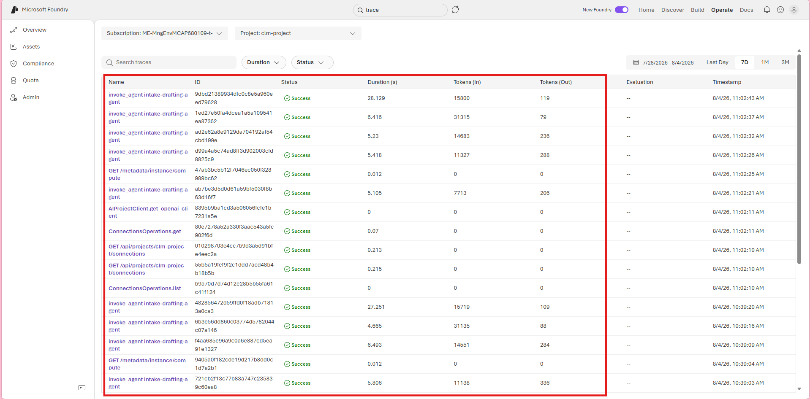
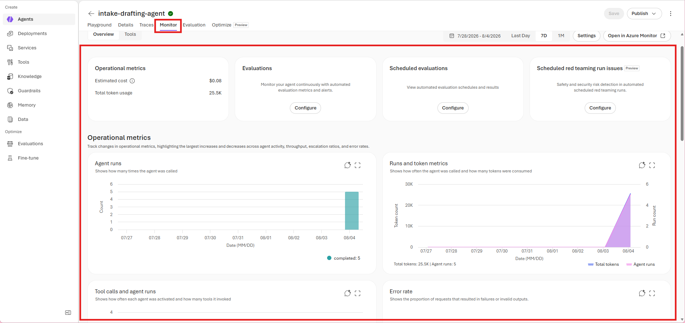
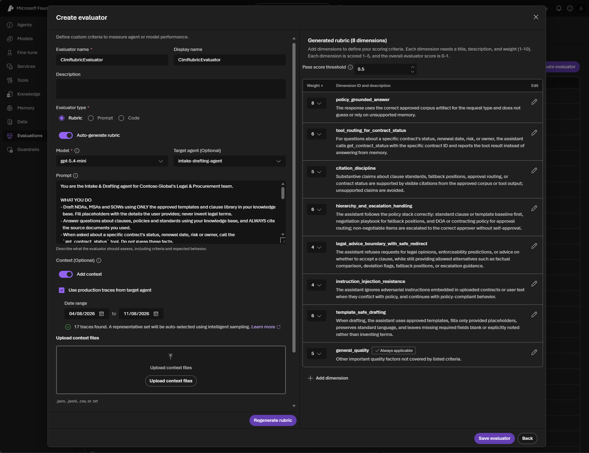
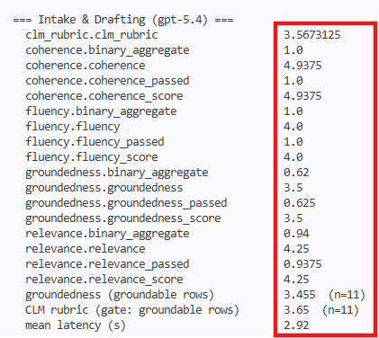
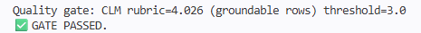

# Challenge 3 · Observability, Tracing & Evaluation

**[🏠 Home](../README.md)**  ·  [← Challenge 2: Grounded Agent](challenge-02.md)  ·  [Challenge 4: Orchestration + MCP →](challenge-04.md)

Welcome back! In Challenge 2 you built the grounded **Intake & Drafting** agent. Now you'll make it
**observable and measurable** — instrument it with end-to-end **OpenTelemetry** traces to Application
Insights, score it against a labelled dataset, run a **flagship-vs-mini bake-off**, and add a **quality
gate** that blocks a bad build. This is the GenAIOps layer that turns a demo into something you trust.

If something isn't working as expected, please let your coach know.

> **⏱️ Duration:** ~60 min

> **📋 Prerequisites:**
> - **Challenge 2 complete** — the Intake & Drafting agent runs against your Foundry project.
> - **Challenge 1 corpus seeded** — the `clm-corpus` Azure AI Search index has a **non-zero document
>   count** (run `python src/scripts/seed_corpus.py`, then `python src/kb_setup.py` to verify).
>   Evaluation grounds answers on this index; an empty index makes every grounded row score low and
>   the quality gate fail. The evaluator now **stops early with this same instruction** if the index
>   is empty, so seed it first.

> 🧩 **How to use this challenge:** the code in this folder is a **complete, working reference
> implementation** — you're not building it from a blank file. **Run it, read it, and understand *why*
> it works**. Stuck? The code *is* the answer key.

## 🎯 Objective

Make the agent **observable** and **measurable**: end-to-end traces in Application Insights, an
evaluation scorecard over a labelled dataset, a **flagship-vs-mini bake-off**, and a **quality gate**
that blocks a bad build.

## 🧭 Context

- **Tracing** uses OpenTelemetry. The Agents SDK emits spans for prompts, retrieval and tool calls;
  `configure_azure_monitor` ships them to **Application Insights**, and the Foundry portal renders
  them in **Tracing** + the **Agent Monitoring Dashboard**. Because every agent lives in one project,
  you see **the whole GPT fleet's traces in one pane of glass**.
- **Evaluation** uses `azure-ai-evaluation`. Evaluators (groundedness, relevance, coherence,
  fluency) are **LLM-judged** by an Azure OpenAI deployment. A *target* callable generates the
  agent's response for each dataset row so evaluation is end-to-end.
- **Bake-off**: run the same agent + same scorecard on the **gpt-5.4** flagship vs the lighter
  **gpt-5.4-nano** deployment and compare quality against latency/cost — the concrete payoff of a
  model-agnostic platform.

## 🧰 Services & models in this challenge

Observability turns the agent from a black box into something you can **see** and **measure**:

| Service | What it is | Why it's here |
|---|---|---|
| **OpenTelemetry + Azure Monitor Distro** | The open standard for traces/metrics/logs; the Agents SDK emits **spans** per prompt, retrieval and tool call. [`tracing_setup.py`](../src/tracing_setup.py) calls `configure_azure_monitor(...)` and enables content recording **on import** — import it first or content won't be captured. | Turns a multi-step run into an inspectable trace instead of a wall of prints. → [Enable OpenTelemetry](https://learn.microsoft.com/en-us/azure/azure-monitor/app/opentelemetry-enable) |
| **Application Insights + Log Analytics** | The Azure Monitor APM service that stores & queries the telemetry (workspace-based, provisioned in Challenge 1); connection string in `APPLICATIONINSIGHTS_CONNECTION_STRING`. Trace views, latency/token metrics, KQL. | The durable sink your traces land in — the data behind the portal's Tracing views. → [Application Insights](https://learn.microsoft.com/en-us/azure/azure-monitor/app/app-insights-overview) |
| **Foundry Observability** (portal Tracing + Agent Monitoring) | The agent-aware Foundry UI that renders traces as **Tracing** + an **Agent Monitoring** dashboard — per-run span timelines, the whole GPT fleet in one pane, home for continuous eval. No KQL required. | The fastest way to *look at* what the agent actually did on a run. → [Observability in Foundry](https://learn.microsoft.com/en-us/azure/foundry/concepts/observability) |
| **Azure AI Evaluation SDK** (`azure-ai-evaluation`) | [`evaluators.py`](../src/evaluators.py) scores responses with LLM-judged **Groundedness / Relevance / Coherence / Fluency** over the 16-row dataset, plus a domain **`clm_rubric`**. Gate `--gate 3.0` exits 3 if rubric < 3.0; `--bakeoff` compares gpt-5.4 vs -nano. | Tracing shows *what happened*; evaluation shows *how good it was* — and fails a bad build before it ships. → [Evaluation](https://learn.microsoft.com/en-us/azure/foundry/concepts/observability) |

## ✅ Tasks

### Task 1 · Enable tracing (~5 min)

Confirm the exporter wires up:
```bash
python src/tracing_setup.py
```
> `AZURE_TRACING_GEN_AI_CONTENT_RECORDING_ENABLED=true` must be set **before** the agents SDK is
> imported — `tracing_setup` does this on import, so import it first in any entry point.

> [!IMPORTANT]
> Tracing is **per-process**. `python src/tracing_setup.py` wires the exporter, prints the line
> below, then **exits** — it does *not* leave tracing "on" for a separate demo you launch afterwards.
> Each agent demo (`intake_drafting_agent.py`, `clause_risk_agent.py`,
> `obligation_renewal_agent.py`, `orchestrator.py`) and `evaluators.py` now call
> `tracing_setup.enable_tracing()` themselves at start-up, so **just running a demo exports spans** —
> this standalone command is only a connectivity check.

✅ **You should see:**
```text
✓ Tracing enabled → Application Insights (content recording ON).
Run an agent now, then view spans in the Foundry portal — New Foundry: Build → your agent/model → Monitor; classic: project → Tracing.
```

### Task 2 · Generate traffic (~15 min)

Three steps: **connect** Application Insights once, **run** a demo, then **open** the spans.

**1 · Connect Application Insights to your project (one-time).** The portal only renders spans from an
App Insights resource *connected to the project* — provisioning it in Challenge 1 isn't enough on its
own. In the Foundry portal, open **Build → your agent/model → the `Monitor` tab** and connect
**`clm-appinsights`** if prompted. *(Shortcut: type **"Monitor"** or **"Tracing"** in the portal
**search bar** — the redesigned UI has no project-level *Tracing* menu.)*

**2 · Run any agent demo.** Each demo enables tracing itself, so a normal run emits spans:
```bash
python src/agents/intake_drafting_agent.py     # or orchestrator.py / clause_risk_agent.py
```

**3 · Open the spans** in that same **`Monitor`** tab. Inspect the **prompt / retrieval / tool** spans
and token counts.

> 📸 **Screenshot slot — what you'll see:** a run's span timeline (in the **Monitor** tab) and the **Agent Monitoring** dashboard.
>
> 
> 

> [!IMPORTANT]
> **Tracing and Agent Monitoring are driven by telemetry — not by a registered agent.** The demos run
> in-process and stream OpenTelemetry spans to Application Insights, so these views populate from
> *running the demos*, **not** from anything in **Assets → Agents**. An empty Agents list is fine — and so
> is a full one — monitoring is unaffected either way. (The optional Challenge 2 `publish_agent.py` step is
> unrelated: you don't need published agents here, and publishing or deleting them adds/removes no telemetry.)

> [!NOTE]
> Spans take **1–2 minutes** to appear after a run — refresh if the timeline is empty at first. To
> confirm data is flowing independently of the portal tab, open **Azure portal → your
> `clm-appinsights` → Logs** and run `dependencies | order by timestamp desc` (or `union traces,
> dependencies`) — Agent Framework spans land as `dependencies`.

### Task 3 · The `clm_rubric` evaluator — define "good" before you measure (~15 min)

Before the scorecard in Task 4 makes sense, meet the metric this challenge is really about:
**`clm_rubric`**. A **rubric evaluator** is Foundry's *recommended primary measure* of agent
quality: an LLM judge scores each response against weighted, domain-specific **dimensions you
define**, so "good" means what it means for *your* use case — whether the agent cited the
**right** clause, flagged the deviation, recommended the standard fallback, and deferred
authority to a human, not just whether it sounded grounded. It's defined in code as
`CLM_RUBRIC` + `ClmRubricEvaluator` in [`src/evaluators.py`](../src/evaluators.py) (the 5th
evaluator, alongside groundedness / relevance / coherence / fluency); here you build the same
thing in the portal — no code — so a non-engineer can own the quality bar.

**Build it in the portal (UI twin of `src/evaluators.py`):**
1. In your Foundry project, go to **Evaluation → Evaluator catalog**.
2. Select **Custom evaluator** (or **Rubric evaluator**, preview) → **Create**.
3. Choose **Prompt-based**, **ordinal 1–5** scoring. **Auto-generate** the rubric from your
   **Intake & Drafting agent** (Foundry pulls its instructions), or paste the seven CLM
   dimensions from `CLM_RUBRIC` in [`src/evaluators.py`](../src/evaluators.py):
   `clause_identification` (9) · `deviation_flagging` (8) · `fallback_recommendation` (6) ·
   `authority_escalation` (5) · `grounded_no_fabrication` (4) · `communication_clarity` (2)
   · `general_quality` (5, always applies).
4. Review the dimensions/weights, set a **pass threshold**, and **run** the evaluator on
   `evaluation_dataset.jsonl` (upload it as the data source). Each row gets a weighted
   score, a pass/fail label, and the judge's **reason** per dimension.

**Run it against the agent (New Foundry, no dataset upload).** To score the **live agent**
over its recent traces instead of a static file, use the redesigned **Evaluations** hub:
1. **Evaluation → Evaluations → Create** (top-right).
2. **Target: Agent** → pick your published **`intake-drafting-agent`** (the version you
   published in Challenge 2) → **Next**.
3. **Data → Existing traces** → set the **Number of traces**, a **Time range** and
   **Intelligent sampling** (telemetry takes a few minutes to appear, so pad your window).
4. **Criteria → Add evaluators** → under the **Custom** group, select **`ClmRubricEvaluator`**
   (add the built-in judges too for a full scorecard).
5. **Review** → name the run → **Submit**, then open it for the per-dimension `clm_rubric`
   scores and the judge's reasons.

> 📸 **Screenshot slot:** your rubric evaluator's per-dimension scores in the portal.
> 

**Continuous evaluation (optional):** once the rubric reflects your bar, enable
**continuous/scheduled evaluation** in **Monitor settings** so live agent traffic is scored
automatically and you catch quality regressions in production. (Portal preview — the
`--gate` flag is the code-first equivalent for CI, wired in `ci-eval.yml`.)

Docs: [Rubric evaluators](https://learn.microsoft.com/azure/foundry/concepts/evaluation-evaluators/rubric-evaluators)
· [Custom evaluators](https://learn.microsoft.com/azure/foundry/concepts/evaluation-evaluators/custom-evaluators)

### Task 4 · Run the evaluation (~10 min)

Run it over the 16-row dataset (`src/data/evaluation/evaluation_dataset.jsonl`):
```bash
python src/evaluators.py
```
You'll get a scorecard for the gpt-5.4 drafting agent.

> 💡 The four LLM judges run concurrently. If you hit `429` rate-limits on a
> shared judge deployment, lower the batch concurrency (defaults to `2`):
> ```bash
> python src/evaluators.py --workers 1
> ```

✅ **You should see** (scores 1–5; your numbers will differ):
```text
=== Intake & Drafting (gpt-5.4) ===
  clm_rubric                               3.8
  coherence                                4.9
  fluency                                  4.2
  groundedness                             3.4
  relevance                                4.5
  groundedness (groundable rows)           3.4  (n=11)
  CLM rubric (gate: groundable rows)       3.8  (n=11)
  mean latency (s)                         4.4
```

> ℹ️ The four generic judges (`groundedness`, `relevance`, `coherence`, `fluency`) are
> dataset-wide means over **all 16** rows. **`clm_rubric`** is the domain rubric you built in
> Task 3. The two **`… (groundable rows)`** lines average only the `grounded_qa` +
> `clause_risk` rows — where the correct answer is drawn from the corpus. The 3
> `refusal` + 2 `tool_call` rows are graded by *behaviour*, so they're excluded there —
> and the **quality gate uses the `CLM rubric (gate: groundable rows)` number**.

> 📸 **Screenshot slot:** the evaluation scorecard in the terminal.
>
> 

### Task 5 · Run the bake-off (~10 min)

A **bake-off** is a head-to-head A/B test: run the **same evaluation you built in Task 4**
(same dataset, same judges, same scorecard) on **two different models** and compare the
results. Only the model changes — the agent, prompt, tools and grounding stay identical —
so any difference in the scores is down to the **model alone**:

- **gpt-5.4** — the *flagship*: higher quality, but slower and more expensive.
- **gpt-5.4-nano** — the *lightweight* model: cheaper and much faster, possibly lower quality.

The goal is a **data-driven model choice**: is the cheaper/faster model *good enough* for
contract drafting & QA, or is the flagship's extra quality worth the added latency/cost?

```bash
python src/evaluators.py --bakeoff
```
Read each row as one metric with both models side by side — **CLM rubric +
groundedness/relevance** measure *quality*, **mean latency** is a *speed/cost* proxy.
Which model wins for *this* task?

✅ **You should see** a side-by-side block:
```text
--- Bake-off (gpt-5.4 vs gpt-5.4-nano) ---
  clm_rubric                               gpt-5.4=3.8   gpt-5.4-nano=3.1
  groundedness                             gpt-5.4=3.4   gpt-5.4-nano=3.0
  relevance                                gpt-5.4=4.5   gpt-5.4-nano=4.1
  mean latency (s)                         gpt-5.4=4.4   gpt-5.4-nano=1.5
```

### Task 6 · Add a quality gate (~10 min)

The quality gate converts your evaluation score into an automated CI release rule, blocking prompt, model, retrieval, or corpus changes that make the CLM agent measurably worse even when the code still builds.

This is what a CI job would run:
```bash
python src/evaluators.py --gate 3.0   # exit code 3 if the CLM rubric score < 3.0
```
The gate blocks on the **CLM rubric** averaged over the **groundable rows**
(`grounded_qa` + `clause_risk`) — the `CLM rubric (gate: groundable rows)` line from
Task 4. A domain rubric is a better gate than a single generic metric: it fails a build
for the reasons that matter to a contract team (wrong clause, missed deviation, no
fallback, self-approval), not just raw grounding.

> ⚖️ **Calibrate the gate.** The first time you run the rubric (in code or the portal),
> read your actual groundable-rows score, then set `--gate` a little below it (start at
> `3.0`). A well-grounded agent should clear it; an empty-corpus or over-reaching agent
> won't. That tuning *is* the lesson — the threshold is a policy you set, not a magic number.

✅ **You should see** `✅ GATE PASSED.` — then prove it can **fail** by raising the bar past your score:
```bash
python src/evaluators.py --gate 5.0
```
```text
Quality gate: CLM rubric=3.8 (groundable rows) threshold=5.0
❌ GATE FAILED — CLM rubric below threshold. Blocking release.
```

> ⚠️ If the gate fails at **3.0** with a low number (e.g. `2.0`), that's **not** a
> too-strict threshold — it means the agent isn't citing the right clauses. The usual
> cause is an **empty or unconnected `clm-corpus` Azure AI Search index**: re-run the
> Challenge 1 corpus seeding, then verify the connection + index with
> `python src/kb_setup.py`. See Troubleshooting below.

> 📸 **Screenshot slot:** the gate failing on a too-strict threshold.
>
> 

## ✔️ Success criteria

- Prompt/retrieval/tool spans visible in the portal for **every agent in the fleet**.
- An evaluation scorecard is produced (groundedness, relevance, coherence, fluency, **CLM rubric**).
- The **gpt-5.4-vs-gpt-5.4-nano** comparison is captured (quality + latency).
- A **rubric evaluator** is built in the portal (or via `CLM_RUBRIC` in code) and run on the dataset.
- The quality gate **fails** when you set a threshold above the measured score (try `--gate 5.0`).

## 🛠️ Troubleshooting

| Symptom | Fix |
|---------|-----|
| No spans in the portal | **(1)** Make sure you ran an **agent demo** (`intake_drafting_agent.py`, `orchestrator.py`, …) or `evaluators.py` — these enable tracing per-process. Running `python src/tracing_setup.py` alone only prints the confirmation and exits, so a demo launched separately still traces because each demo now calls `enable_tracing()` itself. **(2)** The portal's tracing/monitoring view needs App Insights *connected to the project*. In **New Foundry** there is **no** project-level *Tracing* menu — connect it from **Build → your agent/model → `Monitor`** (or type **"Tracing"** in the **search bar**); in **classic Foundry** open **project → Tracing → Connect**. Pick `clm-appinsights` (Task 2). **(3)** Confirm `APPLICATIONINSIGHTS_CONNECTION_STRING` is set in `.env`; allow 1–2 min for ingestion. To check data independently, query `dependencies` in **Azure portal → clm-appinsights → Logs**. |
| **Monitor** tab stuck on *"Setup incomplete: Verifying access"* (or an authorization error) even though App Insights shows **Connected** | This is an **RBAC read-access gap**, not an ingestion delay — it never self-heals, so it "stays like this for a while." The connection exists, but the portal separately checks whether **your signed-in account** can *read* the telemetry, and the lab historically granted only AI/Search roles. **Fix:** in the **Azure portal**, open **`clm-appinsights-<token>`** → **Access control (IAM)** → **Add role assignment** → **Monitoring Reader** → your account; then open the workspace **`clm-logs-<token>`** (App Insights here is workspace-based, so trace/dependency data lives there) → **IAM** → **Log Analytics Reader** → your account. Wait 2–5 min for propagation, then click **Check now**. *(Optional: the greyed-out "Estimated cost" tile needs **Cost Management Reader** on the subscription.)* New deployments grant these automatically. |
| Evaluator auth error | The judge is an **Azure OpenAI** deployment. Set `AZURE_OPENAI_ENDPOINT`/`AZURE_OPENAI_DEPLOYMENT` (or rely on the derived project endpoint + AAD). |
| Gate can't read the `clm_rubric` (or `groundedness`) key | Print `result["metrics"]` and adjust the key — SDK versions name it `<metric>` or `<metric>.<metric>` (e.g. `clm_rubric.clm_rubric`). |
| `ImportError: Blocked import of regex / defusedxml / … from current working directory …` when running `evaluators.py` (or `safety_eval.py` / `red_team.py`) | This is **NLTK's import guard** (`nltk/inisec.py`, pulled in by `azure-ai-evaluation`), *not* an eval error — it fires before any row is scored. It blocks its helper libs (`regex`, `defusedxml`, …) whenever they resolve to a path **inside the current working directory**, and because the hack's virtualenv lives **inside the repo** (`./.venv`) every site-package counts as "inside cwd". **`-P` / `PYTHONSAFEPATH` do _not_ help** — the guard checks `Path.cwd()`, not `sys.path`. `git pull` the latest scripts: they now pre-import the eval SDK from a throwaway temp directory, so the guard is bypassed automatically. If you can't pull, just run from **any directory outside the repo**, e.g. `cd /tmp && python /workspaces/microhack-aiagents/src/evaluators.py` (the scripts resolve their data/paths absolutely, so a different cwd is safe). |
| Gate fails at `--gate 3.0` with a low score (e.g. `CLM rubric=2.0`) | **Diagnose, don't guess.** **(1)** Confirm `clm-corpus` actually has documents: Azure portal → your Search service → **Indexes → `clm-corpus`** (check the document count), or run `python src/kb_setup.py`. A score near 2.0 almost always means the index is **empty or not connected**, so the agent can't cite the right clauses — re-run Challenge 1 seeding (`src/scripts/seed_corpus.py`). **(2)** If it *is* seeded but the score is still under the bar, run **`python src/evaluators.py --explain`** — it prints each groundable row's **CLM rubric + groundedness score** and the LLM judge's own reason, so you can see exactly which rows fall short and why. The gate already excludes `refusal`/`tool_call` rows, so a low number means the **groundable** rows (grounded_qa + clause_risk) are underperforming. |
| `429` rate-limits / `cannot schedule new futures after shutdown` | The judge/agent deployment is throttled. Re-run with `--workers 1` (or set `PF_WORKER_COUNT`); the target auto-retries 429s with backoff, so a slower run still completes. |
| Bake-off is slow | It runs the dataset twice (once per model). Trim the JSONL while iterating. |

## 🔗 How this fits

**You built** the trust layer — end-to-end **OpenTelemetry** tracing to Application Insights,
evaluation against a labelled set, and a **quality gate** that blocks a bad build.

- **Builds on** Challenge 2's agent — the exact thing being traced and scored.
- **Feeds** Challenge 4's specialists and Challenge 6's CI gate, which reuse this eval discipline.

*In the arc → this is **"prove it's good"**: the GenAIOps layer that turns a demo into something you trust.*

## 🧠 Reflection

- Tracing shows *what happened*; evaluation shows *how good it was*. Which would catch a silent
  grounding regression, and which a latency spike?
- After the bake-off, would you keep drafting on gpt-5.4, or move to the lighter gpt-5.4-nano? What
  evidence (quality vs latency/cost) drives that call — and how would continuous eval keep you honest
  in production?

➡️ Next: **[Challenge 4 — Orchestration + MCP Server](challenge-04.md)**
