# Challenge 3 · Observability, Tracing & Evaluation

**[🏠 Home](../README.md)**  ·  [← Challenge 2: Grounded Agent](challenge-02.md)  ·  [Challenge 4: Orchestration + MCP →](challenge-04.md)

Welcome back! In Challenge 2 you built the grounded **Intake & Drafting** agent. Now you'll make it
**observable and measurable** — instrument it with end-to-end **OpenTelemetry** traces to Application
Insights, score it against a labelled dataset, run a **flagship-vs-mini bake-off**, and add a **quality
gate** that blocks a bad build. This is the GenAIOps layer that turns a demo into something you trust.

If something isn't working as expected, please let your coach know.

> **⏱️ Duration:** ~60 min

> **📋 Prerequisites:**
> - **Challenge 2 complete** — the Intake & Drafting agent runs against your Foundry project.

> 🧩 **How to use this challenge:** the code in this folder is a **complete, working reference
> implementation** — you're not building it from a blank file. **Run it, read it, and understand *why*
> it works**, then take it further with **🚀 Go Further**. Stuck? The code *is* the answer key.

## 🎯 Objective

Make the agent **observable** and **measurable**: end-to-end traces in Application Insights, an
evaluation scorecard over a labelled dataset, a **flagship-vs-mini bake-off**, and a **quality gate**
that blocks a bad build.

## 🧭 Context

- **Tracing** uses OpenTelemetry. The Agents SDK emits spans for prompts, retrieval and tool calls;
  `configure_azure_monitor` ships them to **Application Insights**, and the Foundry portal renders
  them in **Tracing** + the **Agent Monitoring Dashboard**. Because every agent lives in one project,
  you see **the whole GPT fleet's traces in one pane of glass**.
- **Evaluation** uses `azure-ai-evaluation`. Evaluators (groundedness, relevance, coherence,
  fluency) are **LLM-judged** by an Azure OpenAI deployment. A *target* callable generates the
  agent's response for each dataset row so evaluation is end-to-end.
- **Bake-off**: run the same agent + same scorecard on the **gpt-5.4** flagship vs the lighter
  **gpt-5.4-nano** deployment and compare quality against latency/cost — the concrete payoff of a
  model-agnostic platform.

## 🧰 Services & models in this challenge

Observability turns the agent from a black box into something you can **see** and **measure**. These are
the services that make that possible.

### OpenTelemetry + Azure Monitor OpenTelemetry Distro

**What it is:** the **open standard** for traces, metrics and logs. The Agents SDK emits OpenTelemetry
**spans** for every prompt, retrieval and tool call; `configure_azure_monitor(...)` from the Azure Monitor
distro exports them to Azure with one call.

- **Vendor-neutral** instrumentation — no bespoke logging code.
- Captures the **causal chain** of a run (prompt → retrieval → tool → response).
- [`src/tracing_setup.py`](../src/tracing_setup.py) calls `configure_azure_monitor(connection_string=…)`
  and sets `AZURE_TRACING_GEN_AI_CONTENT_RECORDING_ENABLED=true` **on import** — import it first in any
  entry point, or prompt/response content won't be recorded.

**Why here:** it's how a multi-step agent run becomes an inspectable trace instead of a wall of print
statements. → [Enable OpenTelemetry](https://learn.microsoft.com/en-us/azure/azure-monitor/app/opentelemetry-enable)

### Application Insights + Log Analytics

**What it is:** the **Azure Monitor** APM service that **stores and queries** the telemetry. Ch0 provisions
a **workspace-based** Application Insights component wired to a Log Analytics workspace (`PerGB2018` SKU,
30-day retention).

- End-to-end **transaction/trace** views, latency and token metrics, failures.
- **KQL** queries over spans for custom analysis and dashboards.
- Provisioned in **Challenge 1**; the connection string lives in `APPLICATIONINSIGHTS_CONNECTION_STRING`.

**Why here:** it's the durable sink your traces land in — the data source behind the portal's Tracing and
monitoring views. → [Application Insights overview](https://learn.microsoft.com/en-us/azure/azure-monitor/app/app-insights-overview)

### Foundry Observability (portal Tracing + Agent Monitoring)

**What it is:** the **agent-aware UI** in the Foundry portal that renders those traces as **Tracing** and
an **Agent Monitoring Dashboard** — no query-writing required.

- Per-run **span timelines** with retrieval hits and tool arguments.
- Because every agent lives in one project, you see **the whole GPT fleet's traces in one pane of glass**.
- Home for **continuous/online evaluation** on live traffic.

**Why here:** it's the fastest way to *look at* what the agent actually did on a given run.
→ [Observability in Foundry](https://learn.microsoft.com/en-us/azure/foundry/concepts/observability)

### Azure AI Evaluation SDK (`azure-ai-evaluation`)

**What it is:** the library ([`src/evaluators.py`](../src/evaluators.py)) that **scores** agent responses.
`GroundednessEvaluator`, `RelevanceEvaluator`, `CoherenceEvaluator` and `FluencyEvaluator` are **LLM-judged**
by an Azure OpenAI deployment (your `gpt-5.4` / `gpt-5.4-nano`); a `target(query)` callable produces the
agent's answer for each of the **16 rows** in `src/data/evaluation/evaluation_dataset.jsonl`.

- Ready-made **quality** and **safety** evaluators (safety ones take `azure_ai_project` + a credential).
- The gate `python src/evaluators.py --gate 4.0` **exits 3** if groundedness < 4.0 — drop-in for CI.
- `--bakeoff` reruns the same scorecard on **gpt-5.4 vs gpt-5.4-nano** to weigh quality against latency/cost.

**Why here:** tracing shows *what happened*; evaluation shows *how good it was* — and lets a bad build
**fail the gate** before it ships. → [Evaluation & observability](https://learn.microsoft.com/en-us/azure/foundry/concepts/observability)

## ✅ Tasks

### Task 1 · Enable tracing (~5 min)

Confirm the exporter wires up:
```bash
python src/tracing_setup.py
```
> `AZURE_TRACING_GEN_AI_CONTENT_RECORDING_ENABLED=true` must be set **before** the agents SDK is
> imported — `tracing_setup` does this on import, so import it first in any entry point.

> [!IMPORTANT]
> Tracing is **per-process**. `python src/tracing_setup.py` wires the exporter, prints the line
> below, then **exits** — it does *not* leave tracing "on" for a separate demo you launch afterwards.
> Each agent demo (`intake_drafting_agent.py`, `clause_risk_agent.py`,
> `obligation_renewal_agent.py`, `orchestrator.py`) and `evaluators.py` now call
> `tracing_setup.enable_tracing()` themselves at start-up, so **just running a demo exports spans** —
> this standalone command is only a connectivity check.

✅ **You should see:**
```text
✓ Tracing enabled → Application Insights (content recording ON).
Run an agent now; open Foundry portal → Tracing to see spans.
```

> 📸 **Screenshot slot:** the "Tracing enabled" confirmation.
>
> 

### Task 2 · Generate traffic (~15 min)

**One-time — connect Application Insights to your project.** The Foundry portal **Tracing** tab only
renders spans from an App Insights resource that is *connected to the project*; provisioning the
resource in Challenge 1 is not enough on its own. In the portal open your **project → Tracing** (or
**Observability → Tracing**) and, if prompted, click **Connect** and pick the `clm-appinsights`
resource. *(Fresh `azd up` / `deploy.ps1` / `deploy.sh` deployments now create this connection for
you — this step is only needed if Tracing still shows "connect a resource".)*

Then run any agent demo — each one enables tracing itself, so a normal run emits spans:
```bash
python src/agents/intake_drafting_agent.py     # or orchestrator.py / clause_risk_agent.py
```
Open **Foundry portal → Tracing** and inspect the **prompt / retrieval / tool** spans and token counts.

> 📸 **Screenshot slot — what you'll see:** a run's span timeline in **Tracing**, and the **Agent Monitoring** dashboard.
>
> 
> 

> [!IMPORTANT]
> **Tracing and Agent Monitoring are driven by telemetry — not by a registered agent.** The demos run
> in-process and stream OpenTelemetry spans to Application Insights, so these views populate from
> *running the demos*, **not** from anything in **Assets → Agents**. An empty Agents list is expected and
> does not affect monitoring. (The optional Challenge 2 `publish_agent.py` step is unrelated: you don't
> need a published agent here, and deleting one removes no telemetry.)

> [!NOTE]
> Spans take **1–2 minutes** to appear after a run — refresh if the timeline is empty at first. To
> confirm data is flowing independently of the portal tab, open **Azure portal → your
> `clm-appinsights` → Logs** and run `dependencies | order by timestamp desc` (or `union traces,
> dependencies`) — Agent Framework spans land as `dependencies`.

### Task 3 · Run the evaluation (~10 min)

Run it over the 16-row dataset (`src/data/evaluation/evaluation_dataset.jsonl`):
```bash
python src/evaluators.py
```
You'll get a scorecard for the gpt-5.4 drafting agent.

> 💡 The four LLM judges run concurrently. If you hit `429` rate-limits on a
> shared judge deployment, lower the batch concurrency (defaults to `2`):
> ```bash
> python src/evaluators.py --workers 1
> ```

✅ **You should see** (scores 1–5; your numbers will differ):
```text
=== Intake & Drafting (gpt-5.4) ===
  groundedness                             4.6
  relevance                                4.4
  coherence                                4.7
  fluency                                  4.8
  groundedness (gate: groundable rows)     4.6  (n=11)
  mean latency (s)                         3.2
```

> ℹ️ The plain `groundedness` line is the dataset-wide mean over **all 16** rows.
> The **`groundedness (gate: groundable rows)`** line is the mean over only the
> `grounded_qa` + `clause_risk` rows — the ones where the correct answer is drawn
> from the corpus. The 3 `refusal` + 2 `tool_call` rows are graded by *behaviour*,
> not grounding, so they're excluded here — and the **quality gate uses this number**.

> 📸 **Screenshot slot:** the evaluation scorecard in the terminal.
>
> 

### Task 4 · Run the bake-off (~10 min)

gpt-5.4 (flagship) vs gpt-5.4-nano (lightweight) on the same scorecard:
```bash
python src/evaluators.py --bakeoff
```
Compare groundedness/relevance vs mean latency. Which model wins for *this* task?

✅ **You should see** a side-by-side block:
```text
--- Bake-off (gpt-5.4 vs gpt-5.4-nano) ---
  groundedness                             gpt-5.4=4.6   gpt-5.4-nano=4.2
  relevance                                gpt-5.4=4.4   gpt-5.4-nano=4.1
  mean latency (s)                         gpt-5.4=3.2   gpt-5.4-nano=1.1
```

### Task 5 · Add a quality gate (~10 min)

This is what a CI job would run:
```bash
python src/evaluators.py --gate 4.0   # exit code 3 if groundedness < 4.0
```
The gate measures groundedness over the **groundable rows** (`grounded_qa` +
`clause_risk`) — the `groundedness (gate: groundable rows)` line from Task 3.

✅ **You should see** `✅ GATE PASSED.` — then prove it can **fail** by raising the bar past your score:
```bash
python src/evaluators.py --gate 5.0
```
```text
Quality gate: groundedness=4.6 (groundable rows) threshold=5.0
❌ GATE FAILED — groundedness below threshold. Blocking release.
```

> ⚠️ If the gate fails at **4.0** with a low number (e.g. `2.75`), that's **not** a
> too-strict threshold — it means the agent isn't grounding well. The usual cause
> is an **empty or unconnected `clm-corpus` Azure AI Search index**: re-run the
> Challenge 1 corpus seeding, then verify the connection + index with
> `python src/kb_setup.py`. See Troubleshooting below.

> 📸 **Screenshot slot:** the gate failing on a too-strict threshold.
>
> 

### Task 6 · (Portal) Continuous evaluation (~10 min)

In the portal, enable **continuous/online evaluation** on the
agent so production traffic is scored automatically. (This is portal-only preview — no stable
Python API yet; the `--gate` flag is the code-first equivalent for CI.)

## ✔️ Success criteria

- Prompt/retrieval/tool spans visible in the portal for **every agent in the fleet**.
- An evaluation scorecard is produced (groundedness, relevance, coherence, fluency).
- The **gpt-5.4-vs-gpt-5.4-nano** comparison is captured (quality + latency).
- The quality gate **fails** when you set a threshold above the measured score (try `--gate 5.0`).

## 🚀 Go Further

- Add **safety** evaluators (`ContentSafetyEvaluator`) — these take `azure_ai_project` + a credential
  instead of a `model_config`.
- Add a **`ToolCallAccuracyEvaluator`** for the `get_contract_status` tool rows.
- Run **AI red teaming** against the agent and add adversarial rows to the dataset.
- Wire `--gate` into a GitHub Action so PRs are blocked on a groundedness regression.

## 🛠️ Troubleshooting

| Symptom | Fix |
|---------|-----|
| No spans in the portal | **(1)** Make sure you ran an **agent demo** (`intake_drafting_agent.py`, `orchestrator.py`, …) or `evaluators.py` — these enable tracing per-process. Running `python src/tracing_setup.py` alone only prints the confirmation and exits, so a demo launched separately still traces because each demo now calls `enable_tracing()` itself. **(2)** The portal **Tracing** tab needs App Insights *connected to the project* — open **project → Tracing → Connect** and pick `clm-appinsights` (Task 2). **(3)** Confirm `APPLICATIONINSIGHTS_CONNECTION_STRING` is set in `.env`; allow 1–2 min for ingestion. To check data independently, query `dependencies` in **Azure portal → clm-appinsights → Logs**. |
| Evaluator auth error | The judge is an **Azure OpenAI** deployment. Set `AZURE_OPENAI_ENDPOINT`/`AZURE_OPENAI_DEPLOYMENT` (or rely on the derived project endpoint + AAD). |
| `groundedness` key not found by the gate | Print `result["metrics"]` and adjust the key — SDK versions name it `groundedness` or `groundedness.groundedness`. |
| `ImportError: Blocked import of regex / defusedxml / … from current working directory …` when running `evaluators.py` (or `safety_eval.py` / `red_team.py`) | This is **NLTK's import guard** (NLTK is pulled in by `azure-ai-evaluation`), *not* an eval error — it fires before any row is scored. `git pull` the latest scripts: they now automatically re-run themselves under `PYTHONSAFEPATH`, which makes the guard stand down for **every** such module. If you can't pull, launch in safe-path mode yourself: `PYTHONSAFEPATH=1 python src/evaluators.py` (equivalently `python -P src/evaluators.py`). |
| Gate fails at `--gate 4.0` with a low score (e.g. `groundedness=2.75`) | Not a too-strict threshold — the agent isn't grounding. Your **`clm-corpus` Azure AI Search index is empty or not connected**, so answers aren't drawn from the corpus. Re-run the Challenge 1 corpus seeding (`src/scripts/seed_corpus.py` / SharePoint indexer), then verify the default Search connection + index resolve with `python src/kb_setup.py`. The gate already excludes `refusal`/`tool_call` rows, so a low number means the **groundable** rows themselves are underperforming. |
| `429` rate-limits / `cannot schedule new futures after shutdown` | The judge/agent deployment is throttled. Re-run with `--workers 1` (or set `PF_WORKER_COUNT`); the target auto-retries 429s with backoff, so a slower run still completes. |
| Bake-off is slow | It runs the dataset twice (once per model). Trim the JSONL while iterating. |

## 🧠 Reflection

- Tracing shows *what happened*; evaluation shows *how good it was*. Which would catch a silent
  grounding regression, and which a latency spike?
- After the bake-off, would you keep drafting on gpt-5.4, or move to the lighter gpt-5.4-nano? What
  evidence (quality vs latency/cost) drives that call — and how would continuous eval keep you honest
  in production?

➡️ Next: **[Challenge 4 — Orchestration + MCP Server](challenge-04.md)**
