# Challenge 4 · Orchestration + MCP Server

**[🏠 Home](../README.md)**  ·  [← Challenge 3: Observability](challenge-03.md)  ·  [Challenge 5: Publish to M365 →](challenge-05.md)

Welcome back! You have one grounded specialist so far. In this challenge you'll add the **second
specialist** — **Clause & Risk** on GPT-5.6 Sol — then stand up an **Orchestrator** (GPT-5.4) that routes
to both via the **agent-as-tool pattern**, and finally expose the whole workflow as an **MCP server** —
run it locally, then **host it on Azure Container Apps** and call it from a **Foundry** agent by URL.
This is where the system becomes truly **multi-agent**.

If something isn't working as expected, please let your coach know.

> **⏱️ Duration:** ~55 min (Tasks 1–4). Task 4 hosts the MCP server remotely and calls it from Foundry — that's the point of this challenge, so plan for it.

> **📋 Prerequisites:**
> - **Challenge 2 pattern understood** — you know how a grounded agent is built.
> - *Recommended:* Challenge 3 (you'll see orchestration spans in Tracing).

> 🧩 **How to use this challenge:** the code in this folder is a **complete, working reference
> implementation** — you're not building it from a blank file. **Run it, read it, and understand *why*
> it works**. Stuck? The code *is* the answer key.

## 🎯 Objective

Add the **2nd specialist** (Clause & Risk on GPT-5.6 Sol), stand up an **Orchestrator agent** (GPT-5.4)
that routes to both specialists via the **agent-as-tool pattern**, then expose the whole workflow as an **MCP
server** — locally over stdio, then **hosted on Azure Container Apps** and called from a **Foundry** agent by URL.

## 🧭 Context

- **Clause & Risk agent** reuses the Ch1 grounding pattern → fast to build. It compares a
  counterparty draft to the enterprise standard and returns a **risk score**.
- **Orchestrator** (GPT-5.4) uses the Agent Framework's **`agent.as_tool(...)`** to call each specialist as a tool. A
  **GPT-5.4 orchestrator coordinating gpt-5.4 drafting and GPT-5.6 Sol specialists** is multi-model composition in one project. It
  manages routing, hand-offs and human-in-the-loop.
- **MCP** (Model Context Protocol) lets you expose the workflow as standard tools so *any* MCP client
  can reuse it. You'll run it locally over **stdio**, then **host it on Azure Container Apps** over HTTP
  and call it from a **Foundry agent** by URL — same tools, now a network service.

> [!NOTE]
> **Orchestration vs MCP — why both?** They're different layers, not alternatives. **Orchestration**
> (`agent.as_tool`) is the *reasoning brain* that routes each request to the right specialist. **MCP** is
> a *packaging standard* that exposes those same capabilities so clients **outside your code** (VS Code,
> the Foundry Playground, another team's agent) can call them. `orchestrator.py` and `orchestrator_mcp.py`
> are the **same brain** — only *where the tools live* changes (in-process vs. behind MCP).

```
        ┌────────────── Orchestrator (GPT-5.4) ──────────────┐
 user → │  routes + hand-offs + human-in-the-loop            │
        └───────┬───────────────────────────┬───────────────┘
                │ agent-as-tool             │ agent-as-tool
        Intake & Drafting (gpt-5.4)  Clause & Risk (GPT-5.6 Sol)
                └──────────── grounded on Foundry IQ ─────────┘
        Also exposed as an MCP server (local stdio **or** hosted on Azure Container Apps,
        callable from Foundry / another agent): draft_contract · analyze_contract · get_contract_status
```

## 🧰 Services & models in this challenge

This challenge is about **composition** — specialists behind one orchestrator, plus a standard protocol that makes the workflow reusable outside your code:

| Building block | What it is | Why it's here |
|---|---|---|
| **Agent-as-tool** (`agent.as_tool(...)`) | The Agent Framework's multi-agent primitive: wrap an agent as a *tool* and hand it to an orchestrator, which calls specialists like functions. `as_tool(name=…, description=…)` wires them into [`orchestrator.py`](../src/orchestrator.py); each specialist keeps its own model & instructions. | Lets the Orchestrator delegate *drafting* and *clause/risk* to the right specialist instead of one bloated mega-agent. → [Agent Framework](https://learn.microsoft.com/agent-framework/overview/agent-framework-overview) |
| **Model — gpt-5.4** (orchestrator) | The LLM behind the Orchestrator (`MODEL_ORCHESTRATOR`, `GlobalStandard`) — fast, deterministic tool-calling & routing; same Agents API as the specialists (only the `model` id differs). | Routing & drafting share flagship **gpt-5.4**; clause/risk uses **gpt-5.6-sol** — the right GPT deployment per job. → [Models in Foundry](https://learn.microsoft.com/azure/ai-foundry/) |
| **Model Context Protocol (MCP)** | An open standard for exposing tools/data to any LLM client. `src/mcp_server/server.py` serves `draft_contract` · `analyze_contract` · `get_contract_status` over **stdio**; any client (VS Code, Copilot) — or an agent via `src/orchestrator_mcp.py` (`MCPStdioTool`) — can discover and call them. | Turns your agents into reusable building blocks the rest of the org can call **without touching your code**. → [Model Context Protocol](https://modelcontextprotocol.io/docs/getting-started/intro) |
| **Azure SQL Database** *(optional)* | The managed store behind `get_contract_status`, provisioned only with `deploySql=true` (`Basic`, db `clmdb`, table `dbo.contracts`); queried via **pyodbc** in [`tools.py`](../src/clm_common/tools.py). Without it, the tool falls back to `contracts_seed.json`. | Structured contract facts belong in a queryable database, not the model's memory. → [Azure SQL](https://learn.microsoft.com/en-us/azure/azure-sql/database/sql-database-paas-overview?view=azuresql) |

## ✅ Tasks

### Task 1 · Build the Clause & Risk agent (~10 min)

Analyze the (deliberately red-flag) sample drafts. By
default it analyzes **both** inbound drafts (`acme_msa_draft.pdf` and `globex_nda_redline.pdf`),
reusing one agent:
```bash
python src/agents/clause_risk_agent.py
# analyze a single draft instead:
python src/agents/clause_risk_agent.py --draft src/data/counterparty_drafts/globex_nda_redline.pdf
```
Expect: per draft, a clause table, flagged deviations (e.g. uncapped liability, 60-day
auto-renew) with the negotiation-playbook fallback for items to negotiate, **High** risk with
top-3 issues and the required approver per the delegation-of-authority matrix, all cited against
the standard clause library.

✅ **You should see** (wording/format will vary — the analysis is the point):
```text
✓ Built clause-risk-agent on model 'gpt-5.6-sol'

――――――――――――――――――――――――――――――――――――――――――――――――――――――――――――――――――――――――――――――
DRAFT: acme_msa_draft.pdf
Clause review:
  • Limitation of liability — UNCAPPED vs standard 12-month cap [CL-04]  → ❌ deviation
  • Auto-renewal — 60-day vs standard 30-day notice [CL-07]             → ⚠️ deviation
Risk: HIGH · Top issues: uncapped liability, long auto-renew, one-sided indemnity
Required approver: VP Legal (delegation-of-authority matrix)
```

> 📸 **Screenshot slot:** the clause table + High-risk verdict with citations.
>
> 

> [!TIP]
> **Want to see this agent in the Foundry portal?** `python src/agents/publish_agent.py` (from Challenge 2)
> publishes **all** the specialists — including `clause-risk-agent` (gpt-5.6-sol) — so it shows up in
> portal → **Agents** and opens in the **Playground**. Optional; the demo output above is the real evidence.

### Task 2 · Build the Orchestrator (~10 min)

With both specialists connected, run a multi-step thread
(draft → analyze → status):
```bash
python src/orchestrator.py
```
Note which specialist the orchestrator says it used for each turn.

✅ **You should see** the orchestrator delegate each turn to the right specialist:
```text
✓ Orchestrator on 'gpt-5.4' with 2 specialists as tools

――――――――――――――――――――――――――――――――――――――――――――――――――――――――――――――――――――――――――――――
USER: Draft an NDA for Northwind, review the Acme MSA draft, and give me CT-4821's status.
ORCHESTRATOR: [→ intake_drafting] Draft ready... [→ clause_risk] Acme draft is HIGH risk...
              [→ get_contract_status] CT-4821 is Active, renews 2026-09-01.
```

> 📸 **Screenshot slot:** the orchestrator thread routing across specialists.
>
> 

### Task 3 · Verify the MCP server exposes its tools (~5 min)

The server speaks **two transports** from the same code: **stdio** for local dev (what VS Code
launches) and **streamable HTTP** for remote hosting (Task 4). Start locally here, then go remote next.

**Verify the tools are registered** — this needs no client and exits on its own:
```bash
python src/mcp_server/server.py --list
```
```text
clm-mcp exposes 3 tool(s):
  • draft_contract: Draft a contract from Contoso Global's approved templates.
  • analyze_contract: Extract clauses from a counterparty draft, compare to standard, and return a risk score.
  • get_contract_status: Look up a contract's status, renewal date, risk and owner by ID (e.g. "CT-4821").
```

That's all you need before hosting it in Task 4.

<details>
<summary>💻 <b>(Optional) Run it locally over stdio & call it from your own agent — click to expand</b></summary>

Start it over stdio the way a client will — it sits there with **no output, which is success, not a hang**
(a stdio server waits silently for a client); press `Ctrl-C` to stop:
```bash
python src/mcp_server/server.py       # serves over stdio — silent = waiting for a client (Ctrl-C to stop)
```

Or let the Orchestrator spawn it for you and drive all three tools end-to-end — no IDE, no second terminal:
```bash
python src/orchestrator_mcp.py     # MCPStdioTool launches server.py → draft → analyze → status over MCP
```

This is the exact **"an agent is an MCP client"** pattern you'll reuse against the **remote** server in
Task 4 — only the transport changes (stdio here, HTTPS there). It should return the **same** risk
assessment you saw in Task 1.

**Gotchas:** no output is correct — don't type into that window (a stray keystroke isn't valid JSON, so it
logs a harmless red `Invalid JSON … Internal Server Error` and keeps running; `Ctrl-C` to stop). Running it
by hand does **not** register it with VS Code — it reads [`.vscode/mcp.json`](../.vscode/mcp.json) and
launches its own copy (*MCP: List Servers* → **clm-mcp** → **Start**, then call `#analyze_contract` in
Copilot Chat **Agent mode**).

</details>

### Task 4 · Host it remotely + call it from Foundry (~30 min)

This is the production shape: **host the MCP server in Azure**, then let a **Foundry agent call it by
URL** — the same three tools, now a network service any MCP client (the Foundry Playground, another
agent, your orchestrator) can reach. No editor required.

> **Task 4 at a glance — two core parts (+ one optional):**
> - **A · Host it** → `bash deploy/mcp-server/deploy.sh` → you get a `https://…/mcp` URL.
> - **B · Call it from Foundry** → paste that URL as an agent's MCP tool, test `analyze_contract` in the Playground.
> - **C *(optional)* · Call it from your own code** → `CLM_MCP_URL=<url> python src/orchestrator_mcp.py`.
>
> **Do this task — it's the point of the challenge.** You provisioned an Azure lab subscription back
> in Challenge 1, so you're set to host and call the server for real. (Task 3's local stdio server
> produces the identical tools and results — keep it only as a fallback if Azure is ever completely
> unavailable; otherwise the whole value of MCP is reaching the server *remotely* here.)

#### Part A · Host the server on Azure Container Apps

The server already speaks HTTP — `--http` (what the repo-root [`Dockerfile`](../Dockerfile) runs) serves
**streamable HTTP** at `/mcp` on port 8000. Deploy it (image builds **in the cloud** — no local Docker)
from the **repo root**. The script **reads your `.env`** (the same one the agents use) and
**auto-discovers** the resource group, Foundry account and region from your project endpoint — so there's
nothing to fill in:

```bash
bash deploy/mcp-server/deploy.sh            # Codespaces / Linux / macOS / Cloud Shell
```
```powershell
./deploy/mcp-server/deploy.ps1              # Windows PowerShell ONLY — not for Codespaces/bash
```

> [!IMPORTANT]
> **In GitHub Codespaces (and Azure Cloud Shell) you're in a Linux `bash` shell — run the
> `bash deploy/mcp-server/deploy.sh` line.** The `.ps1` is **Windows PowerShell only**; running
> `./deploy/mcp-server/deploy.ps1` in bash fails with
> `bash: ./deploy/mcp-server/deploy.ps1: Permission denied`. Both lines run the *same* deploy with
> the same auto-discovery — just pick the one for your shell.

The script builds the image, creates the Container App with **external HTTPS ingress**, turns on a
**system-assigned managed identity**, and grants it a data-plane role on your Foundry account so the
server's own tools can call your models. It echoes what it discovered, then prints your endpoint:

```text
==> Using:
    resource group   = rg-clm-lab
    region           = swedencentral
    Foundry account  = /subscriptions/…/accounts/<your-account>
    project endpoint = https://<account>.services.ai.azure.com/api/projects/<project>
 clm-mcp is live. Use this MCP endpoint in Foundry / CLM_MCP_URL:
     https://clm-mcp.<region>.azurecontainerapps.io/mcp
```

> [!TIP]
> Everything is still overridable if the auto-discovery guesses wrong (e.g. multiple AI accounts in the
> subscription) — just set the value on the command line: `RESOURCE_GROUP=<rg>
> FOUNDRY_ACCOUNT_ID=<id> bash deploy/mcp-server/deploy.sh` (or `-ResourceGroup`/`-FoundryAccountId` for
> the `.ps1`). Prereq: `az login` on your lab subscription. See
> [`deploy/mcp-server/README.md`](../deploy/mcp-server/README.md) for the full override list.

> [!IMPORTANT]
> The server's tools **call Foundry agents themselves**, so the container needs its **own** Foundry
> access — that's the managed identity + role the script sets up. Without it the MCP endpoint answers but
> the tools return auth errors. Role propagation can take ~1 minute after assignment.

> [!NOTE]
> For hack simplicity the endpoint is **public with no auth** — anyone with the URL can call the tools.
> Securing it (add a key header, front it with APIM, or make the endpoint private on a dedicated MCP
> subnet) is out of scope for this hack, but it's the recommended next step before any real use.

#### Part B · Connect it to a Foundry agent (portal Playground)

In the **[Foundry portal](https://ai.azure.com)**, create an agent and give it the **MCP tool** pointing
at your URL. *(Task 2's orchestrator ran **in-process** from your terminal — nothing was published to the
portal — so you create a fresh agent here whose **only** tool is the MCP server. The drafting & clause-risk
grounding still runs, but **server-side**, behind that tool.)*

1. Open your project → **Agents** → **+ New agent** → pick **Build an agent**. In the **Create an agent**
   dialog, set **Agent name** = `clm-contract-agent` and click **Create** (the portal used to drop you on a
   `new-agent` default and a *Details* tab — the current UI names the agent up front).
2. On the agent, go to **Tools** → **Connect a tool** → **Custom** tab → **Model Context Protocol (MCP)** →
   **Create**.
3. In the **Add Model Context Protocol tool** dialog set **Name** = `clm-mcp`, **Remote MCP Server
   endpoint** = `https://<your-app>.azurecontainerapps.io/mcp`, and **Authentication** = **Unauthenticated**
   (matches Part A), then click **Connect**.
4. Open the **Playground** and ask, e.g.:
   *"Analyze this clause and score its risk: 'Contoso's liability shall be unlimited and the agreement
   auto-renews for 2-year terms unless cancelled 90 days in advance.'"*
5. When prompted, **Approve** the MCP tool call — the **Approve** button is a dropdown (**Approve once** /
   *Always approve this tool* / *Always approve all tools*); **Approve once** is fine for the hack. The agent
   then invokes `analyze_contract` on **your hosted server** and returns the risk assessment.

> 📸 **Screenshot slot — what you'll see:** the MCP tool/connection on the agent, then the Playground
> running `analyze_contract` against your remote server.
>
> 
> 

✅ **You'll know it worked when:** the Playground shows an **MCP tool call to `clm-mcp`** and returns the
**same** risk result as Task 1 — a Foundry-hosted agent just consumed your *remote* server by URL.

<details>
<summary>💻 <b>Part C <i>(optional)</i> · Point your own agent at the remote server — click to expand</b></summary>

Same `orchestrator_mcp.py`, but now over the **network** instead of stdio — just set `CLM_MCP_URL`:

```bash
CLM_MCP_URL=https://<your-app>.azurecontainerapps.io/mcp python src/orchestrator_mcp.py
```

With `CLM_MCP_URL` set, the client switches from `MCPStdioTool` (local subprocess) to
`MCPStreamableHTTPTool` (remote HTTPS) with **no code change** — the same Orchestrator now drives your
**hosted** tools. *(If you protect the endpoint with a key, also set `CLM_MCP_KEY`.)* This is the
"same brain, swappable transport" idea from the Context note, taken all the way to a hosted endpoint.

> [!TIP]
> **`MCP server failed to initialize: Cancelled via cancel scope`?** Your `CLM_MCP_URL` is pointing at a
> server that isn't ready. Check it directly — `curl -s -o /dev/null -w '%{http_code}\n' "$CLM_MCP_URL"`.
> A **421** means the container is running an **old image**: redeploy with `bash deploy/mcp-server/deploy.sh`
> and retry. (`orchestrator_mcp.py` now prints this diagnosis for you automatically.)

> 📸 **Screenshot slot:** `orchestrator_mcp.py` printing that it's calling `clm-mcp` **via https://…/mcp** and completing the run.
>
> 

</details>

## ✔️ Success criteria

- One orchestrator thread runs **draft → extract → risk** by delegating to the two specialists.
- The Clause & Risk agent returns a structured risk assessment with citations.
- The MCP server is **discoverable and callable** from an MCP client — locally (VS Code/Copilot or
  `orchestrator_mcp.py`) **and** as a **remote** endpoint, returning the same results as the agents.
- **(Task 4)** The server is **hosted on Azure Container Apps** and a **Foundry agent calls it by URL**
  from the Playground. *(Optional: the same URL also works from the local orchestrator via `CLM_MCP_URL`.)*

## 🛠️ Troubleshooting

| Symptom | Fix |
|---------|-----|
| `clm-mcp` not in *MCP: List Servers* | VS Code discovers a workspace MCP server only from `.vscode/mcp.json` at the **root of the opened folder** — running `python src/mcp_server/server.py` in a terminal does **not** register it. Open the **repo root** (not `src/`) and confirm the file is at `<repo>/.vscode/mcp.json`. If it's missing there, **pull the latest hack repo** (older copies shipped it under `src/.vscode/`), then reload VS Code. |
| `Invalid JSON … Internal Server Error` after starting the server | **Harmless.** You typed or pressed **Enter** in the stdio window, so the server rejected the newline as invalid JSON-RPC. It's still running — don't type into it. Use `python src/mcp_server/server.py --list` to confirm the tools without the stdio loop. |
| Orchestrator doesn't route correctly | Sharpen the routing rules in `INSTRUCTIONS`; make each specialist's `as_tool(description=...)` specific. |
| `ImportError: cannot import name 'Agent' from 'agent_framework'` (or other `agent_framework` import errors) | You have an **old/mismatched build**, or you `pip install`ed into a **different Python** than the one running the script (common with Microsoft Store Python). First see **which** interpreter actually runs the script: `python -c "import sys; print(sys.executable)"`. Then reinstall the pinned deps into **that same** interpreter — the `-U` matters, a plain install won't replace a stale version: `python -m pip install -U -r requirements.txt`. Finally verify: `python -c "import agent_framework as a; print(a.__version__)"` — you need **≥ 1.11.0**. |
| MCP server not listed in VS Code | Ensure the MCP feature is enabled and `mcp.json` path is correct; confirm the server imports cleanly first with `python src/mcp_server/server.py --list`. |
| MCP tool call times out | Each call spins up + tears down a Foundry agent (a few seconds). Keep drafts short while testing. |
| `orchestrator_mcp.py` finds no tools / hangs at startup | The stdio server failed to import. Confirm `python src/mcp_server/server.py` starts standalone; `MCPStdioTool` sets `PYTHONPATH=src`, so run from the repo root. |
| Web search tool not attaching | Confirm `AZURE_BING_CONNECTION_NAME` matches a **project connection** for your Grounding with Bing Search resource; run `python src/kb_setup.py` — it prints whether the web-grounding tool built. |
| `deploy.sh` fails / `az containerapp up` errors | Ensure `az` ≥ 2.53 and the **containerapp** extension (`az extension add -n containerapp`), you're logged in (`az login`) and on the lab subscription (`az account set -s <id>`), and you're running it from the **repo root** (build context needs `Dockerfile`, `requirements.txt`, `src/`). First run also registers the `Microsoft.App`/`Microsoft.OperationalInsights` providers — that can take a minute. |
| Foundry agent shows the MCP tool but tool calls fail / time out | Check the app is reachable: open `https://<app>.azurecontainerapps.io/mcp` — it should respond (405/JSON, not a connection error). Confirm ingress is **external** (`az containerapp ingress show`), the URL **ends with `/mcp`**, and the Server URL in Foundry matches exactly. |
| Remote tools return `401/403` / "credential" errors from Foundry | The **container's managed identity** lacks a data-plane role on your Foundry account. Re-run the role step in `deploy.sh` (or assign **Azure AI User** on `FOUNDRY_ACCOUNT_ID`), then wait ~1 min for propagation. Verify with `az containerapp identity show` + `az role assignment list --assignee <principalId>`. |
| `CLM_MCP_URL` run: connection refused / hangs | Confirm the app is running (`az containerapp show --query properties.runningStatus`) and the URL includes `/mcp`. If you added a key, set `CLM_MCP_KEY` too. Unset `CLM_MCP_URL` to fall back to the local stdio server. |

## 🔗 How this fits

**You built** the team — a second specialist (**Clause & Risk**, GPT-5.6 Sol), an **Orchestrator**
(GPT-5.4) that routes to both via the **agent-as-tool** pattern, and an **MCP server** exposing the
whole workflow (locally, then on Azure Container Apps).

- **Builds on** Challenge 2's agent pattern and Challenge 3's evaluation discipline.
- **Feeds** Challenge 5, which publishes this orchestrator to where people work.

*In the arc → this is **"orchestrate a team"**: one agent becomes a reusable set of specialists callable from anywhere.*

## 🧠 Reflection

- Specialist agents-as-tools vs one mega-agent with many tools — what do you gain (separation, per-agent
  models/eval) and what do you pay (latency, orchestration complexity)?
- MCP makes the workflow portable. Who else in the org could consume `analyze_contract` without
  touching your code?

➡️ Next: **[Challenge 5 — Publish to M365 Copilot & Teams + Alerts](challenge-05.md)**
