# Challenge 4 · Orchestration + MCP Server

**[🏠 Home](../README.md)**  ·  [← Challenge 3: Observability](challenge-03.md)  ·  [Challenge 5: Publish to M365 →](challenge-05.md)

Welcome back! You have one grounded specialist so far. In this challenge you'll add the **second
specialist** — **Clause & Risk** on GPT-5.6 Sol — then stand up an **Orchestrator** (GPT-5.4) that routes
to both via the **agent-as-tool pattern**, and finally expose the whole workflow as an **MCP server**
any client (VS Code, GitHub Copilot) can call. This is where the system becomes truly **multi-agent**.

If something isn't working as expected, please let your coach know.

> **⏱️ Duration:** ~60 min

> **📋 Prerequisites:**
> - **Challenge 2 pattern understood** — you know how a grounded agent is built.
> - *Recommended:* Challenge 3 (you'll see orchestration spans in Tracing).

> 🧩 **How to use this challenge:** the code in this folder is a **complete, working reference
> implementation** — you're not building it from a blank file. **Run it, read it, and understand *why*
> it works**, then take it further with **🚀 Go Further**. Stuck? The code *is* the answer key.

## 🎯 Objective

Add the **2nd specialist** (Clause & Risk on GPT-5.6 Sol), stand up an **Orchestrator agent** (GPT-5.4)
that routes to both specialists via the **agent-as-tool pattern**, then expose the whole workflow as an **MCP
server** callable from VS Code / GitHub Copilot.

## 🧭 Context

- **Clause & Risk agent** reuses the Ch1 grounding pattern → fast to build. It compares a
  counterparty draft to the enterprise standard and returns a **risk score**.
- **Orchestrator** (GPT-5.4) uses the Agent Framework's **`agent.as_tool(...)`** to call each specialist as a tool. A
  **GPT-5.4 orchestrator coordinating gpt-5.4 drafting and GPT-5.6 Sol specialists** is multi-model composition in one project. It
  manages routing, hand-offs and human-in-the-loop.
- **MCP** (Model Context Protocol) lets you expose the workflow as standard tools so *any* MCP client
  can reuse it. You'll run a local **stdio** server and call it from VS Code.

```
        ┌────────────── Orchestrator (GPT-5.4) ──────────────┐
 user → │  routes + hand-offs + human-in-the-loop            │
        └───────┬───────────────────────────┬───────────────┘
                │ agent-as-tool             │ agent-as-tool
        Intake & Drafting (gpt-5.4)  Clause & Risk (GPT-5.6 Sol)
                └──────────── grounded on Foundry IQ ─────────┘
        Also exposed as an MCP server: draft_contract · analyze_contract · get_contract_status
```

## 🧰 Services & models in this challenge

This challenge is about **composition**: many specialist agents behind one orchestrator, plus a standard
protocol that makes the whole workflow reusable outside your code.

### Agent-as-tool composition (`agent.as_tool(...)`)

**What it is:** the Microsoft Agent Framework's **multi-agent orchestration** primitive. You wrap an
existing agent as a *tool* and hand it to an orchestrator, which then calls specialists the same way it
calls a function.

- **Separation of concerns** — each specialist has its own model, instructions and evaluation.
- The orchestrator handles **routing, hand-offs and human-in-the-loop**.
- A **multi-model GPT fleet** = one project with gpt-5.4 orchestration/drafting and GPT-5.6 Sol risk analysis.
- `agent.as_tool(name=..., description=...)` wires each specialist into
  [`src/orchestrator.py`](../src/orchestrator.py); agents are built in-process, so there's nothing to keep.

**Why here:** it lets the Orchestrator delegate *drafting* and *clause/risk* to the right specialist
instead of one bloated mega-agent. → [Microsoft Agent Framework](https://learn.microsoft.com/agent-framework/overview/agent-framework-overview)

### Model — GPT-5.4 (the orchestrator)

**What it is:** the LLM behind the Orchestrator (`MODEL_ORCHESTRATOR = gpt-5.4`) — deployment `gpt-5.4`
(`format: OpenAI`, version confirmed in your region's Foundry catalog, SKU `GlobalStandard`, capacity 30), sitting alongside the other GPT
specialist deployments on the same account.

- Fast, **deterministic tool-calling** and reliable **routing** decisions.
- Same Agents API as the specialists — only the `model` id differs when a specialist uses its own deployment.

**Why here:** routing and drafting share the flagship gpt-5.4 deployment, while clause/risk uses
gpt-5.6-sol for deeper review — the platform lets you pick **the right GPT deployment per job**.
→ [Models in Microsoft Foundry](https://learn.microsoft.com/azure/ai-foundry/)

### Model Context Protocol (MCP)

**What it is:** an **open standard** for exposing tools/data to any LLM client. You run a local **stdio**
server that publishes the workflow as standard tools; any MCP client (VS Code, GitHub Copilot) can
discover and call them.

- **Portable** — the same tools work across editors, agents and hosts.
- Decouples *who provides a capability* from *who consumes it*.
- `src/mcp_server/server.py` serves over **stdio**; VS Code loads it from
  `src/.vscode/mcp.json` (start **clm-mcp**), exposing `draft_contract` · `analyze_contract` · `get_contract_status`.
- **An agent can be the client too:** `src/orchestrator_mcp.py` runs the same GPT-5.4
  Orchestrator but reaches the workflow over MCP (`MCPStdioTool`) instead of in-process
  `as_tool()` — proving the tools are consumable by *any* MCP client, editor **or** agent.

**Why here:** it turns your agents into reusable building blocks the rest of the org can call **without
touching your code**. → [Model Context Protocol](https://modelcontextprotocol.io/docs/getting-started/intro)

### Azure SQL Database

**What it is:** the **optional** managed relational store behind `get_contract_status` — provisioned only
when you deploy with `deploySql=true` (`Basic` tier, database `clmdb`, table `dbo.contracts`); without it
the tool falls back to `contracts_seed.json`.

- Queried via **pyodbc** (`ODBC Driver 18 for SQL Server`) in [`src/clm_common/tools.py`](../src/clm_common/tools.py).
- Authoritative, **queryable** system-of-record for structured contract facts.

**Why here:** structured contract facts belong in a database the tool can query, not in the model's
memory. → [Azure SQL Database](https://learn.microsoft.com/en-us/azure/azure-sql/database/sql-database-paas-overview?view=azuresql)

## ✅ Tasks

### Task 1 · Build the Clause & Risk agent (~15 min)

Analyze the (deliberately red-flag) sample drafts. By
default it analyzes **both** inbound drafts (`acme_msa_draft.pdf` and `globex_nda_redline.pdf`),
reusing one agent:
```bash
python src/agents/clause_risk_agent.py
# analyze a single draft instead:
python src/agents/clause_risk_agent.py --draft src/data/counterparty_drafts/globex_nda_redline.pdf
```
Expect: per draft, a clause table, flagged deviations (e.g. uncapped liability, 60-day
auto-renew) with the negotiation-playbook fallback for items to negotiate, **High** risk with
top-3 issues and the required approver per the delegation-of-authority matrix, all cited against
the standard clause library.

✅ **You should see** (wording/format will vary — the analysis is the point):
```text
✓ Built clause-risk-agent on model 'gpt-5.6-sol'

――――――――――――――――――――――――――――――――――――――――――――――――――――――――――――――――――――――――――――――
DRAFT: acme_msa_draft.pdf
Clause review:
  • Limitation of liability — UNCAPPED vs standard 12-month cap [CL-04]  → ❌ deviation
  • Auto-renewal — 60-day vs standard 30-day notice [CL-07]             → ⚠️ deviation
Risk: HIGH · Top issues: uncapped liability, long auto-renew, one-sided indemnity
Required approver: VP Legal (delegation-of-authority matrix)
```

> 📸 **Screenshot slot:** the clause table + High-risk verdict with citations.
>
> 

### Task 2 · Build the Orchestrator (~15 min)

With both specialists connected, run a multi-step thread
(draft → analyze → status):
```bash
python src/orchestrator.py
```
Note which specialist the orchestrator says it used for each turn.

✅ **You should see** the orchestrator delegate each turn to the right specialist:
```text
✓ Orchestrator on 'gpt-5.4' with 2 specialists as tools

――――――――――――――――――――――――――――――――――――――――――――――――――――――――――――――――――――――――――――――
USER: Draft an NDA for Northwind, review the Acme MSA draft, and give me CT-4821's status.
ORCHESTRATOR: [→ intake_drafting] Draft ready... [→ clause_risk] Acme draft is HIGH risk...
              [→ get_contract_status] CT-4821 is Active, renews 2026-09-01.
```

> 📸 **Screenshot slot:** the orchestrator thread routing across specialists.
>
> 

### Task 3 · Run the MCP server (~10 min)

First **verify the tools are registered** — this needs no client and exits on its own:
```bash
python src/mcp_server/server.py --list
```
```text
clm-mcp exposes 3 tool(s):
  • draft_contract: Draft a contract from Contoso Global's approved templates.
  • analyze_contract: Extract clauses from a counterparty draft, compare to standard, and return a risk score.
  • get_contract_status: Look up a contract's status, renewal date, risk and owner by ID (e.g. "CT-4821").
```

Then start it **over stdio** the way a client will:
```bash
python src/mcp_server/server.py       # serves over stdio (Ctrl-C to stop)
```

> [!NOTE]
> A stdio MCP server has **no console UI**: once it starts it just waits silently for a client
> (VS Code, next step) to connect over stdin/stdout. **Don't type into that window** — a stray
> keystroke or **Enter** isn't valid JSON, so the server logs a red
> `Invalid JSON … Internal Server Error` and **keeps running**. That line is harmless (it's the
> server rejecting your keystroke, not a crash). Leave it running, or stop it with `Ctrl-C` since
> VS Code starts its own copy from `mcp.json`.

### Task 4 · Consume it from VS Code (~15 min)

Open this repo in VS Code, ensure `src/.vscode/mcp.json`
is picked up (Command Palette → *MCP: List Servers* → start **clm-mcp**), then in Copilot Chat
(Agent mode) call `#draft_contract` / `#analyze_contract` / `#get_contract_status`. This proves
the workflow is reusable outside your script.

> 📸 **Screenshot slot — what you'll see:** **MCP: List Servers** with `clm-mcp`, then Copilot Chat calling `#analyze_contract`.
>
> 
> 

✅ **You'll know it worked when:** `clm-mcp` shows **Running** in *MCP: List Servers*, and
`#analyze_contract` returns the **same** risk assessment you saw in Task 1.

### Task 5 · (Go Further) Consume it from an agent (~5 min)

Run the Orchestrator as an **MCP client** — same
GPT-5.4 front door as Task 2, but the tools now come from the `clm-mcp` server over the protocol
instead of in-process `as_tool()`:
```bash
python src/orchestrator_mcp.py     # launches the stdio server and calls it as a client
```
You don't start the server yourself — `MCPStdioTool` spawns `mcp_server/server.py` for you.

## ✔️ Success criteria

- One orchestrator thread runs **draft → extract → risk** by delegating to the two specialists.
- The Clause & Risk agent returns a structured risk assessment with citations.
- The MCP server is **discoverable and callable** from an MCP client (VS Code/Copilot), returning
  the same results as the agents.
- *(Go Further)* `orchestrator_mcp.py` runs the Orchestrator as an **MCP client** and produces the
  same draft → analyze → status results as the in-process orchestrator.

## 🚀 Go Further

- Add the **Review & Negotiation** and **Signature & Repository** agents from the 5-agent vision as
  more agent-as-tool specialists.
- **Ground the Clause & Risk agent on the web** for external counterparty due-diligence (corporate
  status, adverse-media, sanctions, public regulatory references). Provision a **Grounding with Bing
  Search** resource, add it as a project connection, and set `AZURE_BING_CONNECTION_NAME` in `.env` —
  `create_agent` then attaches the tool automatically (built in `build_web_search_tool()`, the single
  place to later swap in **Web IQ**). The corpus stays the authority for Contoso standards; the web is
  public context only, and Bing search data leaves the Azure compliance boundary.
- **Consume the MCP server from an agent, not just an editor.** `src/orchestrator_mcp.py`
  already does this over **stdio** (`MCPStdioTool` — the Orchestrator as MCP client). Take it fully
  remote: expose the server over **HTTP/SSE** (behind APIM), then swap in `MCPStreamableHTTPTool`
  (agent-framework client) or a Foundry hosted `MCPTool(server_label=..., server_url=..., require_approval=...)`.
- Add an approval step (`require_approval`) before high-impact tools run.

## 🛠️ Troubleshooting

| Symptom | Fix |
|---------|-----|
| `Invalid JSON … Internal Server Error` after starting the server | **Harmless.** You typed or pressed **Enter** in the stdio window, so the server rejected the newline as invalid JSON-RPC. It's still running — don't type into it. Use `python src/mcp_server/server.py --list` to confirm the tools without the stdio loop. |
| Orchestrator doesn't route correctly | Sharpen the routing rules in `INSTRUCTIONS`; make each specialist's `as_tool(description=...)` specific. |
| `agent_framework` import error | Install the framework: `pip install agent-framework-core agent-framework-foundry` (see requirements.txt). |
| MCP server not listed in VS Code | Ensure the MCP feature is enabled and `mcp.json` path is correct; confirm the server imports cleanly first with `python src/mcp_server/server.py --list`. |
| MCP tool call times out | Each call spins up + tears down a Foundry agent (a few seconds). Keep drafts short while testing. |
| `orchestrator_mcp.py` finds no tools / hangs at startup | The stdio server failed to import. Confirm `python src/mcp_server/server.py` starts standalone; `MCPStdioTool` sets `PYTHONPATH=src`, so run from the repo root. |
| Web search tool not attaching | Confirm `AZURE_BING_CONNECTION_NAME` matches a **project connection** for your Grounding with Bing Search resource; run `python src/kb_setup.py` — it prints whether the web-grounding tool built. |

## 🧠 Reflection

- Specialist agents-as-tools vs one mega-agent with many tools — what do you gain (separation, per-agent
  models/eval) and what do you pay (latency, orchestration complexity)?
- MCP makes the workflow portable. Who else in the org could consume `analyze_contract` without
  touching your code?

➡️ Next: **[Challenge 5 — Publish to M365 Copilot & Teams + Alerts](challenge-05.md)**
