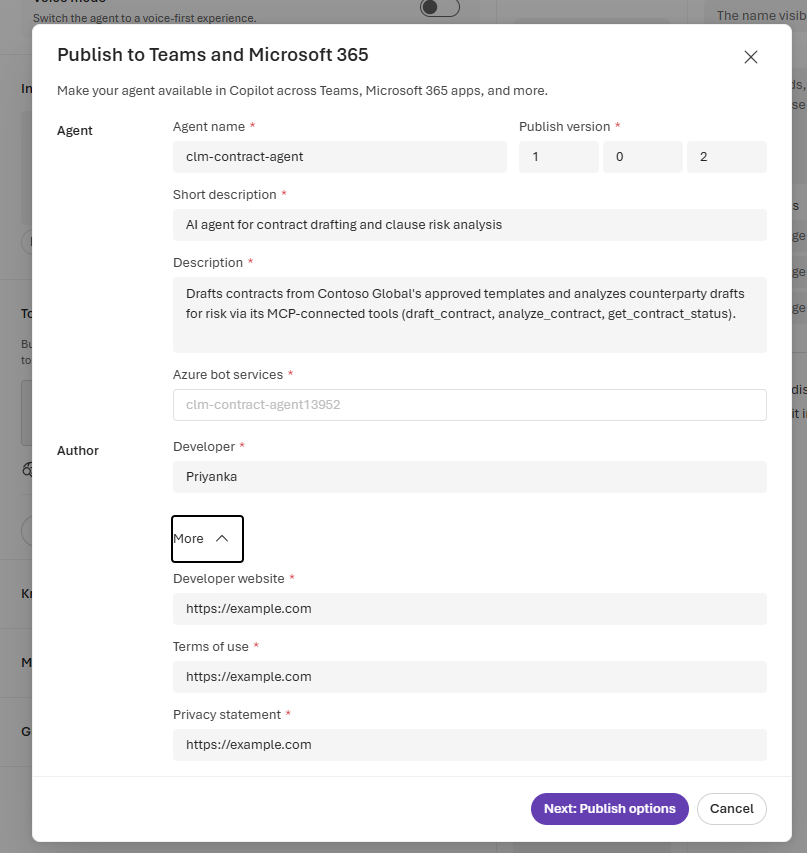
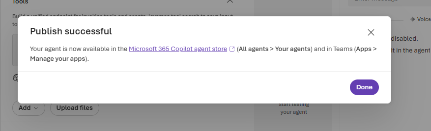
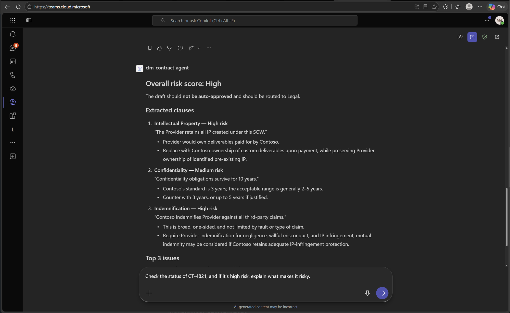

# Challenge 5 · Publish to M365 Copilot & Teams

**[🏠 Home](../README.md)**  ·  [← Challenge 4: Orchestration + MCP](challenge-04.md)  ·  [Challenge 6: Safety (Bonus) →](challenge-06.md)

Welcome back! Your multi-agent workflow works from the terminal — and thanks to Challenge 4 it's also a
**portal agent** (`clm-contract-agent`, backed by your remote MCP server). Now it's time to put it where
people actually work. In this challenge you'll **publish that agent to Microsoft 365 Copilot & Teams**
for live chat — so contract managers can draft, review, and track contracts right where they already work.

If something isn't working as expected, please let your coach know.

> **⏱️ Duration:** ~30 min (Tasks 1–4 · publish to Teams & M365 Copilot).

> **📋 Prerequisites:**
> - **Challenge 4 complete** — you deployed the MCP server to Azure Container Apps (Task 4 Part A) and
>   created the **`clm-contract-agent`** in the Foundry portal (Task 4 Part B). That MCP-backed portal
>   agent — with its MCP endpoint still deployed — is what you publish here.

> 🧩 **How to use this challenge:** the code in this folder is a **complete, working reference
> implementation** — you're not building it from a blank file. **Run it, read it, and understand *why*
> it works**. Stuck? The code *is* the answer key.

## 🎯 Objective

Ship your **CLM agent** — the MCP-backed **`clm-contract-agent`** from Challenge 4 — to **Microsoft 365
Copilot & Teams** so people chat with it live where they already work.

## 🧭 Context

- **Publishing** a Foundry agent to Teams/M365 Copilot auto-creates an **Azure Bot Service** channel
  — no bot code required for the conversational path.

## 🧰 Services & models in this challenge

This challenge is about **delivery** — taking the agent to where legal actually works:

| Service | What it is | Why it's here |
|---|---|---|
| **M365 Copilot & Teams** (channels) | The surfaces you publish your CLM agent (`clm-contract-agent`) to. From the Foundry portal you add the "Teams and Microsoft 365 Copilot" channel — **no conversational bot code** — and users chat with your grounded agent where they already work. | An agent legal never opens isn't used; meeting people in Teams is what makes it real. → [Agent Framework](https://learn.microsoft.com/agent-framework/overview/agent-framework-overview) |
| **Azure Bot Service** | The managed bot hosting + channel layer. Publishing a Foundry agent **auto-provisions an Azure Bot** that brokers messages between the channel and your agent (connectivity, auth, routing). The lab **pre-registers** its `Microsoft.BotService` provider for you (once per subscription), so you normally do nothing here. | The plumbing that connects Teams to your agent. |

## ✅ Tasks

Tasks 1–4 **publish** your `clm-contract-agent` to Teams & M365 Copilot (~30 min).

### Task 1 · Open your CLM agent (~2 min)

In the **[Foundry portal](https://ai.azure.com)**, open the **`clm-contract-agent`** you published in
**Challenge 4 (Task 4 Part B)** — the portal agent whose tool is your remote **MCP server**.

> [!NOTE]
> The `clm-orchestrator` you ran in **Challenge 4 Task 2** was **in-process** (it runs in your terminal
> via `FoundryChatClient`), so it never appears in the portal. The portal agent that carries the same
> **draft + analyze** workflow is `clm-contract-agent` — its MCP tool runs that workflow server-side, so
> it's the one we publish to Teams. Make sure its MCP endpoint from Ch4 is still deployed.

### Task 2 · Publish to Teams & M365 Copilot (~10 min)

Open the agent and select **Publish** (top of the page) → **Publish to Teams and Microsoft 365
Copilot** → **Continue**. This provisions an **Azure Bot Service** behind the scenes — no bot code.

> **Provider registration:** publishing needs the `Microsoft.BotService` resource provider
> registered on the **subscription**. The lab's shared deploy hook
> (`labautomation/shared-deploy-lab.ps1`) registers it **once per subscription, before any lab
> starts**, so this is already done for you. If the dropdown still errors with
> **`MissingSubscriptionRegistration` / `Microsoft.BotService`**, a **subscription Owner**
> registers it once — it's subscription-wide, so it unblocks every lab:
> `az provider register --namespace Microsoft.BotService`. In an RG-scoped lab you (RG-Owner)
> can't run this yourself — ask your coach / lab admin.
>
> Leave the **Azure bot services** dropdown on *auto* — let Foundry provision a fresh,
> properly-wired bot. Re-publishing? **Delete any stale Azure Bot** from earlier attempts first, or
> you'll hit an **App ID collision**.

### Task 3 · Fill the publish details & submit (~10 min)

Fill the **"Publish to Teams and Microsoft 365"** form: **Agent name**, **Short description**, and
**Description**. Leave **Azure bot services** on its auto-filled value — Foundry provisions the bot for
you. Expand **More** and set the required **Developer website / Terms of use / Privacy statement** URLs
(`https://example.com` placeholders are fine for the lab), then select **Next: Publish options**
(older portal builds label this button **Prepare Agent**).

> **App icons:** the current in-product form auto-packages default icons, so you usually **don't upload
> any here**. *If* your tenant's form (or the **Download & customize** route below) asks for them, use the
> branded **color 192×192** + **outline 32×32** placeholders in `src/manifest/` (regenerate with
> `python src/scripts/make_icons.py`).

> 📸 **Publish details form — what you'll see:** the **"Publish to Teams and Microsoft 365"** dialog with
> the agent name, descriptions, the auto-provisioned **Azure bot services**, and the **More** section
> (developer website, terms, privacy) required to continue.
>
> 

On the **Publish options** step, choose a **publish scope** and **Submit** (packaging takes ~1–2 min):

| Scope | Visibility | Admin approval | Use for |
|---|---|---|---|
| **Individual / Shared** | under **Apps → Your agents** | Not required | this lab, personal testing |
| **Organization** | under **Built by your org** | Required | tenant-wide rollout |

For the lab pick **Individual scope**. After it succeeds, find the agent in Teams under **Apps → Your
agents** (allow 1–2 min).

> 📸 **Publish successful — what you'll see:** the confirmation that your agent is now in the
> **Microsoft 365 Copilot agent store** (*All agents → Your agents*) and in **Teams** (*Apps → Manage
> your apps*).
>
> 

> **If direct publish returns a 400 error:** open the **Download & customize** tab instead, download the
> app package, and sideload it manually — in Teams: **Apps → Manage your apps → Upload an app → Upload a
> custom app** → pick the zip. (`src/manifest/` has a ready template if you build the zip yourself.)

### Task 4 · Test the agent live (~8 min)

Open the agent in Teams and in M365 Copilot; ask it to draft an NDA and to review
the Acme draft. Confirm grounded, cited answers come back **through its MCP tool** (approve the tool
call if prompted).

> 📸 **Open in Teams / Microsoft 365 Copilot — what you'll see:** once published, the agent's **Publish**
> dropdown gains the entries **Open in Teams** and **Open in Microsoft 365 Copilot** (plus **Edit display
> details** and **Unpublish**). Launch it and your agent answers **live in a Teams chat** with grounded,
> cited output:
>
> 

✅ **You'll know publishing worked when:** you can chat with the agent inside Teams and it returns the
same grounded, cited answers you saw in the terminal in Challenges 2 & 4.

## ✔️ Success criteria

- Your **`clm-contract-agent`** answers **live in Teams and M365 Copilot** with grounded, cited responses.

## 🛠️ Troubleshooting

| Symptom | Fix |
|---------|-----|
| Publish option missing | Ensure `Microsoft.BotService` is registered and you have rights to create an Azure Bot. |
| **`Azure bot services`** dropdown → **`MissingSubscriptionRegistration` / "subscription is not registered to use namespace 'Microsoft.BotService'"** (409) | The `Microsoft.BotService` provider isn't registered on the **subscription**. The lab's shared deploy hook (`shared-deploy-lab.ps1`) registers it once per subscription before the labs, but if it's still unregistered a **subscription Owner** runs it once (subscription-wide, unblocks all labs): `az provider register --namespace Microsoft.BotService`. In an RG-scoped lab you (RG-Owner) **can't** register it yourself — ask your coach / lab admin. Once it shows `Registered` (~1–2 min), reopen the publish dialog. |
| Bot responds in Teams but not Copilot | Confirm the app is approved for M365 Copilot and the manifest scopes include it. |

## 🔗 How this fits

**You built** delivery — your MCP-backed **`clm-contract-agent`** published to **M365 Copilot & Teams**
for live chat where legal already works.

- **Builds on** Challenge 4's MCP-backed portal agent.
- **Feeds** the bonus Challenge 6, which hardens everything for production.

**Step back — you've built the whole assistant:** grounded (C2) → proven trustworthy (C3) →
orchestrated into a team & made reusable via MCP (C4) → delivered where legal already works (C5).
That's a complete **Agentic CLM** system.

*In the arc → this is **"deliver it"**: the agent reaches its users instead of living in a terminal.*

## 🧠 Reflection

- You just shipped a **GPT orchestrator + GPT specialists** to where legal
  actually works (Teams). What's the next agent from the 5-agent vision you'd add, and why?

🎉 **You've completed the microhack** — a multi-model, multi-agent CLM assistant, grounded with
Foundry IQ, traced and evaluated, exposed over MCP, and live in Teams.
