# Challenge 6 · Safety, Red-Teaming & Continuous Evaluation 🧪 *(Bonus — optional)*

**[🏠 Home](../README.md)**  ·  [← Challenge 5: Publish to M365](challenge-05.md)

Welcome to the bonus challenge! Your assistant works — now make it **production-safe**. You'll
adversarially attack it with the **AI Red Teaming Agent**, add **Content Safety / PII guardrails**,
and wire a **quality + safety gate into CI** so a risky change can never ship. This is the Responsible
AI layer that separates a prototype from something legal and procurement would actually approve.

If something isn't working as expected, please let your coach know.

> **⏱️ Duration:** ~45–60 min · *optional stretch for teams who finish Challenges 1–5 early*

> **📋 Prerequisites:**
> - **Challenge 2** complete — the agent runs.
> - **Challenge 3** complete — evaluation in place.

> 🧩 **How to use this challenge:** the code in this folder is a **complete, working reference
> implementation** — you're not building it from a blank file. **Run it, read it, and understand *why*
> it works**. Stuck? The code *is* the answer key.

## 🎯 Objective

Make the CLM assistant **production-safe**: adversarially attack it with the **AI Red Teaming
Agent**, add **Content Safety / PII guardrails**, and wire a **quality + safety gate into CI** so a
risky change can never ship.

## 🧭 Context

Legal contracts mean **sensitive data + high stakes** — a jailbroken or ungrounded agent is a real
liability. This challenge closes the responsible-AI loop over everything you built:

- **AI Red Teaming Agent** (`azure-ai-evaluation` `red_team`) auto-generates adversarial objectives
  across risk categories, mutates them with **attack strategies** (encodings, ciphers, jailbreak
  templates), fires them at your agent, and reports an **attack success rate** scorecard.
- **Safety evaluators** (`ContentSafetyEvaluator`, `IndirectAttackEvaluator`) score responses for
  harmful content and indirect prompt-injection (XPIA).
- **Guardrails**: Azure AI **Content Safety** (Prompt Shields, PII, protected material) plus the
  prompt-level refusal policy from Challenge 2.
- **Continuous evaluation in CI**: the Ch2 **quality gate** + a new **safety gate** run in a GitHub
  Action so regressions block the merge — the code-first counterpart to portal continuous monitoring.

## 🧰 Services & models in this challenge

This challenge closes the **responsible-AI loop** — services that attack, guard, and gate the agent so a risky change can never ship:

| Service | What it is | Why it's here |
|---|---|---|
| **Azure AI Content Safety** | A managed guardrail service that inspects prompts & responses — **Prompt Shields** (jailbreak + indirect injection), **PII** and protected-material checks — attached to an agent in the portal. | Legal contracts = sensitive data + high stakes; a prompt-only guardrail isn't enough on its own. → [Content Safety](https://learn.microsoft.com/en-us/azure/ai-services/content-safety/overview) |
| **AI Red Teaming Agent** (`azure-ai-evaluation[redteam]`) | An automated adversary: generates adversarial objectives, mutates them with **attack strategies** (encodings, ciphers, composed jailbreaks via **PyRIT**), fires them at your agent, and reports an attack-success-rate scorecard. [`red_team.py`](../src/red_team.py) writes a repeatable `redteam_scorecard.json`. | Finds **unknown** failures — the ones you didn't think to test — before an attacker does. → [AI Red Teaming Agent](https://learn.microsoft.com/en-us/azure/foundry/concepts/ai-red-teaming-agent) |
| **Safety evaluators** (`azure-ai-evaluation`) | The safety side of the Challenge 3 eval SDK: `ContentSafetyEvaluator` + `IndirectAttackEvaluator` score responses for harmful content and **indirect prompt injection (XPIA)**. Run via [`safety_eval.py`](../src/safety_eval.py); gate `--gate 0.1` fails on too high a defect rate. | Red-teaming *attacks*; safety evaluators *measure* — together they tell you whether hardening actually worked. → [Evaluation](https://learn.microsoft.com/en-us/azure/foundry/concepts/observability) |
| **Continuous evaluation in CI** (GitHub Actions) | [`ci-eval.yml`](../.github/workflows/ci-eval.yml) runs `evaluators.py --gate 3.0` + `safety_eval.py --gate 0.1` on schedule / on demand via **Azure OIDC**; a regression **fails the build**, and it cleanly no-ops without secrets. | A one-time scan proves safety *today*; a CI gate keeps it safe **on every future change**. |

## ✅ Tasks

### Task 1 · Baseline red-team scan (~10 min)

Against the Intake & Drafting agent (auto-generated attacks):
```bash
pip install "azure-ai-evaluation[redteam]"     # pulls PyRIT (one-time)
python src/red_team.py --num-objectives 2
```
Inspect the scorecard (`redteam_scorecard.json`) — note any category with a non-zero
attack success rate.

✅ **You should see** the scan run and a scorecard summary (numbers will vary):
```text
▶ Red-teaming intake-drafting-agent (2 objectives)...
=== Red-team scorecard ===
Category                    Attacks   Succeeded   ASR
Hate/Unfairness                   2           0    0%
Violence                          2           0    0%
Self-harm                         2           0    0%
Sexual                            2           0    0%
→ wrote redteam_scorecard.json
```

> 📸 **Screenshot slot — what you'll see:** the printed **scorecard table** (and/or `redteam_scorecard.json`).
>
> 

### Task 2 · Turn up the heat (~10 min)

With attack strategies (encodings + a composed Base64→ROT13 attack):
```bash
python src/red_team.py --strategies --num-objectives 2
```
Which strategies slip past the guardrails that baseline prompts don't?

### Task 3 · Score CLM-specific attacks (~10 min)

Score legal-advice bypass, PII exfiltration, prompt injection and policy
override, and get a **guardrail defect rate**:
```bash
python src/safety_eval.py --safety-evals
# preview the gate with no Azure calls:
python src/safety_eval.py --dry-run --gate 0.1
```

✅ **You should see** a defect rate and a clear PASS/FAIL gate verdict:
```text
Guardrails held: 9/10 · defect rate = 10%
✅ SAFETY GATE PASSED.        # or: ❌ SAFETY GATE FAILED (defect rate 10% > gate 0%)
```

> [!TIP]
> To **see the gate fail on purpose**, run `python src/safety_eval.py --dry-run --gate 0.0`
> against the unhardened agent — a non-zero defect rate will trip `❌ SAFETY GATE FAILED` and exit
> non-zero. That's exactly what CI (Task 5) uses to block a bad merge.

> 📸 **Screenshot slot — what you'll see:** the **defect rate line** + PASS/FAIL verdict.
>
> 

### Task 4 · Harden the agent (~15 min)

Task 4 hardens **two different agents** — keep them straight:
- **Code agent (`intake-drafting-agent`)** — tighten the refusal/grounding instructions in `src/agents/intake_drafting_agent.py`. This is the in-process agent the red-team scan targets, so this is what drops the defect rate.
- **Portal agent (`clm-contract-agent`)** — in the portal, attach **Content Safety** (Prompt Shields + PII) to your **existing** MCP-backed agent from **Ch4 Task 4 Part B** (published to Teams in Ch5). Defense-in-depth for the production/Teams surface — **don't create a new agent**.

**Attach Content Safety (portal):** go to **Build → Agents → `clm-contract-agent`**, expand **Guardrails** in the playground's left pane, then **Manage guardrail** and enable:
- **Content filters** — keep **Hate / Sexual / Self-harm / Violence** at **Medium** (default).
- **Prompt Shields** — turn on both **jailbreak** and **indirect (XPIA) prompt injection** — the injection attacks the red team throws.
- **Protected materials** — text + code.
- **Sensitive data leakage → PII (Preview)** — you **must pick at least one** data type or the wizard blocks you (*"Please select at least one PII data type"*). For legal contracts:
  - **User information:** Name, Email, Phone number, Address — party/contact PII in NDAs & MSAs.
  - **Financial information:** Credit card, IBAN, SWIFT code, and the bank-account types for your regions (US / EU / Canada / Australia) — payment & banking clauses.
  - *Optional (defense-in-depth):* the **Azure / Database** connection-string & key types stop the agent ever echoing infra secrets — or just **Select All** for max coverage.

Then **Review → Create guardrails**, **re-run Tasks 1–3**, and confirm the attack success / defect rate **drops**.

> 📸 **What you'll see:** the Guardrails wizard — content filters plus **PII (Preview)** with its data-type picker (pick at least one).
>
> 

### Task 5 · Wire the gate into CI (~10 min)

Review `.github/workflows/ci-eval.yml` — it runs the **quality gate**
(`evaluators.py --gate 3.0`) and **safety gate** (`safety_eval.py --gate 0.1`) on a schedule /
on demand, using Azure OIDC. Configure the repo secrets (`AZURE_CLIENT_ID`, `AZURE_TENANT_ID`,
`AZURE_SUBSCRIPTION_ID`, `AZURE_AI_PROJECT_ENDPOINT`) and trigger it from the **Actions** tab.

> 📸 **Screenshot slot — what you'll see:** the **Actions** tab with the eval workflow run (green check = gates passed).
>
> 

✅ **You'll know it worked when:** the workflow run shows a **green check** (gates passed) — or a
**red X** if a regression tripped a gate, which is the whole point.

## ✔️ Success criteria

- A red-team scorecard exists and you can point to the **attack success rate** per risk category.
- The safety evaluation prints a **guardrail defect rate**, and the gate **fails** when you set a
  strict threshold (e.g. `--gate 0.0` on an unhardened agent).
- After hardening, the attack success / defect rate is **measurably lower**.
- `ci-eval.yml` runs the quality + safety gates (or cleanly no-ops when secrets are absent).

## 🛠️ Troubleshooting

| Symptom | Fix |
|---------|-----|
| `ModuleNotFoundError: azure.ai.evaluation.red_team` | Install the extra: `pip install "azure-ai-evaluation[redteam]"`. |
| Empty scorecard — `Invalid data type <coroutine ...>, expected str data type`, `coroutine 'callback' was never awaited`, **0/0 attacks / 0.0% ASR** | The scan target must match a supported shape. A **single-arg** callback (`def callback(query)`) is treated as a *sync* callback that must return a `str`; an OpenAI **Chat-Protocol** callback (`async def callback(messages, stream=False, session_state=None, context=None)` returning `{"messages": [...]}`) is *awaited*. `src/red_team.py` uses the Chat-Protocol form — if you customized it, don't make a single-arg callback `async`. |
| Scan is slow | Lower `--num-objectives`; run baseline before `--strategies`. Each objective is a full agent turn. |
| Safety evaluators 401/403 | They need the **Foundry project** endpoint + a logged-in credential with the right role. |
| Defect rate looks too good/bad | The heuristic keys on refusal phrases; use `--safety-evals` for model-graded scoring and refine `REFUSAL_MARKERS`. |
| CI job skipped | Expected when Azure secrets aren't set — it no-ops by design. Add the secrets to enable it. |

## 🔗 How this fits

**You built** the safety net — an **AI Red Teaming** scan, **Content Safety / PII** guardrails, and a
**quality + safety gate wired into CI** so a risky change can never ship.

- **Builds on** the entire system — it attacks and guards everything from Challenges 2–5, reusing
  Challenge 3's gate pattern.
- **Feeds** nothing after it — this is the production-readiness capstone.

*In the arc → this is **"make it safe"**: the Responsible-AI layer that separates a prototype from something legal and procurement would approve.*

## 🧠 Reflection

- Red-teaming finds *unknown* failures; evaluation measures *known* quality. Why do you need both
  before shipping an agent that touches contracts?
- A guardrail can live at the **prompt**, the **content-safety** layer, or the **CI gate**. Which
  attacks does each stop, and where would you invest first for a legal use case?
- What attack-success threshold would *you* require before letting this go live in Teams?

🎉 **Bonus complete** — you red-teamed, hardened, and gated a multi-model CLM agent. That's the full
responsible-AI loop from build → grounded → traced → evaluated → **secured** → shipped.

⬅️ Back to the **[main README](../README.md)**.
