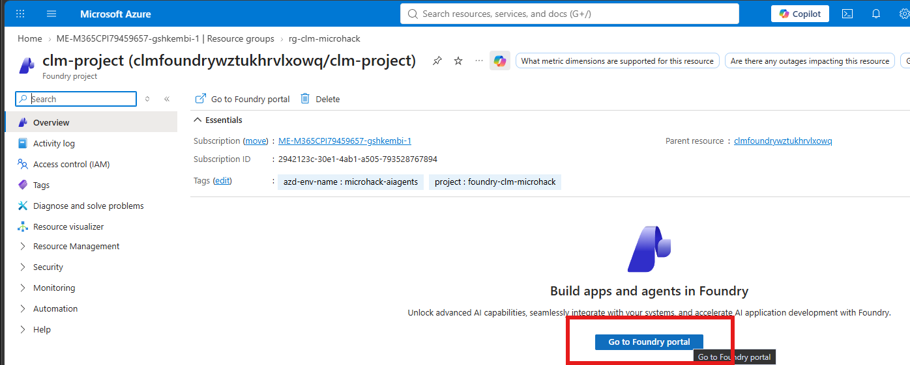
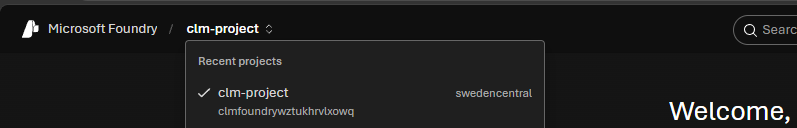
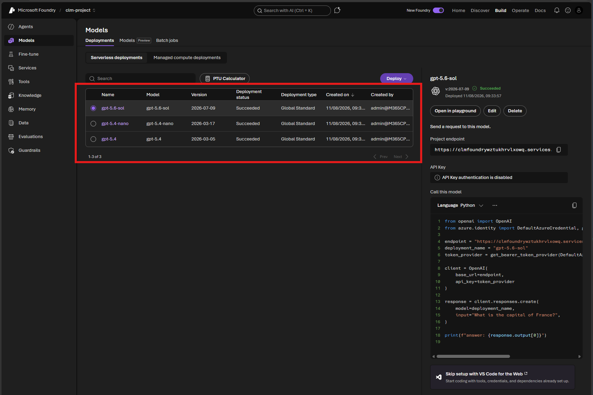
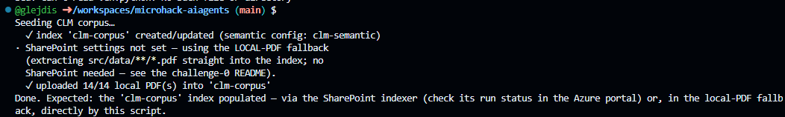
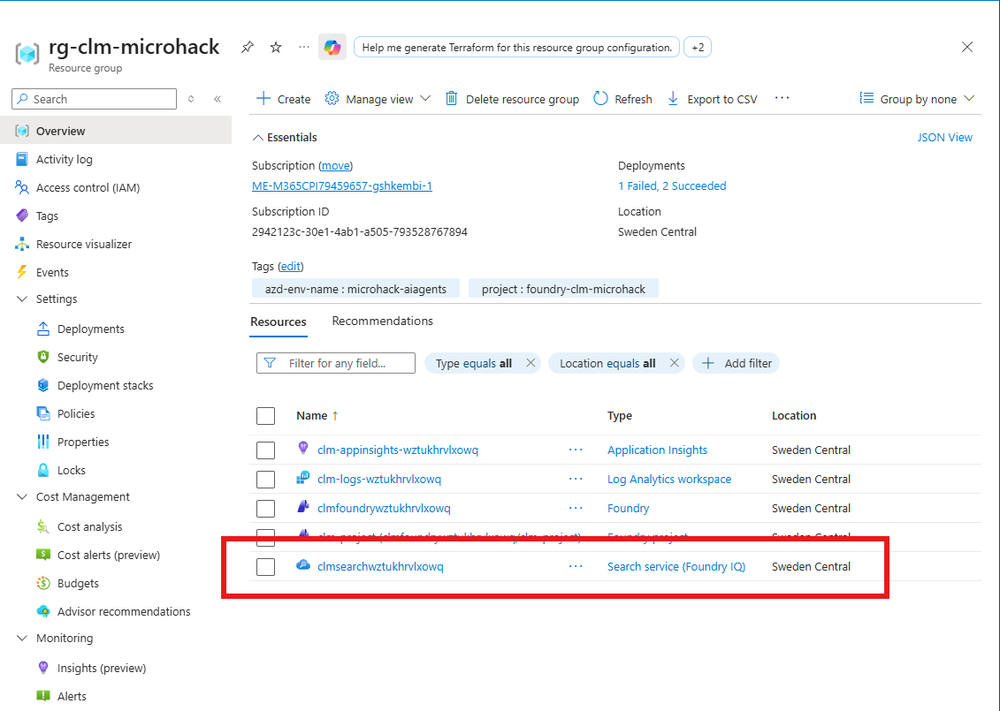
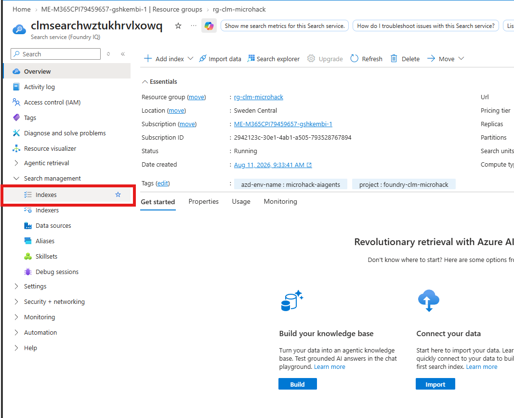
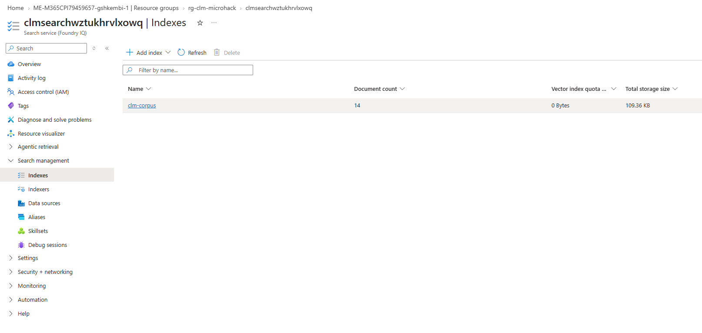

# Solution 01 — Setup & Foundry Foundations

**[← Back to Challenge 1](../../challenges/challenge-01.md)** · [Home](../../README.md)

This challenge is pure setup — there is no agent to build yet. You provision the
Microsoft Foundry environment, wire up your `.env`, and seed the **Contoso Global**
contract corpus the later challenges ground on.

## Expected end state

- Codespace (or local devcontainer) built and dependencies installed.
- `az login --use-device-code` completed and the target subscription selected.
- **MicroHack event:** resources are **already provisioned** — you point `.env` at your
  **lab-dashboard** values. **Self-hosting:** one `azd up` (Bicep in
  [`labautomation/infra/`](../../labautomation/infra/)) — or
  [`labautomation/deploy.sh`](../../labautomation/deploy.sh) / `.ps1`, or the **Deploy to Azure**
  button — provisions the same resources and autofills `.env` via
  [`src/scripts/write_env.py`](../../src/scripts/write_env.py).
- The corpus is crawled into the `clm-corpus` Azure AI Search index. **Default (Path B · any tenant):**
  [`src/scripts/seed_corpus.py`](../../src/scripts/seed_corpus.py) over the local PDFs in
  [`src/data/`](../../src/data/); **optional (Path A · tenant admins):**
  [`src/scripts/setup_sharepoint_corpus.py`](../../src/scripts/setup_sharepoint_corpus.py) builds the
  real SharePoint grounding source.
- **Done when** [`src/scripts/smoke_test.py`](../../src/scripts/smoke_test.py)
  prints `✅ PASS` — a tiny agent verifies each distinct GPT deployment.

## 🛠️ Task-by-task walkthrough

### Task 1 · Open the Codespace
No fork — the code lives in this repo. **`< > Code` ▸ Codespaces ▸ Create codespace on `main`**; the devcontainer builds and `pip install -r requirements.txt` runs automatically. *(Local alt: `git clone` then **Reopen in Container**.)*

> 📸 **Screenshot slot:** creating the **Codespace**.
>
> 

### Task 2 · Log in to Azure
```bash
az login --use-device-code                             # device code is required in Codespaces
az account set --subscription "<your-subscription-id>"
```

> 📸 **Screenshot slot:** the **device-code `az login`** prompt.
>
> 

### Task 3 · Connect to your provisioned resources
**MicroHack event — resources are already provisioned; you don't deploy.** Point `.env` at the values on your **lab dashboard**:
```bash
cp .env.example .env
# then paste the dashboard values into .env (the two endpoints + the App Insights connection string)
```

| Lab-dashboard credential | `.env` variable |
|---|---|
| **FoundryProjectEndpoint** | `AZURE_AI_PROJECT_ENDPOINT` |
| **SearchEndpoint** | `AZURE_SEARCH_ENDPOINT` |
| **AppInsightsConnectionString** | `APPLICATIONINSIGHTS_CONNECTION_STRING` |
| **ModelOrchestrator / Drafting / ClauseRisk / Renewal** | `MODEL_ORCHESTRATOR` / `MODEL_DRAFTING` / `MODEL_CLAUSE_RISK` / `MODEL_RENEWAL` |

The model names + `AZURE_SEARCH_INDEX` (`clm-corpus`) / `AZURE_SEARCH_CONNECTION_NAME` (`clm-search`) already default in `.env.example`, so at minimum paste the two **endpoints** + the **App Insights** string. Leave `SHAREPOINT_*` and the Challenge 5 `MICROSOFT_APP_*` / `TEAMS_*` blank for now.

<details>
<summary><strong>Self-hosting? One <code>azd up</code> provisions everything and writes <code>.env</code> for you</strong></summary>

```bash
azd auth login          # separate from az login above
azd up                  # env name, subscription, region = Sweden Central (offers all three models)
# — or the scripted path — LOCATION=swedencentral ./labautomation/deploy.sh   (deploy.ps1 on Windows)
```
The `postprovision` hook → [`src/scripts/write_env.py`](../../src/scripts/write_env.py) reads the deployment outputs (`azd env get-values`, or `--deployment` for the ARM path) and writes every env var the agents use — filling constants from a `DEFAULTS` map when an output is absent, so you can skip the manual paste above:
```python
# src/scripts/write_env.py — constants used when a deployment output is missing
DEFAULTS = {
    "MODEL_ORCHESTRATOR": "gpt-5.4",
    "MODEL_DRAFTING": "gpt-5.4",
    "MODEL_CLAUSE_RISK": "gpt-5.6-sol",
    "MODEL_RENEWAL": "gpt-5.4-nano",
    "AZURE_SEARCH_INDEX": "clm-corpus",
    "AZURE_SEARCH_CONNECTION_NAME": "clm-search",
    # …
}
env = azd_env_values()                       # or arm_env_values(--deployment)
get = lambda k: env.get(k) or DEFAULTS.get(k, "")
# → writes AZURE_AI_PROJECT_ENDPOINT, MODEL_*, AZURE_SEARCH_*, App Insights, SQL … to .env
```
Add Azure SQL (`azd env set DEPLOY_SQL true`) or Bing web grounding (`azd env set DEPLOY_BING true`) before `azd up`.

> 📸 **Screenshot slot:** the `azd up` prompts, then the **deployment success** summary.
>
> 
> 

</details>

### Task 4 · Verify your resources
Three checks: **(4a)** the **resource group** in the [Azure Portal](https://portal.azure.com/) (its name is on your dashboard; self-host default `rg-clm-microhack`) lists ~7 resources; **(4b)** in the Foundry portal ([ai.azure.com](https://ai.azure.com) → **`clm-project`** → **Models + endpoints**) the **3 distinct model deployments** show **Succeeded** — `gpt-5.4`, `gpt-5.6-sol`, `gpt-5.4-nano` (4 roles; Intake & Drafting shares `gpt-5.4` with Orchestrator); **(4c)** `.env` is filled (every value except the `SHAREPOINT_*` corpus and the Challenge 5 `MICROSOFT_APP_*` / `TEAMS_*`). CLI shortcut for 4b:
```bash
az cognitiveservices account deployment list -g <rg> -n clmfoundry<token> -o table
```

> 📸 **Visual walk-through — checks (4a) → (4b), one screenshot per step:**

**1 · Resource group (Azure Portal).** Open the [Azure Portal](https://portal.azure.com/) → **Resource groups** → your RG (self-host default `rg-clm-microhack`). It should list **~7 resources**: the Foundry (AI Services) account, the Foundry **project**, Azure AI Search, Application Insights + Log Analytics, etc.


<br>

**2 · Open the Foundry project.** Click the **`clm-project`** resource (Type = *Foundry project*); on its **Overview** blade, click **Go to Foundry portal**.



<br>

**3 · Confirm you're in the right project.** The Foundry portal opens on your project — check the switcher (top-left) shows **`clm-project` · swedencentral** ✓.



<br>

**4 · Verify the model deployments.** In the left nav open **Models + endpoints** — the **3 distinct deployments** (`gpt-5.4`, `gpt-5.6-sol`, `gpt-5.4-nano`; Intake & Drafting shares `gpt-5.4` with the Orchestrator) should all show **Succeeded**.



### Task 5 · Seed the corpus
**Path B (local-PDF) is the default — works in any tenant, no SharePoint, no admin consent.** Blank the `SHAREPOINT_*` values so the fallback triggers, then extract the local PDFs straight into `clm-corpus`:
```bash
sed -i -E 's/^(SHAREPOINT_SITE_URL|SHAREPOINT_APP_ID|SHAREPOINT_APP_SECRET|SHAREPOINT_TENANT_ID)=.*/\1=/' .env
python src/scripts/seed_corpus.py          # → "uploaded 14/14 local PDF(s) into 'clm-corpus'"
python src/scripts/seed_sql.py             # optional — only if you deployed Azure SQL
```



The same command then creates or updates the real Foundry IQ layer:
`clm-corpus-ks` (search-index knowledge source) and `clm-contracts-kb` (knowledge base using
gpt-5.4 query planning with low retrieval reasoning effort). Re-running is safe.

Confirm a non-zero document count (**Azure portal → Search service → Indexes → `clm-corpus`**), then jump to Task 6.

**1 · Open the Search service.** In the Azure portal, open your lab resource group and select the **Search service (Foundry IQ)** resource.



**2 · Open the index list.** Under **Search management**, select **Indexes**.



**3 · Verify the corpus.** Find **`clm-corpus`** and confirm its **Document count** is greater than zero. The example below shows all 14 local PDFs indexed successfully.



<details>
<summary><strong>Path A — SharePoint corpus (optional · advanced · tenant admins only)</strong></summary>

One command does the entire SharePoint path in your own admin tenant (Entra app + admin consent + site + upload + index):
```bash
python src/scripts/setup_sharepoint_corpus.py
```
In shared/managed sandbox tenants where you're **not** a tenant admin, its admin consent silently fails — that's expected; use Path B, which builds the **identical** `clm-corpus` index.

</details>

Both paths build the same idempotent `clm-corpus` index and Foundry IQ knowledge base the later
challenges ground on; re-running is safe.


### Task 6 · Smoke test (the finish line)
The gate proves the project is reachable **and** that each distinct model deployment answers. The core of it builds a one-line agent per deployment:
```python
# src/scripts/smoke_test.py
def ping_model(model: str, label: str) -> bool:
    agent = Agent(
        client=build_chat_client(model),
        name=f"smoke-{label}",
        instructions="Reply with exactly one word: OK.",
    )
    reply = run_prompt(agent, "Say OK.")
    return bool(reply.strip())
# main() pings each distinct deployment once; drafting shares MODEL_ORCHESTRATOR (gpt-5.4),
# so that deployment is verified only once.
```
```bash
python src/scripts/smoke_test.py
```
✅ **You should see** — this is the finish line for Challenge 1:
```text
1) Checking environment…
   ✓ AZURE_AI_PROJECT_ENDPOINT = https://<foundry>.services.ai.azure.com/api/projects/clm-project
   ✓ MODEL_ORCHESTRATOR = gpt-5.4
   ✓ MODEL_DRAFTING = gpt-5.4
   ✓ MODEL_CLAUSE_RISK = gpt-5.6-sol
   ✓ MODEL_RENEWAL = gpt-5.4-nano
2) Pinging orchestrator deployment 'gpt-5.4'…
   ✓ orchestrator replied: OK
   · drafting shares deployment 'gpt-5.4' with orchestrator — already verified.
2) Pinging clause-risk deployment 'gpt-5.6-sol'…
   ✓ clause-risk replied: OK
2) Pinging renewal deployment 'gpt-5.4-nano'…
   ✓ renewal replied: OK

Smoke test: ✅ PASS
```

> 📸 **Screenshot slot:** the terminal ending in **`Smoke test: ✅ PASS`**.
>
> 

## Key files

| Path | Role |
|------|------|
| [`labautomation/infra/`](../../labautomation/infra/) | Bicep templates + `azuredeploy.json` for the Foundry project, models, Search, SQL, App Insights |
| [`labautomation/deploy.sh`](../../labautomation/deploy.sh) · `.ps1` | Scripted provisioning that autofills `.env` |
| [`src/scripts/seed_corpus.py`](../../src/scripts/seed_corpus.py) | Seeds the `clm-corpus` index — **Path B local-PDF (default)** or SharePoint crawl |
| [`src/scripts/setup_sharepoint_corpus.py`](../../src/scripts/setup_sharepoint_corpus.py) | Optional Path A — one-command SharePoint corpus (Entra app + consent + site + upload + index) |
| [`src/scripts/seed_sql.py`](../../src/scripts/seed_sql.py) | Optional: seeds contract-status rows in Azure SQL |
| [`src/scripts/smoke_test.py`](../../src/scripts/smoke_test.py) | Gate — confirms each distinct model deployment answers |
| [`src/data/`](../../src/data/) | The CLM corpus (contracts, templates, clause library, playbooks) + eval datasets |

## Common issues

| Symptom | Cause / fix |
|---------|-------------|
| A model isn't offered in your region | *(Self-host only — provisioned labs don't deploy.)* Pick a region with `gpt-5.4`, `gpt-5.6-sol`, and `gpt-5.4-nano`; verify in the Foundry model catalog. |
| `az login` fails / no browser in Codespaces | Use `az login --use-device-code` and paste the code at [microsoft.com/devicelogin](https://microsoft.com/devicelogin). |
| SharePoint (Path A): *"Tenant does not have a SPO license"* / **"Grant admin consent" greyed out** | You're not a tenant admin — expected. Use **Path B** (blank `SHAREPOINT_*`, run `python src/scripts/seed_corpus.py`); it builds the identical `clm-corpus` index. |
| Corpus / index empty | Re-run `python src/scripts/seed_corpus.py` (idempotent); if a doc 403s, wait a minute for Search-role propagation and retry. |
