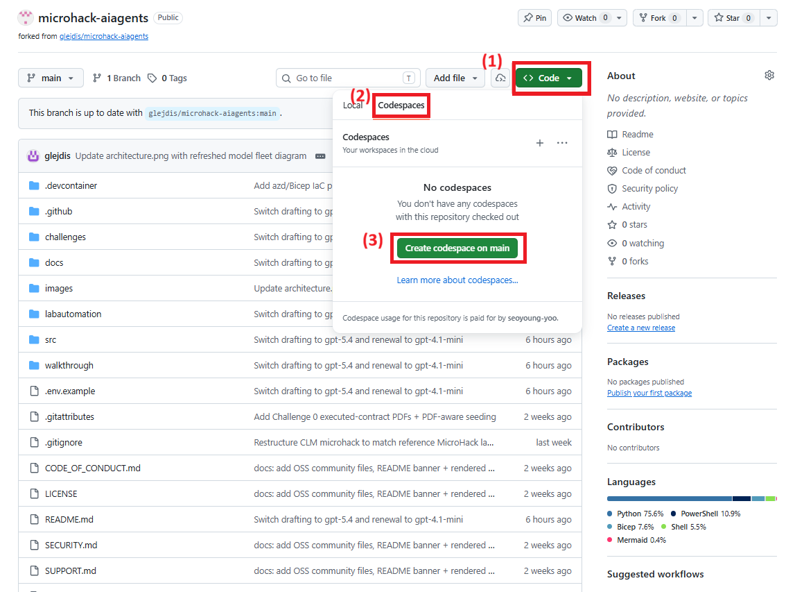
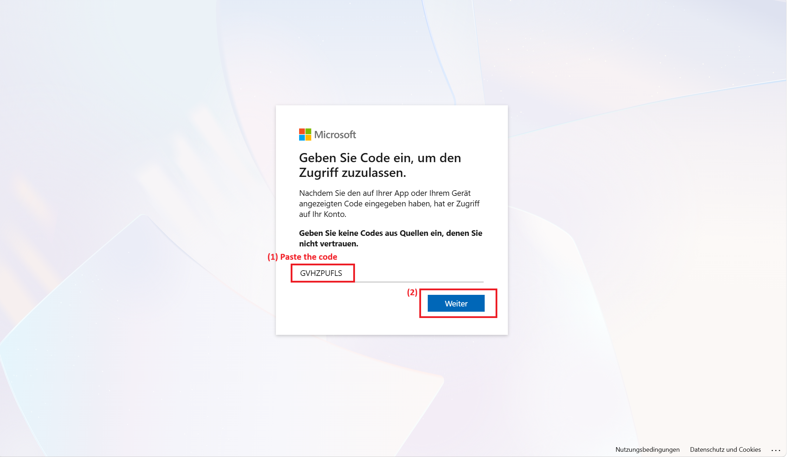
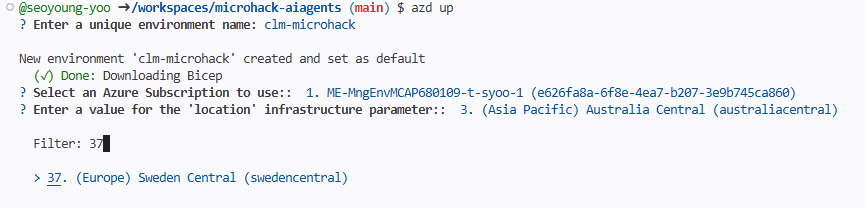
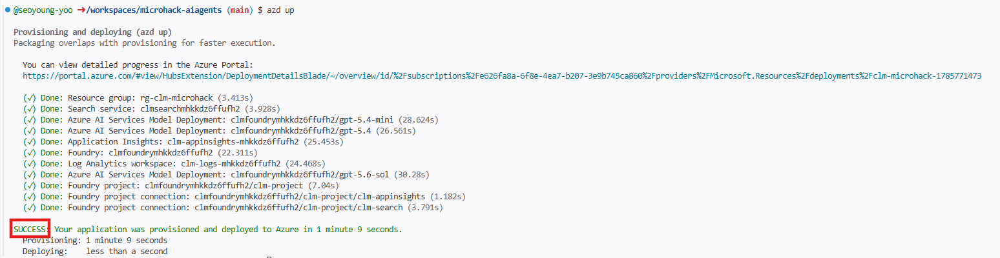
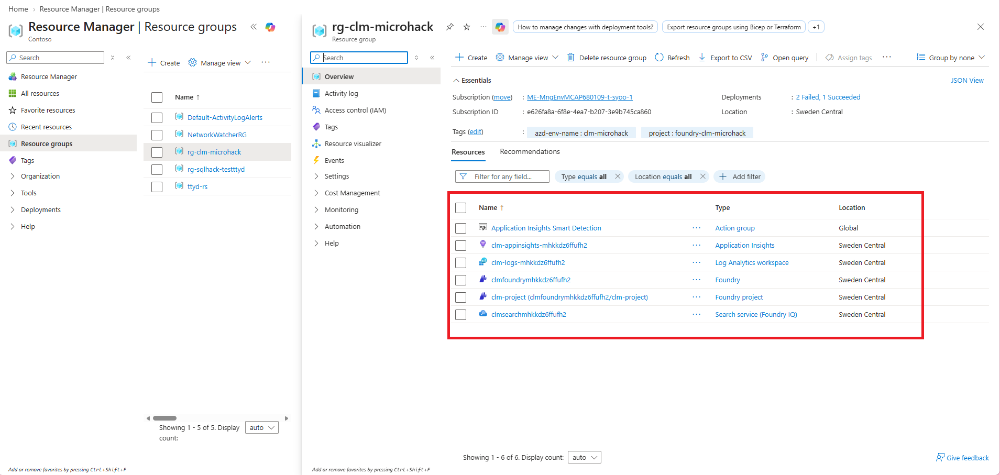
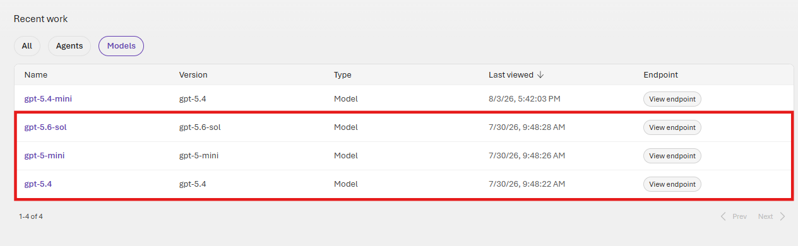
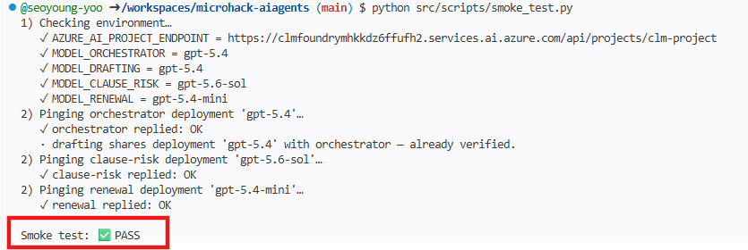

# Solution 01 — Setup & Foundry Foundations

**[← Back to Challenge 1](../../challenges/challenge-01.md)** · [Home](../../README.md)

This challenge is pure setup — there is no agent to build yet. You provision the
Microsoft Foundry environment, wire up your `.env`, and seed the **Contoso Global**
contract corpus the later challenges ground on.

## Expected end state

- Codespace (or local devcontainer) built and dependencies installed.
- `az login` completed in the terminal.
- Resources provisioned via **one** path: `azd up` (Bicep in
  [`labautomation/infra/`](../../labautomation/infra/)), the
  [`labautomation/deploy.sh`](../../labautomation/deploy.sh) / `.ps1` script, or the
  one-click **Deploy to Azure** button.
- `.env` populated — the deploy script / `azd` postprovision hook autofills it via
  [`src/scripts/write_env.py`](../../src/scripts/write_env.py).
- The corpus is crawled into the `clm-corpus` Azure AI Search index. **Default:** one command,
  [`src/scripts/setup_sharepoint_corpus.py`](../../src/scripts/setup_sharepoint_corpus.py), provisions
  the whole SharePoint grounding source in your own admin tenant; **fallback:**
  [`src/scripts/seed_corpus.py`](../../src/scripts/seed_corpus.py) over the local PDFs in
  [`src/data/`](../../src/data/).
- **Done when** [`src/scripts/smoke_test.py`](../../src/scripts/smoke_test.py)
  prints `✅ PASS` — a tiny agent verifies each distinct GPT deployment.

## 🛠️ Task-by-task walkthrough

### Tasks 1–3 · Open the code, dev environment, `az login`
```bash
# Task 1: open glejdis/microhack-aiagents in a Codespace (no fork) — Code ▸ Codespaces ▸ Create.
# Task 2: the devcontainer builds automatically; to run locally instead:
code .            # "Reopen in Container" when prompted
# Task 3: authenticate the Azure CLI (the deploy script and azd both reuse this login)
az login
az account set --subscription "<your-subscription-id>"
```

> 📸 **Screenshot slot:** creating the **Codespace**, then the **device-code `az login`** prompt.
>
> 
> 

### Task 4 · Deploy the resources
Pick **one** path — all three provision the same Foundry project, models, Search, SQL and App Insights, then autofill `.env`:
```bash
azd up                             # Bicep in labautomation/infra/ (recommended)
# — or the scripted path —
./labautomation/deploy.sh          # bash;  deploy.ps1 on Windows
```
The `.env` is written for you by the postprovision hook → [`src/scripts/write_env.py`](../../src/scripts/write_env.py), which reads the deployment outputs (`azd env get-values`, or `--deployment` for the ARM path) and writes every env var the agents use — filling constants from a `DEFAULTS` map when an output is absent:
```python
# src/scripts/write_env.py — constants used when a deployment output is missing
DEFAULTS = {
    "MODEL_ORCHESTRATOR": "gpt-5.4",
    "MODEL_DRAFTING": "gpt-5.4",
    "MODEL_CLAUSE_RISK": "gpt-5.6-sol",
    "MODEL_RENEWAL": "gpt-5.4-nano",
    "AZURE_SEARCH_INDEX": "clm-corpus",
    "AZURE_SEARCH_CONNECTION_NAME": "clm-search",
    # …
}
env = azd_env_values()                       # or arm_env_values(--deployment)
get = lambda k: env.get(k) or DEFAULTS.get(k, "")
# → writes AZURE_AI_PROJECT_ENDPOINT, MODEL_*, AZURE_SEARCH_*, App Insights, SQL … to .env
```

> 📸 **Screenshot slot:** the `azd up` prompts, then the **deployment success** summary.
>
> 
> 

### Task 5 · Verify your resources
In the Foundry portal confirm the project, the **3 distinct model deployments** (4 roles; Intake & Drafting shares gpt-5.4 with Orchestrator), and the `clm-corpus` Search index. From the CLI:
```bash
az cognitiveservices account deployment list -g <rg> -n clmfoundry<token> -o table
```

> 📸 **Screenshot slot:** the **resource group** in the portal and the **Foundry model deployments** (3 distinct deployments).
>
> 
> 

### Task 6 · Seed the corpus
```bash
# Default — one command does the whole SharePoint path in your own admin tenant
# (Entra app + admin consent + site + upload + index):
python src/scripts/setup_sharepoint_corpus.py
# Fallback (not an admin / no SharePoint) — local-PDF corpus straight into the index:
python src/scripts/seed_corpus.py
python src/scripts/seed_sql.py             # optional — only if you deployed Azure SQL
```
Both paths build the same idempotent `clm-corpus` index the later challenges ground on; re-running is safe.


### Task 7 · Smoke test (the finish line)
The gate proves the project is reachable **and** that each distinct model deployment answers. The core of it builds a one-line agent per deployment:
```python
# src/scripts/smoke_test.py
def ping_model(model: str, label: str) -> bool:
    agent = Agent(
        client=build_chat_client(model),
        name=f"smoke-{label}",
        instructions="Reply with exactly one word: OK.",
    )
    reply = run_prompt(agent, "Say OK.")
    return bool(reply.strip())
# main() pings each distinct deployment once; drafting shares MODEL_ORCHESTRATOR (gpt-5.4),
# so that deployment is verified only once.
```
```bash
python src/scripts/smoke_test.py
```
✅ **You should see** — this is the finish line for Challenge 1:
```text
1) Checking environment…
   ✓ AZURE_AI_PROJECT_ENDPOINT = https://<foundry>.services.ai.azure.com/api/projects/clm-project
   ✓ MODEL_ORCHESTRATOR = gpt-5.4
   ✓ MODEL_DRAFTING = gpt-5.4
   ✓ MODEL_CLAUSE_RISK = gpt-5.6-sol
   ✓ MODEL_RENEWAL = gpt-5.4-nano
2) Pinging orchestrator deployment 'gpt-5.4'…
   ✓ orchestrator replied: OK
   · drafting shares deployment 'gpt-5.4' with orchestrator — already verified.
2) Pinging clause-risk deployment 'gpt-5.6-sol'…
   ✓ clause-risk replied: OK
2) Pinging renewal deployment 'gpt-5.4-nano'…
   ✓ renewal replied: OK

Smoke test: ✅ PASS
```

> 📸 **Screenshot slot:** the terminal ending in **`Smoke test: ✅ PASS`**.
>
> 

## Key files

| Path | Role |
|------|------|
| [`labautomation/infra/`](../../labautomation/infra/) | Bicep templates + `azuredeploy.json` for the Foundry project, models, Search, SQL, App Insights |
| [`labautomation/deploy.sh`](../../labautomation/deploy.sh) · `.ps1` | Scripted provisioning that autofills `.env` |
| [`src/scripts/seed_corpus.py`](../../src/scripts/seed_corpus.py) | Seeds the `clm-corpus` index (SharePoint crawl or local-PDF fallback) |
| [`src/scripts/seed_sql.py`](../../src/scripts/seed_sql.py) | Optional: seeds contract-status rows in Azure SQL |
| [`src/scripts/smoke_test.py`](../../src/scripts/smoke_test.py) | Gate — confirms each distinct model deployment answers |
| [`src/data/`](../../src/data/) | The CLM corpus (contracts, templates, clause library, playbooks) + eval datasets |

## Common issues

| Symptom | Cause / fix |
|---------|-------------|
| A model isn't offered in your region | Pick a region with `gpt-5.4`, `gpt-5.6-sol`, and `gpt-5.4-nano`; verify in the Foundry model catalog. |
| Corpus / index empty | Re-run `python src/scripts/seed_corpus.py` (idempotent). |
