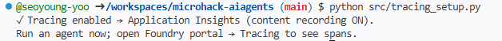

# Solution 03 — Observability, Tracing & Evaluation

**[← Back to Challenge 3](../../challenges/challenge-03.md)** · [Home](../../README.md)

Make the agent **observable** and **measurable**: end-to-end OpenTelemetry traces in
Application Insights, an evaluation scorecard over a labelled dataset, a
**flagship-vs-mini bake-off**, and a **quality gate** you can drop into CI.

## Expected end state

- `configure_azure_monitor(...)` in [`src/tracing_setup.py`](../../src/tracing_setup.py)
  emits spans to Application Insights — you can see agent runs end-to-end.
- [`src/evaluators.py`](../../src/evaluators.py) scores responses (Relevance,
  Coherence, Groundedness) over the labelled dataset and prints a scorecard.
- The bake-off compares gpt-5.4 (flagship) vs gpt-5.4-nano (lightweight) on quality vs latency/cost.
- The gate `python src/evaluators.py --gate 4.0` **exits 3** if groundedness < 4.0.

## 🛠️ Task-by-task walkthrough

### Task 1 · Enable tracing
[`src/tracing_setup.py`](../../src/tracing_setup.py) sets the content-recording flag **on import** (must happen before the agents SDK loads), then wires the Azure Monitor exporter and Agent Framework instrumentation:
```python
# src/tracing_setup.py — set BEFORE importing the agent framework anywhere
os.environ.setdefault("ENABLE_SENSITIVE_DATA", "true")
os.environ.setdefault("AZURE_TRACING_GEN_AI_CONTENT_RECORDING_ENABLED", "true")

def enable_tracing(project=None):
    conn = settings.appinsights_connection_string \
        or (project and project.telemetry.get_application_insights_connection_string())
    configure_azure_monitor(connection_string=conn)   # 1) register exporters
    enable_instrumentation(enable_sensitive_data=True) # 2) emit invoke_agent / chat / execute_tool spans
```
```bash
python src/tracing_setup.py
```
✅ **You should see:**
```text
✓ Tracing enabled → Application Insights (content recording ON).
Run an agent now; open Foundry portal → Tracing to see spans.
```

> 📸 **Screenshot slot:** the "Tracing enabled" confirmation.
>
> 

### Task 2 · Generate traffic, inspect spans
Each agent demo now calls `tracing_setup.enable_tracing()` at start-up (tracing is **per-process**, so running `python src/tracing_setup.py` once does *not* leave it on for a separately-launched demo). Just run any agent — e.g. `python src/agents/intake_drafting_agent.py` — then open **Foundry portal → Tracing**. Inspect the **prompt / retrieval / tool** spans and token counts. Spans take **1–2 min** to appear — refresh if empty.

> [!IMPORTANT]
> The portal **Tracing** tab only renders spans once **Application Insights is connected to the project** — the Challenge 1 resource must be linked, not just created. Fresh `azd up` / `deploy.ps1` / `deploy.sh` runs now create this connection (`clm-appinsights`, category `AppInsights`) automatically; on an older deployment, connect it once via **project → Tracing → Connect**. To verify data independently of the portal, query `dependencies` in **Azure portal → clm-appinsights → Logs**.

> 📸 **Screenshot slot:** a run's span timeline in **Tracing**, and the **Agent Monitoring** dashboard.
>
> 
> 

### Task 3 · Run the evaluation
[`src/evaluators.py`](../../src/evaluators.py) builds a *target* that runs the agent per row, then scores with the Foundry evaluators over `evaluation_dataset.jsonl`:
```python
# src/evaluators.py
def evaluators_dict():
    cfg = judge_model_config()      # an Azure OpenAI GPT deployment as the LLM judge
    # gpt-5.x judges are reasoning models → flip the evaluators into reasoning mode.
    is_reasoning = str(cfg.get("azure_deployment", "")).lower().startswith("gpt-5")
    kwargs = {"model_config": cfg, "is_reasoning_model": is_reasoning}
    return {
        "groundedness": GroundednessEvaluator(**kwargs),
        "relevance":    RelevanceEvaluator(**kwargs),
        "coherence":    CoherenceEvaluator(**kwargs),
        "fluency":      FluencyEvaluator(**kwargs),
    }

result = evaluate(data=str(DATASET), target=target, evaluators=evaluators_dict(), ...)
```
```bash
python src/evaluators.py
```

> ⚙️ **Throttling.** The judges run concurrently against one deployment, so a
> shared judge easily returns `429`. The target retries 429s with jittered
> backoff, and evaluator concurrency defaults to `PF_WORKER_COUNT=2`. Drop it
> further when a run stalls: `python src/evaluators.py --workers 1`.
✅ **You should see** (scores 1–5; your numbers differ):
```text
=== Intake & Drafting (gpt-5.4) ===
  groundedness                             4.6
  relevance                                4.4
  coherence                                4.7
  fluency                                  4.8
  mean latency (s)                         3.2
```

> 📸 **Screenshot slot:** the evaluation scorecard in the terminal.
>
> 

### Task 4 · Run the bake-off
`--bakeoff` runs the **same** target on the flagship and lightweight GPT deployments and prints quality vs latency/cost side by side:
```bash
python src/evaluators.py --bakeoff
```
```text
--- Bake-off (gpt-5.4 vs gpt-5.4-nano) ---
  groundedness                             gpt-5.4=4.6   gpt-5.4-nano=4.2
  relevance                                gpt-5.4=4.4   gpt-5.4-nano=4.1
  mean latency (s)                         gpt-5.4=3.2   gpt-5.4-nano=1.1
```

### Task 5 · Add a quality gate (for CI)
The gate reads mean groundedness and **exits 3** if it's below the threshold — the crux from `main()`:
```python
# src/evaluators.py
if args.gate is not None:
    score = primary.get("groundedness.groundedness") or primary.get("groundedness")
    if float(score) < args.gate:
        print("❌ GATE FAILED — groundedness below threshold. Blocking release.")
        return 3   # non-zero exit fails the CI job
    print("✅ GATE PASSED.")
```
```bash
python src/evaluators.py --gate 4.0     # passes
python src/evaluators.py --gate 5.0     # prove it can fail:
```
```text
Quality gate: groundedness=4.6 threshold=5.0
❌ GATE FAILED — groundedness below threshold. Blocking release.
```

### Task 6 · (Portal) Continuous evaluation
Enable **continuous/online evaluation** on the agent in the portal so production traffic is scored automatically. Portal-only preview today — the `--gate` flag is the code-first equivalent for CI.

> 📸 **Screenshot slot:** the gate failing on a too-strict threshold.
>
> 

## Key files

| Path | Role |
|------|------|
| [`src/tracing_setup.py`](../../src/tracing_setup.py) | Wires OpenTelemetry → Application Insights |
| [`src/evaluators.py`](../../src/evaluators.py) | Scores responses, runs the bake-off, and enforces the quality gate |
| [`src/data/evaluation/`](../../src/data/evaluation/) | The labelled eval dataset (+ adversarial prompts) |

## Run it

```bash
python src/tracing_setup.py                 # verify traces flow to App Insights
python src/evaluators.py                     # print the scorecard
python src/evaluators.py --bakeoff           # flagship-vs-mini comparison
python src/evaluators.py --gate 4.0          # exit code 3 if groundedness < 4.0
python src/evaluators.py --workers 1         # throttle concurrency if 429s appear
```

## Common issues

| Symptom | Cause / fix |
|---------|-------------|
| No traces in App Insights | Confirm `APPLICATIONINSIGHTS_CONNECTION_STRING` is set in `.env` (Challenge 1 sets it), and that you ran an **agent demo** or `evaluators.py` (each enables tracing per-process) — not just `tracing_setup.py`, which prints the confirmation and exits. Check ingestion via `dependencies` in **Azure portal → clm-appinsights → Logs**. |
| Spans in App Insights but not in the Foundry **Tracing** tab | App Insights isn't **connected to the project**. Connect it once via **project → Tracing → Connect** (pick `clm-appinsights`); fresh deployments now wire this automatically. |
| **Monitor** tab stuck on *"Setup incomplete: Verifying access"* / authorization error (App Insights already **Connected**) | RBAC read-access gap — the portal checks that **your account** can read the telemetry, and the lab historically granted only AI/Search roles, so it never self-heals. Grant yourself **Monitoring Reader** on `clm-appinsights-<token>` and **Log Analytics Reader** on `clm-logs-<token>` (Azure portal → resource → **Access control (IAM)**), wait 2–5 min, then **Check now**. New deployments (`resources.bicep`/`azuredeploy.json` user-role block + `deploy-lab.ps1` multi-user loop) now grant these automatically. |
| Gate never fails | Try `--gate 5.0` to see it trip; exit code 3 signals a failed gate for CI. |
| `429` / `cannot schedule new futures after shutdown` | Judge or agent deployment is rate-limited. Re-run with `--workers 1` (or set `PF_WORKER_COUNT`); target 429s are retried with backoff automatically. |
