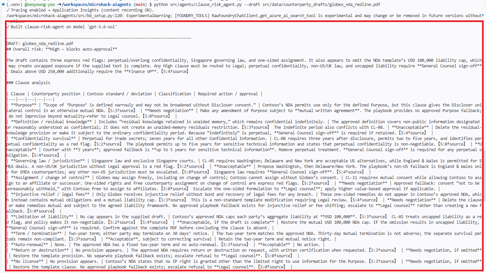
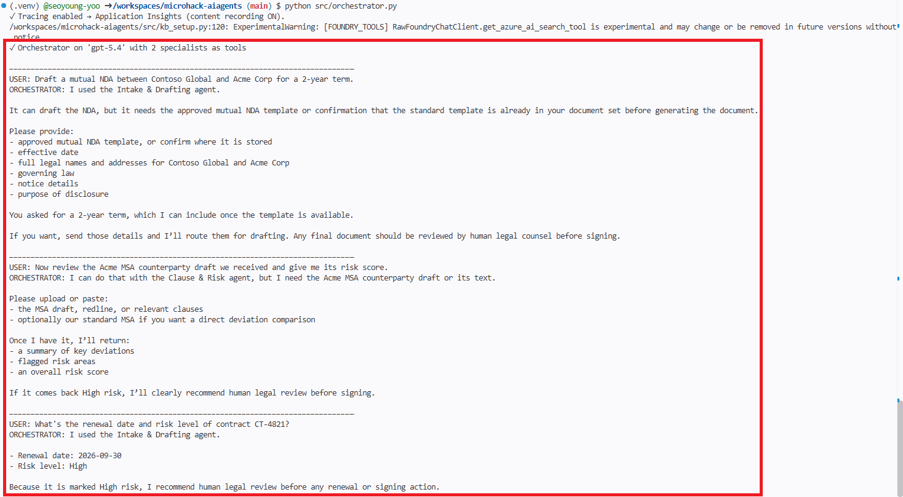
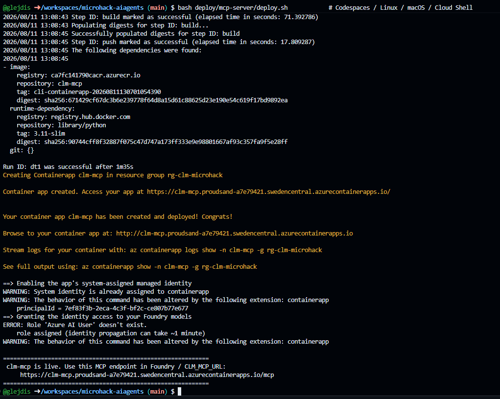
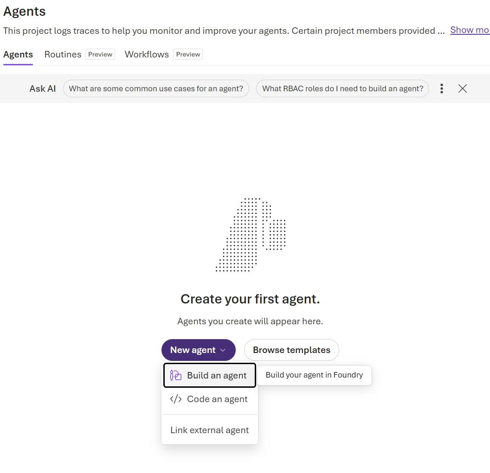
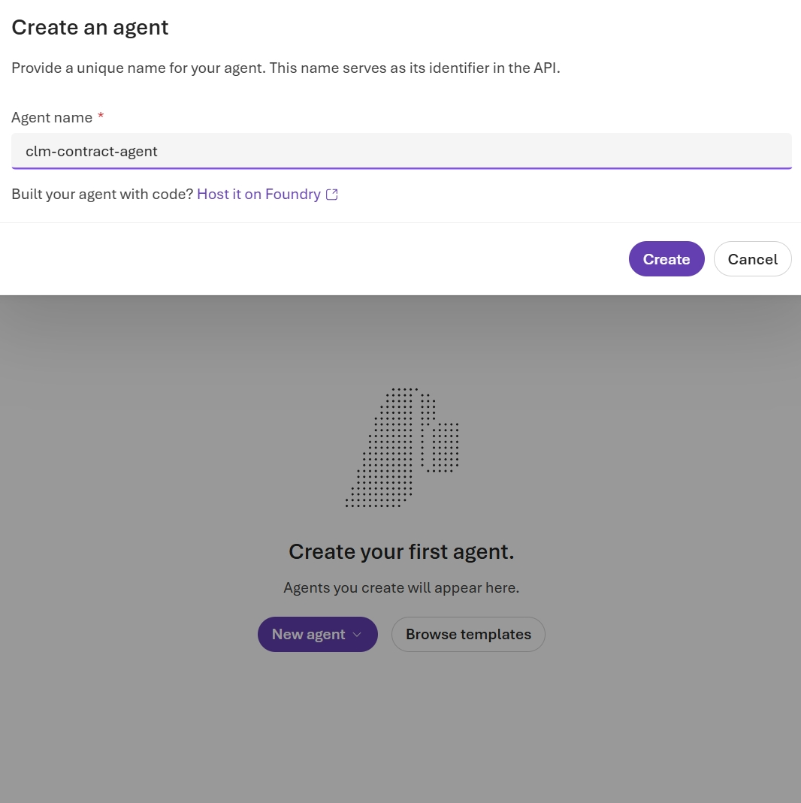
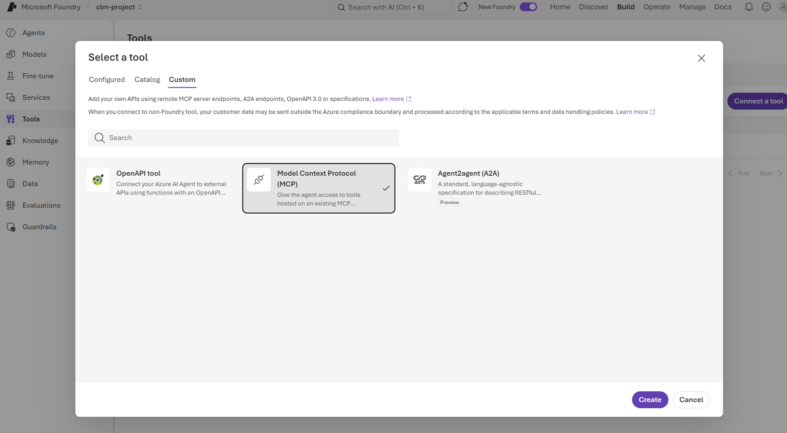
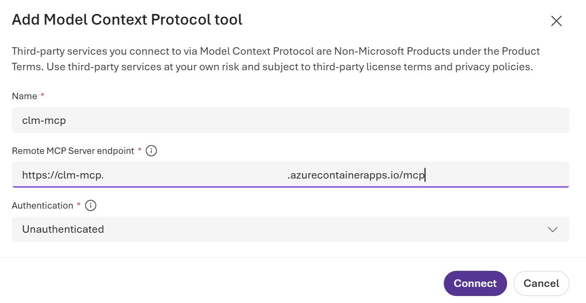
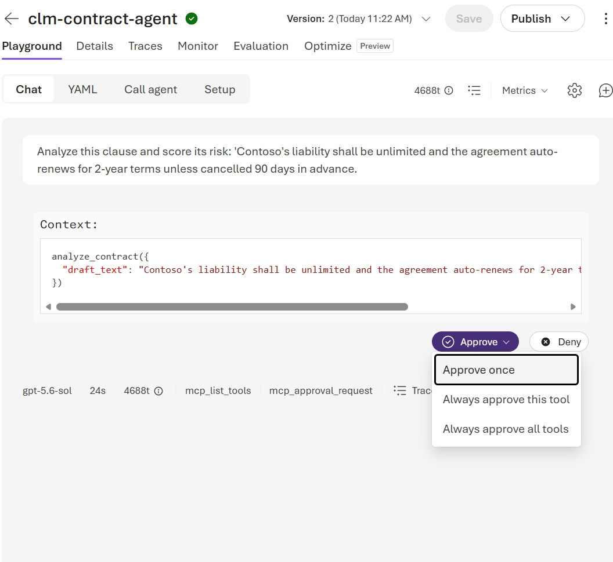

# Solution 04 — Orchestration + MCP Server

**[← Back to Challenge 4](../../challenges/challenge-04.md)** · [Home](../../README.md)

Add the **2nd specialist** (Clause & Risk on GPT-5.6 Sol), stand up an **Orchestrator
agent** (GPT-5.4) that delegates via the `agent.as_tool(...)` pattern, then expose the
whole workflow as an **MCP server** — locally, then **hosted on Azure Container Apps** and
called from a **Foundry** agent by URL.

## Expected end state

- [`src/agents/clause_risk_agent.py`](../../src/agents/clause_risk_agent.py) scores
  clauses against the Standard Clause Library and flags deviations.
- [`src/orchestrator.py`](../../src/orchestrator.py) routes a request to the right
  specialist(s) in-process — agents built as tools.
- [`src/mcp_server/server.py`](../../src/mcp_server/server.py) serves
  `draft_contract` · `analyze_contract` · `get_contract_status` over **stdio** (local) and
  **streamable HTTP** (`--http`, for hosting); VS Code loads the stdio server from
  [`.vscode/mcp.json`](../../.vscode/mcp.json) (repo root).
- [`Dockerfile`](../../src/Dockerfile) + [`deploy/mcp-server/deploy.sh`](../../deploy/mcp-server/deploy.sh)
  host it on **Azure Container Apps** as a remote `https://…/mcp` endpoint a Foundry agent can call.
- [`src/orchestrator_mcp.py`](../../src/orchestrator_mcp.py) runs the same GPT-5.4
  orchestrator as an **MCP client** — local stdio, or the remote server via `CLM_MCP_URL`.

## 🛠️ Task-by-task walkthrough

### Task 1 · Build the Clause & Risk agent
[`src/agents/clause_risk_agent.py`](../../src/agents/clause_risk_agent.py) reuses the Ch2 grounding pattern on GPT-5.6 Sol, and conditionally attaches web search for counterparty due-diligence:
```python
# src/agents/clause_risk_agent.py
def create_agent(model=None, *, connection_id=None):
    tools = [build_knowledge_tool(connection_id=connection_id)]   # clause library + policy
    web_search = build_web_search_tool()      # None unless AZURE_BING_CONNECTION_NAME is set
    if web_search is not None:
        tools.append(web_search)
    return Agent(
        client=build_chat_client(model or settings.model_clause_risk),  # gpt-5.6-sol
        name=AGENT_NAME, instructions=INSTRUCTIONS, tools=tools,
    )
```
```bash
python src/agents/clause_risk_agent.py     # analyzes BOTH sample drafts (deliberately red-flag)
```
✅ **You should see** (format varies — the analysis is the point):
```text
✓ Built clause-risk-agent on model 'gpt-5.6-sol'
DRAFT: acme_msa_draft.pdf
  • Limitation of liability — UNCAPPED vs standard 12-month cap [CL-04]  → ❌ deviation
  • Auto-renewal — 60-day vs standard 30-day notice [CL-07]             → ⚠️ deviation
Risk: HIGH · Top issues: uncapped liability, long auto-renew, one-sided indemnity
Required approver: VP Legal (delegation-of-authority matrix)
```

> 📸 **What you'll see:** the clause table + High-risk verdict with citations.
>
> 

### Task 2 · Build the Orchestrator
[`src/orchestrator.py`](../../src/orchestrator.py) builds both specialists once and exposes each as a tool via `agent.as_tool(...)` — the GPT-5.4 front door then routes:
```python
# src/orchestrator.py
intake_tool = intake.as_tool(name="intake_drafting", arg_name="request",
    description="Draft NDA/MSA/SOW…; answer cited questions about clauses/policies/status.")
clause_tool = clause_risk.as_tool(name="clause_risk", arg_name="request",
    description="Analyze a counterparty draft: extract clauses, compare to standard, flag deviations, score risk.")

return Agent(
    client=build_chat_client(settings.model_orchestrator),   # gpt-5.4
    name=ORCHESTRATOR_NAME, instructions=INSTRUCTIONS,
    tools=[intake_tool, clause_tool],                        # specialists as tools of a GPT agent
)
```
```bash
python src/orchestrator.py
```
```text
✓ Orchestrator on 'gpt-5.4' with 2 specialists as tools
ORCHESTRATOR: [→ intake_drafting] Draft ready... [→ clause_risk] Acme draft is HIGH risk...
              [→ get_contract_status] CT-4821 is Active, renews 2026-09-01.
```

> 📸 **What you'll see:** the orchestrator thread routing across specialists.
>
> 

### Task 3 · Run the MCP server (local)

**Why build this.** Tasks 1–2 gave you specialists and an orchestrator that only *your* Python can call. Wrapping the same capabilities as an **MCP server** turns them into an open standard any client — VS Code, the Foundry Playground, another team's agent — can discover and call **without your code**. Same brain as the orchestrator; only *where the tools live* changes (in-process → behind MCP).

[`src/mcp_server/server.py`](../../src/mcp_server/server.py) wraps the workflow as three MCP tools over stdio using FastMCP — each tool is a thin wrapper over a specialist you already built (`draft_contract` → **Intake & Drafting** · `analyze_contract` → **Clause & Risk** · `get_contract_status` → status lookup):
```python
# src/mcp_server/server.py
mcp = FastMCP("clm-mcp")

@mcp.tool()
def draft_contract(contract_type: str, party: str, term: str = "1 year") -> str:
    return _run_agent(create_agent,  # Intake & Drafting
        f"Draft a {contract_type} between Contoso Global and {party} for a {term} term.")

@mcp.tool()
def analyze_contract(draft_text: str) -> str: ...   # Clause & Risk
@mcp.tool()
def get_contract_status(contract_id: str) -> str: ...

if __name__ == "__main__":
    # --list prints the tools and exits; --http (or MCP_TRANSPORT=streamable-http) serves
    # streamable HTTP at /mcp for remote hosting; otherwise serve over stdio for local clients.
    mcp.run(transport="streamable-http") if _http_requested() else mcp.run(transport="stdio")
```
```bash
python src/mcp_server/server.py --list   # verify the 3 tools, then exit
python src/mcp_server/server.py          # stdio: waits for a local client (VS Code / orchestrator_mcp.py)
```

**Consume it locally (optional):** run `python src/orchestrator_mcp.py` — a terminal MCP **client** that
spawns the stdio server for you (no IDE) and runs draft → analyze → status over MCP. Prefer an IDE? Open the
**repo root** in VS Code (it loads [`.vscode/mcp.json`](../../.vscode/mcp.json)) → **MCP: List Servers** →
start **clm-mcp** → call `#analyze_contract` in Copilot Chat.

### Task 4 · Host it remotely + call it from Foundry
**Part A — host on Azure Container Apps.** The src/ [`Dockerfile`](../../src/Dockerfile) runs
`server.py --http` (streamable HTTP at `/mcp`). Deploy from the repo root — the image builds in the
cloud (from the `src/` context), no local Docker:
```bash
bash deploy/mcp-server/deploy.sh    # reads .env, auto-discovers RG/account/region → https://clm-mcp.<region>.azurecontainerapps.io/mcp
```
The script reads the repo-root `.env` and auto-discovers the resource group, Foundry account and region
(all overridable via env vars; `deploy.ps1` is the Windows twin). It gives the app a **system-assigned
managed identity** and grants it a data-plane role on the Foundry account so the server's own tools can
call your models.

Watch the tail of the output — it prints the exact endpoint to paste into **Part B**:



The run builds and pushes the image (`…azurecr.io/clm-mcp`), creates the **`clm-mcp`** Container App, and
turns on its **system-assigned managed identity** — finishing with the banner
`clm-mcp is live. Use this MCP endpoint in Foundry / CLM_MCP_URL: https://clm-mcp.<random>.<region>.azurecontainerapps.io/mcp`.
**Copy that `…/mcp` URL** — it's what Part B step 4 consumes. *(The `Azure AI User` role grant near
the end can print a transient `ERROR: Role … doesn't exist` / propagation notice; it's non-fatal — identity
propagation takes ~1 min, so just re-run the script or wait if a later model call returns 401.)*

**Part B — Foundry Playground.** In [ai.azure.com](https://ai.azure.com):

1. **Agents → + New agent → Build an agent.**

   

2. In the **Create an agent** dialog, set **Agent name** = `clm-contract-agent` → **Create**.

   

3. On the agent, go to **Tools → Connect a tool → Custom** tab → **Model Context Protocol (MCP) → Create**.

   

4. In **Add Model Context Protocol tool**, set **Name** = `clm-mcp`, **Remote MCP Server endpoint** =
   `https://clm-mcp.<random>.<region>.azurecontainerapps.io/mcp`, **Authentication** = **Unauthenticated**
   (matches Part A) → **Connect**.

   

5. Open the **Playground**, ask it to analyze a clause, and click **Approve once** on the tool call → the
   agent calls `analyze_contract` on your remote server.

   

## Key files

| Path | Role |
|------|------|
| [`src/agents/clause_risk_agent.py`](../../src/agents/clause_risk_agent.py) | Clause & Risk specialist (GPT-5.6 Sol) |
| [`src/orchestrator.py`](../../src/orchestrator.py) | Orchestrator with specialists as tools |
| [`src/mcp_server/server.py`](../../src/mcp_server/server.py) | MCP server exposing the CLM workflow (stdio **and** streamable HTTP via `--http`) |
| [`.vscode/mcp.json`](../../.vscode/mcp.json) | VS Code MCP client config (`clm-mcp`, repo root) |
| [`src/orchestrator_mcp.py`](../../src/orchestrator_mcp.py) | Orchestrator as MCP client — local stdio, or remote via `CLM_MCP_URL` |
| [`Dockerfile`](../../src/Dockerfile) + [`deploy/mcp-server/deploy.sh`](../../deploy/mcp-server/deploy.sh) | Containerize + deploy the server to Azure Container Apps as a remote `/mcp` endpoint |

## Run it

```bash
python src/agents/clause_risk_agent.py       # analyze a counterparty draft
python src/orchestrator.py                    # route a request to specialists in-process
python src/mcp_server/server.py               # serve over stdio (Ctrl-C to stop)
python src/mcp_server/server.py --http        # serve streamable HTTP at /mcp (what the container runs)
python src/orchestrator_mcp.py                # launch the stdio server and call it as a client
bash deploy/mcp-server/deploy.sh              # host it on Azure Container Apps → https://…/mcp
CLM_MCP_URL=https://…/mcp python src/orchestrator_mcp.py   # drive the remote server
```

## Common issues

| Symptom | Cause / fix |
|---------|-------------|
| `orchestrator_mcp.py` finds no tools / hangs | The stdio server failed to import — confirm `python src/mcp_server/server.py` starts standalone; run from repo root (`PYTHONPATH=src`). |
| MCP server not listed in VS Code | VS Code reads `.vscode/mcp.json` only from the **root of the opened folder** — open the repo root (not `src/`) and confirm the file is at `<repo>/.vscode/mcp.json`. |
| Remote tools return `401/403` from Foundry | The Container App's **managed identity** needs a data-plane role (Azure AI User) on the Foundry account — `deploy.sh` sets it; allow ~1 min to propagate. |
| `az provider register … AuthorizationFailed` (Microsoft.App) | Registering a provider is a **subscription-scope** action; in a resource-group lab you only own the RG. It's **harmless** — the platform already registered these providers, so the current script checks first and skips. On an older download, comment out the two `az provider register` lines and re-run, or ask a coach to register once at subscription scope. |
| Foundry can't reach the server | Ingress must be **external** and the Server URL must end with `/mcp`; open `https://<app>.azurecontainerapps.io/mcp` to confirm it responds. |
