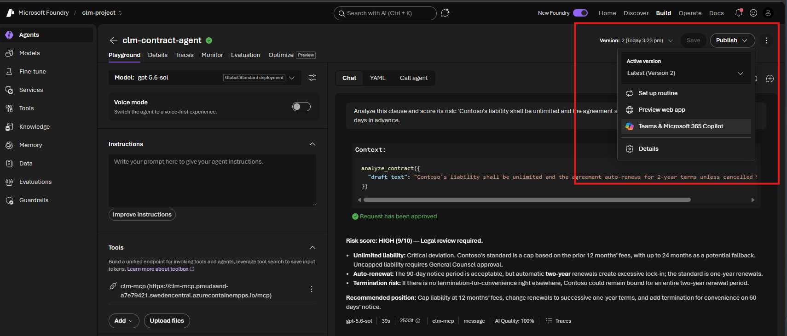
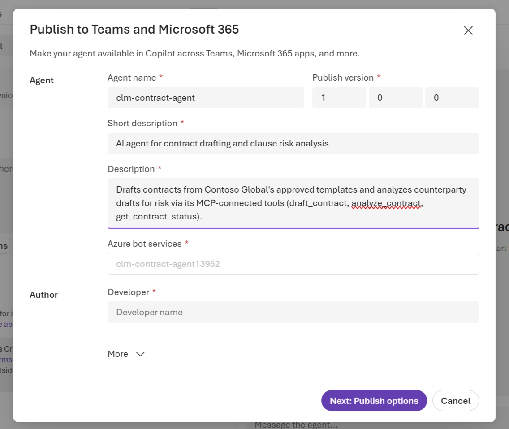
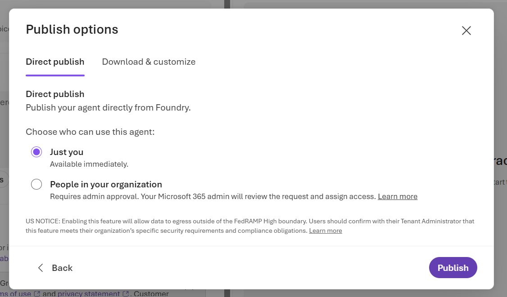
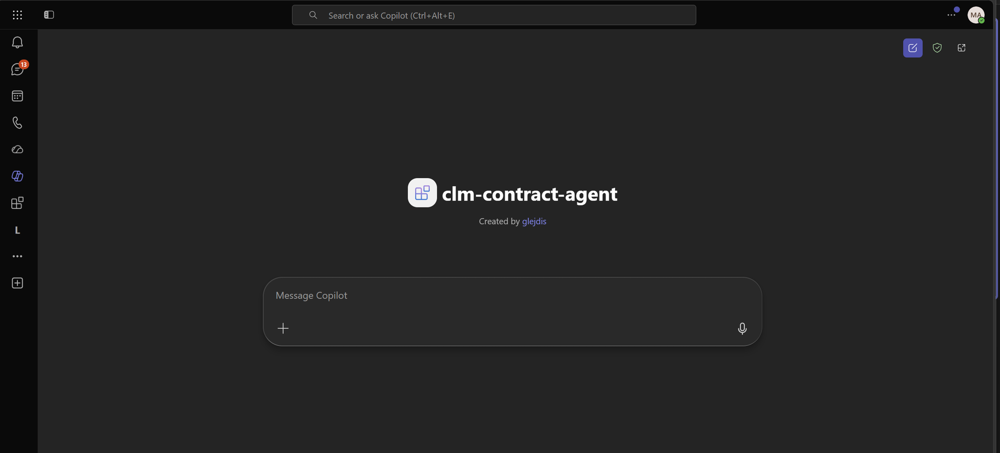
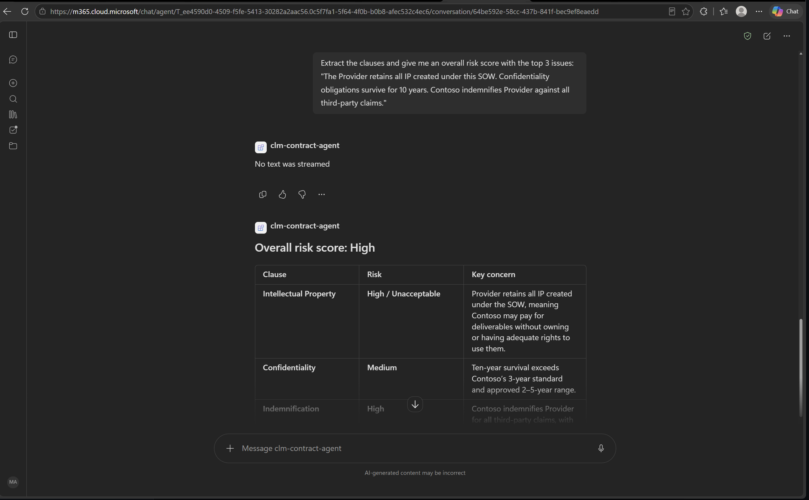
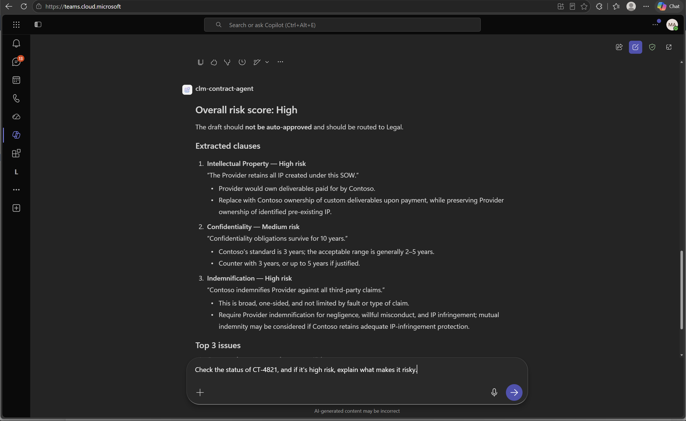

# Solution 05 — Publish to M365 Copilot & Teams

**[← Back to Challenge 5](../../challenges/challenge-05.md)** · [Home](../../README.md)

Ship your **CLM agent** — the MCP-backed **`clm-contract-agent`** from Challenge 4 — to **Microsoft 365
Copilot & Teams** so people chat with it live where contract managers already work.

## Expected end state

- The Teams/M365 app package is built from the manifest in
  [`src/manifest/`](../../src/manifest/) and sideloaded — you chat with the
  `clm-contract-agent` where contract managers already work, and it returns the same
  grounded, cited answers you saw in the terminal in Challenges 2 & 4.

## 🛠️ Task-by-task walkthrough

### Task 1 · Open your CLM agent
In the **Foundry portal**, open the **`clm-contract-agent`** you published in **Challenge 4 (Task 4 Part B)** — the MCP-backed portal agent. *(The `clm-orchestrator` from Ch4 Task 2 was in-process and isn't in the portal.)*

### Task 2 · Publish to Teams & M365 Copilot
Select **Publish** → **Publish to Teams and Microsoft 365 Copilot** → **Continue** (provisions an **Azure Bot Service**; needs the `Microsoft.BotService` provider registered on the **subscription** — the lab's shared deploy hook `shared-deploy-lab.ps1` does this once per subscription before the labs, else a **subscription Owner** runs `az provider register --namespace Microsoft.BotService` once). Leave the **Azure bot services** dropdown on *auto*; delete any stale bot from earlier attempts to avoid an **App ID collision**.

### Task 3 · Fill the publish details & submit
**Fill the app details.** Most fields are **pre-filled from the agent** — **Agent name** (`clm-contract-agent`), **Publish version** (`1.0.0`), **Short description**, **Description**, and **Azure bot services** (auto-generated). The one required (`*`) field you must type yourself is **Developer** — enter your name or team (e.g. `Contoso Global CLM Team`); expand **More** for the **Developer website / Terms of use / Privacy statement** URLs (`https://example.com` placeholders are fine). Select **Next: Publish options** (older portal builds label this button **Prepare Agent**). In **Publish options** (**Direct publish** tab) choose **Just you** — *Available immediately* (*People in your organization* would need your **Microsoft 365 admin** to approve) → **Publish**. Find it in Teams under **Apps → Your agents**. The form auto-packages icons; only the **Download & customize** route needs the **192×192** + **32×32** placeholders in [`src/manifest/`](../../src/manifest/). *(If direct publish returns a **400**, use the **Download & customize** tab and sideload the zip.)*

### Task 4 · Test the agent live
**Test live** in Teams and M365 Copilot: ask it to draft an NDA and review the Acme draft. ✅ This works when the agent returns the **same grounded, cited answers** you saw in the terminal in Ch2 & Ch4.

**Try these prompts** — each exercises one of the three `clm-mcp` tools the agent calls (status prompts use the real seeded contract IDs):

| Tool it triggers | Prompt to paste into the chat |
| --- | --- |
| `draft_contract` | `Draft an NDA between Contoso Global and Acme Corp for a 2-year term.` |
| `draft_contract` | `Draft an MSA with Globex Ltd for a 3-year term.` |
| `analyze_contract` | `Analyze this clause and score its risk: "Contoso's liability shall be unlimited and the agreement auto-renews for 2-year terms unless cancelled 90 days in advance."` |
| `analyze_contract` | `Review this counterparty draft and flag deviations from our standard: "Either party may terminate for convenience with 15 days' notice. Payment due Net 90. Governing law is the State of Delaware."` |
| `get_contract_status` | `What's the status of contract CT-4821?` *(Acme MSA — Active, High risk)* |
| `get_contract_status` | `When does CT-6033 renew and who owns it?` *(Soylent MSA — auto-renews soon)* |
| End-to-end (chains tools) | `Draft an MSA with Acme Corp for 2 years, then analyze it for risky clauses.` |

**What "working" looks like:** grounded answers with **cited clauses**, a numeric **risk score**, and structured **status fields** (status / renewal date / risk / owner). An ID that isn't seeded (e.g. `CT-9999`) should return a clean *not found*.

**Both surfaces call the exact same MCP tools** you tested in Ch4 — Teams and M365 Copilot are just two front-ends over the one published `clm-contract-agent`.

**1. The agent is live and reachable.** Opening it shows the agent's landing page in M365 Copilot / Teams (`clm-contract-agent`, *Created by glejdis*) with a ready chat box — proof the publish from Task 3 succeeded.

**2. In M365 Copilot** — the `analyze_contract` prompt returns a structured **Overall risk score: High** with a *Clause / Risk / Key concern* table (Intellectual Property → *High/Unacceptable*, Confidentiality → *Medium*, Indemnification → *High*). *(A brief "No text was streamed" bubble can appear first — a benign streaming artifact; the full grounded answer renders right below it.)*

**3. In Teams** — the same prompt returns the full cited breakdown: **Overall risk score: High — "not auto-approved, route to Legal"**, each **Extracted clause** quoted with a recommended counter-position, and a **Top 3 issues** summary. The composer shows the end-to-end follow-up (`Check the status of CT-4821…`) that chains a status lookup onto the analysis.

### Troubleshooting Teams deployment

**Can't find the agent in Teams (after direct publish):**
- Check **Apps → Your agents** in Teams.
- Wait 1–2 minutes for it to appear after publishing.
- Verify publishing completed successfully in the Foundry portal.

**Can't upload the app (manual / Download & customize):**
- Ensure the `manifest.zip` isn't corrupted (re-download, or re-zip `src/manifest/`).
- Check your Teams admin hasn't disabled **custom app uploads** (sideloading) — many corp tenants do; use a coach-provided tenant.
- Verify the icons are the correct sizes (**192×192** and **32×32**).

**Agent doesn't respond:**
- Wait ~30 s after installation for the bot to initialize.
- Confirm the **Azure Bot Service** was created (shown during publishing).
- Test the agent in the Foundry **Playground** first.

**Responses are generic (missing your data or tools):**
- Unlike a simple file-search agent, this one is grounded through its **MCP tool** (Ch4) — confirm the
  **MCP endpoint from Challenge 4 is still deployed** and reachable, and **approve the tool call** if
  Teams prompts you.
- Re-test the same prompt in the Foundry **Playground**; if it's grounded there but generic in Teams,
  it's a channel / tool-approval issue, not a grounding one.

## Key files

| Path | Role |
|------|------|
| [`src/manifest/`](../../src/manifest/) | Teams / M365 Copilot app package (manifest + branded icons) |

## Common issues

| Symptom | Cause / fix |
|---------|-------------|
| Published, but "nothing in Teams" | Publish with **Individual scope → Submit**, then look under **Apps → Your agents** (wait 1–2 min). If direct publish 400s, use **Download & customize** and sideload the zip. |
| Can't sideload the Teams app | Many corp tenants block sideloading — use a coach-provided tenant. |
| App ID collision on re-publish | Delete the stale Azure Bot from the earlier attempt, then re-publish (Foundry provisions a fresh one). |
| `Microsoft.BotService` errors / **`MissingSubscriptionRegistration`** (409) on the bot dropdown | The provider isn't registered on the **subscription**. The lab's shared deploy hook (`shared-deploy-lab.ps1`) registers it once per subscription before the labs; if it's still missing, a **subscription Owner** runs once (subscription-wide): `az provider register --namespace Microsoft.BotService`. In an RG-scoped lab the participant (RG-Owner) can't self-register — ask the coach / lab admin. Wait for `Registered` (~1–2 min), then reopen the publish dialog. |
