# Solution 05 — Publish to M365 Copilot & Teams + Proactive Alerts

**[← Back to Challenge 5](../../challenges/challenge-05.md)** · [Home](../../README.md)

Ship your **CLM agent** — the MCP-backed **`clm-contract-agent`** from Challenge 4 — to **Microsoft 365
Copilot & Teams** so people chat with it live, **and** push **proactive renewal alerts** before
contracts auto-renew — driven by the **Obligation & Renewal** agent.

## Expected end state

- The **Obligation & Renewal** agent
  ([`src/agents/obligation_renewal_agent.py`](../../src/agents/obligation_renewal_agent.py))
  reads contract status + upcoming renewals via function tools (Azure SQL, with a
  seed-data fallback).
- The Teams/M365 app package is built from the manifest in
  [`src/manifest/`](../../src/manifest/) and sideloaded — you chat with the
  `clm-contract-agent` where contract managers already work.
- Proactive alerts fire via
  [`src/proactive_alerts.py`](../../src/proactive_alerts.py) — a Teams ping **before**
  the renewal date.

## 🛠️ Task-by-task walkthrough

### Part A · Publish to Teams & M365 Copilot (portal)
1. In the **Foundry portal**, open the **`clm-contract-agent`** you published in **Challenge 4 (Task 4 Part B)** — the MCP-backed portal agent. *(The `clm-orchestrator` from Ch4 Task 2 was in-process and isn't in the portal.)*
2. **Details → Channels → "Teams and Microsoft 365 Copilot" → Publish** (provisions an **Azure Bot Service**; first time: `az provider register --namespace Microsoft.BotService`).
3. Fill the metadata, then **direct publish** or download & sideload the manifest from [`src/manifest/`](../../src/manifest/).
4. **Test live** in Teams and M365 Copilot: ask it to draft an NDA and review the Acme draft. ✅ Part A worked when the agent returns the **same grounded, cited answers** you saw in the terminal in Ch2 & Ch4.

> 📸 **Screenshot slot:** the **Channels** page ("Teams and Microsoft 365 Copilot" → **Publish**), then the agent answering **live in a Teams chat** with cited output.
>
> 
> 

### Part B, Task 5 · Build the Obligation & Renewal agent
[`src/agents/obligation_renewal_agent.py`](../../src/agents/obligation_renewal_agent.py) is a small, cheap GPT-5.4-nano agent with two function tools:
```python
# src/agents/obligation_renewal_agent.py
def create_agent(model=None):
    return Agent(
        client=build_chat_client(model or settings.model_renewal),   # gpt-5.4-nano
        name=AGENT_NAME, instructions=INSTRUCTIONS,
        tools=[function_tool(get_contract_status), function_tool(list_upcoming_renewals)],
    )
```
`list_upcoming_renewals` reads Azure SQL when configured, else the evergreen JSON seed (dates relative to today, so the demo never goes stale):
```python
# src/clm_common/tools.py
def list_upcoming_renewals(within_days: int = 90) -> str:
    contracts, source = _all_contracts()          # Azure SQL if AZURE_SQL_CONNECTION_STRING, else seed
    rows = [{**c, "days_until_renewal": (rdate - today).days}
            for c in contracts if 0 <= (rdate - today).days <= within_days]
    return json.dumps({"within_days": within_days, "count": len(rows), "contracts": rows, "_source": source})
```
```bash
python src/agents/obligation_renewal_agent.py --days 60
python src/proactive_alerts.py --from-renewals --days 30 --dry-run    # preview text, nothing sent
```
✅ **You should see** a renewal summary then the previewed alert (day counts differ — relative to today):
```text
✓ Obligation & Renewal agent on 'gpt-5.4-nano' — window 60d
  🔴 CT-6033 (Soylent Co · MSA) — renews in ~25 days, auto-renew ON, 90-day notice → HIGH, send notice now
  🔴 CT-4821 (Acme Corp · MSA) — renews in ~55 days, auto-renew ON, 90-day notice → HIGH, notify owner
--- alert (dry run) ---
🔴 CT-6033 auto-renews soon (90-day notice) — HIGH risk. Send notice before the window closes; recommend legal review.
```

> 📸 **Screenshot slot:** the **renewal summary** (prioritized, emoji-tagged).
>
> 

### Task 6 · Capture a conversation reference
In your bot's message handler, on **any** inbound activity save `TurnContext.get_conversation_reference(activity)` and persist `service_url` + `conversation.id` into `.env` as `TEAMS_SERVICE_URL` / `TEAMS_CONVERSATION_ID` (plus `MICROSOFT_APP_ID` / `MICROSOFT_APP_PASSWORD` / `MICROSOFT_APP_TENANT_ID`). [`src/proactive_alerts.py`](../../src/proactive_alerts.py) rebuilds the reference from those vars:
```python
# src/proactive_alerts.py
def _conversation_reference():
    return ConversationReference(
        channel_id="msteams",
        service_url=os.environ["TEAMS_SERVICE_URL"],
        bot=ChannelAccount(id=f"28:{os.environ['MICROSOFT_APP_ID']}"),
        conversation=ConversationAccount(id=os.environ["TEAMS_CONVERSATION_ID"]),
    )
```

### Task 7 · Fire a proactive alert
The send path uses `adapter.continue_conversation(...)` to post into the saved conversation unprompted:
```python
# src/proactive_alerts.py
async def _send(text: str):
    async def _callback(turn_context): await turn_context.send_activity(text)
    await adapter.continue_conversation(reference, _callback, bot_id=os.environ["MICROSOFT_APP_ID"])
```
```bash
python src/proactive_alerts.py --from-renewals --days 30      # generate from the agent and send
```
```text
✓ Proactive alert sent to Teams.
```

> 📸 **Screenshot slot:** the **alert message appearing in the Teams channel/chat** without anyone prompting.
>
> 

## Key files

| Path | Role |
|------|------|
| [`src/agents/obligation_renewal_agent.py`](../../src/agents/obligation_renewal_agent.py) | Reads contract status + upcoming renewals (GPT-5.4-nano) |
| [`src/proactive_alerts.py`](../../src/proactive_alerts.py) | Sends proactive Teams renewal alerts via the Bot Framework |
| [`src/manifest/`](../../src/manifest/) | Teams / M365 Copilot app package (manifest + branded icons) |

## Run it

```bash
python src/agents/obligation_renewal_agent.py --days 60
python src/proactive_alerts.py --from-renewals --days 30 --dry-run
python src/proactive_alerts.py --from-renewals --days 30       # live send
```

## Common issues

| Symptom | Cause / fix |
|---------|-------------|
| Can't sideload the Teams app | Many corp tenants block sideloading — use a coach-provided tenant. |
| No renewals found | Seed Azure SQL (`src/scripts/seed_sql.py`) or rely on the seed-data fallback. |
| `Microsoft.BotService` errors | Register the provider: `az provider register --namespace Microsoft.BotService`. |
