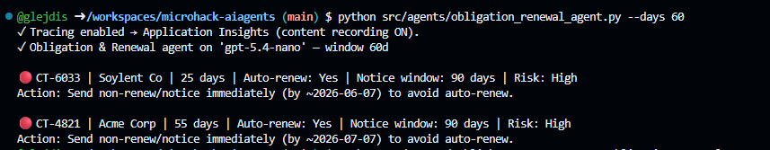

# Solution 05 — Publish to M365 Copilot & Teams + Proactive Alerts

**[← Back to Challenge 5](../../challenges/challenge-05.md)** · [Home](../../README.md)

Ship your **CLM agent** — the MCP-backed **`clm-contract-agent`** from Challenge 4 — to **Microsoft 365
Copilot & Teams** so people chat with it live, **and** push **proactive renewal alerts** before
contracts auto-renew — driven by the **Obligation & Renewal** agent.

## Expected end state

- The **Obligation & Renewal** agent
  ([`src/agents/obligation_renewal_agent.py`](../../src/agents/obligation_renewal_agent.py))
  reads contract status + upcoming renewals via function tools (Azure SQL, with a
  seed-data fallback).
- The Teams/M365 app package is built from the manifest in
  [`src/manifest/`](../../src/manifest/) and sideloaded — you chat with the
  `clm-contract-agent` where contract managers already work.
- Proactive alerts fire via
  [`src/proactive_alerts.py`](../../src/proactive_alerts.py) — a Teams ping **before**
  the renewal date.

## 🛠️ Task-by-task walkthrough

### Task 1 · Open your CLM agent
In the **Foundry portal**, open the **`clm-contract-agent`** you published in **Challenge 4 (Task 4 Part B)** — the MCP-backed portal agent. *(The `clm-orchestrator` from Ch4 Task 2 was in-process and isn't in the portal.)*

### Task 2 · Publish to Teams & M365 Copilot
Select **Publish** → **Publish to Teams and Microsoft 365 Copilot** → **Continue** (provisions an **Azure Bot Service**; first time: `az provider register --namespace Microsoft.BotService`). Leave the **Azure bot services** dropdown on *auto*; delete any stale bot from earlier attempts to avoid an **App ID collision**.


### Task 3 · Fill the publish details & submit
**Fill the app details.** Most fields are **pre-filled from the agent** — **Agent name** (`clm-contract-agent`), **Publish version** (`1.0.0`), **Short description**, **Description**, and **Azure bot services** (auto-generated). The one required (`*`) field you must type yourself is **Developer** — enter your name or team (e.g. `Contoso Global CLM Team`); expand **More** for the **Developer website / Terms of use / Privacy statement** URLs (`https://example.com` placeholders are fine). Select **Next: Publish options** (older portal builds label this button **Prepare Agent**). In **Publish options** (**Direct publish** tab) choose **Just you** — *Available immediately* (*People in your organization* would need your **Microsoft 365 admin** to approve) → **Publish**. Find it in Teams under **Apps → Your agents**. The form auto-packages icons; only the **Download & customize** route needs the **192×192** + **32×32** placeholders in [`src/manifest/`](../../src/manifest/). *(If direct publish returns a **400**, use the **Download & customize** tab and sideload the zip.)*


### Task 4 · Test the agent live
**Test live** in Teams and M365 Copilot: ask it to draft an NDA and review the Acme draft. ✅ This works when the agent returns the **same grounded, cited answers** you saw in the terminal in Ch2 & Ch4.

**Try these prompts** — each exercises one of the three `clm-mcp` tools the agent calls (status prompts use the real seeded contract IDs):

| Tool it triggers | Prompt to paste into the chat |
| --- | --- |
| `draft_contract` | `Draft an NDA between Contoso Global and Acme Corp for a 2-year term.` |
| `draft_contract` | `Draft an MSA with Globex Ltd for a 3-year term.` |
| `analyze_contract` | `Analyze this clause and score its risk: "Contoso's liability shall be unlimited and the agreement auto-renews for 2-year terms unless cancelled 90 days in advance."` |
| `analyze_contract` | `Review this counterparty draft and flag deviations from our standard: "Either party may terminate for convenience with 15 days' notice. Payment due Net 90. Governing law is the State of Delaware."` |
| `get_contract_status` | `What's the status of contract CT-4821?` *(Acme MSA — Active, High risk)* |
| `get_contract_status` | `When does CT-6033 renew and who owns it?` *(Soylent MSA — auto-renews soon)* |
| End-to-end (chains tools) | `Draft an MSA with Acme Corp for 2 years, then analyze it for risky clauses.` |

**What "working" looks like:** grounded answers with **cited clauses**, a numeric **risk score**, and structured **status fields** (status / renewal date / risk / owner). An ID that isn't seeded (e.g. `CT-9999`) should return a clean *not found*.

**Both surfaces call the exact same MCP tools** you tested in Ch4 — Teams and M365 Copilot are just two front-ends over the one published `clm-contract-agent`.

**1. The agent is live and reachable.** Opening it shows the agent's landing page in M365 Copilot / Teams (`clm-contract-agent`, *Created by glejdis*) with a ready chat box — proof the publish from Task 3 succeeded.


**2. In M365 Copilot** — the `analyze_contract` prompt returns a structured **Overall risk score: High** with a *Clause / Risk / Key concern* table (Intellectual Property → *High/Unacceptable*, Confidentiality → *Medium*, Indemnification → *High*). *(A brief "No text was streamed" bubble can appear first — a benign streaming artifact; the full grounded answer renders right below it.)*


**3. In Teams** — the same prompt returns the full cited breakdown: **Overall risk score: High — "not auto-approved, route to Legal"**, each **Extracted clause** quoted with a recommended counter-position, and a **Top 3 issues** summary. The composer shows the end-to-end follow-up (`Check the status of CT-4821…`) that chains a status lookup onto the analysis.


### Troubleshooting Teams deployment

**Can't find the agent in Teams (after direct publish):**
- Check **Apps → Your agents** in Teams.
- Wait 1–2 minutes for it to appear after publishing.
- Verify publishing completed successfully in the Foundry portal.

**Can't upload the app (manual / Download & customize):**
- Ensure the `manifest.zip` isn't corrupted (re-download, or re-zip `src/manifest/`).
- Check your Teams admin hasn't disabled **custom app uploads** (sideloading) — many corp tenants do; use a coach-provided tenant.
- Verify the icons are the correct sizes (**192×192** and **32×32**).

**Agent doesn't respond:**
- Wait ~30 s after installation for the bot to initialize.
- Confirm the **Azure Bot Service** was created (shown during publishing).
- Test the agent in the Foundry **Playground** first.

**Responses are generic (missing your data or tools):**
- Unlike a simple file-search agent, this one is grounded through its **MCP tool** (Ch4) — confirm the
  **MCP endpoint from Challenge 4 is still deployed** and reachable, and **approve the tool call** if
  Teams prompts you.
- Re-test the same prompt in the Foundry **Playground**; if it's grounded there but generic in Teams,
  it's a channel / tool-approval issue, not a grounding one.

### Task 5 · (Optional) Build the Obligation & Renewal agent
[`src/agents/obligation_renewal_agent.py`](../../src/agents/obligation_renewal_agent.py) is a small, cheap GPT-5.4-nano agent with two function tools:
```python
# src/agents/obligation_renewal_agent.py
def create_agent(model=None):
    return Agent(
        client=build_chat_client(model or settings.model_renewal),   # gpt-5.4-nano
        name=AGENT_NAME, instructions=INSTRUCTIONS,
        tools=[function_tool(get_contract_status), function_tool(list_upcoming_renewals)],
    )
```
`list_upcoming_renewals` reads Azure SQL when configured, else the evergreen JSON seed (dates relative to today, so the demo never goes stale):
```python
# src/clm_common/tools.py
def list_upcoming_renewals(within_days: int = 90) -> str:
    contracts, source = _all_contracts()          # Azure SQL if AZURE_SQL_CONNECTION_STRING, else seed
    rows = [{**c, "days_until_renewal": (rdate - today).days}
            for c in contracts if 0 <= (rdate - today).days <= within_days]
    return json.dumps({"within_days": within_days, "count": len(rows), "contracts": rows, "_source": source})
```
```bash
python src/agents/obligation_renewal_agent.py --days 60
python src/proactive_alerts.py --from-renewals --days 30 --dry-run    # preview text, nothing sent
```
✅ **You should see** a renewal summary then the previewed alert (day counts differ — relative to today):
```text
✓ Obligation & Renewal agent on 'gpt-5.4-nano' — window 60d
  🔴 CT-6033 (Soylent Co · MSA) — renews in ~25 days, auto-renew ON, 90-day notice → HIGH, send notice now
  🔴 CT-4821 (Acme Corp · MSA) — renews in ~55 days, auto-renew ON, 90-day notice → HIGH, notify owner
--- alert (dry run) ---
🔴 CT-6033 auto-renews soon (90-day notice) — HIGH risk. Send notice before the window closes; recommend legal review.
```

> 📸 **What you'll see:** the **renewal summary** printed by `obligation_renewal_agent.py --days 60` — each
> contract prioritized and emoji-tagged with days-to-renewal, auto-renew, notice window, and risk.
>
> 

### Task 6 · (Optional) Capture a conversation reference
A Foundry-published agent is **managed**, so you don't own its message handler. Use
[`src/capture_reference_bot.py`](../../src/capture_reference_bot.py) — a tiny aiohttp bot that, on
**any** inbound activity, calls `TurnContext.get_conversation_reference(activity)` and writes
`TEAMS_SERVICE_URL` + `TEAMS_CONVERSATION_ID` into `.env` (with `MICROSOFT_APP_ID` /
`MICROSOFT_APP_PASSWORD` / `MICROSOFT_APP_TENANT_ID`). Run it, expose it with a dev tunnel, point your
Azure Bot's **Messaging endpoint** at `https://<tunnel>/api/messages`, message the agent once, then
revert the endpoint:
```python
# src/capture_reference_bot.py
async def _on_turn(turn_context):
    ref = TurnContext.get_conversation_reference(turn_context.activity)
    _upsert_env({"TEAMS_SERVICE_URL": ref.service_url,
                 "TEAMS_CONVERSATION_ID": ref.conversation.id})
```
```python
# src/proactive_alerts.py
def _conversation_reference():
    return ConversationReference(
        channel_id="msteams",
        service_url=os.environ["TEAMS_SERVICE_URL"],
        bot=ChannelAccount(id=f"28:{os.environ['MICROSOFT_APP_ID']}"),
        conversation=ConversationAccount(id=os.environ["TEAMS_CONVERSATION_ID"]),
    )
```

### Task 7 · (Optional) Fire a proactive alert
The send path uses `adapter.continue_conversation(...)` to post into the saved conversation unprompted:
```python
# src/proactive_alerts.py
async def _send(text: str):
    async def _callback(turn_context): await turn_context.send_activity(text)
    await adapter.continue_conversation(reference, _callback, bot_id=os.environ["MICROSOFT_APP_ID"])
```
```bash
python src/proactive_alerts.py --from-renewals --days 30      # generate from the agent and send
```
```text
✓ Proactive alert sent to Teams.
```

> 📸 **Screenshot slot:** the **alert message appearing in the Teams channel/chat** without anyone prompting.
>
> 

## Key files

| Path | Role |
|------|------|
| [`src/agents/obligation_renewal_agent.py`](../../src/agents/obligation_renewal_agent.py) | Reads contract status + upcoming renewals (GPT-5.4-nano) |
| [`src/proactive_alerts.py`](../../src/proactive_alerts.py) | Sends proactive Teams renewal alerts via the Bot Framework (tenant-aware adapter) |
| [`src/capture_reference_bot.py`](../../src/capture_reference_bot.py) | Helper bot that captures `TEAMS_SERVICE_URL` + `TEAMS_CONVERSATION_ID` from a real Teams chat |
| [`src/manifest/`](../../src/manifest/) | Teams / M365 Copilot app package (manifest + branded icons) |

## Run it

```bash
python src/agents/obligation_renewal_agent.py --days 60
python src/proactive_alerts.py --from-renewals --days 30 --dry-run
python src/proactive_alerts.py --from-renewals --days 30       # live send
```

## Common issues

| Symptom | Cause / fix |
|---------|-------------|
| Published, but "nothing in Teams" | Publish with **Individual scope → Submit**, then look under **Apps → Your agents** (wait 1–2 min). If direct publish 400s, use **Download & customize** and sideload the zip. |
| Can't sideload the Teams app | Many corp tenants block sideloading — use a coach-provided tenant. |
| `continue_conversation` 401/403 | Foundry provisions a **single-tenant** bot — set `MICROSOFT_APP_TENANT_ID` in `.env` (adapter scopes auth to it). |
| App ID collision on re-publish | Delete the stale Azure Bot from the earlier attempt, then re-publish (Foundry provisions a fresh one). |
| No renewals found | Seed Azure SQL (`src/scripts/seed_sql.py`) or rely on the seed-data fallback. |
| `Microsoft.BotService` errors | Register the provider: `az provider register --namespace Microsoft.BotService`. |
