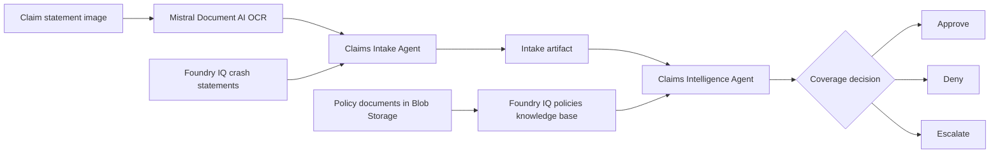

# Challenge 3 - Build the Claims Intelligence Agent

[Home](../README.md)

**Expected Duration:** 30 minutes

## Overview

In this challenge, you will build the Claims Intelligence Agent, the core
decision-making component of the claims processing pipeline.

Like Challenge 2, this component is built in two steps: first you create a Foundry IQ
knowledge base over the policy documents in Blob Storage, then you create one
specialized Foundry agent. The agent receives the knowledge base as an MCP retrieval
tool and handles policy extraction and coverage adjudication in one resource.

Together, the Claims Intake Agent and Claims Intelligence Agent form this flow:



Challenge 2 creates `claims-intake-agent`. This challenge creates
`claims-intelligence-agent`. After completing both challenges, the two Foundry agents
required by Challenge 4 are available.

### From mock policies to real policy documents

Enterprise claims adjudication starts with the model, but it only becomes useful when
the model can read the same policy documents your organization uses. In this challenge,
the Claims Intelligence Agent is the reasoning component, and the Foundry IQ knowledge
base over the Storage account `policies` container is its enterprise grounding layer.

In short: **policy documents → Foundry IQ knowledge base → Claims Intelligence Agent →
coverage decision**. The policy documents remain the source of truth. The agent
retrieves the matching document, structures its policy fields, and adjudicates the
claim in one Foundry resource.

The Claims Intelligence Agent combines Policy Matching and Coverage Validation into a
single orchestrated flow:

1. Retrieve the policy document that matches the claim's policy number through the Foundry IQ knowledge base.
2. Extract structured policy fields (coverage types, limits, deductibles, exclusions) from the grounded document using a dedicated Foundry agent.
3. Run multi-factor coverage analysis using an LLM-backed adjudicator.
4. Apply the compliance rules engine to identify exclusions and limits.
5. Score how consistent the reported crash details are with the policy on a 1-100 scale, driving the approve/deny/escalate outcome.
6. Escalate edge cases with structured reasoning and severity levels.
7. Emit a detailed coverage decision with confidence scores, a consistency score, and a full audit trail.

> [!IMPORTANT]
> The supplied Claims Intelligence implementation is complete. Do not modify the
> Python code in this challenge. Run the commands below and validate each result.

## Prerequisites

* Complete [Challenge 2](./challenge-02.md).
* Keep the repository-root `.env` configuration from the participant setup.
* Confirm the MicroHack platform or your event coach supplied access to the Foundry
  project and the Azure Storage account.

## Tasks

### Task 1: Create the policies knowledge base

Create a Foundry IQ Blob knowledge source over the Storage account's `policies`
container and a `policies-kb` knowledge base over that source:

From the `docs` directory, run:

```bash
cd docs
python create_knowledge_base.py --policies
```

Foundry IQ creates and runs the ingestion resources asynchronously. The five Markdown
documents already uploaded to the `policies` container become retrievable through the
knowledge base without application code downloading the blobs.

Expected result:

```text
Knowledge source 'policies-blob-ks' created or updated from Blob container 'policies'.
Knowledge base 'policies-kb' created or updated.
```

Open the Azure AI Search service in the Azure portal. Under **Agentic retrieval**,
confirm that `policies-blob-ks` appears under **Knowledge sources** and `policies-kb`
appears under **Knowledge bases**. Wait for the knowledge source synchronization to
finish before continuing.

### Task 2: Prepare the Claims Intelligence Agent

Create or update `claims-intelligence-agent`. It retrieves policy documents through
the `policies-kb` MCP tool, converts them into structured policy information, and
compares that policy with the structured claim to produce a coverage decision.

```bash
python claims-intelligence-agent.py --setup-agent
```

Expected result:

```text
Foundry agent 'claims-intelligence-agent' is ready.
```

Open your Foundry project and confirm that `claims-intelligence-agent` appears under
**Agents** with `policies-knowledge-base` and `crash-statements-knowledge-base` MCP
tools. It calls `knowledge_base_retrieve` against the policies tool when extracting
coverage types, limits, deductibles, and exclusions. The crash-statements tool lets the
same agent inspect indexed accident evidence when requested.

Verify the crash-statements connection with a known indexed statement:

```bash
python claims-intelligence-agent.py --verify-crash-statement crash1_front
```

At this point, your project contains the two Foundry agents used in Challenge 4:
`claims-intake-agent` from Challenge 2 and `claims-intelligence-agent` from this
challenge.

### Task 3: Verify the enterprise policy documents

Run the policy verification command from the `docs` directory:

```bash
python claims-intelligence-agent.py --verify-policies
```

The command asks `claims-intelligence-agent` to retrieve each lab policy through Foundry
IQ. It does not download policy files from Blob Storage in application code.

Expected result:

```text
Found 5 policy document(s) through Foundry IQ:
  - COMM-AUTO-001
  - COMP-AUTO-001
  - HV-AUTO-001
  - LIAB-AUTO-001
  - MOTO-001
```

This confirms that the Claims Intelligence Agent can retrieve the real policy documents
uploaded from [`data/policies/`](../data/policies/) through the knowledge base.

If the command reports that no policy documents were found, ask your coach to
verify the lab deployment and policy upload, then run the verification command
again.

### Task 4: Run the Claims Intelligence Agent

Feed the intake artifact produced by the Claims Intake Agent in [Challenge 2](./challenge-02.md) straight into the Intelligence Agent:

```bash
cd docs
python claims-intelligence-agent.py ../data/claims/crash1/derived/statements/crash1_front.intake.json
```

The command prints the coverage decision to the terminal. It does not save another
local JSON file.

The intake artifact's `policy_number` is `LIAB-AUTO-001` (Liability Only), so this run exercises the exclusion path: a liability-only policy denying a collision claim, with `own_vehicle_damage` or `collision` listed in `exclusions_matched`.

Optional: override the policy number to test the approval path:

```bash
python claims-intelligence-agent.py ../data/claims/crash1/derived/statements/crash1_front.intake.json --policy-number COMP-AUTO-001
```

Optional: override the claim amount to test the escalation path:

```bash
python claims-intelligence-agent.py ../data/claims/crash1/derived/statements/crash1_front.intake.json --policy-number LIAB-AUTO-001 --claim-amount 95000
```

When the adjudicator returns `"requires_escalation": true`, confirm that `state.errors` contains an `ESCALATION_REQUIRED` entry with severity `WARN`.

## Expected output

### What the agent does

1. Retrieves the exact policy number from the `policies-kb` Foundry IQ knowledge base.
2. Parses the retrieved policy into a structured `PolicyInfo` object and caches it for the current process.
3. Builds a contextualized decision prompt combining claim details and policy fields.
4. Submits the prompt to the LLM adjudicator, which evaluates type match, limits, deductibles, exclusions, and crash-to-policy consistency simultaneously.
5. Parses the structured JSON response into a typed `CoverageDecision` object:
   - Approved amount after deductible
   - Matched exclusions
   - Risk flags and confidence score
   - `consistency_score`: a 1-100 rating of how well the crash details line up with what the policy should cover, and therefore whether the claim should be approved
6. Escalates to `ESCALATED` status and records a `WARN`-severity error when the adjudicator signals manual review is needed.
7. Appends a complete audit trail entry for every significant action, including agent name, action type, outcome, and structured metadata (including the consistency score).


## Validation checklist

- Policy retrieval succeeds through the `policies-kb` Foundry IQ knowledge base and the cache is populated on the first call.
- The `claims-intelligence-agent` appears under your Foundry project's agents with its MCP retrieval tool.
- The LLM adjudicator returns a valid JSON decision with all required fields.
- `approved_amount` reflects the claim amount minus the applicable deductible, capped at the policy limit.
- The audit trail contains at least two entries: `retrieve_policy` and `validate_coverage`.
- Escalation path sets `status` to `ESCALATED` and populates `errors`.
- A liability-only policy correctly denies a collision claim and lists `own_vehicle_damage` or `collision` in `exclusions_matched`.
- `consistency_score` is an integer between 1 and 100 that agrees with the decision: scores below 30 do not coincide with `is_covered: true`, and scores of 90+ do not require escalation unless a hard policy limit is exceeded.

## Next step

Continue with [Challenge 4](./challenge-04.md) to orchestrate the two Foundry agents
from Challenges 2 and 3 as one sequential workflow.
