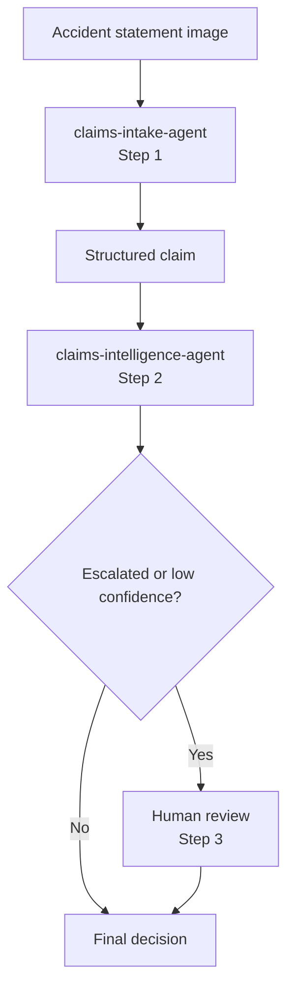

# Challenge 4 - Orchestrate the Two-Agent Claims Workflow and Human In the Loop Configuration

[Home](../README.md)

**Expected Duration:** 45 minutes

## Overview

Challenges 2 and 3 created two Foundry agents. This challenge runs those existing
agents in sequence without redefining their instructions or duplicating their policy
rules:

1. `claims-intake-agent` from Challenge 2
2. `claims-intelligence-agent` from Challenge 3

Insurance adjudication is a high-impact decision process. A coverage result can affect
a claimant's financial recovery, an insurer's regulatory obligations, and the evidence
available for a later dispute or appeal. Even when an agent retrieves the correct
policy, uncertainty can remain because accident statements may be incomplete, damage
descriptions may conflict, policy clauses may interact, and exceptional circumstances
may require judgment beyond a straightforward rule match.

Human-in-the-loop review provides a controlled boundary between model-assisted analysis
and a consequential final decision. The agents handle repeatable work such as document
extraction, evidence retrieval, policy matching, and preliminary adjudication. A human
reviewer remains responsible when confidence is low or the agent requests escalation.
The reviewer can inspect the structured claim, grounded policy information, reasoning,
confidence score, exclusions, and risk flags before accepting or overriding the result.

This design balances speed with accountability. Routine, high-confidence cases can move
through the workflow without unnecessary delay, while ambiguous or high-risk cases stop
before an uncertain recommendation affects the claimant. Recording both the agent's
recommendation and the reviewer's action also creates a clearer audit trail for quality
assurance, compliance review, dispute handling, and future model evaluation.

In short: **accident statement image -> intake agent -> structured claim -> policy
retrieval and coverage adjudication by the intelligence agent -> conditional human
review -> final decision**.



The structured intake and policy objects stay in memory. The workflow prints the final
decision and does not create another local JSON file.

## Tasks

### Task 1: Confirm the two Foundry agents (no action needed)

Open your Foundry project and confirm that these agents are available:

- `claims-intake-agent`
- `claims-intelligence-agent`

Open `claims-intelligence-agent` and confirm that it has both MCP tools:

- `policies-knowledge-base` for policy retrieval
- `crash-statements-knowledge-base` for indexed accident evidence

> [!IMPORTANT]
> The supplied workflow implementation is complete. Do not modify the Python code. The
> workflow reuses the agents above and does not create replacement agents.

The workflow calls each agent for one responsibility. Human review is regular workflow
logic and does not appear as an agent in Foundry.

### Task 2: Run the sequential workflow

```bash
cd docs
python claims-sequential-workflow.py ../data/claims/crash1/raw/statements/crash1_front.jpeg --policy COMP-AUTO-001
```

This runs the approval path against the comprehensive policy. The workflow passes the
intake result to the intelligence agent, which retrieves and structures the policy in
memory before printing the final decision.

Test the default liability-only denial path:

```bash
python claims-sequential-workflow.py ../data/claims/crash1/raw/statements/crash1_front.jpeg
```

Override the claim identifier and amount when needed:

```bash
python claims-sequential-workflow.py ../data/claims/crash1/raw/statements/crash1_front.jpeg --policy COMM-AUTO-001 --claim-id CLM-2026-007 --amount 28000
```

To test retrieval from an already-indexed statement without rerunning OCR, start the
workflow with the repository claim reference instead of an image path:

```bash
python claims-sequential-workflow.py --indexed-claim crash1 --policy COMP-AUTO-001
```

This mode asks `claims-intake-agent` to retrieve `crash1_front` through its Foundry IQ
tool, converts the retrieved statement text into the intake structure, and continues
with the same intelligence and human-review steps. The `--claim-id` option remains the
business workflow identifier; `--indexed-claim` selects the indexed repository claim.

If the decision is escalated or its confidence is below the configured threshold, the
workflow changes its status to `PENDING_HUMAN_REVIEW` and pauses. It keeps waiting until
you enter `approve`, `escalate`, or `deny`; invalid responses prompt again instead of
allowing the workflow to continue. The default confidence threshold is `0.90`. Set
`HUMAN_REVIEW_CONFIDENCE_THRESHOLD` in the repository-root `.env` to change it.

### Task 3: Complete human-in-the-loop review when requested

When the intelligence agent returns a confidence score below the configured threshold,
human review is required before the workflow can continue.

Human-in-the-loop review makes the system more resilient by preventing uncertain model
outputs from becoming final business decisions automatically. Low confidence can signal
missing evidence, ambiguous claim details, conflicting policy language, or an unusual
case that falls outside the model's strongest patterns. Pausing the workflow gives a
reviewer an explicit decision point while preserving the original agent status,
confidence score, and supporting evidence for inspection.

This creates a fail-safe boundary: high-confidence cases can continue efficiently,
while uncertain or escalated cases move to accountable human judgment. The review
record also strengthens auditability because the final result distinguishes the
agent's recommendation from the reviewer's action. Human review complements, rather
than replaces, deterministic validation, access controls, monitoring, and policy
enforcement.

The terminal displays:

```text
[Step 3] Human review requested...
    Decision status: APPROVED | confidence: 0.74 | threshold: 0.90
    Workflow paused. Waiting for human-in-the-loop input.
    Type 'approve' to accept, 'escalate' for manual review, or 'deny' to override:
```

Enter one of the following decisions:

* `approve` accepts the agent's original status
* `escalate` sets the final status to `ESCALATED`
* `deny` overrides the final status to `DENIED`

The workflow does not print its final result or proceed to Challenge 5 until this input
is received. Run the command in an interactive terminal so standard input remains
available.

#### Run the workflow in an interactive terminal

1. In VS Code or GitHub Codespaces, select **Terminal** > **New Terminal**. Use the
    integrated **Terminal** panel, not the **Output** panel or **Debug Console**.
2. Move to the repository's `docs` directory:

    ```bash
    cd docs
    ```

3. Confirm that the terminal provides interactive standard input:

    ```bash
    python -c "import sys; print(sys.stdin.isatty())"
    ```

    Continue when the command prints `True`. If it prints `False`, open a new integrated
    terminal and run the command directly instead of redirecting or piping its input.
4. Start the workflow in the foreground:

    ```bash
    python claims-sequential-workflow.py --indexed-claim crash3
    ```

5. Leave the terminal open while both agents run. If Step 3 requests review, click
    inside the terminal, type `approve`, `escalate`, or `deny`, and press **Enter**.
6. Wait for `Human review complete` and the final JSON result before closing the
    terminal or continuing to Challenge 5.

> [!IMPORTANT]
> Do not append `&`, redirect input from a file, pipe another command into the workflow,
> or run it from a non-interactive task. Those modes cannot collect the reviewer input.

### How the workflow operates

| Step | Foundry resource | Input | Output |
|---|---|---|---|
| 1 | `claims-intake-agent` | OCR text from the accident statement | Structured claim and grounded statement context |
| 2 | `claims-intelligence-agent` | Structured claim and policy number | Foundry IQ-grounded policy plus an approved, denied, or escalated decision |
| 3 | Human-in-the-loop review | Escalated or low-confidence decision | Human-confirmed or overridden final status |

The workflow cannot start Step 2 until the intake result supplies a policy number. The
intelligence agent retrieves and structures that policy before making its decision.


## Validation checklist

- The console lists the two agent steps in order.
- Challenge 4 reuses `claims-intelligence-agent` without creating a replacement.
- The final output contains `policy_info` and `coverage_decision` from the intelligence
    agent.
- `status` is `APPROVED`, `DENIED`, or `ESCALATED`.
- `approved_amount` uses the deductible and limit extracted from the real policy file.
- The liability-only command returns `DENIED` with `collision` or
    `own_vehicle_damage` in `exclusions_matched`.
- Human review runs only for an escalated or low-confidence decision.
- A requested review enters `PENDING_HUMAN_REVIEW` and blocks until the reviewer enters
    a valid decision.
- Invalid review input leaves the workflow paused and displays the prompt again.

## Next step

Continue with [Challenge 5](./challenge-05.md) to harden this pipeline against prompt injection and data exfiltration using FIDES.
