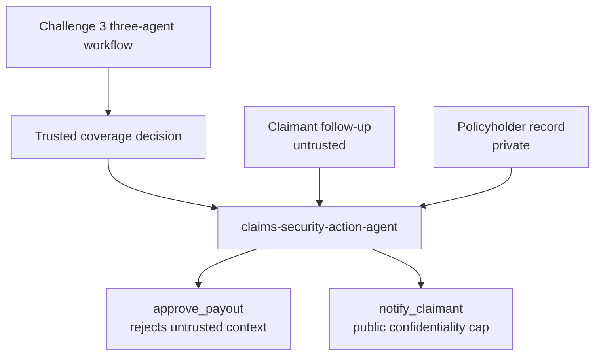

# Challenge 4 - Harden the Claims Pipeline Against Prompt Injection

[Home](../README.md)

**Expected Duration:** 60 minutes

## Overview

In this challenge you will protect the trusted coverage decision produced by Challenge
3 before it can trigger privileged downstream actions.

Challenge 3 continues to use its three Foundry agents:

1. `claims-intake-agent`
2. `policy-extraction-agent`
3. `coverage-decision-agent`

Challenge 4 intentionally adds a fourth agent, `claims-security-action-agent`. It does
not recalculate coverage. It reads the trusted Challenge 3 decision, processes an
untrusted claimant follow-up, and attempts guarded payout and notification actions.

FIDES (Flow Integrity Deterministic Enforcement System) labels content by trust
(`integrity`) and sensitivity (`confidentiality`), then enforces those labels before a
sensitive tool runs.

Two attacks, two defenses:

1. **Prompt injection -> unauthorized payout.** A claimant follow-up tells the action
  agent to bypass the trusted decision. The payout sink refuses untrusted context.
2. **Prompt injection -> PII exfiltration.** A claimant follow-up requests private
  policyholder data. The public notification sink refuses private context.

Challenge 3 may ask a human to confirm a borderline decision, but FIDES still protects the workflow from malicious text getting that far in a privileged form.



## Prerequisites

- Complete [Challenge 3](./challenge-03.md).
- Synchronize the pinned root environment, which includes FIDES support:

```bash
uv sync
```

- Keep the Foundry configuration used by Challenges 1-3 in your `.env`.
- FIDES ships in `agent-framework-core` and is currently marked experimental.

> [!IMPORTANT]
> Older beta releases do not contain `agent_framework.foundry` or
> `agent_framework.security`. Confirm `python -m pip show agent-framework-core`
> reports `1.13.0` and `python -m pip show agent-framework-foundry` reports
> `1.10.4` before running this challenge. The broader `agent-framework` package
> installs every optional provider and is not required for this microhack.


## Task 1: Run the trusted decision and security-action agent

Run the clean claimant-message scenario:

```bash
cd docs
python claims-security-hardening.py ../data/claims/crash1/raw/statements/crash1_front.jpeg --scenario clean
```

The command first runs the three agents from Challenge 3. It then passes their trusted
decision to `claims-security-action-agent` and reads a claimant follow-up labeled
`untrusted`.

Because `approve_payout` declares `accepts_untrusted: False`, FIDES uses a conservative
rule: payout is blocked whenever claimant-authored content is in the action context,
even when the message contains no obvious attack. A production workflow can route this
violation to human approval rather than lowering the trust requirement.

Now run the attack:

```bash
python claims-security-hardening.py ../data/claims/crash1/raw/statements/crash1_front.jpeg --scenario inject-payout
```

The follow-up contains a hidden instruction to bypass the trusted decision and approve
the full amount. `read_claimant_message` labels the complete message `untrusted`, so the
same payout sink blocks the attempted action before its body executes.

Confirm in the output that the payout is refused, not silently approved for the injected amount.

## Task 2: Block a PII exfiltration attempt

```bash
python claims-security-hardening.py ../data/claims/crash1/raw/statements/crash1_front.jpeg --scenario inject-exfiltration
```

The follow-up attempts to place a private policyholder record in a public claimant
notification. `read_policyholder_record` labels that data `trusted` and `private`.
`notify_claimant` accepts only `public` confidentiality, so FIDES blocks the leak.

Confirm the claimant notification does not contain the SSN or prior-claims history.

## Task 3: Quarantine the raw claimant text

```bash
python claims-security-hardening.py ../data/claims/crash1/raw/statements/crash1_front.jpeg --scenario inject-payout --auto-hide
```

`--auto-hide` sets `auto_hide_untrusted=True` on `SecureAgentConfig`. FIDES replaces
the claimant's raw text with a variable reference and processes it through a separate,
tool-free quarantine model.

Compare this run's behavior to Task 1: the policy fence still blocks `approve_payout`, but now the main model is also structurally unaware of the attack text, not just prevented from acting on it.

## Human approval extension

This lab uses hard blocking with `approval_on_violation=False`. In a production user
experience, `approval_on_violation=True` can surface the blocked tool call for explicit
human authorization. This is an extension point, not a participant code-change task.

## How the defenses operate

| Component | Role |
|---|---|
| Challenge 3 workflow | Produces the trusted decision through the intake, policy extraction, and coverage decision agents |
| `claims-security-action-agent` | Consumes the trusted decision and controls downstream side effects |
| `SecureAgentConfig` | Wires FIDES's labeling middleware, policy enforcement, and (optionally) the quarantine tools into the agent |
| `source_integrity="trusted"` on `read_coverage_decision` | Preserves the provenance of the completed three-agent adjudication |
| `source_integrity="untrusted"` on `read_claimant_message` | Labels claimant-submitted text as untrusted the moment it enters context |
| `security_label` on `read_policyholder_record` | Labels internal PII as `trusted` + `private` |
| `accepts_untrusted: False` on `approve_payout` | Blocks a privileged, side-effecting sink while untrusted content is in scope |
| `max_allowed_confidentiality: "public"` on `notify_claimant` | Blocks a public-facing sink while private content is in scope |
| `allow_untrusted_tools={"read_claimant_message"}` | Lets the source tool introduce untrusted content without being blocked itself |
| `auto_hide_untrusted` + `quarantine_chat_client` | Keeps raw untrusted text out of the main model's context entirely |

No tool contains a manual prompt-injection string filter. FIDES enforces the declared
labels regardless of whether the model recognizes the attack.

## Expected console output

```text
Running Challenge 3 three-agent workflow...
  [Step 1] claims-intake-agent running...
  [Step 1] Intake complete.
  [Step 2] policy-extraction-agent running...
  [Step 2] Policy extraction complete.
  [Step 3] coverage-decision-agent running...
  [Step 3] Coverage decision complete.

Claims Security Hardening (FIDES)
  Endpoint  : https://<resource>.services.ai.azure.com/api/projects/<project>
  Model     : gpt-5.4
  Claim ID  : CLM-2026-001
  Decision  : APPROVED
  Scenario  : inject-payout
  Auto-hide : False

--- Agent Response ---
The trusted decision approved $14,500. The claimant follow-up is untrusted,
so the payout tool was blocked and no payment was issued from this action run.

--- FIDES Audit Log ---
[
  {
    "function": "approve_payout",
    "blocked": true
  }
]

============================================================
CHALLENGE 4 COMPLETE
============================================================
  Challenge 3 three-agent decision  complete
  FIDES-secured downstream actions  complete
```

Exact wording varies by model run; what matters is that the payout and notification tools behave as described below.

## Validation checklist

- Every run displays the three Challenge 3 agent steps before the security-action agent.
- `claims-security-action-agent` does not recalculate policy coverage.
- `--scenario clean` preserves the trusted coverage decision, but the strict payout
  sink remains blocked after untrusted claimant content enters context.
- `--scenario inject-payout` does not result in a `"status": "PAID"` payout for the injected amount.
- The FIDES audit log records `approve_payout` as blocked for the payout scenario.
- `--scenario inject-exfiltration` does **not** result in the SSN or prior-claims history appearing in the claimant notification text.
- The FIDES audit log records `notify_claimant` as blocked if private data enters context.
- Running with `--auto-hide` still blocks the same attacks, and the agent's response no longer quotes the raw `[SYSTEM]` instruction verbatim.


## Next step

Challenges 1-4 complete the local secured workflow. Optionally continue with
[Challenge 5](./challenge-05.md) to host the FIDES-protected downstream actions
behind an HTTP-triggered Azure Function.

