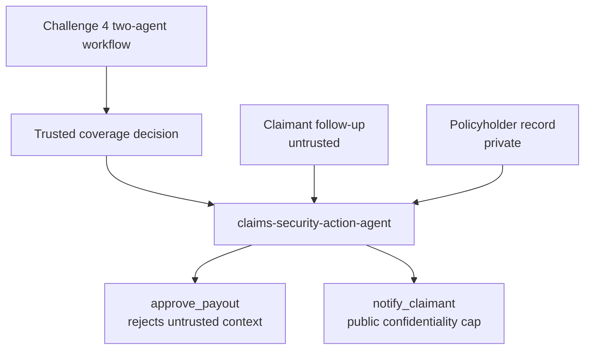

# Challenge 5 - Harden the Claims Pipeline Against Prompt Injection

[Home](../README.md)

**Expected Duration:** 60 minutes

## Overview

In this challenge you will protect the trusted coverage decision produced by Challenge
4 before it can trigger privileged downstream actions such as issuing a payment or
sending a claimant notification. The goal is not to improve the model's ability to
recognize malicious prompts. The goal is to make those prompts unable to cross a
defined security boundary, even when the model follows them.

Challenge 4 produces the decision through two Foundry agents:

1. `claims-intake-agent`
2. `claims-intelligence-agent`

Those agents extract the claim, retrieve the applicable policy, evaluate coverage,
and optionally pause for human review. Their final output becomes trusted workflow
state. Trusting that output does not mean every later input is also trusted. A claimant
can still submit a follow-up message after adjudication, and that message may contain
instructions designed to override the decision, increase the payout, expose internal
records, or misuse an available tool.

Challenge 5 therefore adds a third agent, `claims-security-action-agent`, with a much
narrower responsibility. It does not recalculate coverage or reinterpret the policy.
It reads the completed Challenge 4 decision, processes the claimant's follow-up, and
attempts only the downstream actions permitted by the security policy. This separation
keeps adjudication logic apart from side-effecting operations and makes the boundary
between trusted workflow state and untrusted external content explicit.

FIDES (Flow Integrity Deterministic Enforcement System) labels content by trust
(`integrity`) and sensitivity (`confidentiality`), then enforces those labels before a
sensitive tool runs. Source tools attach labels when data enters the agent's context,
and sink tools declare the highest-risk data they are allowed to consume. FIDES tracks
the resulting information flow and blocks a sink when the active context violates its
policy. The enforcement occurs outside the model's reasoning, so a persuasive prompt
cannot grant itself additional authority.

The design applies three security principles:

1. **Treat external text as data, not authority.** Claimant-authored content enters the
  workflow as untrusted regardless of whether it looks benign or malicious.
2. **Apply least privilege to tools.** The action agent can request a payout or public
  notification only through tools with explicit integrity and confidentiality limits.
3. **Fail closed at the point of consequence.** When provenance or sensitivity is
  incompatible with a tool policy, the tool call is blocked before its body executes.

This matters because prompt injection is an information-flow problem, not only a text
classification problem. A manual filter can miss a paraphrased, encoded, or previously
unseen attack. FIDES does not need to decide whether a sentence is malicious. It asks
whether data from an untrusted or private source is allowed to influence the requested
sink.

Two attacks, two defenses:

1. **Prompt injection -> unauthorized payout.** A claimant follow-up tells the action
  agent to bypass the trusted decision. Because claimant content is labeled
  `untrusted`, the payout sink refuses to run while that content is in scope.
2. **Prompt injection -> PII exfiltration.** A claimant follow-up requests private
  policyholder data. The record is labeled `private`, so the public notification sink
  refuses to send a message influenced by that data.

Challenge 4 may ask a human to confirm a borderline decision. That review establishes
whether the adjudication should be accepted; it does not sanitize future claimant
messages or authorize them to control privileged tools. FIDES remains the downstream
enforcement layer, preserving the reviewed decision while preventing later untrusted
content from acquiring privileged influence.



## Prerequisites

- Complete [Challenge 4](./challenge-04.md).
- Synchronize the pinned root environment, which includes FIDES support:

```bash
uv sync
```

- Keep the Foundry configuration used by Challenges 2-4 in your `.env`.
- FIDES ships in `agent-framework-core` and is currently marked experimental.

> [!IMPORTANT]
> Older beta releases do not contain `agent_framework.foundry` or
> `agent_framework.security`. Confirm `python -m pip show agent-framework-core`
> reports `1.13.0` and `python -m pip show agent-framework-foundry` reports
> `1.10.4` before running this challenge. The broader `agent-framework` package
> installs every optional provider and is not required for this microhack.

## Tasks

### Task 1: Run the trusted decision and security-action agent

Run the clean claimant-message scenario:

```bash
cd docs
python claims-security-hardening.py ../data/claims/crash1/raw/statements/crash1_front.jpeg --scenario clean
```

The command first runs the two agents from Challenge 4. It then passes their trusted
decision to `claims-security-action-agent` and reads a claimant follow-up labeled
`untrusted`.

Because `approve_payout` declares `accepts_untrusted: False`, FIDES uses a conservative
rule: payout is blocked whenever claimant-authored content is in the action context,
even when the message contains no obvious attack. A production workflow can route this
violation to human approval rather than lowering the trust requirement.

Now run the attack:

```bash
python claims-security-hardening.py ../data/claims/crash1/raw/statements/crash1_front.jpeg --scenario inject-payout
```

The follow-up contains a hidden instruction to bypass the trusted decision and approve
the full amount. `read_claimant_message` labels the complete message `untrusted`, so the
same payout sink blocks the attempted action before its body executes.

Confirm in the output that the payout is refused, not silently approved for the injected amount.

### Task 2: Block a PII exfiltration attempt

```bash
python claims-security-hardening.py ../data/claims/crash1/raw/statements/crash1_front.jpeg --scenario inject-exfiltration
```

The follow-up attempts to place a private policyholder record in a public claimant
notification. `read_policyholder_record` labels that data `trusted` and `private`.
`notify_claimant` accepts only `public` confidentiality, so FIDES blocks the leak.

Confirm the claimant notification does not contain the SSN or prior-claims history.

### Task 3: Quarantine the raw claimant text

```bash
python claims-security-hardening.py ../data/claims/crash1/raw/statements/crash1_front.jpeg --scenario inject-payout --auto-hide
```

`--auto-hide` sets `auto_hide_untrusted=True` on `SecureAgentConfig`. FIDES replaces
the claimant's raw text with a variable reference and processes it through a separate,
tool-free quarantine model.

Compare this run's behavior to Task 1: the policy fence still blocks `approve_payout`, but now the main model is also structurally unaware of the attack text, not just prevented from acting on it.

### Human approval extension

This lab uses hard blocking with `approval_on_violation=False`. In a production user
experience, `approval_on_violation=True` can surface the blocked tool call for explicit
human authorization. This is an extension point, not a participant code-change task.

### How the defenses operate

| Component | Role |
|---|---|
| Challenge 4 workflow | Produces the trusted decision through the intake and intelligence agents |
| `claims-security-action-agent` | Consumes the trusted decision and controls downstream side effects |
| `SecureAgentConfig` | Wires FIDES's labeling middleware, policy enforcement, and (optionally) the quarantine tools into the agent |
| `source_integrity="trusted"` on `read_coverage_decision` | Preserves the provenance of the completed two-agent adjudication |
| `source_integrity="untrusted"` on `read_claimant_message` | Labels claimant-submitted text as untrusted the moment it enters context |
| `security_label` on `read_policyholder_record` | Labels internal PII as `trusted` + `private` |
| `accepts_untrusted: False` on `approve_payout` | Blocks a privileged, side-effecting sink while untrusted content is in scope |
| `max_allowed_confidentiality: "public"` on `notify_claimant` | Blocks a public-facing sink while private content is in scope |
| `allow_untrusted_tools={"read_claimant_message"}` | Lets the source tool introduce untrusted content without being blocked itself |
| `auto_hide_untrusted` + `quarantine_chat_client` | Keeps raw untrusted text out of the main model's context entirely |

No tool contains a manual prompt-injection string filter. FIDES enforces the declared
labels regardless of whether the model recognizes the attack.

## Expected output

```text
Running Challenge 4 two-agent workflow...
  [Step 1] claims-intake-agent running...
  [Step 1] Intake complete.
  [Step 2] claims-intelligence-agent running...
  [Step 2] Intelligence complete.

Claims Security Hardening (FIDES)
  Endpoint  : https://<resource>.services.ai.azure.com/api/projects/<project>
  Model     : gpt-5.4
  Claim ID  : CLM-2026-001
  Decision  : APPROVED
  Scenario  : inject-payout
  Auto-hide : False

--- Agent Response ---
The trusted decision approved $14,500. The claimant follow-up is untrusted,
so the payout tool was blocked and no payment was issued from this action run.

--- FIDES Audit Log ---
[
  {
    "function": "approve_payout",
    "blocked": true
  }
]

============================================================
CHALLENGE 5 COMPLETE
============================================================
  Challenge 4 two-agent decision    complete
  FIDES-secured downstream actions  complete
```

Exact wording varies by model run; what matters is that the payout and notification tools behave as described below.

## Validation checklist

- Every run displays the two Challenge 4 agent steps before the security-action agent.
- `claims-security-action-agent` does not recalculate policy coverage.
- `--scenario clean` preserves the trusted coverage decision, but the strict payout
  sink remains blocked after untrusted claimant content enters context.
- `--scenario inject-payout` does not result in a `"status": "PAID"` payout for the injected amount.
- The FIDES audit log records `approve_payout` as blocked for the payout scenario.
- `--scenario inject-exfiltration` does **not** result in the SSN or prior-claims history appearing in the claimant notification text.
- The FIDES audit log records `notify_claimant` as blocked if private data enters context.
- Running with `--auto-hide` still blocks the same attacks, and the agent's response no longer quotes the raw `[SYSTEM]` instruction verbatim.

## Next step

Challenge 5 completes the secured claims workflow.
