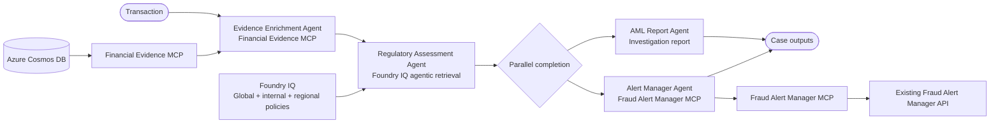
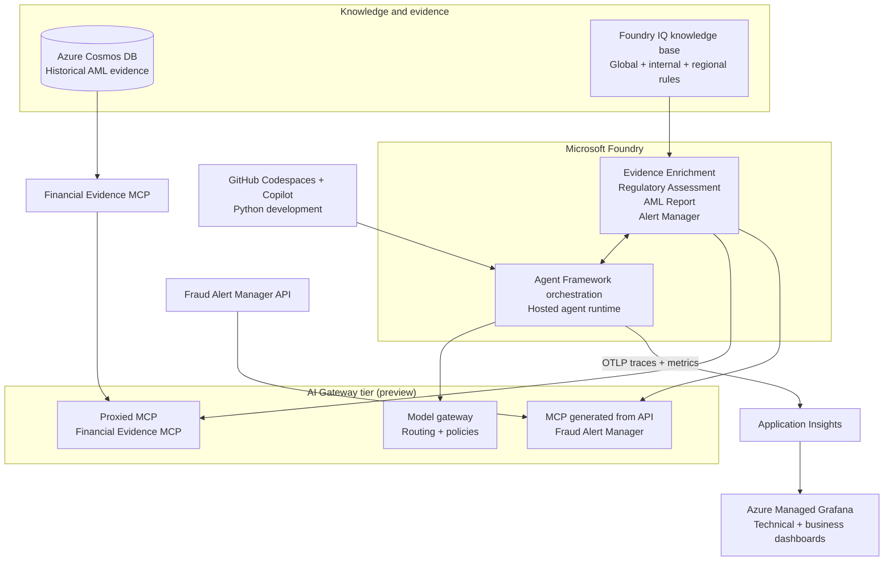

# Agentic AI Hacks | Fraud Intelligence 🔍

Welcome to the **Fraud Intelligence Hackathon**! In this workshop you will explore how agentic AI systems can transform financial compliance — moving from slow, manual review to a continuously monitoring, reasoning, and auditing multi-agent solution. You will build a modern, reusable, Python-based solution with Microsoft Foundry, the Microsoft Agent Framework, MCP, Foundry IQ, and Azure observability services.

---

## Introduction

Fraud moves faster than manual review. Analysts piecing together transactions, customer profiles, internal policies, and regulatory updates by hand are slow and error-prone — genuine fraud slips through while false positives pile up, driving direct losses, the risk of significant fines, and erosion of customer trust.

An **agentic fraud intelligence system** continuously investigates operations and turns raw activity into evidence-backed decisions. It retrieves historical transaction evidence from **Azure Cosmos DB through an MCP server**, reasons over global, internal, and country-specific AML policies with **Foundry IQ agentic retrieval**, evaluates the rules that apply to both the origin and destination bank account countries, and produces audit-ready investigation reports and operational alerts.

Unlike earlier rule-based systems limited to rudimentary patterns, agentic systems reason through the *why* behind a flag. The complete workflow runs as a **hosted agent in Microsoft Foundry**, uses the **Microsoft Agent Framework** for orchestration, routes models and MCP servers through the new **AI Gateway tier (preview)**, and emits end-to-end telemetry to **Application Insights and Azure Managed Grafana**.

While Fraud Intelligence is highly relevant for FSI — where fraud, money laundering, and insider trading draw constant regulatory scrutiny — the hack extends cleanly to any regulated industry. With a diverse audience, the goal is to broaden attendees' thinking: they leave with a **modern, reusable, Python-based component set** they can apply to their own domains.

## Scenario

A transaction enters the system. The fraud intelligence workflow must:

1. **Evidence Enrichment Agent** — use the Financial Evidence MCP to retrieve historical banks, accounts, transactions, and laundering evidence from **Azure Cosmos DB**, then enrich the original transaction without making a compliance decision.
2. **Regulatory Assessment Agent** — use **Foundry IQ agentic retrieval** to apply global AML guidance, internal policies, and the regional regulations relevant to the origin and destination bank account countries.
3. **AML Report Agent** — transform the enriched evidence and regulatory assessment into a professional, audit-ready AML investigation report.
4. **Alert Manager Agent** — run in parallel with the AML Report Agent and use the Fraud Alert Manager MCP to create an operational alert when the regulatory status requires one.
5. **Fraud Intelligence Orchestration** — coordinate the agents with the **Microsoft Agent Framework**, deploy the workflow as a hosted agent in Microsoft Foundry, govern model and MCP traffic through **AI Gateway (preview)**, and emit traces and business metrics through OTLP.

The image below illustrates the conceptual scenario and agent roles:



---

## Architecture

The hackathon builds a **Python-based, multi-agent Fraud Intelligence system**. Individual Microsoft Foundry agents are composed into a hosted workflow with the Microsoft Agent Framework. Foundry IQ supplies agentic retrieval over AML knowledge, while MCP servers provide access to financial evidence and alert-management actions. The AI Gateway tier (preview) provides a common control plane for model and MCP traffic.



### The four agents

| Agent | Role | Data source / tool | Introduced in |
|---|---|---|---|
| **Evidence Enrichment Agent** | Retrieves historical financial evidence and enriches the original transaction | **Financial Evidence MCP** backed by Azure Cosmos DB | Challenge 2 |
| **Regulatory Assessment Agent** | Validates the transaction against applicable global, internal, origin-country, and destination-country AML rules | **Foundry IQ** agentic retrieval | Challenge 3 |
| **AML Report Agent** | Produces a professional, audit-ready AML investigation report without changing the assessment | Structured output from the Regulatory Assessment Agent | Challenge 4 |
| **Alert Manager Agent** | Creates an operational alert when the supplied regulatory status meets the alerting rule | **Fraud Alert Manager MCP** generated from an existing API | Challenge 5 |

---

## Learning Objectives

By participating in this hackathon, you will learn how to:

- Build and integrate an **MCP server backed by Azure Cosmos DB** with a Microsoft Foundry agent
- Configure **Foundry IQ** with global, internal, and regional AML sources and use agentic retrieval for country-aware regulatory assessment
- Compose remote agents with the **Microsoft Agent Framework** and deploy the orchestration as a **hosted agent in Microsoft Foundry**
- Configure the **AI Gateway tier (preview)** for model and MCP traffic, including proxying an existing MCP and creating an MCP from an existing API
- Add end-to-end **OTLP tracing** and business metrics with **Application Insights**, then visualize operational and business outcomes in **Azure Managed Grafana**

---

## Requirements

To successfully complete this hackathon, you will need:

- A [GitHub account](https://github.com/signup) with access to [GitHub Codespaces](https://github.com/features/codespaces) and [GitHub Copilot](https://github.com/features/copilot)
- Familiarity with Python programming, including JSON handling and API calls
- Familiarity with Generative AI solutions and Azure services
- An active Azure subscription with **Owner** rights
- Ability to provision Azure resources in `swedencentral` or [another supported region](https://learn.microsoft.com/en-us/azure/ai-foundry/openai/concepts/models?tabs=global-standard%2Cstandard-chat-completions#global-standard-model-availability)

---

## Repository structure

```
fraud-intelligence-microhack/
├── challenges/                  # Challenge instructions (challenge-01 … challenge-06)
├── labautomation/               # EMEA MicroHack platform provisioning
├── walkthrough/
│   ├── challenge-01/            # Challenge 1 reference solution
│   ├── challenge-02/            # Challenge 2 reference solution
│   ├── challenge-03/            # Challenge 3 reference solution
│   ├── challenge-04/            # Challenge 4 reference solution
│   ├── challenge-05/            # Challenge 5 reference solution
│   └── challenge-06/            # Challenge 6 reference solution
└── README.md
```

| Path | Who uses it | Purpose |
|---|---|---|
| [`challenges/`](./challenges/) | Attendees | Instructions for the preparation challenge and five build challenges |
| [`labautomation/`](./labautomation/) | Platform / facilitators | Per-lab provisioning invoked by the EMEA MicroHack platform |
| [`walkthrough/`](./walkthrough/) | Facilitators / attendees | Reference solutions for each challenge |

---

## Challenges

This hackathon starts with one preparation challenge followed by five build challenges. Each build stage extends the same end-to-end fraud intelligence solution, and the agent and orchestration code is Python-based.

### Challenge structure

Each challenge follows a consistent structure:

| Section | Description |
|---|---|
| 🎯 **Objective** | Learning goals for the challenge |
| 🧭 **Context and Background** | Scenario explanation, architecture diagrams, and key concepts |
| ✅ **Tasks** | Step-by-step instructions |
| 🚀 **Go Further** | Optional stretch goals |
| 🛠️ **Troubleshooting** | Common problems and solutions |
| 🧠 **Conclusion** | Recap, key takeaways, and further reading |

### Challenge list

| # | Challenge | Description | Duration |
|---|---|---|---|
| **1** | [Prepare the Environment](./challenges/challenge-01.md) | Validate access to the Azure resources, Microsoft Foundry project, models, data store, and development tools used throughout the hack | 30 min |
| **2** | [Build the Evidence Enrichment Agent](./challenges/challenge-02.md) | Build a **Financial Evidence MCP** over Azure Cosmos DB, integrate it with the **Evidence Enrichment Agent**, and validate evidence-backed transaction enrichment | 30 min |
| **3** | [Build the Regulatory Assessment Agent](./challenges/challenge-03.md) | Configure **Foundry IQ** with global, internal, and regional AML sources, then use agentic retrieval to assess rules for both bank account countries | 45 min |
| **4** | [Build and Orchestrate the Investigation](./challenges/challenge-04.md) | Build the **AML Report Agent**, compose the first three agents with the **Microsoft Agent Framework**, and deploy the orchestration as a Foundry hosted agent | 45 min |
| **5** | [Govern Models and MCP Servers](./challenges/challenge-05.md) | Introduce the **AI Gateway tier (preview)**, configure model access, proxy the Financial Evidence MCP, create a new MCP from the Fraud Alert Manager API, and add the parallel **Alert Manager Agent** | 45 min |
| **6** | [Observe Fraud Intelligence](./challenges/challenge-06.md) | Add end-to-end **OTLP tracing**, publish technical and business metrics to **Application Insights**, and build a **Grafana** dashboard for business decision makers | 30 min |

> **Tip:** While it is possible to rush through the challenges, we encourage you to pause and reflect. Consider how each pattern relates to your own context: what business processes in your environment could benefit from coordinated AI agents? How might agents help orchestrate decisions across teams and systems?

### Solution walkthroughs

- [Challenge 1 solution](./walkthrough/challenge-01/solution-01.md)
- [Challenge 2 solution](./walkthrough/challenge-02/solution-02.md)
- [Challenge 3 solution](./walkthrough/challenge-03/solution-03.md)
- [Challenge 4 solution](./walkthrough/challenge-04/solution-04.md)
- [Challenge 5 solution](./walkthrough/challenge-05/solution-05.md)
- [Challenge 6 solution](./walkthrough/challenge-06/solution-06.md)

---

## Contributing

This project welcomes contributions and suggestions. Most contributions require you to agree to a Contributor License Agreement (CLA) declaring that you have the right to, and actually do, grant us the rights to use your contribution. For details, visit [https://cla.opensource.microsoft.com](https://cla.opensource.microsoft.com/).

This project has adopted the [Microsoft Open Source Code of Conduct](https://opensource.microsoft.com/codeofconduct/). For more information see the [Code of Conduct FAQ](https://opensource.microsoft.com/codeofconduct/faq/) or contact [opencode@microsoft.com](mailto:opencode@microsoft.com) with any additional questions or comments.

## Trademarks

This project may contain trademarks or logos for projects, products, or services. Authorized use of Microsoft trademarks or logos is subject to and must follow [Microsoft's Trademark & Brand Guidelines](https://www.microsoft.com/legal/intellectualproperty/trademarks/usage/general). Use of Microsoft trademarks or logos in modified versions of this project must not cause confusion or imply Microsoft sponsorship. Any use of third-party trademarks or logos are subject to those third-party's policies.
