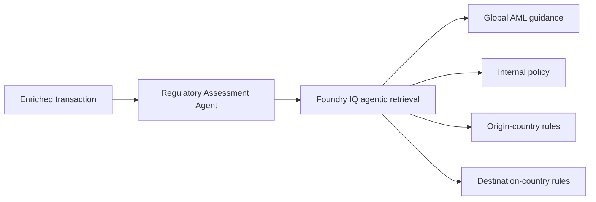
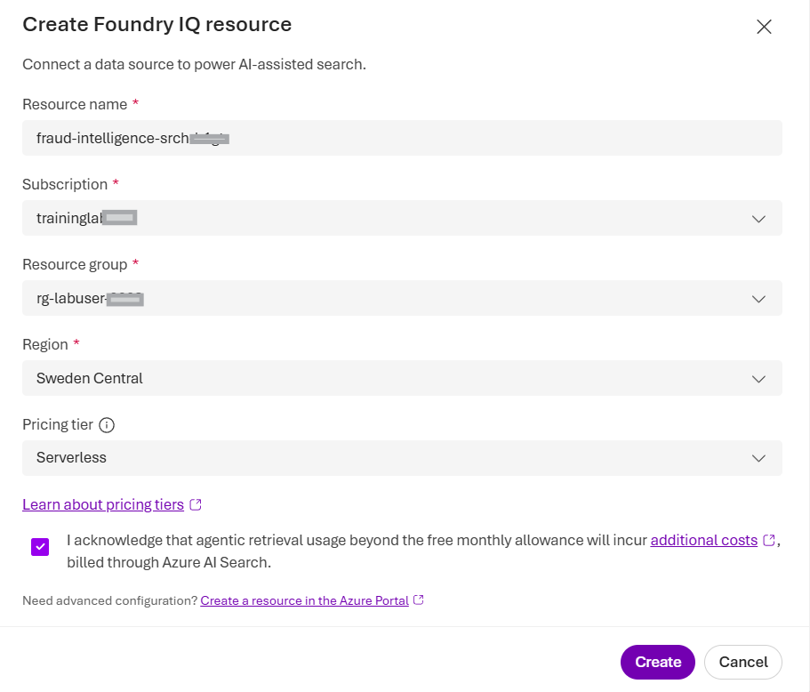
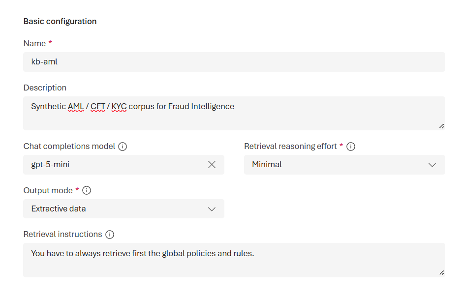
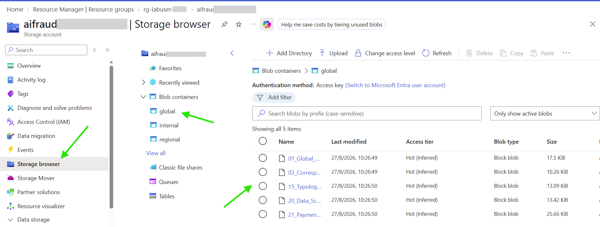
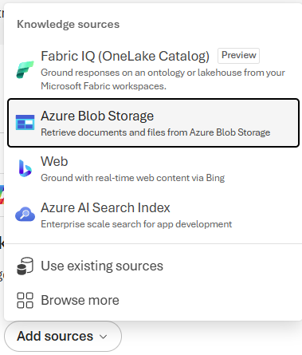
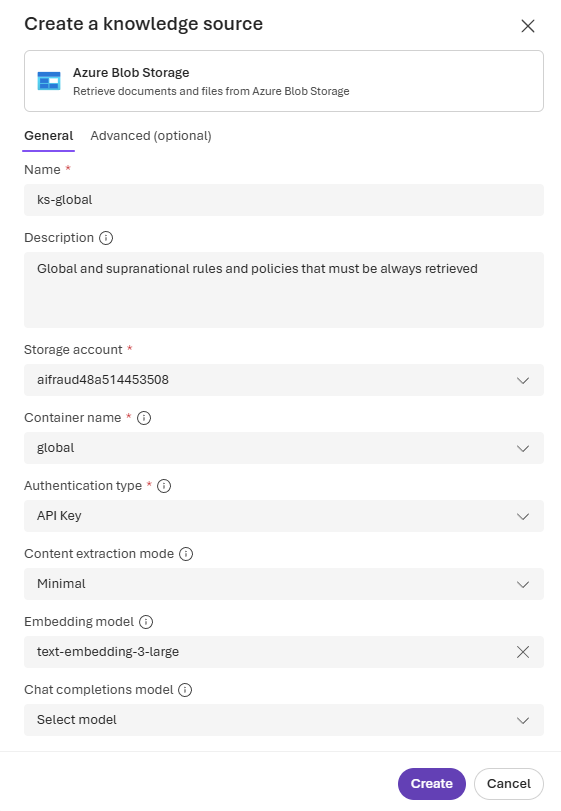
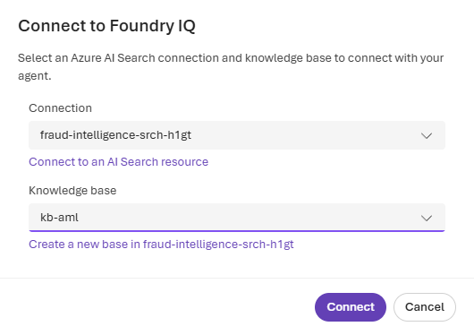
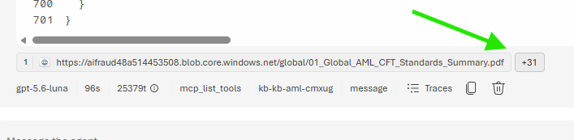
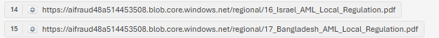

# Challenge 3 - Build the Regulatory Assessment Agent

[Previous challenge](challenge-02.md) | **[Home](../README.md)** | [Next challenge](challenge-04.md)

## 🎯 Objective

Configure a Foundry IQ knowledge base containing global, internal, and regional AML policies, then build a **Regulatory Assessment Agent** that applies the rules relevant to both sides of an enriched transaction.

## 🧭 Context and Background

The Evidence Enrichment Agent from Challenge 2 retrieves facts but does not decide whether a transaction complies with policy. The Regulatory Assessment Agent receives that evidence, determines the origin and destination countries, retrieves the applicable guidance, and returns a cited assessment.



The assessment must remain grounded in retrieved policy. Missing or conflicting guidance must be reported explicitly rather than resolved by assumption.

## ✅ Tasks

Before starting, source `baseenv` and `hackenv` to load the environment variables used by this challenge.

```bash
source baseenv
source hackenv
```

### 1. Create the Foundry IQ knowledge base

Build the Foundry IQ knowledge base that will support the Regulatory Assessment Agent. This involves ingesting relevant policy documents, providing retrieval instructions, and ensuring that the documents are searchable during assessments.

In **Foundry**, open the **Build** section. Then select **Knowledge** in the left navigation pane to open the main interface for managing your knowledge base:


To learn more about how Foundry IQ works, watch the video available on this page.

At the bottom of the page, select **Create new resource** to start building your knowledge base.

Use the defaults, accept the acknowledgment, and proceed to create the new knowledge base resource:



Under the hood, a new **Azure AI Search** resource is being created to support the knowledge base. This resource will handle the indexing and retrieval of policy documents, ensuring that the Regulatory Assessment Agent can access the necessary information efficiently.

After the resource is created, select **Create a knowledge base** and set the following values:

- **Name**: kb-aml
- **Description**: Synthetic AML / CFT / KYC corpus for Fraud Intelligence
- **Chat completion model**: gpt-5-mini
- **Retrieval reasoning effort**: Minimal
- **Output mode**: Extractive data
- **Retrieval instructions**: You have to always retrieve first the global policies and rules.



Then select **Add sources** and review the available source types for your knowledge base.


Stop here for now. The next section creates the storage account and containers for the policy documents.

### 2. Prepare the storage account and containers

For simplicity, all sources will use **Blob storage**, but each source is managed independently and can be updated or replaced as needed.

First, create the **Storage Account** in Azure to host the Blob storage and the three containers for the policy documents.

Run the following Azure CLI command to create the storage account. It uses the `foundryAccountName` environment variable because storage account names must be globally unique:

```bash
az storage account create --name $foundryAccountName --resource-group $rg --location $location --sku Standard_LRS
```

Then, create the three containers in the storage account to store the policy documents:

```bash
az storage container create --name global --account-name $foundryAccountName
az storage container create --name internal --account-name $foundryAccountName
az storage container create --name regional --account-name $foundryAccountName
```

Give appropriate permissions to the storage account and containers to ensure you can upload and manage the policy documents:

```bash
userId=$(az ad signed-in-user show --query id -o tsv)
storageId=$(az storage account show \
  --name "$foundryAccountName" \
  --resource-group "$rg" \
  --query id -o tsv)

az role assignment create \
  --assignee-object-id "$userId" \
  --assignee-principal-type User \
  --role "Storage Blob Data Contributor" \
  --scope "$storageId"
```

Finally, upload the policy documents into their respective containers. You can use the Azure CLI or Azure Storage Explorer. The `upload-batch` command uploads every file from each local directory:

```bash
az storage blob upload-batch --account-name "$foundryAccountName" --destination global --source "$walkthroughHome/challenge-03/documents/global" --auth-mode login
az storage blob upload-batch --account-name "$foundryAccountName" --destination internal --source "$walkthroughHome/challenge-03/documents/internal" --auth-mode login
az storage blob upload-batch --account-name "$foundryAccountName" --destination regional --source "$walkthroughHome/challenge-03/documents/regional" --auth-mode login
```

To verify that the policy documents were uploaded successfully, open the **Storage Account** in the Azure portal and check the contents of each container:



Return to the **Foundry IQ** interface to continue adding and managing your policy sources. You can now add the policy sources from the Azure Blob storage containers you created.

Select **Add Sources**, then choose **Azure Blob Storage** as the source type.



For each container, fill in the required details and click **Create** to link it as a policy source.

The following example shows how to link the `global` container as a policy source:

- **Name**: ks-global
- **Description**: Global and supranational rules and policies that must be always retrieved
- **Storage account** and **Container**: Specify the storage account name and the container name (`global`) where the policy documents are stored.
- **Authentication type**: API Key
- **Content extraction mode**: Minimal
- **Embedding model**: text-embedding-3-large
- **Chat completion model**: Not needed



The **Status** of the policy source displays **Creating** while it is being linked. During this process, **AI Search** begins indexing the policy documents in the container. To monitor indexing, open the **Search Service** resource and review the following areas:
- **Search management**: go into **Indexes** and **Indexers** to monitor the indexing process.
- **Agentic retrieval**: if you want to see the configuration created from **Foundry IQ**.


You will connect the `internal` and `regional` containers later in this guide so that you can compare the output and observe how the engine queries one or more sources.


### 3. Create the Regulatory Assessment Agent

In the previous challenge, you created the `EvidenceEnrichmentAgent`. Now, create the `RegulatoryAssessmentAgent` to assess regulatory compliance using the policy sources in **Foundry IQ**.

Because this is the second agent, follow the same **Microsoft Foundry** agent creation process you used for the `EvidenceEnrichmentAgent`.

Relevant steps you should not miss include:

- Define the agent's name as `RegulatoryAssessmentAgent`
- Set the model: `gpt-5.6-luna`
- Set instructions: find them under `walkthrough/challenge-03/regulatory-assessment-agent/instructions.md`. Review and validate content.
- Remove the `Web Search` tool, irrelevant for this agent.

Next, add **Knowledge** by selecting **Add**, then **Connect to Foundry IQ**:


Select the **Knowledge Base** you created (`kb-aml`), then select **Connect**:



Finally, select **Save** to create the new agent and make it ready for use.

Ensure that the agent has permission to access the connected **Foundry IQ** knowledge base by assigning the `Search Index Data Reader` role to the **Microsoft Foundry Project** managed identity:

```bash
subscriptionId=$(az account show --query id -o tsv)

projectId="/subscriptions/$subscriptionId/resourceGroups/$rg/providers/Microsoft.CognitiveServices/accounts/$foundryAccountName/projects/$foundryProjectName"

projectPrincipalId=$(az resource show \
  --ids "$projectId" \
  --query identity.principalId \
  -o tsv)

searchId=$(az search service list \
  --resource-group "$rg" \
  --query "[0].id" \
  -o tsv)

az role assignment create \
  --assignee-object-id "$projectPrincipalId" \
  --assignee-principal-type ServicePrincipal \
  --role "Search Index Data Reader" \
  --scope "$searchId"
```

### 4. Test the agent with the global policy source

Test the agent as you tested the `EvidenceEnrichmentAgent`. Use output from the previous agent as input. You can run the `EvidenceEnrichmentAgent` and save its output, or use the sample below.

This is an example JSON output from the `EvidenceEnrichmentAgent`:

```json
{
  "transaction_id": "TX-TEST-0001",
  "original_transaction": {
    "transaction_id": "TX-TEST-0001",
    "originator_name": "James Carter",
    "origin_account": "83D4B1F30",
    "bank_origin": "0121",
    "beneficiary_name": "Emily Foster",
    "destination_account": "818CCA030",
    "bank_destination": "29196",
    "amount": 15000,
    "currency": "EUR"
  },
  "data_agent_response": {
    "transaction_id": "TX-TEST-0001",
    "match_found": true,
    "assessment": "Historical laundering records were found for one or more accounts in the transaction.",
    "origin_account": {
      "originator_name": "James Carter",
      "account": "83D4B1F30",
      "bank_id": "0121",
      "bank_name": "Israel Bank #35",
      "country": "Israel",
      "historical_participation": true,
      "role": "Receiver",
      "laundering_transaction_count": 3,
      "laundering_attempt_count": 3,
      "first_seen": "2026-09-02T10:03:00Z",
      "last_seen": "2026-09-18T05:02:00Z",
      "pattern_types": [
        "BIPARTITE",
        "FAN-OUT",
        "GATHER-SCATTER"
      ],
      "evidence": [
        {
          "pattern_txn_sk": 120259084422,
          "attempt_id": 2502,
          "pattern_type": "GATHER-SCATTER",
          "step_in_attempt": 5,
          "date_key": 20260918,
          "txn_ts": "2026-09-18T05:02:00Z",
          "from_bank_id": "0015",
          "from_account": "84221F9F0",
          "to_bank_id": "0121",
          "to_account": "83D4B1F30",
          "amount_received": 44947.3,
          "receiving_currency": "Shekel",
          "amount_paid": 44947.3,
          "payment_currency": "Shekel",
          "payment_format": "ACH",
          "is_laundering": 1,
          "id": "120259084422",
          "partition_key": "2502"
        },
        {
          "pattern_txn_sk": 68719477003,
          "attempt_id": 1385,
          "pattern_type": "FAN-OUT",
          "step_in_attempt": 1,
          "date_key": 20260909,
          "txn_ts": "2026-09-09T02:52:00Z",
          "from_bank_id": "0015",
          "from_account": "84221D110",
          "to_bank_id": "0121",
          "to_account": "83D4B1F30",
          "amount_received": 23427.81,
          "receiving_currency": "Shekel",
          "amount_paid": 23427.81,
          "payment_currency": "Shekel",
          "payment_format": "ACH",
          "is_laundering": 1,
          "id": "68719477003",
          "partition_key": "1385"
        },
        {
          "pattern_txn_sk": 8589934791,
          "attempt_id": 150,
          "pattern_type": "BIPARTITE",
          "step_in_attempt": 13,
          "date_key": 20260902,
          "txn_ts": "2026-09-02T10:03:00Z",
          "from_bank_id": "0220",
          "from_account": "8000EB430",
          "to_bank_id": "0121",
          "to_account": "83D4B1F30",
          "amount_received": 58403.73,
          "receiving_currency": "Shekel",
          "amount_paid": 58403.73,
          "payment_currency": "Shekel",
          "payment_format": "ACH",
          "is_laundering": 1,
          "id": "8589934791",
          "partition_key": "150"
        }
      ]
    },
    "destination_account": {
      "beneficiary_name": "Emily Foster",
      "account": "818CCA030",
      "bank_id": "29196",
      "bank_name": "Bank of Topeka",
      "country": "Bangladesh",
      "historical_participation": false,
      "role": null,
      "laundering_transaction_count": 0,
      "laundering_attempt_count": 0,
      "first_seen": null,
      "last_seen": null,
      "pattern_types": [],
      "evidence": []
    }
  },
  "historical_context": {
    "accounts_with_history": 1,
    "accounts_without_history": 1,
    "highest_historical_context_level": 4,
    "transaction_interpretation": "One account involved in the transaction has historical AML participation."
  },
  "origin_account_enrichment": {
    "historical_context_level": 4,
    "historical_context_category": "Repeated Participation Across Multiple Patterns",
    "participation_consistency": "Receiver Only",
    "participation_frequency": "Repeated",
    "pattern_diversity_count": 3,
    "pattern_diversity_level": "High",
    "days_since_last_seen": 10,
    "recency_band": "Recent",
    "investigator_interpretation": "The account shows repeated historical participation spanning multiple laundering patterns."
  },
  "destination_account_enrichment": {
    "historical_context_level": 0,
    "historical_context_category": "No Historical AML Participation",
    "participation_consistency": "None",
    "participation_frequency": "None",
    "pattern_diversity_count": 0,
    "pattern_diversity_level": "None",
    "days_since_last_seen": null,
    "recency_band": "None",
    "investigator_interpretation": "No historical AML participation was identified."
  },
  "derived_features": {
    "origin_has_history": true,
    "destination_has_history": false,
    "multiple_pattern_presence": true,
    "recent_historical_activity": true,
    "highest_historical_context_level": 4
  },
  "aml_regulatory_inputs": {
    "historical_context_level": 4,
    "pattern_diversity_count": 3,
    "laundering_attempt_count": 3,
    "recent_participation": true,
    "historical_participation_role": "Receiver",
    "historical_participation_detected": true
  }
}
```

The output contains the enrichment details from the previous agent and additional context provided by the `global` policy source. Expand all evaluated files by selecting **+NN** at the bottom of the response:



Confirm that all files come from the `global` policy source by checking for `global` in each path.

Next, add the internal and regional policy sources.


### 5. Add the internal and regional policy sources

Return to **Knowledge** and select the `kb-aml` knowledge base you created.

First, modify the **Retrieval instructions** to include the internal and regional policy sources after the global policies:

```text
You have to always retrieve first the global policies and rules, then the internal rules and policies, and finally the regional rules and policies based on the transaction's bank origin and destination. Only the ones for these countries if documentation exists.
```

Then, add new **Azure Blob Storage** sources for the `internal` and `regional` containers. Repeat the process you followed for the `global` container, specifying the appropriate storage account, container, and authentication details for each.

**Internal**

- **Name**: ks-internal
- **Description**: Internal rules and policies
- **Storage account** and **Container**: Specify the storage account name and the container name (`internal`) where the policy documents are stored.
- **Authentication type**: API Key
- **Content extraction mode**: Minimal
- **Embedding model**: text-embedding-3-large
- **Chat completion model**: Not needed

**Regional**

- **Name**: ks-regional
- **Description**: Regional rules and policies
- **Storage account** and **Container**: Specify the storage account name and the container name (`regional`) where the policy documents are stored.
- **Authentication type**: API Key
- **Content extraction mode**: Minimal
- **Embedding model**: text-embedding-3-large
- **Chat completion model**: Not needed


Select **Save** to apply the changes to the knowledge base. Wait for all three sources to be indexed before testing the agent. Each source should display a status of **Active**.

You do not need to modify the agent. The **Knowledge Base** provides a centralized source of domain knowledge, and the agent automatically uses updated information from all sources in the knowledge base.

Finally, test the agent again and verify that its response and sources reflect the addition of the internal and regional policy sources. For example, if you use the JSON provided earlier, you should now see files for the transaction's origin and destination countries:



You can also select **Traces** to review the agent's queries and how it retrieved the sources:


## 🚀 Go Further

Test a cross-border transaction for which one country has incomplete guidance. Compare broad retrieval queries with metadata-filtered queries and explain which approach produces the most defensible assessment.

## 🛠️ Troubleshooting

- **Relevant policies are not retrieved:** Check document ingestion, country metadata, index status, and the wording of the retrieval query.
- **Only one country is assessed:** Confirm that the agent derives and queries both the origin and destination countries.
- **Citations are missing:** Verify that citations are enabled and that the instructions require citations to survive into the structured output.
- **The agent invents a rule:** Strengthen the grounding instructions and require an explicit `insufficient_evidence` outcome when retrieval does not support a decision.
- **The next agent cannot parse the result:** Validate the response against the agreed assessment schema and remove explanatory text outside the structured result.

## 🧠 Conclusion

You have added a policy-grounded Regulatory Assessment Agent that evaluates global, internal, and country-specific AML requirements. Continue to [Challenge 4](challenge-04.md) to generate an investigation report and orchestrate the first three agents.
