# Challenge 5 - Govern Models and MCP Servers

[Previous challenge](challenge-04.md) | **[Home](../README.md)** | [Next challenge](challenge-06.md)

## 🎯 Objective

Introduce the **AI Gateway tier (preview)** for governed model and MCP access, generate an MCP interface from the Fraud Alert Manager API, build an **Alert Manager Agent**, and run alert creation in parallel with report generation.

## 🧭 Context and Background

The investigation workflow now produces a decision, but a decision that requires action must also reach the operational alert system. AI Gateway provides a shared policy and observability boundary for model and tool traffic.

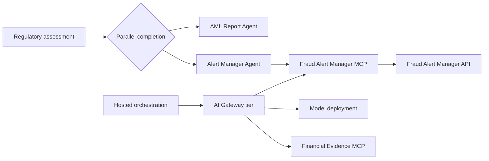
```mermaid
flowchart LR
	ASSESS[Regulatory assessment] --> FORK{Parallel completion}
	FORK --> REPORT[AML Report Agent]
	FORK --> ALERT[Alert Manager Agent]
	ALERT --> AMCP[Fraud Alert Manager MCP]
	AMCP --> API[Fraud Alert Manager API]

	ORCH[Hosted orchestration] --> GATEWAY[AI Gateway tier]
	GATEWAY --> MODEL[Model deployment]
	GATEWAY --> FMCP[Financial Evidence MCP]
	GATEWAY --> AMCP
```

The Alert Manager Agent must treat the regulatory assessment as authoritative. It decides whether to call the alert tool according to an explicit rule, but it does not re-evaluate the transaction.

## ✅ Tasks

Before starting, source `baseenv` and `hackenv` to load the environment variables used by this challenge.

```bash
source baseenv
source hackenv
```

### 1. Deploy the AI Gateway

An **AI Gateway** is a centralized control point for securing and managing interactions among AI agents, models, and external services. It routes requests and responses through a governance layer that can enforce authentication, authorization, rate limiting, and other policies. This helps protect sensitive information, support compliance, and provide observability into AI-driven workflows.

In Azure, API Management provides the AI Gateway. In this lab, you will deploy a dedicated API Management instance using the preview `AIGateway` SKU, then route model requests and MCP calls through this centralized governance layer.

#### Create the Gateway

During the preview, you can create the `AIGateway` SKU through the **AI Gateway portal**, but not through the public Azure CLI or ARM REST API.

Open the [AI Gateway portal](https://ai.gateway.azure.com/) and sign in with the lab account. Create a new AI Gateway with these settings:

- **Name**: enter a globally unique name
- **Subscription**: the lab subscription
- **Region**: `swedencentral`
- **Resource group**: the existing lab resource group
- **Enable managed identity**

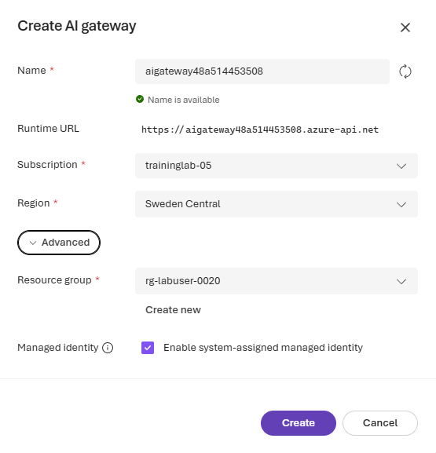

### 2. Configure Governed Model Access

#### Import Models

In the AI Gateway left navigation pane, select **Models**, then select **Add Models**.

Models can be imported from several sources and providers. For this lab, select models deployed in **Microsoft Foundry**:

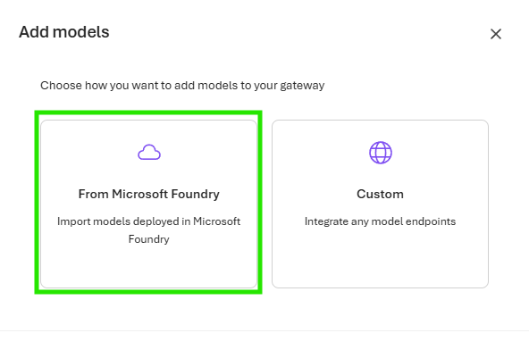

Choose the lab subscription and Foundry resource, then select **Next**:

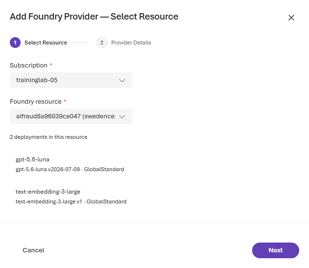

Keep the default settings, or adjust the names if needed, then select **Create** to import the models into the AI Gateway:

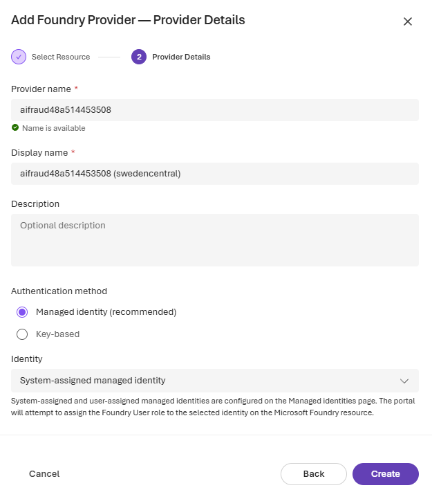

After a successful import, the newly added models appear under **Models**:

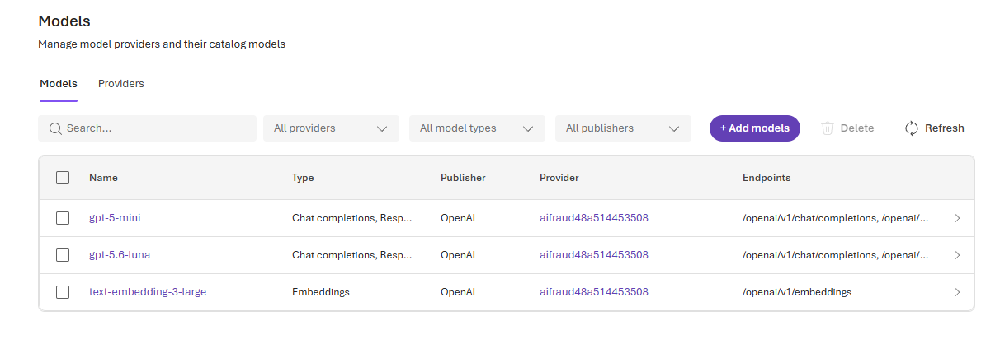

#### Configure Agents to Access Models Through the AI Gateway

After importing the models, configure the agents to access them through the AI Gateway. In **Microsoft Foundry**, open **Manage**, select **Resource details**, and then select **Admin-connected models**:

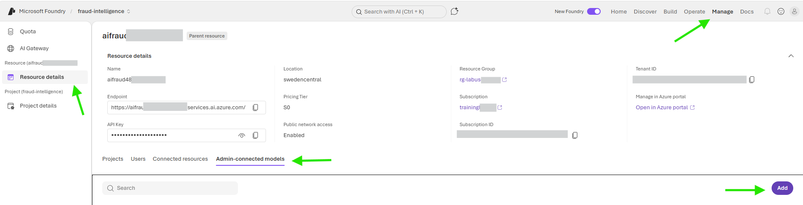

Select **Add** to open the connection dialog.

Because the **AI Gateway** SKU is still in preview, select **Other source** instead of **Azure API Management**. Enter the following details:

- **Connection name**: unique identifier, for instance, `aigateway<random>`
- **Base URL**
	1) Get the Gateway models endpoint from the **AI Gateway** portal:

	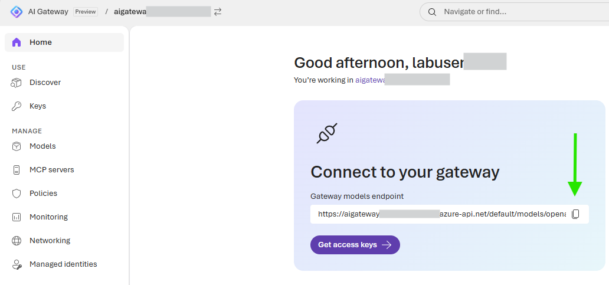

	2) Get the access key. Create new ones:

	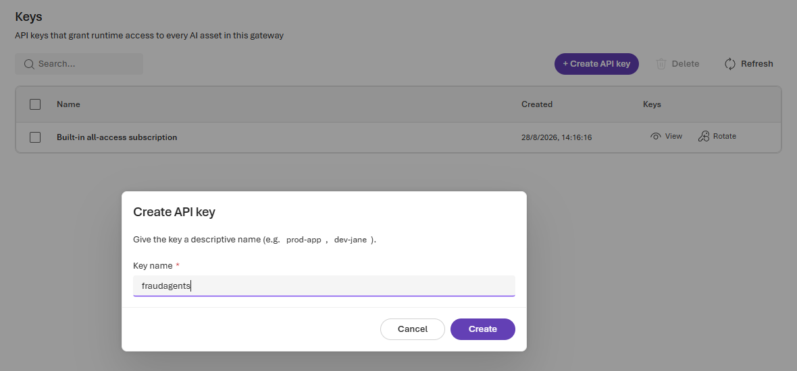

	Copy the access key and keep it for next steps. Click **Next**.

- **Authentication**: Select **API Key** and enter the access key you obtained in the previous step. As header name, use `api-key`. Then, **Next**

Finally, select **Add Model** and configure the following values:

- **Name**: gpt-5.6-luna
- **Display name**: gpt-5.6-luna
- **Version**: leave it empty
- **Format**: OpenAI

Select **Save** to finish adding the model, then select **Add** to complete the connection.

The newly added models should now appear under **Admin-connected models** in Microsoft Foundry:

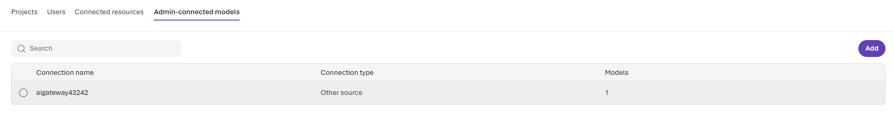

Next, add the new admin-connected model to your agents so they can use it through the AI Gateway.

Open the **Agents** section in Microsoft Foundry, select the agent you want to configure, such as `EvidenceEnrichmentAgent`, and change its **Model** to the newly added admin-connected model:

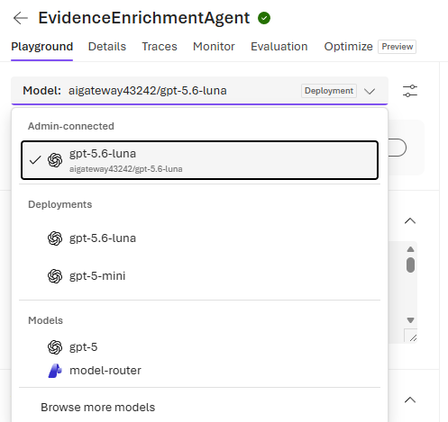

Select **Save** to apply the configuration changes. This creates a new agent version.

Then test the agent. If you configured `EvidenceEnrichmentAgent`, use this JSON payload:

```json
{
  "transaction_id": "TX-TEST-0001",
  "originator_name": "James Carter",
  "origin_account": "83D4B1F30",
  "bank_origin": "0121",
  "beneficiary_name": "Emily Foster",
  "destination_account": "818CCA030",
  "bank_destination": "29196",
  "amount": 15000,
  "currency": "EUR"
}
```

The agent should use the newly added admin-connected model to return a response based on the transaction details.

Return to the **AI Gateway** portal to monitor requests and responses for the newly added admin-connected model. Open **Monitoring** and select **Configure telemetry**.

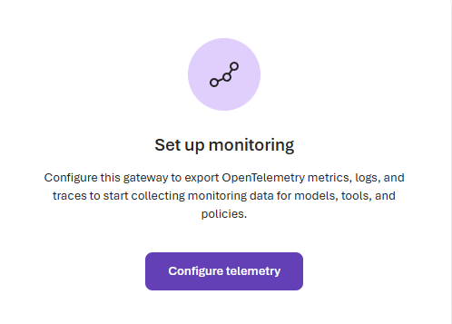

Use the existing **Application Insights** instance to monitor telemetry. Select the appropriate instance, then select **Next**:

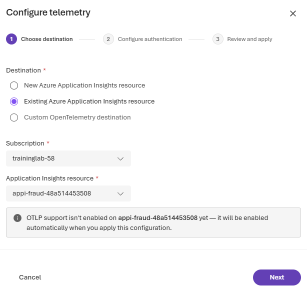

Keep **System-assigned managed identity** as the authentication method, review the configuration, and select **Apply**.

Allow a minute for the configuration to take effect before looking for telemetry.

Test the agent again, then review the **Monitoring** section in the AI Gateway portal. Telemetry may take a few moments to appear. You should see a metrics view similar to the following:

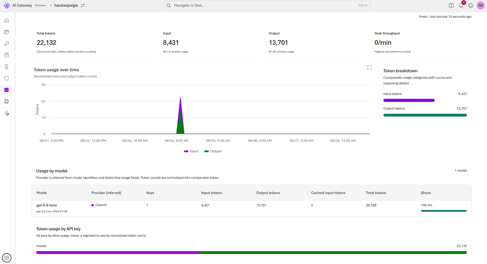

If time permits, apply the same model changes to all prompt agents.

#### Apply a Rate-Limiting Policy

When multiple agents call the same admin-connected model simultaneously, unrestricted usage can degrade the service. Apply a rate-limiting policy to control usage for each caller identity.

Open **Models**, select `gpt-5.6-luna`, switch to the **Policies** tab, and select **Add policy**:

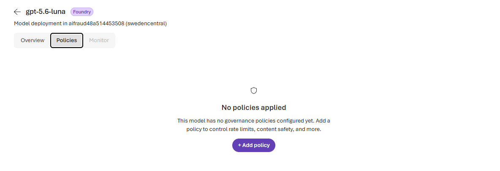

Select the **Token rate limit** policy:

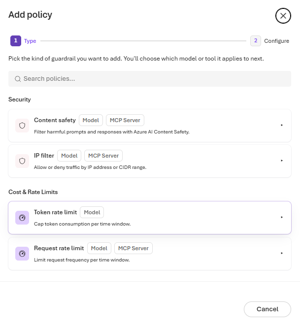

Set the desired rate-limit parameters. Keep **Caller identity** as the target; in this case, the identity is the key used to connect Microsoft Foundry to the AI Gateway model:

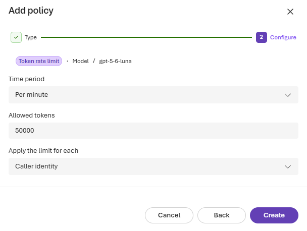

Select **Create** to apply the rate-limiting policy.

Requests that exceed the configured limit will now be throttled, helping to maintain fair usage and service availability.


### 3. Proxy the Financial Evidence MCP

The **AI Gateway** can proxy existing Model Context Protocol (MCP) servers. This applies access, authentication, and rate-limiting policies at the gateway without requiring changes to the MCP implementation.

Next, onboard the existing `financial evidence` MCP to the AI Gateway. In the **AI Gateway** portal, open the **MCP servers** section and select **Add MCP server**:

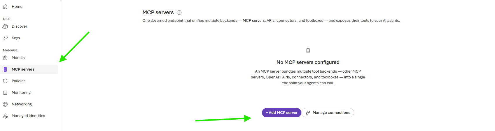

The portal supports three backend types:

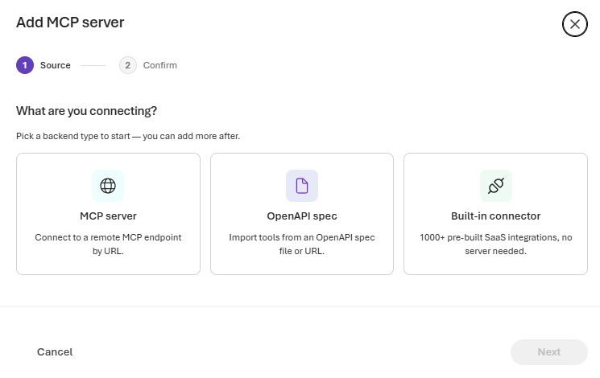

Select **MCP server**, then provide the details required to connect to the existing Financial Evidence MCP:

- **Backend Name**: A friendly name for the MCP server, for instance, `financial-evidence-mcp`.
- **URL**: The URL of the existing `financial evidence` MCP server. Use the value returned by `echo "$financialEvidenceMcpEndpoint"`
- **Authentication**: set **API Key**, with:
  - **Header Name**: `x-functions-key`
  - **Value:** Use the value returned by `echo "$financialEvidenceMcpSystemKey"`.

Select **Next**, validate the configuration, and select **Create** to add the MCP server to the **AI Gateway**.

You can now test the MCP from the **AI Gateway**. Select **Use**:

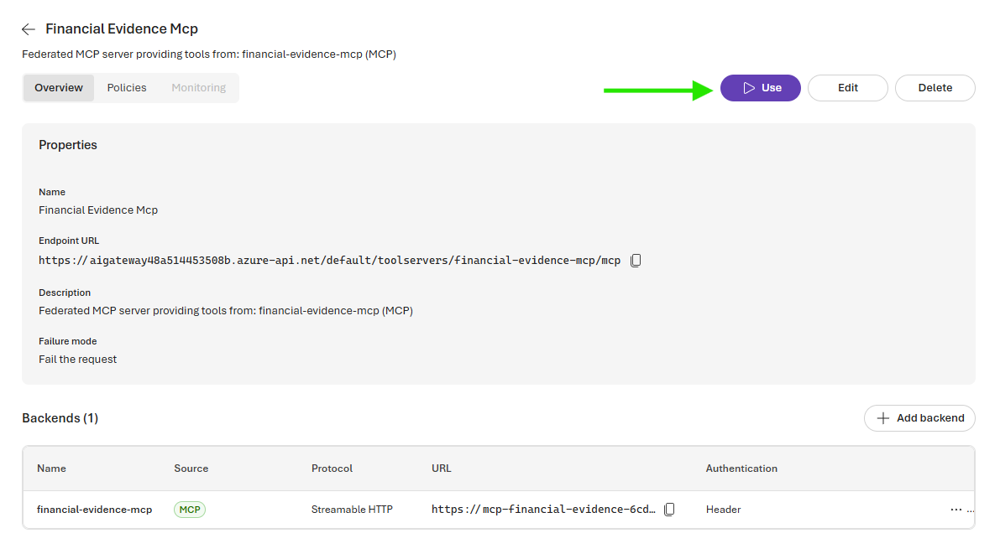

Select the **Try it** tab, then select **List tools**. You should see all tools exposed by the Financial Evidence MCP:

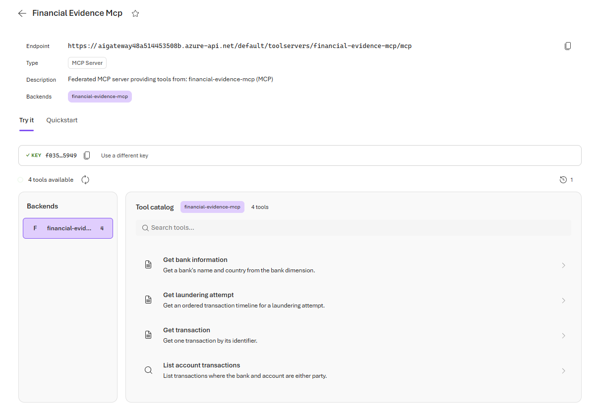

Select the **Get Bank Information** operation, enter `0121` as the bank ID, and select **Run tool**:

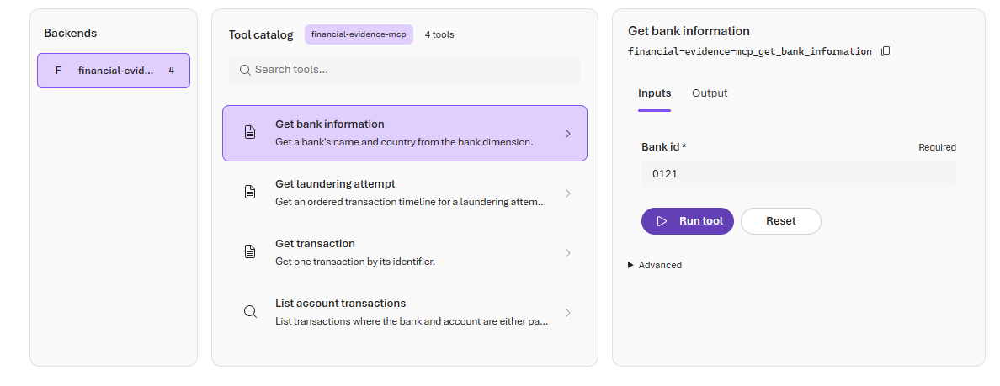

The result should display information for bank ID `0121`. Expand the `data` element to view the details:

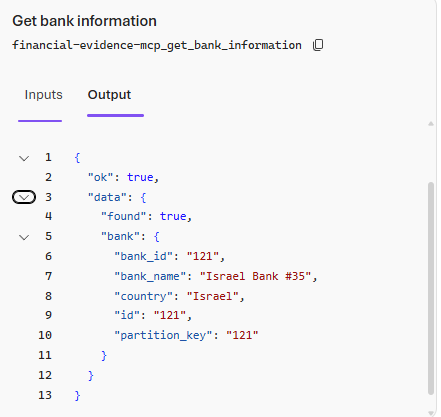

You can now interact with the Financial Evidence MCP through the **AI Gateway**. Next, configure `EvidenceEnrichmentAgent` to use it.

#### Update the EvidenceEnrichmentAgent Configuration

Return to the **Microsoft Foundry** portal. Under **Build**, select **Agents**, then select `EvidenceEnrichmentAgent`. Remove the existing tool to ensure that the agent uses the latest MCP configuration:

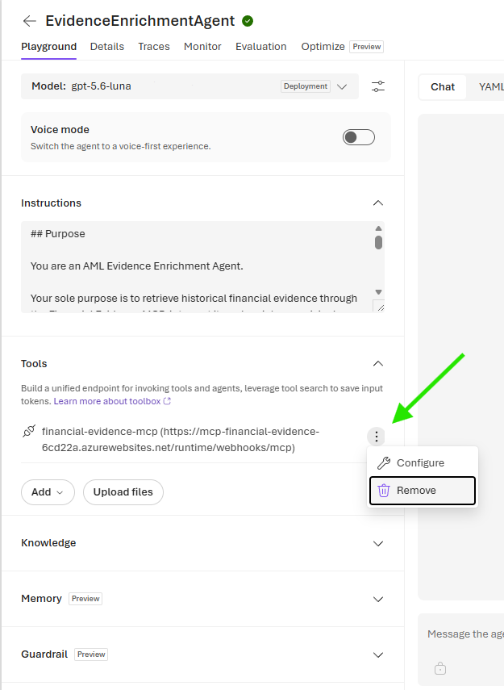

Select **Save**, then open the **Tools** menu on the left side of the page.

Select the `financial-evidence-mcp` tool and update its URL and authentication:

- **Remote MCP Server endpoint**: Use the Financial Evidence MCP URL exposed through the **AI Gateway**.
- **Credential**: Set the header name to `api-key` and use an existing key from your **AI Gateway** configuration.

Then select **Update**.

On the same MCP configuration page, select **Use in an agent**:

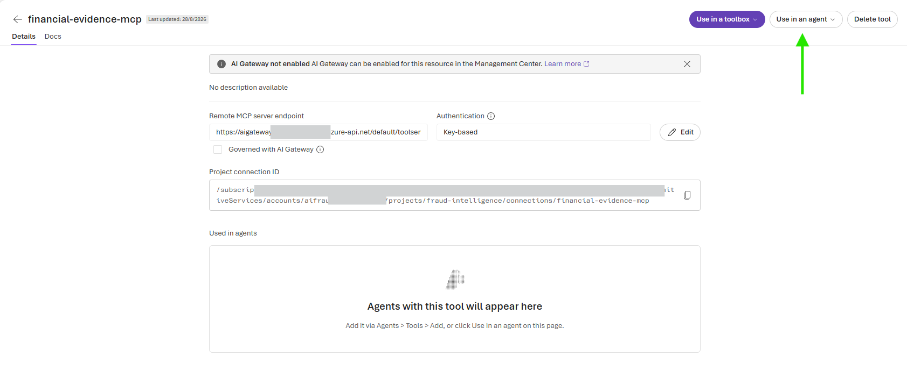

Select `EvidenceEnrichmentAgent` as the agent that will use this MCP.

Under the `EvidenceEnrichmentAgent` **Tools** section, verify that the `financial-evidence-mcp` endpoint shows the new **AI Gateway** configuration. Enable **Always auto-approve all tools**:

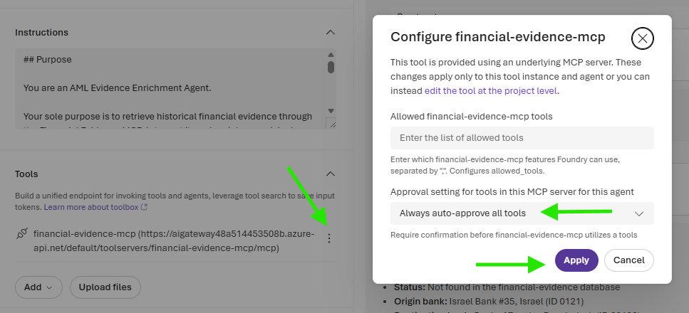

**Save** the agent again to apply the new configuration.

Test the agent and inspect its traces to verify that it uses `financial-evidence-mcp` through the **AI Gateway**.

To explore additional gateway policies, open the **Policies** section for `financial-evidence-mcp`. Because the **AI Gateway** is in preview, some MCP features, including the **Monitoring** tab, may still be unavailable.


### 4. Generate an MCP from the Fraud Alert Manager API

The **AI Gateway** can also expose an existing API as an MCP, bringing agent integration and policy management to APIs that were not originally designed as MCP servers.

For this scenario, the Fraud Alert Manager API manages financial alerts so that operational users can review them and take action. A simple web interface is also available for validation.

First, retrieve the API endpoint so that the AI Gateway can read its OpenAPI specification. The API runs on **Azure Container Apps**:

```bash
endpoint=$(az containerapp show --name alert-manager --resource-group $rg --query properties.configuration.ingress.fqdn -o tsv)
echo "https://$endpoint/openapi.json"
```
Copy the URL; you will use it to configure the MCP in the **AI Gateway**.

Return to **MCP servers** in the **AI Gateway** portal. Follow the previous process using a different backend.

Select **Add MCP server**, choose **OpenAPI Specification**, and complete the form with the following details:

- **Name**: Provide a name for the MCP server, e.g., `alert-manager-mcp`.
- **Spec source**: Select **Fetch from URL**
- **Spec URL**: Paste the URL you obtained from the previous step.
- **Authentication**: Select **None** because the lab API does not require authentication.

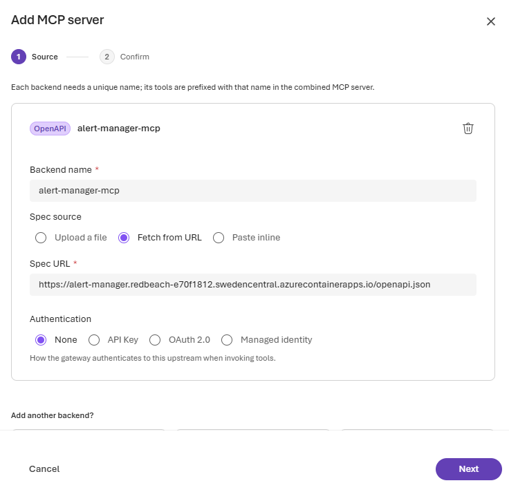

Select **Next**, validate the configuration, and select **Create** to add the MCP server.

Explore the new MCP server in the **AI Gateway** playground. For example, list the existing alerts:

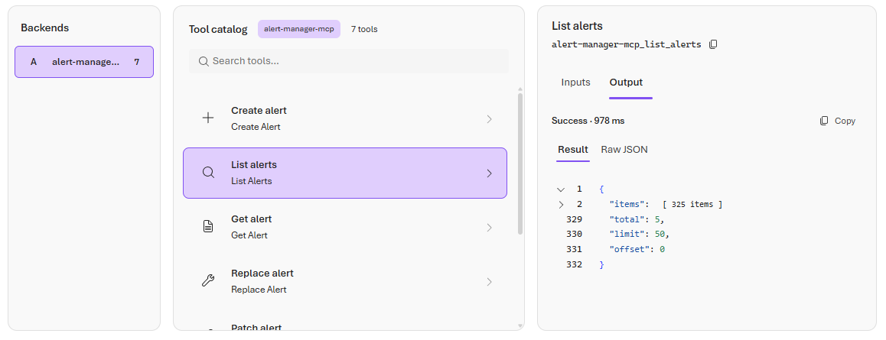


Next, create `AlertManagerAgent` to interact with `alert-manager-mcp` through the **AI Gateway**, then add the agent to the full orchestration.

### 5. Create the AlertManagerAgent

This is the fourth agent in the workflow. `AlertManagerAgent` uses `alert-manager-mcp` to manage financial alerts through the **AI Gateway**.

Use the following configuration:

- Use the agent instructions in `walkthrough/challenge-05/alert-manager-agent/instructions.md`.
- Select the model routed through the **AI Gateway**.
- Onboard the MCP in **Microsoft Foundry** following the usual steps for MCP integration. Remember to add authentication with **API Key**, using header name `api-key` and value a valid API key provided by the **AI Gateway**.
- Configure the MCP for the agent and enable auto-approval for all tools.
- Save the agent configuration.

The supplied instructions require the agent to accept the regulatory assessment without changing it, create an alert only when the configured status requires one, and surface tool failures without claiming success. The agent sends only the operational data required by the API and uses the transaction ID as a stable case key.

You can verify alert creation by inspecting the agent traces and confirming that the MCP call succeeded.

Alternatively, use the Alert Manager web interface to view the current alerts.

The web interface runs in the same container as the API. Retrieve its URL:

```bash
endpoint=$(az containerapp show --name alert-manager --resource-group $rg --query properties.configuration.ingress.fqdn -o tsv)
echo "https://$endpoint"
```

Open the URL. Before testing, the dashboard contains five alerts:

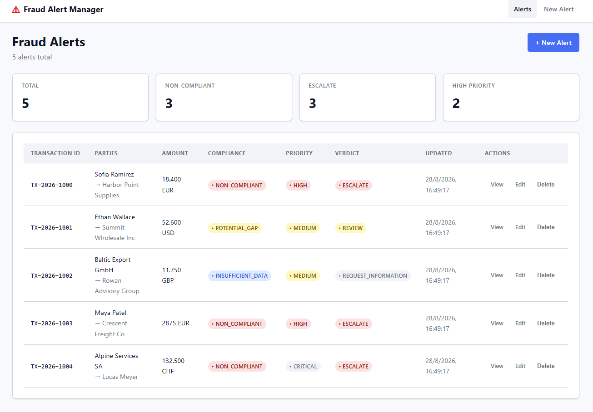

Test `AlertManagerAgent` by sending it the following JSON payload:

```json
{
  "transaction_id": "TX-TEST-0001",
  "original_transaction": {
    "transaction_id": "TX-TEST-0001",
    "originator_name": "James Carter",
    "origin_account": "83D4B1F30",
    "bank_origin": "0121",
    "beneficiary_name": "Emily Foster",
    "destination_account": "818CCA030",
    "bank_destination": "29196",
    "amount": 15000,
    "currency": "EUR"
  },
  "data_agent_response": {
    "transaction_id": "TX-TEST-0001",
    "match_found": true,
    "assessment": "Historical laundering records were found for one or more accounts in the transaction.",
    "origin_account": {
      "originator_name": "James Carter",
      "account": "83D4B1F30",
      "bank_id": "0121",
      "bank_name": "Israel Bank #35",
      "country": "Israel",
      "historical_participation": true,
      "role": "Receiver",
      "laundering_transaction_count": 3,
      "laundering_attempt_count": 3,
      "first_seen": "2026-09-02T10:03:00Z",
      "last_seen": "2026-09-18T05:02:00Z",
      "pattern_types": [
        "FAN-OUT",
        "GATHER-SCATTER",
        "BIPARTITE"
      ],
      "evidence": [
        {
          "pattern_txn_sk": 120259084422,
          "attempt_id": "2502",
          "pattern_type": "GATHER-SCATTER",
          "step_in_attempt": 5,
          "date_key": 20260918,
          "txn_ts": "2026-09-18T05:02:00Z",
          "from_bank_id": "0015",
          "from_account": "84221F9F0",
          "to_bank_id": "0121",
          "to_account": "83D4B1F30",
          "amount_received": 44947.3,
          "receiving_currency": "Shekel",
          "amount_paid": 44947.3,
          "payment_currency": "Shekel",
          "payment_format": "ACH",
          "counterparty_bank_id": "0015",
          "counterparty_account": "84221F9F0",
          "participation_role": "Receiver"
        },
        {
          "pattern_txn_sk": 68719477003,
          "attempt_id": "1385",
          "pattern_type": "FAN-OUT",
          "step_in_attempt": 1,
          "date_key": 20260909,
          "txn_ts": "2026-09-09T02:52:00Z",
          "from_bank_id": "0015",
          "from_account": "84221D110",
          "to_bank_id": "0121",
          "to_account": "83D4B1F30",
          "amount_received": 23427.81,
          "receiving_currency": "Shekel",
          "amount_paid": 23427.81,
          "payment_currency": "Shekel",
          "payment_format": "ACH",
          "counterparty_bank_id": "0015",
          "counterparty_account": "84221D110",
          "participation_role": "Receiver"
        },
        {
          "pattern_txn_sk": 8589934791,
          "attempt_id": "150",
          "pattern_type": "BIPARTITE",
          "step_in_attempt": 13,
          "date_key": 20260902,
          "txn_ts": "2026-09-02T10:03:00Z",
          "from_bank_id": "0220",
          "from_account": "8000EB430",
          "to_bank_id": "0121",
          "to_account": "83D4B1F30",
          "amount_received": 58403.73,
          "receiving_currency": "Shekel",
          "amount_paid": 58403.73,
          "payment_currency": "Shekel",
          "payment_format": "ACH",
          "counterparty_bank_id": "0220",
          "counterparty_account": "8000EB430",
          "participation_role": "Receiver"
        }
      ]
    },
    "destination_account": {
      "beneficiary_name": "Emily Foster",
      "account": "818CCA030",
      "bank_id": "29196",
      "bank_name": "Bank of Topeka",
      "country": "Bangladesh",
      "historical_participation": false,
      "role": null,
      "laundering_transaction_count": 0,
      "laundering_attempt_count": 0,
      "first_seen": null,
      "last_seen": null,
      "pattern_types": [],
      "evidence": []
    }
  },
  "historical_context": {
    "accounts_with_history": 1,
    "accounts_without_history": 1,
    "highest_historical_context_level": 5,
    "transaction_interpretation": "One account involved in the transaction has historical AML participation."
  },
  "origin_account_enrichment": {
    "historical_context_level": 5,
    "historical_context_category": "Extensive Historical Participation",
    "participation_consistency": "Receiver Only",
    "participation_frequency": "Repeated",
    "pattern_diversity_count": 3,
    "pattern_diversity_level": "High",
    "days_since_last_seen": 12,
    "recency_band": "Recent",
    "investigator_interpretation": "The account appeared across several AML typologies and multiple independent laundering attempts."
  },
  "destination_account_enrichment": {
    "historical_context_level": 0,
    "historical_context_category": "No Historical AML Participation",
    "participation_consistency": "None",
    "participation_frequency": "None",
    "pattern_diversity_count": 0,
    "pattern_diversity_level": "None",
    "days_since_last_seen": null,
    "recency_band": "None",
    "investigator_interpretation": "No historical AML participation was identified."
  },
  "derived_features": {
    "origin_has_history": true,
    "destination_has_history": false,
    "multiple_pattern_presence": true,
    "recent_historical_activity": true,
    "highest_historical_context_level": 5
  },
  "aml_regulatory_inputs": {
    "historical_context_level": 5,
    "pattern_diversity_count": 3,
    "laundering_attempt_count": 3,
    "recent_participation": true,
    "historical_participation_role": "Receiver",
    "historical_participation_detected": true
  },
  "aml_regulatory_assessment": {
    "assessment_source": "kb-aml",
    "assessment_type": "AML regulation and policy compliance validation",
    "regulatory_scope": {
      "global_rules_evaluated": true,
      "supranational_rules_evaluated": true,
      "origin_country_rules_evaluated": true,
      "destination_country_rules_evaluated": true,
      "cross_border_rules_evaluated": true,
      "historical_aml_context_rules_evaluated": true,
      "origin_country": "Israel",
      "destination_country": "Bangladesh",
      "is_cross_border": true
    },
    "retrieved_policy_sets": [
      {
        "policy_set_id": "GLB-STD-001",
        "policy_set_name": "Global AML/CFT Standards Summary",
        "scope": "GLOBAL",
        "jurisdiction": null,
        "summary": "Risk-based AML controls, CDD, enhanced due diligence, wire-transfer transparency, monitoring, reporting, sanctions screening and record keeping.",
        "source_reference": "01_Global_AML_CFT_Standards_Summary.pdf【6:9†source_name】"
      },
      {
        "policy_set_id": "GLB-STD-001",
        "policy_set_name": "Supranational FATF-style Framework",
        "scope": "SUPRANATIONAL",
        "jurisdiction": null,
        "summary": "Supranational risk-based controls apply using origin and destination geography and relevant transaction indicators.",
        "source_reference": "01_Global_AML_CFT_Standards_Summary.pdf【6:9†source_name】"
      },
      {
        "policy_set_id": "IL-REG-016",
        "policy_set_name": "Israel AML Local Regulation",
        "scope": "ORIGIN_COUNTRY",
        "jurisdiction": "Israel",
        "summary": "Israel identification, beneficiary and controlling-shareholder declaration, cross-border reporting and suspicious-activity obligations.",
        "source_reference": "16_Israel_AML_Local_Regulation.pdf【6:16†source_name】"
      },
      {
        "policy_set_id": "BD-REG-017",
        "policy_set_name": "Bangladesh AML Local Regulation",
        "scope": "DESTINATION_COUNTRY",
        "jurisdiction": "Bangladesh",
        "summary": "Bangladesh customer identification, suspicious-activity reporting and outward-remittance documentation requirements.",
        "source_reference": "17_Bangladesh_AML_Local_Regulation.pdf【6:3†source_name】【6:1†source_name】"
      },
      {
        "policy_set_id": "GLB-STD-001",
        "policy_set_name": "Cross-Border AML and Wire-Transfer Policy",
        "scope": "CROSS_BORDER",
        "jurisdiction": "Israel to Bangladesh",
        "summary": "Cross-border transfers require accurate originator and beneficiary information, risk-based review and applicable jurisdictional controls.",
        "source_reference": "01_Global_AML_CFT_Standards_Summary.pdf【6:10†source】【6:11†source】"
      },
      {
        "policy_set_id": "HIST-AML-001",
        "policy_set_name": "Historical AML Participation Review",
        "scope": "HISTORICAL_AML_CONTEXT",
        "jurisdiction": null,
        "summary": "Historical participation and repeated typology indicators are relevant inputs to transaction monitoring and enhanced review.",
        "source_reference": "01_Global_AML_CFT_Standards_Summary.pdf【6:6†source】"
      }
    ],
    "rule_evaluations": [
      {
        "rule_id": "AML-GLOBAL-CDD-001",
        "rule_name": "Customer due diligence and beneficial-owner verification",
        "policy_set_name": "Global AML/CFT Standards Summary",
        "scope": "GLOBAL",
        "jurisdiction": null,
        "rule_summary": "CDD applies to relevant transactions and requires identity, beneficial-owner, purpose and ongoing monitoring information.",
        "applies_to_transaction": true,
        "compliance_status": "INSUFFICIENT_DATA",
        "validation_result": {
          "passed": false,
          "failed": false,
          "missing_required_data": true
        },
        "evidence_used": {
          "transaction_id": "TX-TEST-0001",
          "origin_country": "Israel",
          "destination_country": "Bangladesh",
          "origin_bank_id": "0121",
          "destination_bank_id": "29196",
          "amount": 15000,
          "currency": "EUR",
          "origin_historical_participation": true,
          "destination_historical_participation": false,
          "highest_historical_context_level": 5,
          "pattern_types": [
            "FAN-OUT",
            "GATHER-SCATTER",
            "BIPARTITE"
          ],
          "recent_historical_activity": true
        },
        "interpretation": "Names and account identifiers are present, but the input does not establish identity verification, beneficial-owner verification, purpose, source of funds or source of wealth.",
        "kb_source_reference": "01_Global_AML_CFT_Standards_Summary.pdf【6:9†source】【6:10†source】"
      },
      {
        "rule_id": "AML-GLOBAL-TRM-001",
        "rule_name": "Transaction monitoring for historical AML indicators",
        "policy_set_name": "Historical AML Participation Review",
        "scope": "HISTORICAL_AML_CONTEXT",
        "jurisdiction": null,
        "rule_summary": "Monitoring must consider co-occurring typology indicators and prior AML participation.",
        "applies_to_transaction": true,
        "compliance_status": "COMPLIANT",
        "validation_result": {
          "passed": true,
          "failed": false,
          "missing_required_data": false
        },
        "evidence_used": {
          "transaction_id": "TX-TEST-0001",
          "origin_country": "Israel",
          "destination_country": "Bangladesh",
          "origin_bank_id": "0121",
          "destination_bank_id": "29196",
          "amount": 15000,
          "currency": "EUR",
          "origin_historical_participation": true,
          "destination_historical_participation": false,
          "highest_historical_context_level": 5,
          "pattern_types": [
            "FAN-OUT",
            "GATHER-SCATTER",
            "BIPARTITE"
          ],
          "recent_historical_activity": true
        },
        "interpretation": "The evidence contains repeated participation, three pattern types, three attempts and recent activity, providing the historical indicators required for monitoring.",
        "kb_source_reference": "01_Global_AML_CFT_Standards_Summary.pdf【6:6†source】"
      },
      {
        "rule_id": "AML-CROSS-BORDER-WIRE-001",
        "rule_name": "Cross-border wire-transfer information",
        "policy_set_name": "Cross-Border AML and Wire-Transfer Policy",
        "scope": "CROSS_BORDER",
        "jurisdiction": "Israel to Bangladesh",
        "rule_summary": "Cross-border messages must contain required and accurate originator and beneficiary information.",
        "applies_to_transaction": true,
        "compliance_status": "INSUFFICIENT_DATA",
        "validation_result": {
          "passed": false,
          "failed": false,
          "missing_required_data": true
        },
        "evidence_used": {
          "transaction_id": "TX-TEST-0001",
          "origin_country": "Israel",
          "destination_country": "Bangladesh",
          "origin_bank_id": "0121",
          "destination_bank_id": "29196",
          "amount": 15000,
          "currency": "EUR",
          "origin_historical_participation": true,
          "destination_historical_participation": false,
          "highest_historical_context_level": 5,
          "pattern_types": [
            "FAN-OUT",
            "GATHER-SCATTER",
            "BIPARTITE"
          ],
          "recent_historical_activity": true
        },
        "interpretation": "Originator and beneficiary names and account identifiers are supplied, but address, national identification or date/place of birth and transfer-message completeness are not provided.",
        "kb_source_reference": "01_Global_AML_CFT_Standards_Summary.pdf【6:10†source】【6:11†source】"
      },
      {
        "rule_id": "AML-IL-001",
        "rule_name": "Israel identification and cross-border reporting",
        "policy_set_name": "Israel AML Local Regulation",
        "scope": "ORIGIN_COUNTRY",
        "jurisdiction": "Israel",
        "rule_summary": "Relevant Israeli institutions must perform required identification, record the purpose and corridor information, and report suspicious activity where suspicion arises.",
        "applies_to_transaction": true,
        "compliance_status": "POTENTIAL_GAP",
        "validation_result": {
          "passed": false,
          "failed": false,
          "missing_required_data": true
        },
        "evidence_used": {
          "transaction_id": "TX-TEST-0001",
          "origin_country": "Israel",
          "destination_country": "Bangladesh",
          "origin_bank_id": "0121",
          "destination_bank_id": "29196",
          "amount": 15000,
          "currency": "EUR",
          "origin_historical_participation": true,
          "destination_historical_participation": false,
          "highest_historical_context_level": 5,
          "pattern_types": [
            "FAN-OUT",
            "GATHER-SCATTER",
            "BIPARTITE"
          ],
          "recent_historical_activity": true
        },
        "interpretation": "Israel is the origin jurisdiction and the transfer is cross-border. The input does not show completed identification, declared beneficiary or controlling shareholder, purpose, or reporting assessment.",
        "kb_source_reference": "16_Israel_AML_Local_Regulation.pdf【6:4†source】"
      },
      {
        "rule_id": "AML-BD-001",
        "rule_name": "Bangladesh remittance purpose and supporting documentation",
        "policy_set_name": "Bangladesh AML Local Regulation",
        "scope": "DESTINATION_COUNTRY",
        "jurisdiction": "Bangladesh",
        "rule_summary": "Outward-remittance controls require authorised purpose and supporting documentation; transaction and suspicious-activity requirements apply where relevant.",
        "applies_to_transaction": true,
        "compliance_status": "POTENTIAL_GAP",
        "validation_result": {
          "passed": false,
          "failed": false,
          "missing_required_data": true
        },
        "evidence_used": {
          "transaction_id": "TX-TEST-0001",
          "origin_country": "Israel",
          "destination_country": "Bangladesh",
          "origin_bank_id": "0121",
          "destination_bank_id": "29196",
          "amount": 15000,
          "currency": "EUR",
          "origin_historical_participation": true,
          "destination_historical_participation": false,
          "highest_historical_context_level": 5,
          "pattern_types": [
            "FAN-OUT",
            "GATHER-SCATTER",
            "BIPARTITE"
          ],
          "recent_historical_activity": true
        },
        "interpretation": "Bangladesh is the destination jurisdiction, but the input does not provide the transfer purpose, authorised purpose code, licensed channel evidence or supporting documentation.",
        "kb_source_reference": "17_Bangladesh_AML_Local_Regulation.pdf【6:1†source】"
      },
      {
        "rule_id": "AML-GLOBAL-EDD-001",
        "rule_name": "Enhanced review for complex or unusually large activity",
        "policy_set_name": "Global AML/CFT Standards Summary",
        "scope": "SUPRANATIONAL",
        "jurisdiction": null,
        "rule_summary": "Complex or unusually large transactions without apparent lawful purpose and higher geographic or historical exposure require enhanced due-diligence consideration.",
        "applies_to_transaction": true,
        "compliance_status": "POTENTIAL_GAP",
        "validation_result": {
          "passed": false,
          "failed": false,
          "missing_required_data": true
        },
        "evidence_used": {
          "transaction_id": "TX-TEST-0001",
          "origin_country": "Israel",
          "destination_country": "Bangladesh",
          "origin_bank_id": "0121",
          "destination_bank_id": "29196",
          "amount": 15000,
          "currency": "EUR",
          "origin_historical_participation": true,
          "destination_historical_participation": false,
          "highest_historical_context_level": 5,
          "pattern_types": [
            "FAN-OUT",
            "GATHER-SCATTER",
            "BIPARTITE"
          ],
          "recent_historical_activity": true
        },
        "interpretation": "The corridor includes Israel and Bangladesh, and one account has extensive recent historical participation across multiple typologies. Enhanced-review evidence such as senior approval, purpose and source-of-funds information is absent.",
        "kb_source_reference": "01_Global_AML_CFT_Standards_Summary.pdf【6:9†source】【6:10†source】"
      }
    ],
    "overall_compliance": {
      "overall_status": "POTENTIAL_GAP",
      "non_compliant_rule_count": 0,
      "potential_gap_rule_count": 3,
      "insufficient_data_rule_count": 2,
      "not_applicable_rule_count": 0,
      "compliant_rule_count": 1
    },
    "decision_support": {
      "calculation_version": "1.0",
      "calculation_inputs": {
        "highest_historical_context_level": 5,
        "non_compliant_rule_count": 0,
        "potential_gap_rule_count": 3,
        "insufficient_data_rule_count": 2,
        "not_applicable_rule_count": 0,
        "compliant_rule_count": 1
      },
      "investigation_priority": {
        "base_historical_context_score": 65,
        "potential_gap_points": 30,
        "insufficient_data_points": 10,
        "non_compliance_points": 0,
        "raw_score": 105,
        "score": 100,
        "maximum_score": 100,
        "priority_band": "Critical"
      },
      "workflow_classification": {
        "final_verdict": "ENHANCED REVIEW REQUIRED",
        "matched_rule_id": "LEVEL_C",
        "rationale": [
          "The highest historical context level is 5.",
          "Three potential regulatory gaps were identified.",
          "Two applicable rules cannot be fully assessed because required data is absent.",
          "No retrieved rule was assessed as clearly non-compliant."
        ],
        "meaning": "The transaction has substantial regulatory relevance and unresolved validation gaps. This is a workflow classification, not a legal conclusion.",
        "is_legal_conclusion": false,
        "establishes_money_laundering": false
      }
    },
    "regulatory_interpretation": {
      "summary": "The transaction is cross-border from Israel to Bangladesh and involves an origin account with extensive, recent participation across three historical AML typologies. The available data supports transaction-monitoring validation, but does not establish completion of CDD, enhanced due diligence, wire-transfer data requirements, purpose validation or local reporting controls.",
      "key_findings": [
        "The origin account has historical participation level 5, three laundering attempts and three pattern types.",
        "The destination account has no recorded historical AML participation.",
        "Israel and Bangladesh country rules are applicable because the transaction crosses both jurisdictions.",
        "Originator and beneficiary names and account identifiers are present, but additional wire-transfer identity fields are absent.",
        "Purpose, source-of-funds, beneficial-owner, sanctions-screening and reporting-status fields are absent.",
        "No direct regulatory breach was established from the retrieved rules and supplied evidence."
      ],
      "regulatory_relevance": "The transaction requires regulatory validation because of cross-border scope and extensive historical AML context. This assessment does not determine fraud, suspicious activity, money laundering or a mandatory operational outcome."
    },
    "missing_data": [
      {
        "field": "customer_due_diligence_status",
        "required_for_rule": "AML-GLOBAL-CDD-001",
        "reason": "The input does not establish identity verification or completion of CDD."
      },
      {
        "field": "beneficial_owner_information",
        "required_for_rule": "AML-GLOBAL-CDD-001 and AML-IL-001",
        "reason": "No beneficial-owner or controlling-shareholder information is supplied."
      },
      {
        "field": "purpose_and_intended_nature",
        "required_for_rule": "AML-GLOBAL-CDD-001 and AML-BD-001",
        "reason": "The transaction purpose and intended nature are not provided."
      },
      {
        "field": "originator_address_or_identification_data",
        "required_for_rule": "AML-CROSS-BORDER-WIRE-001",
        "reason": "The retrieved cross-border wire rule requires address, national ID, or date and place of birth information."
      },
      {
        "field": "beneficiary_address_or_identification_data",
        "required_for_rule": "AML-CROSS-BORDER-WIRE-001",
        "reason": "The input does not provide the additional beneficiary information required by the retrieved wire-transfer policy."
      },
      {
        "field": "sanctions_screening_result",
        "required_for_rule": "AML-GLOBAL-EDD-001",
        "reason": "No sanctions-screening result is supplied."
      },
      {
        "field": "source_of_funds_and_source_of_wealth",
        "required_for_rule": "AML-GLOBAL-CDD-001 and AML-GLOBAL-EDD-001",
        "reason": "No source-of-funds or source-of-wealth evidence is supplied."
      },
      {
        "field": "bangladesh_authorised_purpose_code_and_supporting_documentation",
        "required_for_rule": "AML-BD-001",
        "reason": "The Bangladesh policy requires purpose and supporting documentation for applicable remittance activity."
      },
      {
        "field": "suspicious_activity_reporting_assessment",
        "required_for_rule": "AML-IL-001 and global reporting controls",
        "reason": "The input does not state whether the institution performed or documented a reporting assessment."
      }
    ],
    "downstream_inputs": {
      "has_regulatory_non_compliance": false,
      "has_potential_regulatory_gap": true,
      "requires_case_recommendation_review": true,
      "highest_historical_context_level": 5,
      "rules_triggered": [
        "AML-GLOBAL-CDD-001",
        "AML-GLOBAL-TRM-001",
        "AML-CROSS-BORDER-WIRE-001",
        "AML-IL-001",
        "AML-BD-001",
        "AML-GLOBAL-EDD-001"
      ],
      "countries_evaluated": [
        "Israel",
        "Bangladesh"
      ],
      "policy_scopes_evaluated": [
        "GLOBAL",
        "SUPRANATIONAL",
        "ORIGIN_COUNTRY",
        "DESTINATION_COUNTRY",
        "CROSS_BORDER",
        "HISTORICAL_AML_CONTEXT"
      ]
    }
  }
}
```

Confirm that the new alert appears on the Alert Management dashboard:


You can view the alert details or remove the alert to avoid duplicates in later tests.


### 6. Add the Alert Manager Agent to the Orchestration

The final task is to add `AlertManagerAgent` to the orchestration so it can process transactions that require operational alerting.

As in [Challenge 4](challenge-04.md), update the orchestration to include and connect the new agent. 

The source code is under the `walkthrough/challenge-05/orchestration` directory. The relevant files are:

- `src/main.py`: Initializes and coordinates the agents in the orchestration.
- `azure.yaml`: Defines the agent for deployment as a **Hosted Agent** in **Microsoft Foundry**.

Review the addition of the Alert Manager Agent:

```python
    alert_manager_agent = get_foundry_agent(
        project_endpoint=project_endpoint,
        credential=credential,
        agent_name="AlertManagerAgent",
        agent_version="7",
    )
```

The workflow then runs the AML Report Agent and Alert Manager Agent as parallel branches after regulatory assessment:

```python
    workflow_agent = (
        WorkflowBuilder(
            start_executor=evidence_enrichment_executor,
            # Limiting the output to only the final formatted result.
            # If this is not set, all intermediate results will be included in the output.
            output_from=[aml_report_executor],
        )
        .add_edge(evidence_enrichment_executor, regulatory_assessment_executor)
        .add_edge(regulatory_assessment_executor, aml_report_executor)
        .add_edge(regulatory_assessment_executor, alert_manager_executor)
        .build()
        .as_agent()
    )
```

> **Important:** Review your agent versions in case you need to update them before deployment.

Deploy the updated orchestration.

> **Important:** Because of current source-code handling limitations in the extension, copy the orchestration source and `azure.yaml` to the project root before deployment:

```bash
cp -Rf \
  "$walkthroughHome/challenge-05/orchestration/src" \
  "$walkthroughHome/challenge-05/orchestration/azure.yaml" \
  "$rootHome/"
```

For the complete **Foundry Toolkit** deployment procedure, refer to [Challenge 4](challenge-04.md). For this deployment:

- Keep **Deployment method** set to **Code** and **Package mode** set to **Remote**.
- Set **Deploy to** to **Existing agent** because this deployment updates the orchestration with `AlertManagerAgent`.

You can now test the full orchestration through the **Foundry Toolkit** or directly in **Microsoft Foundry**.

Inspect the traces to verify that the orchestration invokes the new agent and that the alert appears in the dashboard. If you retained the alert from the standalone agent test, a repeated invocation may create a duplicate.

Use these additional JSON payloads to test the orchestration:

- A transaction with no fraudulent activity in the database:

```json
{
  "transaction_id": "TX-TEST-0002",
  "originator_name": "Oliver Thompson",
  "origin_account": "844C89040",
  "bank_origin": "3160527",
  "beneficiary_name": "Sophie Williams",
  "destination_account": "842700DC0",
  "bank_destination": "237304",
  "amount": 75000,
  "currency": "EUR"
}
```

- A transaction that remains within the EU and has no evidence:

```json
{
  "transaction_id": "TX-TEST-0003",
  "originator_name": "Daniel Harris",
  "origin_account": "80870EE60",
  "bank_origin": "220048",
  "beneficiary_name": "Charlotte Evans",
  "destination_account": "8099ADB50",
  "bank_destination": "31585",
  "amount": 5000,
  "currency": "EUR"
}
```

Finally, inspect the AI Gateway telemetry and agent traces to verify that model calls and both MCP integrations traverse the gateway. Confirm that logs do not expose credentials or unnecessary financial payloads. Where possible, send an unauthorized request and verify that the gateway rejects it.

## 🚀 Go Further

Add per-agent quotas and compare their effects under a short concurrent workload. Define a retry policy that respects API throttling and does not create duplicate alerts.

## 🛠️ Troubleshooting

- **Gateway requests are unauthorized:** Verify the caller identity, gateway audience or credential, role assignments, and backend authentication policy.
- **MCP tools are missing:** Confirm that the API operation is included in the imported specification and supported by the generated MCP interface.
- **An MCP tool name exceeds 64 characters:** Use a shorter MCP server name or shorter OpenAPI `operationId`, recreate the MCP integration, and start a new agent conversation.
- **Evidence calls bypass the gateway:** Check the agent's active version and MCP endpoint configuration.
- **Duplicate alerts are created:** Remove test alerts between runs and ensure that retries use the same stable case key.
- **A parallel branch hides a failure:** Inspect the traces and require each branch to return an explicit status.

## 🧠 Conclusion

You have placed model and MCP traffic behind a governance boundary and added operational alerting in parallel with report generation. Continue to [Challenge 6](challenge-06.md) to add operational and business observability to the complete workflow.
