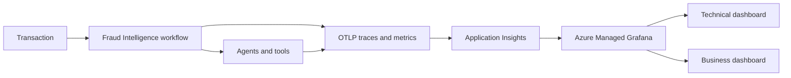

# Challenge 6 - Observe Fraud Intelligence

[Previous challenge](challenge-05.md) | **[Home](../README.md)** | [Finish](finish.md)

## 🎯 Objective

Add end-to-end **OpenTelemetry Protocol (OTLP)** tracing and business metrics to the hosted fraud intelligence workflow, send telemetry to **Application Insights**, and visualize operational and business outcomes in **Azure Managed Grafana**.

## 🧭 Context and Background

So far, you have built a multi-agent workflow that enriches transactions, assesses regulatory requirements, generates reports, and creates alerts. However, you still lack deep visibility into how the workflow behaves from end to end. In this challenge, you will add that observability.

Production observability must answer two kinds of questions: whether the system is healthy and whether it is delivering the intended business outcome. A shared correlation identifier connects one transaction to its workflow, agent, model, retrieval, MCP, report, and alert activity.



Telemetry must not become a second copy of sensitive financial data. Capture identifiers, timings, statuses, counts, and bounded classifications; avoid names, account numbers, full prompts, evidence payloads, and secrets.

## ✅ Tasks

### 1. Explore default telemetry in Application Insights

In Challenge 2, you connected **App Insights** to **Microsoft Foundry**, but you did not explore the **App Insights** dashboard to view the default telemetry.

Open the **Monitor** tab for any agent to review its captured metrics. To access the underlying traces, logs, and custom telemetry, select **Open in Azure Monitor**:


You should see a dashboard similar to the one below, showing the default telemetry captured by Application Insights:


Explore the sections and panels to understand the default telemetry and how it reflects agent behavior.

Next, inspect a complete orchestration trace to see how the components interact and how telemetry is correlated across the workflow.

Select **View Traces with Agent Runs**, then choose a **Dependency**:


The detailed trace shows the selected dependency within its orchestration run, including its interactions with other components and the telemetry correlation across the workflow.

To explore and filter all traces, open **Search** in the **Investigate** section of the left sidebar:


Select a trace to review its execution details, including spans, attributes, and related telemetry:


These insights are provided by Application Insights through the agents' default auto-instrumentation.

Next, add custom telemetry to the orchestration to capture business-specific metrics and additional trace context in Application Insights.

### 2. Review the custom telemetry implementation

The updated orchestration adds executors after specific agent executions. These executors inspect the responses and record custom metrics.

The new code is under `/walkthrough/challenge-06/orchestration`.
Review the main orchestration code to see where the custom telemetry executors run after specific agent executions. The following image highlights the main changes:


The metric definitions and configuration are in `walkthrough/challenge-06/orchestration/src/business_metrics.py`.

Review this code to understand how each custom metric is defined and recorded.

### 3. Redeploy the orchestration and generate telemetry

After reviewing the custom telemetry setup, redeploy the orchestration to generate telemetry.

> **Important:** Review your agent versions in case you need to update them before redeployment.


As in previous deployments, copy `src` and `azure.yaml` to the project root before redeploying:

```bash
cp -Rf \
  "$walkthroughHome/challenge-06/orchestration/src" \
  "$walkthroughHome/challenge-06/orchestration/azure.yaml" \
  "$rootHome/"
```

Then redeploy using the **Foundry Toolkit**.

After deployment, run the Python test script to send randomized requests and generate telemetry in **Application Insights**.

To run the script, use the following command:

```bash
$walkthroughHome/challenge-06/orchestration/run-tests.sh \
	--cosmos-endpoint "$cosmosEndpoint" \
	--database "aml" \
	--project-endpoint "https://$foundryAccountName.services.ai.azure.com/api/projects/$foundryProjectName" \
	--agent-name "fraud-intelligence-orchestration" \
	--count 10
```

The script sends the number of requests specified by the `--count` argument.

### 4. Verify custom telemetry in Application Insights

In **Application Insights**, verify that the custom telemetry is being captured. Open **Logs** under **Monitoring**, select the `customMetrics` table, and run a query to view the recorded metrics.


You should see metrics similar to those shown below:


You can also query specific custom metrics directly from **Logs**. Open the selector on the right, choose **KQL mode**, enter a query in the editor, and select **Run**:


The following example queries provide several views of the custom metrics:

- Transactions Processed by Currency (Last 24 Hours)

```kusto
customMetrics
| where timestamp > ago(24h)
| where name == "fraud.transactions.processed"
| extend Currency = tostring(customDimensions["currency"])
| summarize Transactions = sum(valueSum)
  by Currency, bin(timestamp, 15m)
| render timechart
```
- Transactions Processed by Cross-Border and History Detected (Last 24 Hours)

```kusto
customMetrics
| where timestamp > ago(24h)
| where name == "fraud.transactions.processed"
| extend
    CrossBorder = tostring(customDimensions["cross_border"]),
    HistoryDetected = tostring(customDimensions["history_detected"])
| summarize Transactions = sum(valueSum)
  by CrossBorder, HistoryDetected
| render columnchart
```
- AML Historical Context Level by Account Role (Last 24 Hours)

```kusto
customMetrics
| where timestamp > ago(24h)
| where name == "fraud.aml.historical_context_level"
| extend AccountRole = tostring(customDimensions["account_role"])
| summarize
    AverageLevel = sum(valueSum) / sum(valueCount),
    MaximumLevel = max(valueMax)
  by AccountRole, bin(timestamp, 1h)
| render timechart
```

- AML Typology Detected by Pattern Type (Last 7 Days)

```kusto
customMetrics
| where timestamp > ago(7d)
| where name == "fraud.aml.typology_detected"
| extend PatternType = tostring(customDimensions["pattern_type"])
| summarize Detections = sum(valueSum) by PatternType
| order by Detections desc
| render piechart
```

The following image shows the result of the last query:


Explore additional queries and visualizations as needed.

Next, create **Graphical Dashboards** to visualize these custom metrics interactively.

### 5. Import the Grafana dashboard

Use Grafana to create interactive dashboards for the custom metrics queried in Application Insights.

Return to the **Agents (Preview)** section introduced at the beginning of the lab, then select **Explore in Grafana** to open the Grafana integration:


Grafana provides prebuilt dashboards and panels for visualizing the default telemetry:


Explore these dashboards to become familiar with the interface.

Next, create a custom dashboard for the metrics used in this workflow. The provided JSON file defines Grafana panels for the custom metrics.

Select **Dashboards**, then **New**, and choose **Import**. Upload `walkthrough/challenge-06/grafana/fraud-intelligence-grafana-dashboard.json` to import the dashboard into Grafana.

Then, use the following settings:

- **Title**: FraudIntelligence
- **Subscription**: The one associated with your lab
- **Resource Group**: The one associated with your lab
- **Region**: swedencentral
- **Azure Monitor Datasource**: Azure Monitor


Select the correct **Application Insights** resource, whose name starts with `appi-fraud`. The imported dashboard should display panels similar to those below:


You have now imported the dashboard and visualized the custom metrics in Grafana.

### 6. Run the final validation

Run additional requests and confirm that the custom metrics appear in both Application Insights and Grafana. Verify that transaction counts match the number of requests sent and that the dashboard distinguishes currencies, cross-border transactions, historical-context levels, account roles, and detected typologies.

Inspect a complete orchestration trace and confirm that agent and dependency spans remain correlated. Ensure that no credentials, names, account numbers, full prompts, or evidence payloads appear in the custom telemetry.

## 🚀 Go Further

Create an Azure Monitor alert for sustained workflow failures or alert-delivery failures. Define a service-level objective for successful investigations and visualize its error budget.

## 🛠️ Troubleshooting

- **No telemetry appears:** Verify the exporter configuration, Application Insights connection, identity permissions, network access, and ingestion delay.
- **Spans are disconnected:** Confirm that trace context and the correlation identifier are propagated across async and parallel branches.
- **Metrics have unexpected counts:** Check retry behavior, metric emission points, and idempotency around completed state transitions.
- **Grafana cannot query Azure Monitor:** Verify the data source, managed identity, subscription access, and Grafana role assignments.
- **Queries are slow or expensive:** Reduce the time range, remove high-cardinality dimensions, and aggregate before visualization.
- **Sensitive data appears:** Stop emitting the attribute, deploy the correction, and follow the lab's process for handling previously ingested data.

## 🧠 Conclusion

You have instrumented the complete fraud intelligence workflow and created technical and business views of its behavior. Continue to the [finish page](finish.md) to complete the MicroHack.

